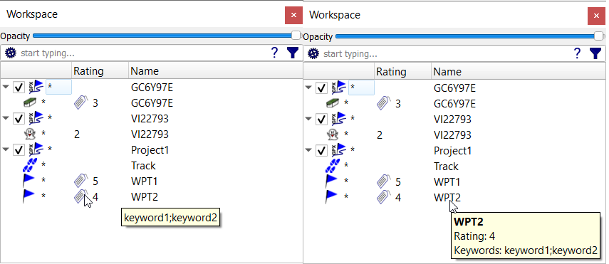
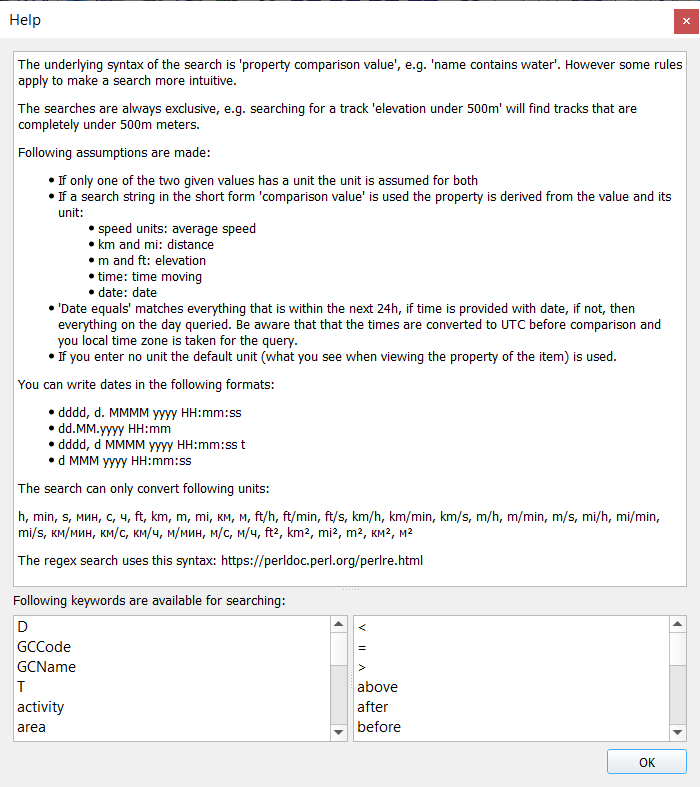
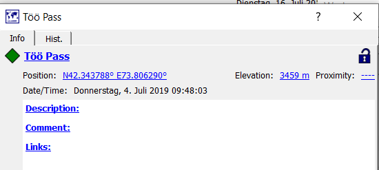
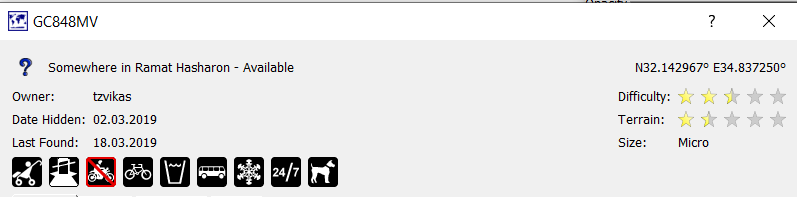

[Prev](DocMapsTipsRasterDEM) (Tips & tricks for raster maps, vector maps, and elevation data) | [Home](Home) | [Manual](DocMain) | [Index](AxAdvIndex) | (Tracks) [Next](AdvTracks)
- - -

***Table of contents***

* [Data handling](#data-handling)
    * [Data selection and handling in map views](#data-selection-and-handling-in-map-views)
    * [Searching data in the workspace](#searching-data-in-the-workspace)
        * [General description](#general-description)
        * [Object types for properties](#object-types-for-properties)
        * [More details and remarks](#more-details-and-remarks)
        * [Examples](#examples)
            * [Waypoint](#waypoint)
            * [Track](#track)
            * [Geocache](#geocache)
    * [Searching in projects](#searching-in-projects)

* * * * * * * * * *
 
# Data handling

## Data selection and handling in map views

Some actions with several GIS data objects can be carried out easily with the help of a selection rectangle in a map view as follows:

* Display all data objects of interest in the map by selecting them in the workspace.
* Zoom the map view so that all data objects of interest are visible in the map view.
* Right-click in the map view to open its context menu and select the menu entry `Select items on map`. 
* An infobox at the upper left corner of the map view describes the next actions: 
    * Select a rectangular area on the map. Use the left mouse button and move the mouse. 
    * Abort with a right click. 
    * Adjust the selection by point-click-move on the corners.

Here is an example of a map view with a selection rectangle in the exact mode (selection summary is shown in infobox!):

Example for intersect mode:

The toolbar at the right side of the selection rectangle gives access to the supported actions. A tooltip pops-up when locating the mouse on a toolbox icon.
The following table lists all actions of the toolbar:

*Action*|*Icon (off state)*|*Icon (on state)*|*Checkable*|*Exclusive*|
----|----|----|----|----|
 Copy all selected items to a project. |  | - | - | - |  
 Create a route from selected waypoints. |  | - | - | - |  
 Set proximity and no-go area option. |  | - | - | - |  
 Change the icon of all selected waypoints. |  | - | - | - |  
 Replace the elevation in all selected waypoints and tracks by values from the view's DEM data. |  | - | - | - |  
 Combine all selected tracks to a new one. |  | - | - | - |  
 Set an activity for all selected tracks. |  | - | - | - |  
 Change the color of all selected tracks. |  | - | - | - |  
 Delete all selected items. |  | - | - | - |  
 Select all items that intersect the selected area. |  |  | true | true |  
 Select all items that are completely inside the selected area. |  |  | true | true |  
 Add tracks to selection. |  |  | true | - |  
 Add waypoints to selection. |  |  | true | - |  
 Add routes to selection. |  |  | true | - |  
 Add areas to selection. |  |  | true | - |  

(_Overview derived from commit f3dbcb2119e8 (Tue Apr 23 09:39:43 2019 +0200))_ 

_Comments:_

* `true` in the column `Exclusive` marks a group of actions where only one checkable action in the group can ever be active at any time. 
  If the user chooses another checkable action in the group, the one chosen becomes active and the one that has been active becomes inactive.
* `true` in the column `Checkable` marks an action which has an on/off state (`checked/selected` or 
  `not checked/not selected`). A change of the state implies a change of the displayed toolbar icon.
* Select first the necessary states of the checkable actions.
* Next click one of the actions that can't be checked. The corresponding action is carried out immediately.
* Close the selection rectangle with a right click.

## Tagging data

Data objects can be tagged with a rating and with keywords for easier search.  To use this feature proceed as follows:

* Goto the [workspace setup](AdvSetup#workspace-setup) window be clicking the menu entries `Workspace - Setup workspace`.
* Select the option `Show tags in workspace tree`. Having done this a new column "Rating" is shown in the workspace window.
* Select one or more data objects in the workspace.
* Right-click on one of the selected data objects to open the context menu and click the menu entry `Set tags`.
* In the windows that pops-up select a rating between 1 and 5 (stars) and insert a colon separated list of keywords.

    
    
* Close the window by clicking the `Ok` button.

The column "Rating" shows for tagged objects their rating (a number between 1 and 5) and an additional icon as indicator for keywords belonging to the object.
When moving the mouse pointer on the icon a bubble box displays the keywords. Keywords and rating are also displayed when moving the mouse pointer on the name field of data object.

Data in workspace projects in the can be sorted by their ratings using the context menu entry `Sort by rating` of the project.

Keywords and ratings can also be used in [extended searches](#general-description) in the workspace

*Warning:* Tags of data objects can't be saved into GPX files. They can be saved only in QMS files or databases.

## Searching data in the workspace

### General description

If the user opens many projects with many GIS objects in the workspace, then there emerges the need to search for a subset of these objects satisfying some given criterion. QMS offers 3 different ways to perform such a search:

1. search for some substring in the name of a GIS object ("*name-only search*"),
1. search for some substring in the text (name, description, comment, ... fields) belonging to a GIS object ("*complete-text search*"),
1. search for GIS objects using a query ("*extended search*").

In all 3 cases the search is carried out in all GIS objects in all projects in the workspace. The search string/query has to be typed into the edit field on top of the workspace window:

Clicking the setup wheel at the left border of the edit field opens a context menu. Here, name-only resp. complete-text search can be selected and it can be selected if the search is case-sensitive or not.

At the right border of the edit field appears either a filter symbol (if edit field is empty) or an icon with a cross (if there is some text in the edit field). Click the cross to clear the complete edit field.

Clicking the question mark near the right border of the edit field opens a help window that describes the structure of queries for an extended search.

For the **name-only** and the **complete-text search** set the proper option in the setup context menu and then start typing the text string you are searching for. After typing some character the workspace opens those projects that have GIS objects satisfying the search criterion (the typed text is a substring of the name or the complete text). All other GIS objects are not visible anymore in the workspace. Only all project headers remain visible. *Remember:* The search is done for GIS objects and not for text in the enclosing projects!

Here is an example for a case-insensitive complete-text search:

An **extended search** is used automatically as soon as the input has the special structure

`property comparison value` 

where both the `property` and the `comparison` terms should be taken from the lists displayed in the extended search help window (left list: properties, right list: comparisons (operators):

Some help text in form of a tooltip is shown after clicking on an entry in one of the lists.

All property and comparison terms should be written exactly as shown.

A warning icon near the right border of the edit field is an indicator that the structure required for an extended search is not (yet) recognized by the parser. In this case the input string is used for a name-only or complete-text search depending on the setup.

Some of the properties and comparison terms are synonyms. Synonyms give more flexibility in formulating a search query:

* terrain, T
* difficulty, D
* positive attributes, non-negated attributes
* ascent, elevation gain
* distance, length
* max elevation/speed, maximal elevation/speed
* min elevation/speed, minimal elevation/speed
* duration, total time

* above, 
  after, 
  bigger than, 
  greater than, 
  higher than, later than, 
  longer than, 
  over, >
* before, earlier than, less than, lower than, shorter than, smaller than, under, >
* equals, =
* containing, contains, with  

The `property` part of an extended search string can be dropped, if it can be deduced from the `value` part of the search string.  In this case, the following rules for the `property` part hold true:

* If the `value` part has a speed unit, then the `property` is assumed to be `average speed`. *Example:* `above 20 km/h` means `average speed above 20 km/h`.
* If the `value` part has units km or mi, then the `property` is assumed to be `distance`. *Example:* `shorter than 5km` means `distance shorter than 5km`.
* If the `value` part has units m or ft, then the `property` is assumed to be `elevation`. *Example:* `above 50m` means `elevation above 50m`.
* If the `value` part is a time, then the `property` is assumed to be `time moving`. *Example:* `less than 100 min` means `time moving less than 100 min`.
* If the `value` part is a date, then the `property` is assumed to be `date`. *Example:* `after 01.01.2013` means `date after 01.01.2013`.

### Object types for properties

Each property has a specific set of GIS object types for which it can be used. The following table gives an overview:

| Property | Track | Route | Area | Waypoint | Geocache |
| ---------|-------|-------|------|----------|----------|
| description, full text, name, comment, keywords, rating | x | x | x | x | x |
| activity, max(imal)/min(imal) speed, time moving, total time, average speed, duration| x | - | - | - | - |
| length, ascent, descent, elevation gain, distance, max(imal)/min(imal) elevation | x | x | - | - | - |
| date | x | - | - | x | x |
| elevation | **?** | **?** | - | x | - |
| area | - | - | x | - | - |
| D, T, GCCode, GCName, difficulty, terrain, negated/non-negated/positive attributes, size, status| - | - | - | - | x |

### More details and remarks

* *Check the examples later on this page for more explanations and hints!*
* All comparisons are exclusive, i.e. the bounds are not included
* When trying a search with the comparison term `equals`, then you have to type the complete value to search for before you get the correct result. 
* When trying a search with a comparison `regex`, then follow the regular expression syntax used for [Pearl](https://perldoc.perl.org/perlre.html).
* When using units then only the ones listed in the search help window are supported.
* The search keywords `keywords` and `rating` can be used to find [tagged GIS data objects]().
* The search keyword `status` can be used to find geocaches with a certain status (`available, not available, archived`).
* Geocaches from different sources may have significant differences in their formal description (in GPX files). For correct search results it is assumed, that geocaches are defined using the rules applied in [geocaching.com](https://www.geocaching.com/play).
* The properties `T` resp. `D` are convenient abbreviations for the properties `terrain` resp. `difficulty`.
* When searching for geocache attributes use the comparison term `contains`.

    The query `positive attributes contains attr` means: find all geocaches that have an attribute `attr`, where `attr` is a positive value (e.g. `dogs`). `non-negated` is a synonym for `positive`.
    
    The query `negated attributes contains attr` means: find all geocaches that have an attribute which is the negation of the positive attribute `attr` (e.g. if `attr`= `dogs`, then find geocaches having the attribute `no dogs`).
* A list of all supported attributes can be found on the [geocaching.com server](https://www.geocaching.com/about/icons.aspx) (attributes together with their symbols, switch language if necessary!) and [here](https://forums.geocaching.com/GC/index.php?/topic/282652-groundspeak-gpx) (attributes together with their codes). 
* If an extended search string is syntactically wrong, then a red background indicates this fact. Additionally, a tooltip pops-up to inform about this fact. In this case the input string is used for a name-only or complete-text search depending on the setup options. *Attention:* The background is red, too, if the search string is still incomplete!
* Dates and times must have the structure described in the search help window. The parts that appear in this description have the following meaning (compare ["Custom date and time strings"](https://docs.microsoft.com/en-us/dotnet/standard/base-types/custom-date-and-time-format-strings)):

    | Abbreviation | Meaning |
    | ------------ | ------- |
    | d | day of the month, from 1 through 31 |
    | dd | day of the month, from 01 through 31 |
    | dddd | full name of the day of the week (e.g. Monday) |
    | HH | hour, using a 24-hour clock from 00 to 23 |
    | mm | minute, from 00 through 59 |
    | MM | month, from 01 through 12 |
    | MMM | abbreviated name of the month (e.g. Jan)|
    | MMMM | full name of the month (e.g. January) |
    | ss | second, from 00 through 59 |
    | t | first character of the AM/PM designator |
    | yyyy | year as a four-digit number |

    Here are examples for each of the given formats:

    * Wednesday, 17. July 2019 13:08:11
    * 17.07.2019 13:08
    * Wednesday, 17 July 2019 13:09:11 P
    * 17 Jan 2019 13:09:11
* If using a search string of the form `date equals xx`, then the following rules apply:
    * If `xx` is without a time part, then `00:00` is added as the time part.
    * The timezone for `xx` is the local timezone of the operating system. **Attention:** Depending on the QMS setup timestamps in QMS could be displayed in a timezone different from the local timezone!
    * The search result shows all QMS data objects with timestamps greater than the given date and time and less than this date and time plus 24 hours. For tracks the first and the last trackpoint should have timestamps within this interval.

### Examples

In this section details for a waypoint, a track and a geocache are shown together with some typical search queries having (among others) these GIS objects as a result.

#### Waypoint

| Query | Comment |
|-------|---------|
| `elevation equals 3459 m` | Töö Pass waypoint satisfies condition |
| `elevation =  `| (*2 spaces at the end of the search string!*) Find all waypoints without elevation | 
| `date equals 04.07.2019` | Töö Pass waypoint satisfies condition  |
| `date between 13.03.2019 and 17.07.2019` | Töö Pass waypoint satisfies condition |
| `elevation above 1000m`| Töö Pass waypoint satisfies condition  |
| `name without Töö` | *Meaning:* Show all GIS objects with name not containing `Töö` (waypoint `Töö pass` no more shown in workspace) |

#### Track

| Query | Comment |
|-------|---------|
| `time moving less than 100 min ` | Track satisfies condition |
| `total time > 10 min` | Track satisfies condition |
| `duration greater than 0.20 h` | Unit conversion, leading zero required. Track satisfies condition |
| `total time > 700 s`| Unit conversion. Track satisfies condition |
| `description regex dry.*bad road` | Track with `Dry, sunny, bad road` in the description field found via regular expression search |
| `comment with this is my` | Track description field has substring `this is my` |
| `comment regex dry.*comment` | Search is restricted to comment field, `dry` is part of the description and not of the comment field, thus Track doesn't satisfy condition |
| `date between 13.03.2019 and 17.07.2019` | Track satisfies condition |
| `date after 13.03.2019` | Töö Pass waypoint and Track satisfy condition |
| `max speed between 20 km/h and 40 km/h` | Track satisfies this condition. |
| `max speed between 20 and 40` | No units given - QMS default unit is assumed (km/h) |
| `elevation under 600m` | *Meaning:* Elevation of the whole track is below 600 m. Track satisfies this condition. |
| `elevation between 180 and 520 m` | *Meaning:* Elevation of the whole track is getween 180 m and 520 m. Only 1 unit given, other one equals the given one. Track satisfies this condition. |
| `elevation between 0.180 km and 520 m` | Both units given and different - unit conversion takes place. |
| `activity contains motor bike`| Part Track has activity `Motor Bike` |
| `activity without bicycle` | *Meaning:* Find tracks where no bicycles where used. Track satisfies condition |

#### Geocache

This geocache has the following 9 attributes (same order  as shown icons): Stroller accessible, Stealth required, No Motorcycles (negated attribute!), Bicycles, Drinking water nearby, Public transportation, Available during winter, Available at all times, Dogs.

| Query | Comment |
|-------|---------|
| `positive attributes containing stealth required` | Geocache GC848MV satisfies condition |
| `positive attributes containing motorcycles` | Geocache GC8488MV doesn't have this attribute |
| `negated attributes containing motorcycles` | *Meaning:* Find all geocaches with the attribute `No motorcycles`. Geocache GC848MV satisfies condition |
| `positive attributes without motorcycles` | *Meaning:* Find all geocaches without the attribute `motorcycles (allowed)`. Geocache GC848MV satisfies condition |
| `negated attributes without stealth required` | *Meaning:* Find all geocaches without the attribute `no stealth required`. Geocache GC848MV satisfies condition |
| `positive attributes regex drinking water\|dogs\|stealth` | Attributes search with regular expression: *Meaning:* Find geocaches having either `drinking water` or `dogs` or `stealth (required)` as attribute. Geocache GC848MV satisfies condition |
| `D between 2 and 3` | *Meaning:* Difficulty between 2 and 3. Geocache GC848MV satisfies condition |
| `GCName contains Ramat` | *Meaning:* The geocache name (data of the `<groundspeak:name>` tag in the GPX file in which the geocache is saved) contains `Ramat` as substring. Geocache GC848MV satisfies condition |
| `size equals Micro` | Geocache GC848MV satisfies condition |
| `description contains tzvikas, Unknown Cache (2.5/1.5)` | *Meaning:* The geocache description (data of the `<descr>` tag in the GPX file in which the geocache is saved) contains `tzvikas ...`. Geocache GC848MV satisfies condition |
|  `date before 02.03.2019` | *Meaning for geocache:* Date hidden strictly before 02.03.2019. Geocache GC848MV doesn't satisfy condition: date hidden is 02.03.2019. |

## Searching in projects

In addition to the global search of data in the whole workspace there is a possibility to restrict the search to some project in the workspace. To do this, open the project context menu and click the menu entry `Filter project`. An edit window appears below the project header which can be used in the same way as the global one. 
Clicking the menu entry again closes the edit window.

Different searches in different projects can be carried out simultaneously.

If a global search is active, then the project search criterion is added to the global one (with an `and` operation). I.e the project displays those data objects satisfying both search criteria.

- - -
[Prev](DocMapsTipsRasterDEM) (Tips & tricks for raster maps, vector maps, and elevation data) | [Home](Home) | [Manual](DocMain) | [Index](AxAdvIndex) | [Top](#) | (Tracks) [Next](AdvTracks)
