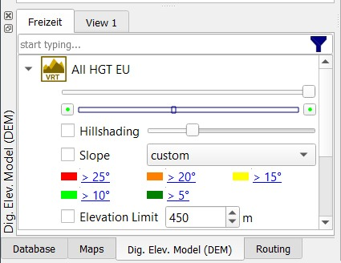

[Prev](AdvProjActions) (General Actions) | [Home](Home) | [Manual](DocMain) | [Index](AxAdvIndex) | (Tips & tricks for online maps) [Next](DocMapsTipsOnline)
- - -
 
***Table of contents***

* [Details of map use](#details-of-map-use)
    * [Adjustable map properties](#adjustable-map-properties)
    * [Adjustable elevation properties](#adjustable-elevation-properties)
    * [Map scale type](#map-scale-type)
    * [Projection and datum](#projection-and-datum)
    * [Full-screen display](#full-screen-display)
    * [Distance ruler](#distance-ruler)

* * * * * * * * * *
 
# Details of map use

For basic information about this topic compare also the
[Control of Maps and DEM Files](DocControlMapDem "Control of Maps and DEM Files") page!

## Adjustable map properties

_(valid starting with QMS patch version de4deeb (30.07.2017))_

After activating a map in a map view, some properties that control the display of the map can be adjusted.
The number of properties depends on the type of the map. Their availability is shown in the next table:

Property | vector map | off-line raster map | on-line  map
---------|------------|--------------------|------------
Map opacity               | ✔ | ✔ | ✔
Visibility range of map   | ✔ | ✔ | ✔
Visibility of object types | ✔ | ✘ | ✘
Visibility of details     | ✔ | ✘ | ✘
Layout of map objects     | ✔ | ✘ | ✘
Cache size                | ✘ | ✘ | ✔
Cache expiration          | ✘ | ✘ | ✔
Layer selection           | ✘ | ✘ | ✔
_Data opacity_            | ✔ | ✔ | ✔
_Full-screen display_     | ✔ | ✔ | ✔

The following image shows the layout of the various selection possibilities in the map tab:

_Comments:_

* The map opacity controls the map visibility in a map overlay.
* The visibility range controls the zoom levels for which the map is displayed.
* The visibility of object types allows to suppress the display of some object types in the map.
* The visibility of details controls how many map details are shown at a given zoom level.
* The layout of map objects can be changed by using different type files for the map.
* The data opacity (slider in the data and not in the map tab!) controls the opacity of the GIS data in the workspace.
* Full-screen display of a map window is enabled by pressing `F11` (toggle!).

## Adjustable elevation properties

After activating elevation data (DEM data), some properties that control the display of this data in a map view
can be adjusted.

The following image shows the layout of the various selection possibilities:

_Comments:_

* The opacity slider controls the visibility of hill shading and slope on a map.
* The visibility range controls the zoom levels for which hill shading and slope are displayed.
* The level of hill shading controls the intensity used for the display of hill shading.
* The slope selection allows to choose one of the predefined slope models. In the case of the "__custom__" model
  the user can define 5 slope levels.

## Map scale type

Selecting the menu `View  - Setup Map View` opens a map view setup window.
In this window the user can set the map scales to _Logarithmic_ or _Square_.

A change of this option leads to a different zoom behavior of maps.

Logarithmic scales support more zoom levels than square ones. As a consequence,
zooming with a square scale changes the scale faster than zooming with a logarithmic scale.

The minimum and maximum zoom levels (scales) are nearly the same for both scales.

For square scales the next zoom step leads to a scale which is approximately changed by a factor 2
compared with the previous one. This scale is recommended for on-line (TMS, WMTS) maps.

## Projection and datum

The projection and geodetic datum (in short: _the coordinate systems_) for map rendering and grid display 
can be defined separately for each view. To do this, use the menu entries `View - Setup map view` and `View - Setup grid`.

Recommended (default) settings are:

* _for map rendering:_ projection: Mercator, datum: WGS_1984, used setup string (`Proj.4` format):

        +proj=merc +a=6378137.0000 +b=6356752.3142 +towgs84=0,0,0,0,0,0,0,0 +units=m +no_defs
        
* _for grid display:_  projection: lon/lat (geographical coordinates), datum: WGS_1984, used setup string (`Proj.4` format):

        +proj=longlat +datum=WGS84 +no_defs

These settings use the format of the `Proj.4` project. For details see the project documentation which can be downloaded from [here](https://proj4.org/index.html).       
        
_Remark:_ For map rendering projections using lat/lon coordinates are not supported. Don't use Proj.4 settings with `+proj=longlat`!
        
The status line at the bottom of the QMS window shows always the geographical coordinates of the mouse location on the
map. The map is rendered so that the edges of the map view have constant first resp. second coordinate as defined with the coordinate system for the map. 

If the grid display is switched on (use menu entry `View - Show grid`), then grid lines are drawn on the map. In general, grid lines are curves 
connecting points on the map with equal first resp. second coordinate (in the default case: latitude resp. longitude). 
Grid coordinates are shown in the status line within square brackets after the geographical coordinates.

If the map coordinate system and the grid coordinate system are equal, then the grid lines are straight lines parallel to the edges of the
map view.

Some properties of coordinate systems are illustrated in the following images using a map for the whole of Germany:

* _Map and grid settings as mentioned at the begin of this section:_ 
    * default WGS84 display of map and grid
    * coordinates are longitude and latitude
    * map and grid coordinates are equal
    * straight grid line
    * grid lines parallel to the edges of the map view
    * coordinates and grid coordinates in the status line are equal
    * grid coordinates displayed at the edges of the map view show longitude and latitude

    

* _ Map setting changed to UTM, zone 32, grid settings unchanged:_
    * new map setting:
    
            +proj=utm +zone=32  +a=6378137.0000 +b=6356752.3142 +towgs84=0,0,0,0,0,0,0,0 +units=m  +no_defs
            
    * grid coordinates are still longitude and latitude
    * map coordinates are UTM (northing/easting)
    * as a consequence of UTM coordinates in the map and lon/lat coordinates in the grid: grid lines are curved
    * edges of the map view have constant northing resp. easting values
    * map is distorted compared with previous image due to the use of different coordinate systems
    * coordinates and grid coordinates in status line are equal (even if the coordinates used for map rendering
      have changed, the location on the map is always shown with lat/lon coordinates)
    * grid coordinates at the edges of the map window show longitude and latitude   
    
    
  
* _ Map setting changed to UTM, zone 32, grid changed to UTM, zone 32:_  
    * new grid setting:
    
            +proj=utm +zone=32  +a=6378137.0000 +b=6356752.3142 +towgs84=0,0,0,0,0,0,0,0 +units=m  +no_defs
            
    * grid coordinates are UTM (northing/easting)       
    * map coordinates are UTM (northing/easting) and equal to grid coordinates
    * edges of the map view have constant northing resp. easting (latitude resp. longitude vary along these edges!)
    * carefully comparing the next image with the first one in this section shows that there is again a distortion due to the use of 
      different coordinate systems in the 2 images.
    * straight grid lines
    * grid lines parallel to the edges of the map view
    * grid coordinates at the edges of the map window show northing resp. easting
    * coordinates in status line are different: lon/lat followed by UTM for grid
 
    
    
_Remarks:_  

* Curved grid lines and map distortion are clearly visible if the map is displayed at a large scale. The smaller the 
  map area displayed in the map view the less obvious are these distortions.
* A side effect of using coordinate systems with different features is the change of the map scale when 
  moving the map over long distances to the north or south (not zooming the map).
* Many projections are defined for use within a certain region (e.g. an UTM zone). Using such a projection outside its area of definition (e.g. in a different UTM zone) may lead to weird screen results.
* Quite often geographical lon/lat coordinates are given without mentioning the used coordinate system. A typical situation is the use of some national
  coordinate system. The following image shows map and grid coordinates in lon/lat format. The map coordinate system is the international WGS84 one, the grid
  coordinate system is the German Potsdam datum. WPT2 is located at 50° North (WGS84/map coordinate), the corresponding grid coordinate is 50.001162° North (Potsdam datum).
  WPT1 is a WPT located at 50° North (Potsdam datum). The distance between both waypoints is more than 100m. This demonstrates also the danger of using coordinates
  with unknown coordinate system (can happen with coordinates from printed raster maps). Trying different grid settings can help
  to identify the coordinate system which was used when describing a waypoint.
  
  
  

## Full-screen display

_(valid starting with QMS patch version de4deeb (30.07.2017))_

Map windows (and other windows as well) can be displayed in full-screen mode. A map window switches to full-screen mode after pressing `F11`. 
Pressing `F11` again switches the window back to the standard mode.

_Remarks:_
* If the QMS toolbar is active, then it is also shown in the full-screen window.
* Pressing `CTRL-D` in the full-screen mode activates the docked windows. Pressing this key again closes the docked windows in the full-screen mode.

## Distance ruler

_(valid starting with QMS patch version bf60cdce289a (13.08.2018))_

The purpose of the distance ruler is to find distances along straight line segments in a map view window.

To use the distance rule proceed as follows:

* Open a map view.
* Right-click with the mouse in the map view to open the context menu and select the menu entry `Ruler`. The mouse icon will change to the ruler icon . A ruler toolbar pops-up at the upper left corner of the map view. Bubble boxes explain the meaning of each toolbar icon when moving the mouse on it. The icons in the middle of the toolbar are selectable (pressed/selected or not pressed/selected).

    

* Left-click in the map view at the first point of the wanted line segment.
* Add more points with further left clicks.
* Right-click, if finished with adding points (line segments).
* Assume all selectable toolbar icons are selected. Then a table shows information about the length (distance) and other information of each line segment. The same information is displayed on the line segments. In addition to this, the angle between adjacent line segments is shown.

    

* Using the respective toolbar icon the ruler line segments can be converted into a track, a route or an area. The endpoints of the line segments can be converted into waypoints. 
* _Hints:_ 
    * If the supplied waypoint name ends with a digit, then the waypoints are numbered consecutively as shown in the next image. Otherwise, all waypoints get the same name.

        
        
    * Tracks generated in this way consist simply of straight line segments.
    * Routes generated in this way can be recalculated using a routing engine (select menu entry `Calculate route` from the route context menu).
    
        
 
    * The 2 comboboxes in the ruler toolbar can be used to select a fixed distance and a fixed angle. In this case the segments have lengths that are multiples of the given distance and the angles between segments are multiples of the given angle.

        
 
* Finally, press the `Close` button in the toolbar to close the ruler tool.    
    

        

- - -
[Prev](AdvProjActions) (General Actions) | [Home](Home) | [Manual](DocMain) | [Index](AxAdvIndex) | [Top](#) | (Tips & tricks for online maps) [Next](DocMapsTipsOnline)
