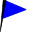
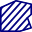

[Prev](AdvProjActions) (General Actions) | [Home](Home) | [Manual](DocMain) | [Index](AxAdvIndex) | (Tips & tricks for online maps) [Next](DocMapsTipsOnline)
- - -

***Table of contents***

* [Details of map use](#details-of-map-use)
    * [Adjustable map properties](#adjustable-map-properties)
    * [Use of map visibility range](#use-of-map-visibility-range)
    * [Adjustable elevation properties](#adjustable-elevation-properties)
    * [Range of use of elevation data](#range-of-use-of-elevation-data)
    * [Map scale type](#map-scale-type)
    * [Projection and datum](#projection-and-datum)
    * [Fullscreen display](#fullscreen-display)
    * [Distance ruler](#distance-ruler)

* * * * * * * * * *
 
# Details of map use

For basic information about this topic compare also the
[Control of Maps and DEM Files](DocControlMapDem "Control of Maps and DEM Files") page!

## Adjustable map properties

_(valid starting with QMS patch version de4deeb (30.07.2017))_

After activating a map in a map view, some properties that control the display of the map can be adjusted.
The number of properties depends on the type of the map. Their availability is shown in the next table:

Property | vector map | offline raster map | online  map
---------|------------|--------------------|------------
Map opacity               | ✔ | ✔ | ✔
Visibility range of map   | ✔ | ✔ | ✔
Visibility of object types | ✔ | ✘ | ✘
Visibility of details     | ✔ | ✘ | ✘
Layout of map objects     | ✔ | ✘ | ✘
Cache size                | ✘ | ✘ | ✔
Cache expiration          | ✘ | ✘ | ✔
Layer selection           | ✘ | ✘ | ✔
_Data opacity_            | ✔ | ✔ | ✔
_Fullscreen display_      | ✔ | ✔ | ✔

The following image shows the layout of the various selection possibilities in the map tab:

_Comments:_

* Each map view has its own set of activated map.
* Re-order the activated maps with drag-and-drop.c
* The map opacity slider controls the map visibility in a map overlay. Having several activated maps you can use this slider to look through a map to see the next one.
* The visibility range controls the zoom levels for which the map is displayed.
* The visibility of object types allows to suppress the display of some object types in the map.
* The visibility of details controls how many map details are shown at a given zoom level.
* The layout of map objects can be changed by using different type files for the map.
* The data opacity (slider in the data and not in the map tab!) controls the opacity of the GIS data in the workspace.
* Fullscreen display of a map window is enabled by pressing `F11` (toggle!).

## Use of map visibility range

A map *visibility range* is the range between some maximum zoom level and some minimum zoom level at which the map is visible in a QMS map view.

Vector and raster maps loaded into QMS have, in general, 2 visibility ranges:

* A predefined visibility range defined with the map itself.
* A user controlled visibility range.

The user-defined visibility range of a map is controlled with the help of the visibility range slider in the docked map window. To define such a range proceed as follows:

* Check if the buttons on the left and on the right side of the slider are both green. If not, then click on each red button to change its color to green. If both bottoms are green, then the map is displayed on all zoom levels.
* Zoom in the map up to the wanted maximum zoom.
* Click the small icon on the left side of the slider. The button changes its color to red as an indication that a range limit is defined.
* Zoom out the map up to the wanted minimum zoom.
* Click the small icon on the right side of the slider. The button changes its color to red as an indication that a range limit is defined.

A green line segment in the visibility slider now shows the user-defined visibility range for the map. When zooming the map, a slider handle moves along the slider. As soon as it is in the green range, the map is visible.

To change a visibility range click the button on the side of the range you want to change. The button color changes to green. Select the new zoom level and click again the same button to define a new size of the range.

A visibility range can be removed by clicks on the red buttons on the left and the right side of the slider.

This feature allows you to switch from one map to another one depending on the zoom level. Simply activate the maps to be used and define for the maps consecutive visibility ranges as shown in the following images. 

If visibility ranges of activated maps overlap, then the lowest activated map in the maps list is drawn.

In the following example 4 different maps of different types with different levels of detail are activated. Each map has its own visibility range. The ranges are disjoint. The waypoint on the map (red diamond near the lower right corner) is shown on 4 different maps depending on the zoom level (check the slider handle positions). The details in the map decrease when decreasing the scale of the map (when zooming out).

![Map visibility range][MapScale1] ![Map visibility range][MapScale2]

![Map visibility range][MapScale3] ![Map visibility range][MapScale4]

## Adjustable elevation properties

After activating elevation data (DEM data), some properties that control the display of this data in a map view
can be adjusted.

The following image shows the layout of the various selection possibilities in the DEM window:

*List of properties (from top to bottom):*

* Filter to find your DEM data set in the list of loaded DEM data sets (type the name of the DEM data into the edit field)
* Name of DEM data. A small triangle in front of the name indicates that the DEM data is active, i.e. used by QMS. Clicking the triangle opens the adjustable properties for this DEM data:
    * Opacity
    * Visibility range (range of data use)
    * Hill shading intensity
    * Slope selection
    * Slope colors and custom slope settings
    * Elevation limit

_Comments:_

* The opacity slider controls the visibility (opacity) of the hill shading, slope and elevation limit layers on a map.
* The visibility range controls the zoom levels for which is used for hill shading, slope and elevation limit layers are displayed.
* The hill shading slider controls the intensity used for the display of hill shading.
* The slope selection allows to choose one of the predefined slope models. In the case of the "__custom__" model
  the user can define 5 personal slope levels (click on a value and adjust it).
* If the elevation limit property is selected, then an extra magenta-colored layer is drawn on the map showing areas above the given limit. This is of special interest when planning aviation routes.

## Range of use of elevation data

A *range of use* of elevation data is the range between some maximum zoom level and some minimum zoom level at which the DEM is used in a QMS map view for creating data objects, for hill-shading, for showing slopes, and for some other purposes.

Elevation data can b e considered as some kind of map (an elevation map). That is the reason why elevation range selection is done in the same way as for [visibility range selection][MapRange] of maps. Therefore, handling of the range selection slider is not repeated here.

DEM files may consist of data with different precision. Defining (disjoint) use ranges for each DEM file makes it possible to use high precision elevation data when zoomed to a level with high detail of the map and to use less precise elevation data when working with an overview map.

The red overlay in the next image shows the area where elevation data of the used DEM file `N51E010` is available. Here, a use range is not selected (both slider buttons are green). The QMS status line displays the elevation at the mouse pointer, if it is inside the data range of this DEM file. Elevation data from this DEM file is not available for locations outside the red area.

![Extend of elevation tile][EleTile]

Now, let's activate a second DEM file and let's define a use range for each of the files:

![Elevation data from DEM][EleRange1]

The zoom in the left image is in the use range of the first DEM file (check the position of the slider handle!) but not in the use range of the second DEM file. In this situation the slope is activated and shown because elevation data is available at this zoom level from the first DEM file. A red elevation limit overlay is not displayed. It is only active for the second DEM file. Elevation data for this DEM file is not available at the given zoom level.

The zoom level in the right image is in the use range of the second DEM file but not in the use range of the first DEM file. Here, the red elevation limit is active and shown. Slopes are not shown. They are not active for the second DEM file. Elevation data is not available at this zoom level for the first DEM file.

This example demonstrates how slope, hill-shading and other elevation features can be made dependent on the zoom level.

If use ranges of activated DEM files overlap, then all elevation-dependent features of all DEM files in the intersection of the use ranges are displayed as shown in the next image. Here, the slope is derived from the first DEM file and the elevation limit (the reddish colored part around the waypoint at the summit) from the second one. The reddish area is opaque due to the opacity setting for the second DEM file. Thus, in this area the slope below the red area is visible, too. 

If no ranges are defined, then all features selected in all DEM files are drawn as well.

![Overlapping elevation ranges][EleOverlap]

If elevation data is required for a data object, the activated DEM files are searched starting with the top-most one for valid elevation data. Elevation data is taken from the first DEM file that can provide it regardless of the use ranges. As a consequence, activated DEM files should be arranged by the precision of the elevation data with the highest precision on top.

The behavior of the elevation-related data under the mouse cursor (the ones shown in the status line of the QMS GUI) is slightly different. In this case, the use ranges are respected. Elevation and slope at the mouse cursor are taken from first DEM file with matching use range containing the elevation for the given position. If there is no matching range, then elevation is not shown in the status bar.

## Map scale type

Selecting the menu `View  - Setup Map View` opens a map view setup window.
In this window the user can set the map scales to _Logarithmic_ or _Square_.

A change of this option leads to a different zoom behavior of maps.

Logarithmic scales support more zoom levels than square ones. As a consequence,
zooming with a square scale changes the scale faster than zooming with a logarithmic scale.

The minimum and maximum zoom levels (scales) are nearly the same for both scales.

For square scales the next zoom step leads to a scale which is approximately changed by a factor 2
compared with the previous one. This scale is recommended for online (TMS, WMTS) maps.

## Projection and datum

The projection and geodetic datum (in short: _the coordinate systems_) for map rendering and grid display 
can be defined separately for each view. To do this, use the menu entries `View - Setup map view` and `View - Setup grid`.

Recommended (default) settings are:

* _for map rendering:_ projection: Mercator, datum: WGS_1984, used setup string (`Proj.4` format):

        +proj=merc +a=6378137.0000 +b=6356752.3142 +towgs84=0,0,0,0,0,0,0,0 +units=m +no_defs
        
* _for grid display:_  projection: lon/lat (geographical coordinates), datum: WGS_1984, used setup string (`Proj.4` format):

        +proj=longlat +datum=WGS84 +no_defs

These settings use the format of the `Proj.4` project. For details see the project documentation which can be downloaded from [here](https://proj4.org/index.html).       
        
_Remark:_ For map rendering projections using lat/lon coordinates are not supported. Don't use Proj.4 settings with `+proj=longlat`!
        
The status line at the bottom of the QMS window shows always the geographical coordinates of the mouse location on the
map. The map is rendered so that the edges of the map view have constant first resp. second coordinate as defined with the coordinate system for the map. 

If the grid display is switched on (use menu entry `View - Show grid`), then grid lines are drawn on the map. In general, grid lines are curves 
connecting points on the map with equal first resp. second coordinate (in the default case: latitude resp. longitude). 
Grid coordinates are shown in the status line within square brackets after the geographical coordinates.

If the map coordinate system and the grid coordinate system are equal, then the grid lines are straight lines parallel to the edges of the
map view.

Some properties of coordinate systems are illustrated in the following images using a map for the whole of Germany:

* _Map and grid settings as mentioned at the begin of this section:_ 
    * default WGS84 display of map and grid
    * coordinates are longitude and latitude
    * map and grid coordinates are equal
    * straight grid line
    * grid lines parallel to the edges of the map view
    * coordinates and grid coordinates in the status line are equal
    * grid coordinates displayed at the edges of the map view show longitude and latitude

    

* _Map setting changed to UTM, zone 32, grid settings unchanged:_
    * new map setting:
    
            +proj=utm +zone=32  +a=6378137.0000 +b=6356752.3142 +towgs84=0,0,0,0,0,0,0,0 +units=m  +no_defs
            
    * grid coordinates are still longitude and latitude
    * map coordinates are UTM (northing/easting)
    * as a consequence of UTM coordinates in the map and lon/lat coordinates in the grid: grid lines are curved
    * edges of the map view have constant northing resp. easting values
    * map is distorted compared with previous image due to the use of different coordinate systems
    * coordinates and grid coordinates in status line are equal (even if the coordinates used for map rendering
      have changed, the location on the map is always shown with lat/lon coordinates)
    * grid coordinates at the edges of the map window show longitude and latitude   
    
    
  
* _Map setting changed to UTM, zone 32, grid changed to UTM, zone 32:_  
    * new grid setting:
    
            +proj=utm +zone=32  +a=6378137.0000 +b=6356752.3142 +towgs84=0,0,0,0,0,0,0,0 +units=m  +no_defs
            
    * grid coordinates are UTM (northing/easting)       
    * map coordinates are UTM (northing/easting) and equal to grid coordinates
    * edges of the map view have constant northing resp. easting (latitude resp. longitude vary along these edges!)
    * carefully comparing the next image with the first one in this section shows that there is again a distortion due to the use of 
      different coordinate systems in the 2 images.
    * straight grid lines
    * grid lines parallel to the edges of the map view
    * grid coordinates at the edges of the map window show northing resp. easting
    * coordinates in status line are different: lon/lat followed by UTM for grid
 
    
    
_Remarks:_  

* Curved grid lines and map distortion are clearly visible if the map is displayed at a large scale. The smaller the 
  map area displayed in the map view the less obvious are these distortions.
* A side effect of using coordinate systems with different features is the change of the map scale when 
  moving the map over long distances to the north or south (not zooming the map).
* Many projections are defined for use within a certain region (e.g. an UTM zone). Using such a projection outside its area of definition (e.g. in a different UTM zone) may lead to weird screen results.
* Often geographical lon/lat coordinates are given without mentioning the used coordinate system. A typical situation is the use of some national
  coordinate system. The following image shows map and grid coordinates in lon/lat format. The map coordinate system is the international WGS84 one, the grid
  coordinate system is the German Potsdam datum. WPT2 is located at 50° North (WGS84/map coordinate), the corresponding grid coordinate is 50.001162° North (Potsdam datum).
  WPT1 is a WPT located at 50° North (Potsdam datum). The distance between both waypoints is more than 100 m. This demonstrates also the danger of using coordinates
  with unknown coordinate system (can happen with coordinates from printed raster maps). Trying different grid settings can help
  to identify the coordinate system which was used when describing a waypoint.
  
    
  

## Fullscreen display

_(valid starting with QMS patch version de4deeb (30.07.2017))_

Map windows (and other windows as well) can be displayed in fullscreen mode. A map window switches to fullscreen mode after pressing `F11`. 
Pressing `F11` again switches the window back to the standard mode.

_Remarks:_

* If the QMS toolbar is active, then it is also shown in the fullscreen window.
* Pressing `CTRL-D` in the fullscreen mode activates the docked windows. Pressing this key again closes the docked windows in the fullscreen mode.

## Distance ruler

_(valid starting with QMS patch version bf60cdce289a (13.08.2018))_

The purpose of the distance ruler is to find distances along straight line segments in a map view window.

To use the distance rule proceed as follows:

* Open a map view.  
* Right-click with the mouse in the map view to open the context menu and select the menu entry `Ruler`. The mouse icon will change to the ruler icon . A ruler toolbar pops-up at the upper left corner of the map view. Bubble boxes explain the meaning of each toolbar icon when moving the mouse on it. The icons in the middle of the toolbar have 2 states: "pressed/selected" or "not pressed/selected".

    
    
    The following table gives an overview of the toolbar:  
    
| Default icon |  Tooltip |
|---------|----------|
|   | Convert into a group of waypoints. |
|   | Convert into a track. |
|   | Convert into a route. |
|   | Convert into an area. |
|   | Show table. |
|   | Show course of each segment. |
|   | Show ascent or descent of each segment. |
|   | Show angle between line segments. |
|   | Show distances in high precision. |
|   | Reset ruler. |
|   | Undo |
|   | Redo |

* Left-click in the map view at the first point of the wanted line segment.
* Add points with more left-clicks.
* Right-click, if finished with adding points (line segments).
* Assume all selectable toolbar icons are selected. Then a table shows information about the length (distance) and other information of each line segment. The same information is displayed on the line segments. In addition to this, the angle between adjacent line segments is shown.

    

* Using the respective toolbar icon the ruler line segments can be converted into a track, a route or an area. The endpoints of the line segments can be converted into waypoints. 
* _Hints:_ 
    * If the supplied waypoint name ends with a digit, then the waypoints are numbered consecutively as shown in the next image. Otherwise, all waypoints get the same name.

        
        
    * Tracks generated in this way consist simply of straight line segments.
    * Routes generated in this way can be recalculated using a routing engine (select menu entry `Calculate route` from the route context menu).
    
        
 
    * The 2 comboboxes in the ruler toolbar can be used to select a fixed distance and a fixed angle. In this case the segments have lengths that are multiples of the given distance and the angles between segments are multiples of the given angle.

        
 
* Finally, press the `Close` button in the toolbar to close the ruler tool.    

[MapRange]: #user-content-use-of-map-visibility-range "Use of map visibility range"
    
[MapScale1]:  images/DocAdv/MapScale1.png  "Map visibility ranges"
[MapScale2]:  images/DocAdv/MapScale2.png  "Map visibility ranges"
[MapScale3]:  images/DocAdv/MapScale3.png  "Map visibility ranges"
[MapScale4]:  images/DocAdv/MapScale4.png  "Map visibility ranges"

[EleTile]:    images/DocAdv/EleTile.jpg    "Extend of elevation tile"
[EleRange1]:  images/DocAdv/EleRange1.png  "Elevation data from DEM"

[EleOverlap]: images/DocAdv/EleOverlap.jpg "Overlapping elevation ranges"        

- - -
[Prev](AdvProjActions) (General Actions) | [Home](Home) | [Manual](DocMain) | [Index](AxAdvIndex) | [Top](#) | (Tips & tricks for online maps) [Next](DocMapsTipsOnline)
