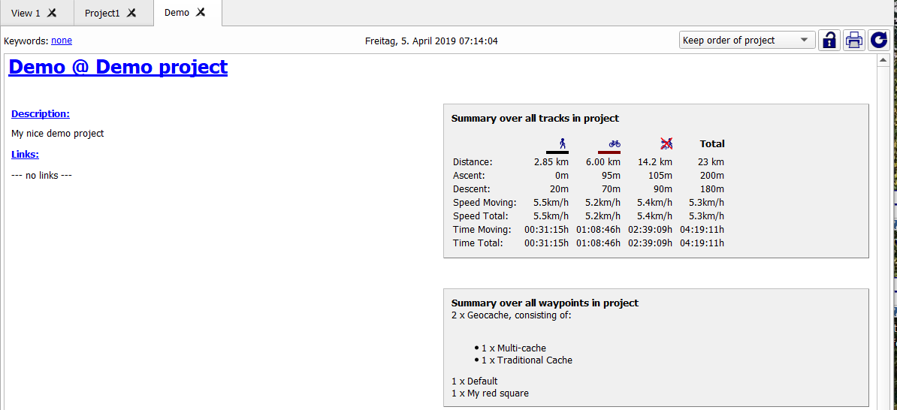
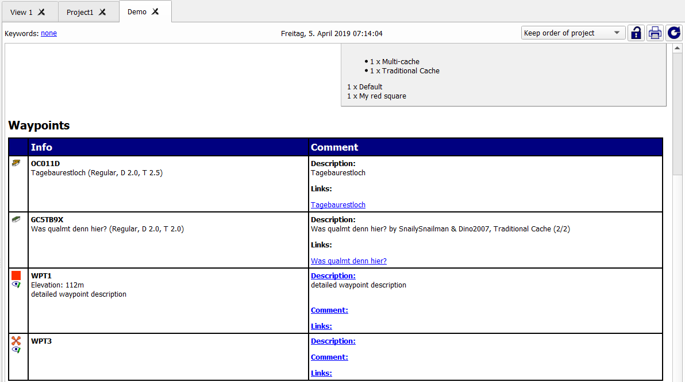
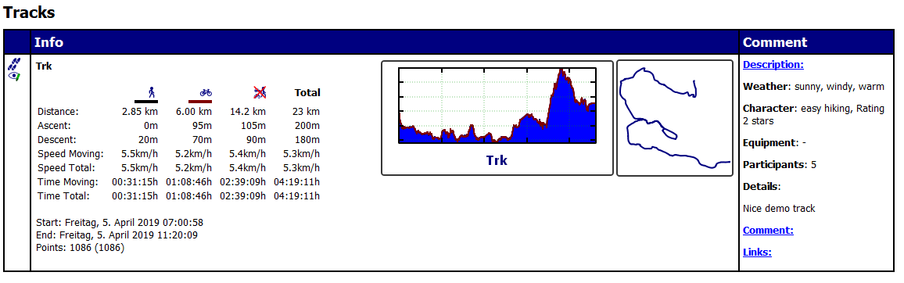
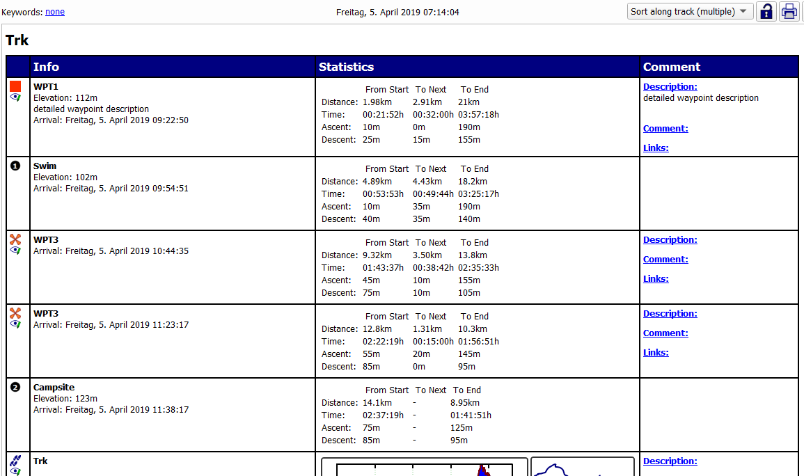
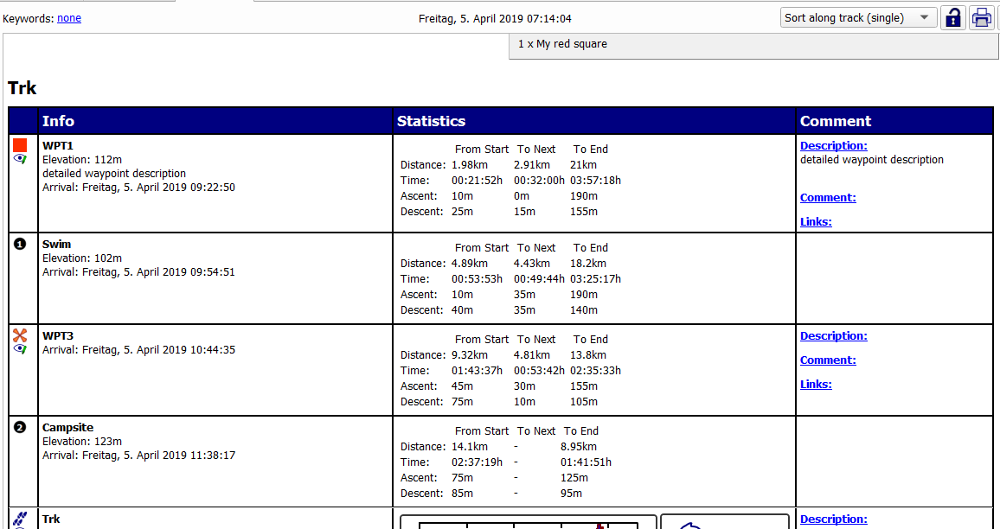
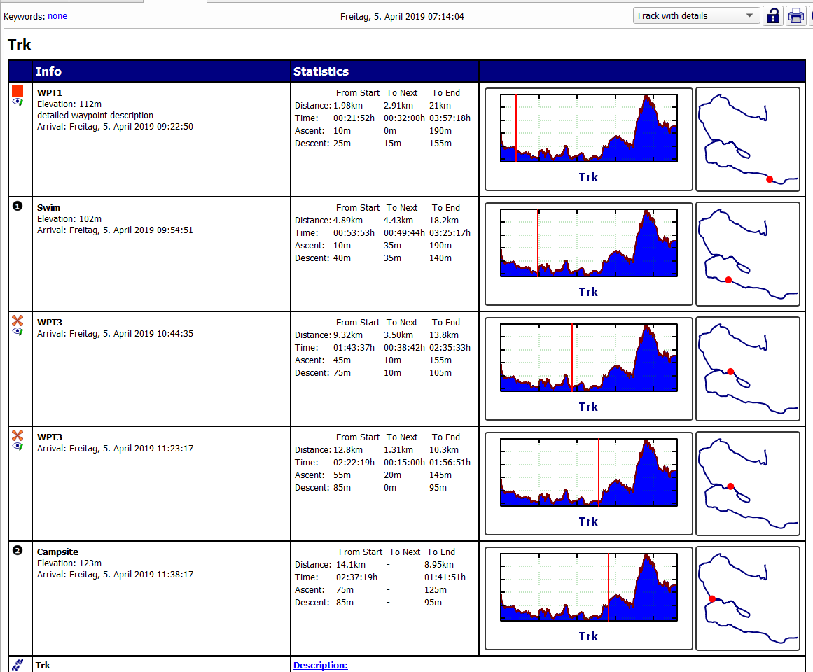

[Prev](AdvProjects) (Databases and projects) | [Home](Home) | [Manual](DocMain) | [Index](AxAdvIndex) | (Details of map use) [Next](AdvMapDetails)
- - -

***Table of contents***

* [General actions](#general-actions)
    * [Working with databases](#working-with-databases)
        * [Import of GIS data](#import-of-gis-data)
        * [Export database to GPX file](#user-content-export-database-to-gpx-file)
    * [Working with projects](#working-with-projects)
        * [Merge projects](#merge-projects)
        * [Copy project](#copy-project)
        * [Save project](#save-project)
        * [Active projects](#active-projects)
        * [Edit project metadata](#edit-project-metadata)
    * [Working with project roadbook](#working-with-project-roadbook)

* * * * * * * * * *
 
# General actions

## Working with databases

### Import of GIS data

(_valid starting with QMS patch version  52659732fc97 (2017-02-05)_)

Files with GIS data (e.g. GPX files) can be loaded as new projects

* into the workspace (use the menu entry `File - Load GIS data`),
* into a database (use context menu entry `Import from files...` of the database),
* into a project of a database (use context menu entry `Import from files...` of the project of the database).

With the last 2 options the user can transfer quickly GIS data from a file to a database.

The name of a new project from a GPX file is the name saved in the GPX metadata part of the file or, if this name is missing, the file
name.

### Export database to GPX file

(_valid starting with QMS patch version  f2297514ff5f (2016-12-08)_)

The data of a whole database or one of its subfolders (project, group, other) can be saved into GPX files. To do so

* right-click the database or folder name and select the context menu entry `Export to GPX...`,
* the window that pops-up ("_export window_") allows to select the target folder and the type of GPX file wanted,
* click the `Start` button to start the save operation.

    _Attention:_ Saving of big databases can take a while. The export window shows the progress of the operation and the storage location of each newly created folder and GPX file. Wait for the `Done` information in the export window!

If a database is saved, a new folder is created in the selected target directory. Subfolders to this folder for projects
and groups in the database are created - if necessary - to mirror the tree structure of the database. Data items (waypoints, tracks,
routes) in a database folder are saved into a GPX file having the name of the folder to which they belong.

If a subfolder (project or group) of a database is saved then this rule is applied similarly.

## Working with projects

### Merge projects

**Source:** [gmane.comp.gis.qlandkartegt](http://article.gmane.org/gmane.comp.gis.qlandkartegt.user/2612)

With QMapShack version 1.6.1 or later:

* Load all stuff you want to have in a single project into the workspace (possibly resulting in several new projects).
* Zoom the map window so that all data of interest can be seen on the map.
* Right-click on the map window and choose `Select Items on Map`.
* Follow the instructions displayed and select whatever data you want to have in one project.
* When the selection is finished, click `Copy all selected items to a project` icon.
* Select or create the destination project.
* Remove all unnecessary projects from the workspace.

If you use a database, you do not have to load all data of a project.
You can load only the items needed. Additionally, if you store a newly created
project into the database you do not need to clone (duplicate) the data.

In the same way all the contents of one project can be dragged into another project.

### Copy project

**Source:** [QMS newsgroup thread](https://sourceforge.net/p/qlandkartegt/mailman/message/35527720/)

To move a project from the workspace into a group in a database and keep the workspace project name proceed as follows:

* Right-click on the project folder in the workspace and select `Copy to...`
* Enter the name you want it to have in the database
* Select the destination database and in the next dialog the location in the database

### Save project

* _Save a single workspace project:_

    When saving a project from the workspace, exactly the project data displayed in the workspace is saved.
    _Remark:_ If the project belongs to a database then the user can select the data to be displayed in the workspace.
    The part of the project data not selected for display is not saved by this method!
    
    * Right-click on the project name in the workspace
    * Select one of the `Save ... ` menu entries in the context menu of the project
    
        * If `Save` is selected then the project is saved in the form selected when the project was created
           (`QMS` or `GPX` file or database file).
        * If `Save as ...` is selected then the user can decide if the project should be saved as `QMS` or as `GPX` file.
        * If `Save as GPX 1.1 w/o ext...` is selected then the project is saved as GPX file without extensions
           (compare section
           ["Which track data is saved in GPX files?"](DocFaqHandling#user-content-which-track-data-is-saved-in-gpx-files))

* _Save all projects in workspace:_

    Select menu entry `File - Save all GIS data` or press `CTRL-S`. Depending on the type of the project (QMS, GPX or database)
    the data is saved to a file or to a database.

* _Save (export) project as part of a database:_

    See section ["Export database to GPX file"](AdvProjActions#user-content-export-database-to-gpx-file)!

### Active projects

When creating a new GIS object (waypoint, track, route, area) it must be assigned to an existing or new project in the workspace. 

With the help of the context menu `Active project` of a project in the workspace one and only one project can be selected as the target of new GIS objects. This makes the creation of a bigger number of GIS objects (especially waypoints) much faster.

An active project in the workspace is labeled with a yellow star in front of the project name.

If a different project should be made active, then simply select the context menu `Active project` of that project.

Selecting again the context menu `Active project` for an already active project removes this feature from the project. When after that creating a new GIS object the target project is again queried during the creation process.

### Edit project metadata

Right-click on a project name in the workspace window and select the menu entry `Edit` from the context menu to open a window where you can edit project metadata and view a summary of the data contained in the project (the so-called [project roadbook](#user-content-working-with-project-roadbook)).

In the upper part of this window you can edit 

* the name of the project,
* the description of the project, 
* add some keywords to the project,
* add some links to the project.

_Hint:_ Be sure the lock in the toolbar at the upper right part of the window is open!

## Working with project roadbook    

_Valid starting with commit 9c99c4dee222 (2019-07-11)_ 

Open the project roadbook as described in the [previous section](#user-content-edit-project-metadata).

The roadbook shows the project metadata and details about the waypoints and tracks in the project. It can be printed using the print icon in the window toolbar.

The upper part of the roadbook gives summary information for the project:

* the project metadata,
* totals over all tracks in the project (distance, ascent, descent, ...) grouped by activity, 
* the number and types of geocaches and waypoints.

The layout of the information displayed in the lower part of the roadbook depends on the selected value in the combobox in the upper right part of the window:

* `Keep order of project`:

    A list of all waypoints and geocaches is followed by a list of all tracks. Both lists show details about the objects.
    
    
    
    
    
* `Sort along track (multiple)`

    Show a list of all tracks together with the waypoints/geocaches [attached to the track](DocGisItemsTrk#user-content-attach-waypoints-to-a-track-to-get-additional-track-information). This list shows also all [trackpoints with additional information](DocGisItemsTrkInfo#user-content-trackpoint-information-for-highlighted-tracks)). If a track passes several times through a point (i.e. if the track has loops), then the point is shown repeatedly. For each point its distance, ascent and descent

    * from the start of the track,
    * to the next point, and
    * to the end of the track 

    is shown.  
    
    _Example (WPT3 is listed several times with different distances from start):_  
    
    

* `Sort along track (single)`    

    Here, waypoints/geocaches attached to the track and trackpoints with additional information are only shown once at the first occurrence.  
    
    _Example (WPT3 is listed only once):_

    

* `Track with details`

    Here, the location of each waypoint/geocache attached to the track and each trackpoint with additional information is shown on the elevation graph and on the track. If a track passes several times through a point (i.e. if the track has loops), then the point is shown repeatedly (compare `WPT3`).

    
    
- - -
[Prev](AdvProjects) (Databases and projects) | [Home](Home) | [Manual](DocMain) | [Index](AxAdvIndex) | [Top](#) | (Details of map use) [Next](AdvMapDetails)
