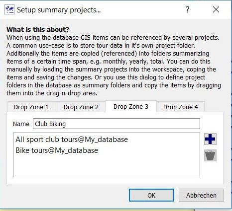
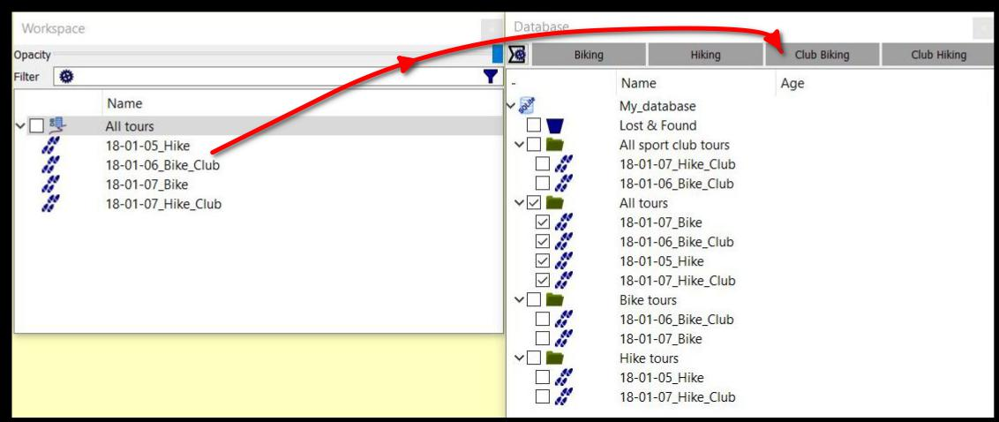

[Prev](DocGisTemplates) (Text Editor Templates) | [Home](Home) | [Manual](DocMain) | [Index](AxAdvIndex) | (General Actions) [Next](AdvProjActions)
- - -

***Table of contents***

* [Databases and projects](#databases-and-projects)
    * [Organization of QMapShack data](#organization-of-qmapshack-data)
    * [Workspace and database windows](#workspace-and-database-windows)
    * [Summary projects and drop zones](#summary-projects-and-drop-zones)

* * * * * * * * * *
 
# Databases and projects

## Organization of QMapShack data

_(inspired by and partially copied from [QMS newsgroup](http://article.gmane.org/gmane.comp.gis.qlandkartegt.user/2744))_

In the following, **data item** means **waypoint**, **track**, **route**, or **area**.

There are 3 physical storage types used in QMS for saving data items:

* `GPX` files (common data format)
* `QMS` files (proprietary efficient binary data format)
* `SQLite` or `MySQL` databases

QMS can load data from files with these types and also from

* `FIT` files (used by Garmin fitness devices),
* `TCX` files (Garmin Training Center XML - limited support), 
* `SLF` files (Sigma Log Format),
* `SML` files (Suunto XML format),
* `LOG` files (Openambi XML format),
* `QLB` files (QLandkarteGT proprietary format).

If selected in the menu `Workspace - Setup Workspace` data is saved automatically at the end of a QMS run and
regularly after some user-defined time interval.
A backup of databases is recommended from time to time.

All QMS data items belong to a **project**.

In the case of a `GPX` or `QMS` file all data in the file belong to one project.
This can be loaded into the QMS workspace and saved from here to the file.

QMS allows the use of one or more databases.

Each database consists of a tree. Each node of the tree is either a **folder** or a **data item**.
Nodes on the highest level must be folders.

There are 3 types of folders:

* **Group** (displayed with a blue icon),
* **Project** (displayed with a green icon),
* **Other** (displayed with an orange icon)

In addition to this, there is a special **Lost & Found** folder. Deleted data items are kept in this folder.
Data can be restored from this folder or deleted. No recovery is possible anymore in the last case.

Group folders cannot contain data items. Only folders can be child nodes of a group folder. Thus, group folders
can be used to group projects.

_Project_ and _other_ folders can have folders and data items as child nodes.

Folders of type _other_ have the same features as those of type _project_. Their main purpose is
to distinguish visibly between basic data of a project and secondary data in it.

If in the following discussion the term _project_ is used, then this includes also the term _other_.

The described database structure can be seen in the QMS database view. Here projects and data items can be selected
with the help of a checkbox for display in the QMS workspace and in the map window.

With this database organization several projects can be saved in one database.

Data items are saved only once in a database. They can be referenced in various projects within a given database.

To rename a _Group_ folder use its context menu in the database window. The other 2 types of database folders can be renamed after opening them in the workspace and using the `Edit` context menu entry.

_Example of data organization:_

A group folder (blue) with each hike track and its waypoints in a project folder (green).
Additionally, a green _summary_ folder
that again contains all tracks from the other green folders. As the tracks are just referenced by the
folders they are not stored several times as would have done with `GPX` or `QMS` files.

Other advantages of the use of databases are the possibility

* to load just a few data items of a project into the workspace. With a `GPX` file everything in the file is completely loaded into the workspace,
* to search for data items with a given text string using the context menu entry `Search database` of the database (starting with QMS version 1.6.3.post).

When creating a new reference to a data item QMS offers the choice either to create simply a reference or a
clone (a copy) of the data item.

## Workspace and database windows

QMS data items can be found in the workspace and database windows (if closed, then open it with the menu entries `Window - Workspace` resp. `Window - Database`). 

Data loaded from files is shown in the workspace. Each file defines a project of its own.

Due to the more sophisticated tree-like structure of databases data in a database is not immediately shown in the workspace. The user must
select with the help of checkboxes those database projects and those data items he wants to have displayed in the workspace 
(and at the same time in the map window).

A checkbox in front of the project name in the workspace allows switching on or off the visibility of all the project data items 
in the map window.

From the workspace perspective all projects are similar. 

Data items can be changed either in special edit windows (use context menu entry `Edit` of item in workspace) or in the map window (left click with mouse 
on data item and select action from toolbar). Data editing in the database window is not supported.

If you do not want to have a data item in the workspace, 
you simply delete it using the context menu entry `Delete`. This will not affect the source of the data item unless you take further actions.

Each project type (project in/from file or project in/from database) has some specific properties. Special attention must be paid to the delete operation 
in the workspace.

A file-type project belongs to exactly one file. It will be written 
from scratch when you save it. The content will be whatever is in the
workspace. By that, a deleted data item will be deleted implicitly from the project when you save it.

The relation between a project in the workspace belonging to a database (a _database-type project_) and its database is more complicated.

A database-type project displays in general only part of the data items of the original project in the database. Other database projects
may exist that are not displayed in the workspace. 

A data item in one database project can be at the same time also part of a second
database project. 

When deleting a data item from one project it is not obvious how to handle the same data item contained 
also in a second project or how to handle data hidden from the workspace.

To avoid additional queries which would be necessary in such a case a delete operation in the workspace for a data item contained in a
database implies only that the data item is deleted from the workspace and not from the database. In practice this means, that the
data item is removed from the workspace and from the map window but not from the database.

If the user wants to delete a data item from the database, then he must use the context menu of this data item in the database window.

**Essential remarks about data in the workspace and in databases:**

* *The workspace is not the location for saving data permanently. Save data, if any possible, in databases.*
* *Use the data selection checkboxes in databases for loading into the workspace only those data you want to work with.*
* *Don't abuse the workspace as a database. The workspace is not the intended location for loading everything to it and then blend out again almost everything but a few items.*

## Summary projects and drop zones

_Valid starting with commit 5f1190254b9f (Feb 09 17:53:45 2018 +0100)_ 
 

If a data item is saved in a database, then it may be part of several database projects even in different databases.
This can be achieved manually by opening the involved database projects in the workspace, copying the data item to
its target projects, and saving the target projects to their databases.

QMS offers a special mechanism to handle this distribution of data items to various database projects in a more sophisticated way.
To do so, the user can define up to 4 classifiers for database projects (called __drop zones__ in the future discussion). Having defined 
drop zones, database projects can be assigned to these drop zones. Database projects in drop zones are called __summary projects__ because they are used
quite often to get summary information for subsets of data items.

The definition and the use of drop zones are described with the help of an example:

* Assume there is a database project _All tours_ containing all recorded data from a GPS device.
* The recorded data should be classified as follows:
    * Bike tours.
    * Bike tours made with a sport club.
    * Hike tours.
    * Hike tours made with a sport club.
* The user wants summary projects for
    * all bike tours,
    * all hike tours,
    * all tours (hike as well as bike) made with a sport club.

Thus, in addition to the _All tours_ database project define 3 more projects in the database:

* _Bike tours_,
* _Hike tours_,
* _All sport club tours_.

Now, define the drop zones:

* Right-click in the database window to open the context menu and select the menu entry _Show summary drop zones_ (toggle!). This displays the drop zone 
  setup icon  in the upper left corner of the database window.
* Click the drop zone setup icon to open the _Setup summary projects window_.
* Go to the _Drop zone 1_ tab.
    * Insert _Biking_ as the drop zone name.
    * Click the  icon and select the database folder _Bike tours_.  
* Go to the _Drop zone 2_ tab.
    * Insert _Hiking_ as the drop zone name.
    * Click the  icon and select the database folder _Hike tours_.  
* Go to the _Drop zone 3_ tab.
    * Insert _Club Biking_ as the drop zone name.
    * Click the  icon and select the database folder _Bike tours_.  
    * Click the  icon again and select the database folder _All sport club tours_.  
* Go to the _Drop zone 4_ tab.
    * Insert _Club Hiking_ as the drop zone name.
    * Click the  icon and select the database folder _Hike tours_.  
    * Click the  icon again and select the database folder _All sport club tours_.  
* Click the _Ok_ to close the setup window.

The names of the 4 drop zones are now displayed in drop areas on the top of the database window.

The drop zones are now ready for use:

* Arrange the docked workspace and database windows so that both of them are visible.
* Display the database folder _All tours_ in the workspace window.
* Pick up a data item (or even several ones, if appropriate) in the _All tours_ folder and drag-and-drop it to the required drop zone,
  e.g. *18-01-06_Bike_Club* to _Club Biking_. This operation saves the dropped item to all summary projects
  that belong to the drop zone, in the example to the summary projects _Bike tours_ and _All sport club tours_.
  
The following image shows a final state of the summary projects:

This content was obtained with the following drag-and-drop operations.

_Dragged items_ | _dropped to drop zone_ | appear in summary project |
----------------|--------------|------------|
18-01-05_Hike   | Hiking       | Hike tours |
18-01-06_Bike_Club | Club Biking | Bike tours, All sport club tours *(1 drag-and-drop operation results in new items in 2 projects!)* |
18-01-07_Bike   | Biking | Bike tours |
18-01-07_Hike_Club | Club_Hiking  | Hike tours, All sport club tours |

Thus, the number of operations to achieve this content of the summary projects is smaller than the number of operations required 
without using the drop zone mechanism.

    

- - -
[Prev](DocGisTemplates) (Text Editor Templates) | [Home](Home) | [Manual](DocMain) | [Index](AxAdvIndex) | [Top](#) | (General Actions) [Next](AdvProjActions)
