[Prev](AdvTrkHist) (Track history and saving) | [Home](Home) | [Manual](DocMain) | [Index](AxAdvIndex) | (Realtime data) [Next](AdvRealtime)
- - -

***Table of contents***

* [Routes and Routing](#routes-and-routing)
    * [Description of a route](#description-of-a-route)
    * [Routing engines](#routing-engines)
    * [Create a route](#create-a-route)
        * [Select autorouting](#select-autorouting)
        * [Use list of routing points](#use-list-of-routing-points)
        * [Use map window](#use-map-window)
    * [Edit a route](#edit-a-route)
    * [Get route instructions](#get-route-instructions)
    * [Save route in GPX file](#save-route-in-gpx-file)
    * [Using no-go areas and lines](#using-no-go-areas-and-lines)
        * [Purpose of no-go areas and lines](#purpose-of-no-go-areas-and-lines)
        * [Defining no-go areas/lines](#defining-no-go-areaslines)
            * [Disc-shaped no-go areas](#disc-shaped-no-go-areas)
            * [Polygon-shaped no-go areas  ](#polygon-shaped-no-go-areas)
            * [No-go lines](#no-go-lines)
        * [Activate no-go areas/lines](#activate-no-go-areaslines)
            * [Routing with no-go areas/lines](#routing-with-no-go-areaslines)
    * [Description of routing methods in QMapShack](#description-of-routing-methods-in-qmapshack)
    * [Comparison of routing engines](#comparison-of-routing-engines)
    * [Other information](#other-information)

* * * * * * * * * *
 
# Routes and Routing

_(For basic information about routes see [here](DocGisItemsRte))_

## Description of a route

A route consists of

* an ordered list of waypoints (routing points) through which the user wants to pass,
* a strategy how to move from one waypoint to the next one.

When selecting a routing strategy, the user has to decide about features like

* used routing engine (online or offline routing, algorithm),
* used road network (used map),
* preferred road types (motorways, toll roads, unpaved roads, ...),
* used transportation type (foot, bicycle, car, ...),
* fastest or shortest route etc.

Having the routing points and having selected the routing strategy the route can be constructed (calculated). After a change of the routing strategy,
the route can be recalculated. This possibility distinguishes routes from tracks. 

If a route is saved into a GPX file, then typically only the routing points are saved. Remember: reconstruction of the route from the list of routing points alone
is not possible. 

Tracks consist of an ordered list of waypoints (trackpoints). In addition to position, elevation and a timestamp trackpoints may contain also other information
(e.g. various fitness data if track has been recorded by a fitness device). Thus, a track is a standalone geospatial data object, which does not require 
additional information like a routing strategy for interpretation.

Typically, a track contains much more points (factor 10 ... 100) than a route. That implies, that it is easier to make changes to a route than to a track when planning
a tour. After the final edit step, the route can easily be converted into a track.

QMS offers tools to create and edit easily routes and tracks.

## Routing engines

QMS provides several routing engines with different routing strategies for the creation of routes. Some routing engines need an Internet server, others
use a local routing database.

The following routing engines (routers) are available in QMS:

* Routers using a routing algorithm (_Auto(matic) routing_)
    * BRouter (online or offline),
    * Routino (offline),
    * MapQuest (online),
* Off-road (straight line) routing (offline),
* Vector routing (offline, use only, if other routers are not available and then better create a track instead of a route),
* Track routing (offline, existing tracks can be used for new routes or tracks).

Offline routers use special routing databases. The preparation of these databases is part of the router configuration/setup (compare page 
[Overview of setup and configuration options](AdvSetup)).  Typically, the data source for a routing database
is [OpenStreetMap](http://www.openstreetmap.org) data.

## Create a route

After the installation and the setup of routers for automatic routing, 2 different approaches are offered for route creation:

* Get route from a list of routing points (waypoints). This approach is supported by the BRouter, Routino and MapQuest routers.
* Define routing points one after the other in a map window. This approach is supported by all routing engines.

### Select autorouting

Autorouting is the default routing setting in QMS. 

If by some reason autorouting might not be active, then proceed as follows:

1. Right click in a map view and select `Add route` from context menu
1. Press `A` (this switches autorouting on)
1. Press twice `Esc` 

### Use list of routing points

1. Prepare all routing points required for the route. Ensure that all routing points are located within 1 project in the `Workspace` docked window
1. Ensure that the `Routing` docked window is open (if necessary, open it with the menu `Window - Routing`).
1. Select one of the routers in the listbox on the top of the `Routing` window.
1. Select the wanted routing strategy using the offered choices (each router has its own choices!).
1. Goto the `Workspace` docked window and select all routing points required for the route.
1. Right click to open the context menu and select `Create route`.
1. If necessary, re-order the routing points in the next window.
1. A new route is constructed. Assign a name to the route and a project to which the route belongs.
1. Goto to the newly created route object in the workspace, open the context menu (right click), and select `Calculate route` (this step is not necessary, if
   the route has been calculated on-the-fly!). 

### Use map window

1. Open a QMS map view
1. Case _Autorouting_:
    1. Ensure that the `Routing` docked window is open (if necessary, open it with the menu `Window - Routing`).
    1. Select one of the routers in the listbox on the top of the `Routing` window.
    1. Select the wanted routing strategy using the offered choices (each router has its own choices!).
1. Move the mouse pointer to the first waypoint of the route in the map view.
1. Right-click the mouse and select `Add route` from the context menu which pops-up. A toolbox appears on the top of the map
   view.
1. Press `A` (autorouting), `O` (off-road routing) or `V` (vector routing) to select a routing method
   (described in detail [here](#description-of-routing-methods-in-qmapshack)).
1. Move the mouse pointer to the next waypoint of the route in the map view and left-click the mouse. After a
   short moment, the route connecting the selected waypoints is shown (maybe in form of a straight line). _Remark:_ The first waypoint is shown with a yellow border,
   the latest one with a green border. Waypoints between the first and the last one are shown as big black rectangles.
   A change of the routing method during the route creation procedure is allowed. The newly selected
   method will be applied to all following new waypoints.
1. Repeat the previous step up to the end of the route.
1. Reaching the last waypoint of the route right-click the mouse.
1. Select `Save as new` in the toolbox on the top of the map view, assign a name and a project to the route.

While creating a route bubble boxes provide additional information about the meaning of an option or the next step.

If an online router is used, then the selected routing points are first connected by straight
lines. After saving the new route (more precisely: the list of selected routing points), left-click on the route in the map window. In the toolbox shown 
select `Calculate route` (wheel icon).
After a short time interval, the online router returns its result and the final route is shown in the map
window. The same procedure should be used if the on-the-fly option for the BRouter (offline) is not selected.

## Edit a route

Editing of routes is described in this section for the case of autorouting only.

An existing route in a project __selected__ in the workspace can be modified and edited in various ways:

* _Change of the routing method/recalculation of route:_
    1. Change selections in routing docked window.
    1. Right-click on the route in the workspace and select `Calculate route` from the context menu. The route will be recalculated using the
      newly selected routing method.
* _Change location of route waypoints:_
    1. Left-click on route in map view. The route is highlighted.
    1. Left-click on the route again to open a toolbox.
    
         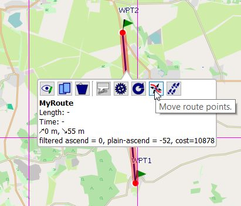
       
    1. Choose `Move route points` from the toolbox. Routing points are shown as big black squares.
    1. Waypoints shown with a big black square (routing points) can be moved with the mouse to a new location. When moving the mouse on such a waypoint, the color of the square 
      is changed to red.
    1. Click on such a waypoint to fix it to the mouse. Move the point with the mouse to a new location.
    1. Left-click at the new location to fix the waypoint.
    1. Repeat previous 2 steps as long as necessary.
    1. When finished, click `Save to original` or `Save as new` from the toolbox at the top of the map window.
    1. If necessary, recalculate route.
    
* _Add routing point:_
    1. Open the toolbox and select `Move route points` as described in the previous point.
    1. Press `CTRL-+` or click the `Add new points` icon in the toolbar to activate adding of new routing points.
    
         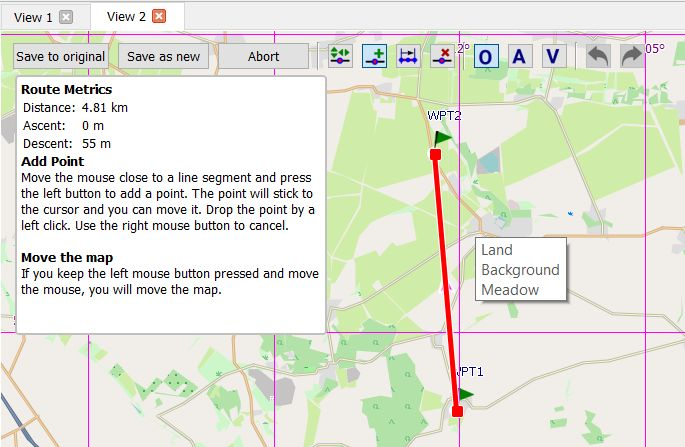
       
       The info box below the toolbar gives some information about possible actions.
    1. Click on the route at a location where a new routing point should be added and move the mouse to the location of the new routing point.  
 
         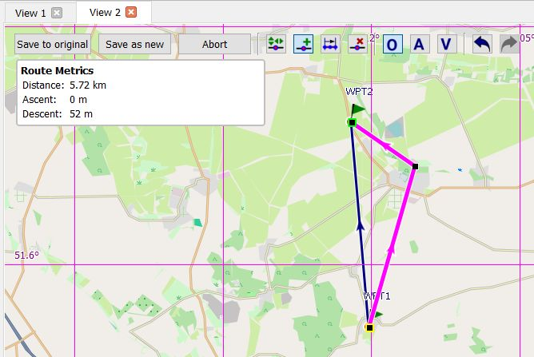
 
    1. Left-click to fix the new routing point.
    1. Repeat previous steps to add more routing points.    
    1. When finished, click `Save to original` or `Save as new` from the toolbox at the top of the map window.
    1. If necessary, recalculate route.
    
## Get route instructions

If the route was constructed with the Routino or the MapQuest router, then route instructions are available. To get them, proceed as follows:

1. Open some map view which can display the route under consideration.
1. Double-click the route name in the workspace to see the route on the map.
1. Right-click on the route name and select the context menu entry `Route Instructions` _or_ left-click on the route
   in the map window and select `Route instructions` from the toolbar.
1. Points on the route with instructions are shown in light-blue.
1. Move the mouse pointer on a light-blue point.
1. See the instructions for the given point in a bubble box.

  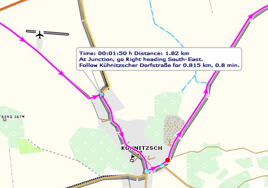

## Save route in GPX file

Routes can be saved in GPX files (and in other formats, too). When checking the information in such a GPX file, it can be seen that only the ordered
list of route waypoints is contained in the route part of the file. This fact needs some explanation.

When following a route, the user expects at all junctions (and only there) information about the necessary
turn in the selected language
(next direction, road number, distance to next junction, ...). No additional information is needed and therefore
no additional information is shown between 2 junctions.

In the following picture the selected waypoints are shown as red dots on the route. Blue dots on the route show
junctions with routing information.

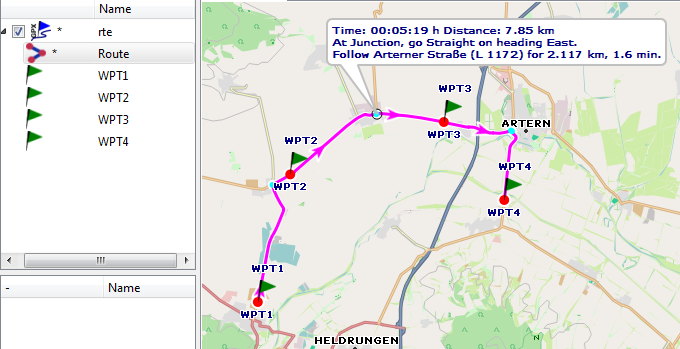

Having the ordered list of route waypoints and the map data (more precisely the routing data of a map and also the
routing engine and its settings) the route
can easily be recalculated by the routing algorithm. This is the reason why when saving a route in form of a portable
GPX file
only the route waypoints are saved. In addition to this the GPX data format does not support the type of information
mentioned above for junctions.

When loading a route from a GPX file into QMS (or into another tool - the file format is portable!), the route has to
be recalculated.
An implication of this is that a transfer of a route
in form of a GPX file from one soft- or hardware tool to another one can lead to a different route due to a different
routing algorithm or different map (routing) data.

QMS can transform a route into a track. This track shows exactly the path to follow but doesn't include the above mentioned
routing information for junctions. This track can be stored together with the route (more precisely the route waypoints)
in a GPX file. In this file the route and the track are 2 independent objects!

_Remark:_ There are some software applications saving a route together with this track in a proprietary
non-portable format which links route and track data.

## Using no-go areas and lines

_(valid starting with QMS version 1.10.0, commit 824a26729b52 (Fri Feb 23 16:05:34 2018 +0100) and BRouter 1.4.10 (07.03.2018))_

### Purpose of no-go areas and lines

A no-go area (an avoid-area) is an area which must be avoided by routes and tracks. A no-go (poly-)line (a no-trespass line) can't be intersected by a route or track.

The BRouter routing engine can handle no-go areas and lines defined in QMS.

No-go areas can be defined in form of

* a disc surrounding a waypoint or
* a polygon-shaped area.

No-go lines can be defined as tracks or routes.

The following image shows from left to right a disc (a circle) surrounding a waypoint, an arbitrary area and a red track. The no-go properties for these objects are not activated. In each case a route intersects the given data object.

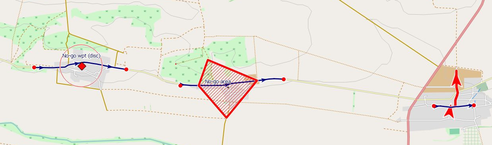

Activating the no-go property of the given 3 objects adds a no-go sign to the objects. Rescheduling the 3 routes leads to the following result:

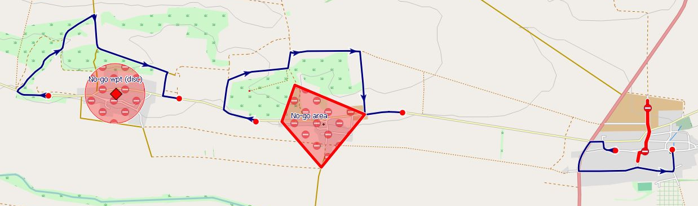

Now, the routes don't intersect anymore the no-go areas resp. the no-go line.

Several no-go areas and lines can be active at the same time.

### Defining no-go areas/lines

#### Disc-shaped no-go areas

* Define a waypoint as center of the no-go area.
* Click `Edit` in the waypoint context menu to open the waypoint edit window 
* In the waypoint edit window define the radius of the no-go area in the field `Proximity`. 
* Close the waypoint edit window. A thin circle around the waypoint shows the proximity
  range.
  
    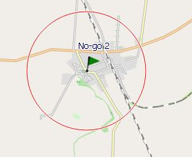 

* In the waypoint context menu select `Toggle no-go area`. The proximity range is now shown as a filled circle.

    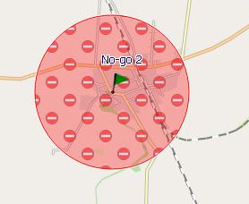
  
* Clicking on the circle surrounding a no-go area opens a toolbox. The text in the toolbox shows the proximity radius. Using the toolbox icons the user can
    * change the radius of the no-go area with the mouse (click icon, move mouse to new size of no-go area, old radius size is still shown, left click to confirm new size).
    * remove the proximity radius and thus the no-go area.
    * switch the no-go area property on or off,    
 
    These actions can also be triggered in the waypoint context menu (menu entries `Change radius`, `Toggle no-go area`, `Delete radius`).
  
    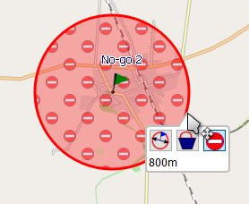    
 
#### Polygon-shaped no-go areas  

* Define a normal QMS area (routing options can be used). _Remark:_ The boundary of an area is a polygon (a closed polyline). 

#### No-go lines

* Define a normal track or route.

### Activate no-go areas/lines

Select the context menu entry `Toggle no-go area` resp. `Toggle no-go line` of the area resp. route/track in the workspace. 

If the no-go property of a data object is activated, then its icon in front of the object name in the workspace displays this state as shown here:

#### Routing with no-go areas/lines

As soon as no-go areas and/or lines are defined any route or track constructed with BRouter avoids each of the no-go areas/lines in __all selected__ projects in the workspace. 
No-go areas/lines defined in unselected workspace projects are inactive while routing.
_Attention:_ This statement is true only if no routing
point lies inside the no-go area. If a routing point is inside a no-go area, then the router creates a route through this routing point irrespective of the no-go area.

Example of a route connecting 2 waypoints without crossing a no-go area:

  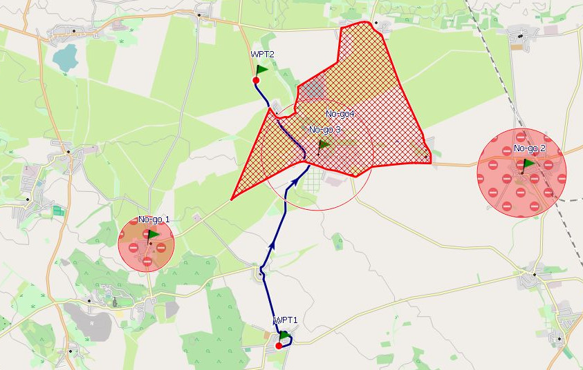

Example of the same route with additional no-go area:

  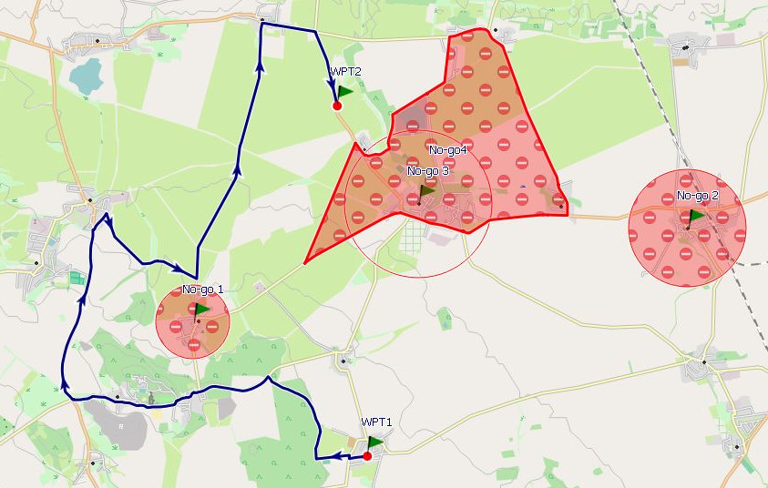
 
 

## Description of routing methods in QMapShack

When creating a new route, QMS offers 4 different offline routing methods.
_Remark:_ These methods work in the same way for track and for route creation.

* _Method 1:_ Off-road routing:

    Select this method by clicking on the toolbar icon `O` or by pressing `O` (easier!) after having defined the first routing point.

    Selected waypoints are connected by straight line segments. Selections in the docked routing window are not used.

* _Method 2:_ Auto(-matic) routing:

    Select this method by clicking on the toolbar icon `A` or by pressing `A` (easier!) after having defined the first routing point.

    This method can be used only after special preparation of an offline router as described in the section
    [Routes](AdvSetup). The map is used only to locate the waypoints properly. Thus, raster maps (e.g.
    Russian military maps) are appropriate.

    The routing algorithm applies the parameters selected in the routing window (foot - bicycle - motorcar, ...).

    * _Advantage of this method:_ Fast routing not depending on map data.
    * _Disadvantage:_ From time to time unexpected routes longer than necessary. There are many reasons for this
        behavior (e.g. incorrect map data used for creating the routing database, location
        of mouse pointer not precise enough).

* _Method 3:_ Routing with vector map data (vector routing):

    Select this method by clicking on the toolbar icon `V` or by pressing `V` (easier!) after having defined the first routing point.
    
    This method can be used only with a vector map. A routing database as described in method 2 is not required.
    As soon as 2 consecutive waypoints can be connected by a
    polyline (a sequence of straight line segments) contained in the map this polyline can be selected manually as part of
    the new route connecting the waypoints considered. If such a polyline is not found in the map, then a straight line
    segment will be used to connect the waypoints.
    
    The manual polyline choice prevents automatic recalculation of routes created with this method. Thus, this method should only be used for
    track creation.

    The following image shows a first new route segment. Its endpoint is on a road of the map (a polyline of the map).
    The yellow part of the road is the extent of this polyline. If the next waypoint is selected on this yellow part,
    then the route follows this road up to this point.

    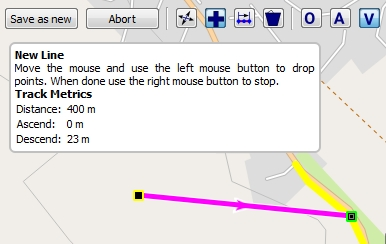

    * _Advantage of this method:_ Off-road and on-road routing can be mixed.
    * _Disadvantage:_ Quite often very short map polylines. Thus, many intermediate routing points are required.

* _Method 4:_ Routing with tracks (track routing):    

    (_valid starting with commit 8c034c733bc4 (Tue Apr 10 13:32:45 2018 +0200)_)
    
    Select this method by clicking on the toolbar icon `T` or by pressing `T` after having defined the first routing point.
    
    As soon as 2 consecutive waypoints can be connected by an existing part of a track contained in the map this track part is selected as part of the new route. If such a track part is not found in the map, then a straight line segment will be used to connect the waypoints.
    
    Here is an example for this routing method:
    
    There exist some track on the map which should be used for the construction of a new route:
    
    
    
    Start creating a new route with track routing (icon `T` is selected). As soon as a new waypoint is on an existing track, the track color is changed to yellow and the new route now may follow the yellow line
    
    
    
    Select the next new waypoint somewhere on the track. The new route follows the track up to this point.
    
    
    
    Continue to the end of the new route (here using straight line segments again)
 
    
    
    Manual routing in a map view allows to change the routing method from step to step. In the next example autorouting was used for the first part of the route. At the second waypoint the routing method was changed to track routing.
    
    
    
    For the final part of the route autorouting (icon `A` is selected) is used again. Thus, straight line segments have been avoided.
    
    
 
    * _Advantage of this method:_ New routes or tracks can use already existing track parts.
    
## Comparison of routing engines

(for a general comparison of routers in general see also [OSM router comparison matrix](http://wiki.openstreetmap.org/wiki/Routing/online_routers))

_Feature_| _BRouter_ | _Routino_ | _MapQuest_ | _Off-road_ | _Vector_ |
---------|-----------|-----------|------------|----------|:----------:|
choose with| Routing window / CTRL-A | Routing window / CTRL-A | Routing window / CTRL-A | CTRL-O | CTRL-V
Internet used | yes or no | no | yes | no | no
create route from list of routing points | yes | yes | yes | no | no
route instructions | no | yes | yes | no | no
use of elevation data in route calculation | yes | no | no | no | no
requires installation of routing database | yes (for offline router, download necessary tiles) | yes (download necessary regional data and run special database preparation script) | no | no | no
requires vector map | no | no | no | no | yes
off-road routing | (yes) | no | no | yes | no
road class preferences | yes, in configuration files | yes, in configuration files | partially | no | manually
user configuration | in additional configuration files | in default configuration file | no | no | no |
cross-border routing | yes | special routing database preparation required | yes | yes | if map covers several countries
no-go areas | yes | no | no | yes - manually | yes - manually
on-the-fly routing | online: no, offline: yes, if switched on | yes | no | no | (yes)

## Other information

* The routing databases used in the BRouter and Routino routing engines and (vector) maps displayed in QMS are completely independent. This may lead to some
  inconsistencies between a calculated route and a vector map (e,g, new road in the map but not yet in routing database).
  OpenStreetMap data are updated 
  quite frequently. To avoid inconsistencies, it is recommended to update from time to time vector maps and routing databases.
  
    _BRouter (offline):_ The tile selection window (last setup window) shows the number of downloaded but outdated tiles. A tile is outdated, if a newer one is found on the 
    BRouter Internet server. This information is available only with Internet access. 
 
* Routino routing data must be downloaded from the Internet. The necessary routing database is created with the help of a special database preparation script. *Warning:* When selecting large regions, the data volume downloaded and the runtime of the script can be huge. To avoid this, use the BRouter for routing. Here, you can download the necessary routing data in form of tiles from the Internet and use them immediately without further data preparation steps.
* The user can change routing preferences in the configuration files of the BRouter and Routino routers. Special knowledge is needed for making changes to these configuration
  files.
* Routes can be (re-)calculated. There are 2 methods to start route calculation:
    * Goto to the route object in the workspace window, open the context menu with a right click and select `Calculate route`.
    * Click on the route in a map window and select the `Calculate route` icon from the displayed toolbar ( icon).
* Recalculation is carried out with the router selected in the routing window. This router can be different to the one used in the original calculation.
* When saving a route (e.g. into a GPX file), only the routing points are saved. (Re-)Loading a saved route into QMS results in a route object with a list of routing points.
  Without recalculating the route it is displayed with straight line segments joining the routing points. After recalculation, the display changes to a _breadcrumb_ line.
  To save this line convert the route into a track using the context menu entry `Convert to track` of the route and save the track.
* _BRouter:_
    * BRouter can be used on- or offline. To switch between these variants click the `Setup` button and select the necessary variant in the next window.
    * _Offline variant:_ A click on the  icon in the routing window opens an additional widget which shows log messages 
      (commands send to the 
      BRouter server, error messages).
    * Click on the question mark (help) button next to the profile selection combobox to see information (the contents) about the selected profile.  
    * _Offline variant:_ The offline server can be started or stopped with the help of the  icon. The state of the server is shown in the 
      routing window. Normally, the server starts automatically.
    * The BRouter stand-alone version is automatically 
      installed when the BRouter engine is set up in QMS. If the offline server is started in QMS, then this server can also be used for a BRouter standalone version.
      Just open [brouter-web](http://brouter.de/brouter-web) in a browser and proceed as described in the browser window.  
      
* _Recommendation on choice of router profiles:_
    * The BRouter and Routino routers offer different routing profiles with different routing results.
    * Good profiles for trekking and biking are:
        * BRouter: `trekking` or `shortest`,
        * Routino: `Foot` or `Bicycle`.
    * The user is advised to check the resulting route and, if necessary, improve it by inserting additional routing points.
    
* _Vector routing:_
    * Routing is possible along any line types in the vector map, even those that don't have the character of a road (e.g. power lines, rivers). Check
      carefully the line types of the map when using this router!

- - -
[Prev](AdvTrkHist) (Track history and saving) | [Home](Home) | [Manual](DocMain) | [Index](AxAdvIndex) | [Top](#) | (Realtime data) [Next](AdvRealtime)
