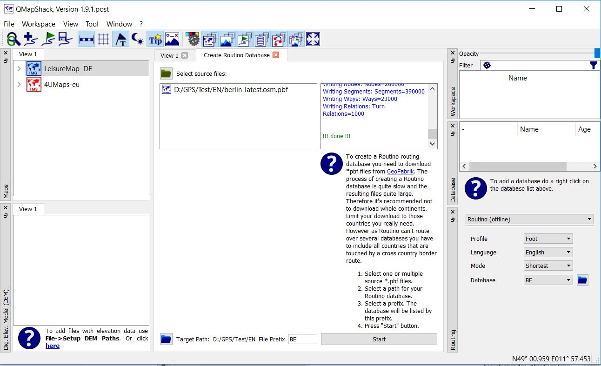

[Prev](DocMapsTipsRasterDEM) (Tips & tricks for raster maps, vector maps, and elevation data) | [Home](Home) | [Manual](DocMain) | [Index](AxAdvIndex) | (Overview of toolbar actions) [Next](AdvToolbarAct)
- - -

***Table of contents***

* [Overview of setup and configuration options](#overview-of-setup-and-configuration-options)
    * [General options](#general-options)
        * [Workspace setup](#workspace-setup)
        * [Waypoint icons setup](#waypoint-icons-setup)
        * [Toolbar setup](#toolbar-setup)
    * [Map and DEM setup](#map-and-dem-setup)
        * [Download and install ](#download-and-install)
        * [Map paths](#map-paths)
        * [Map cache path for online maps](#map-cache-path-for-online-maps)
        * [DEM file paths](#dem-file-paths)
        * [Map window display switches (toggles)](#map-window-display-switches-toggles)
        * [Map window display setup](#map-window-display-setup)
        * [Single map display options](#single-map-display-options)
    * [Routing setup](#routing-setup)
        * [Routino setup](#routino-setup)
        * [BRouter setup](#brouter-setup)
        * [MapQuest setup](#mapquest-setup)
    * [Further setup and configuration options](#further-setup-and-configuration-options)

* * * * * * * * * *
 
# Overview of setup and configuration options

_Valid from patch version 55d8aa7 (18.11.2017)._

This page gives an overview of the available QMS GUI setup and configuration options. This includes in some cases QMS installation topics, too.

More details of the topics mentioned on this page can be found elsewhere in this [Wiki](DocMain).

## General options

### Workspace setup

* Go to menu  `Workspace - Setup workspace` (__Remark:__ changes made to these options need QMS restart!)

    In the pop-up windows define
  
    * a time interval for automatic project data backup,
    * a listening port for a QMS multi-user environment,
    * how GPS devices should be handled by QMS. If this option is not checked, then GPS devices can't be seen in QMS. Otherwise, GPS devices plugged into the PC can be seen in QMS. For details compare section ["Working with GPS Devices"](DocGisDevices).
    * whether [tags (ratings and keywords)](DocDataSearch#user-content-tagging-data) are shown in the workspace window for GIS data objects.
    
* To control the visibility of parts of the workspace go to menu `Window`
    * `Toggle docks:` change visibility of all docked window parts at once.
    * `Toolbar:` change visibility of toolbar.
    * `Maps, Dig.Elev.Model (DEM), Workspace, Database, Routing:` change visibility of single docked window part.
    
### Waypoint icons setup

* Go to menu  `Workspace - Setup waypoint icons`
* In the pop-up windows click the `Open` icon and define a path from which additional user-defined waypoint icons can be loaded


### Toolbar setup

The toolbar allows quick access to important QMS actions.

* Toggle the display of the toolbar with the help of the menu `Window - Toolbar`.
* Configure the toolbar with the help of the menu `Window - Setup toolbar`:
    * Move actions to be included in the toolbar from the left part of the pop-up window to the right part of the window.
    * Move actions not to be included in the toolbar from the right part of the pop-up window to the left of the window.
    * Select the checkbox, if the toolbar should be displayed in the fullscreen mode, too.

## Map and DEM setup

### Download and install 

QMS can render vector maps in the Garmin format and various types of raster and online maps.

* _Vector maps:_ 
    * must have the `gmapsupp.img` container format (the Garmin `gmap` format is not supported!),
    * only unlocked ones can be used,
    * typical sources:
        * [http://download.freizeitkarte-osm.de/garmin/latest/](http://download.freizeitkarte-osm.de/garmin/latest/) - select region and correct format.
        * an overview of available free vector maps can be found [here](https://wiki.openstreetmap.org/wiki/OSM_Map_On_Garmin/Download).
    * download (and unzip if necessary) the map and save it in some map directory.
* _Raster maps:_ for details see [here](DocFaqMaps).
* _Online maps:_ 
    * [Load file with links to online maps](http://www.mtb-touring.net/qms/onlinekarten-einbinden/ "Online maps"). 
      _Hint:_ Click field `Download online maps`! Result is a downloaded file `Onlinemaps.zip`. 
    * Unpack this file into some map directory.  
    
QMS can use digital elevation data (`DEM` data). Necessary files can be downloaded from

* [https://dds.cr.usgs.gov/srtm/version2_1/SRTM3](https://dds.cr.usgs.gov/srtm/version2_1/SRTM3/) or
* [http://viewfinderpanoramas.org/dem3.html](http://viewfinderpanoramas.org/dem3.html).

For more details about the installation of maps and DEM data compare also the [Quick start guide](DocQuickStartEnglish).

### Map paths

* _Assumption:_ Vector, raster maps, or links to online maps have been downloaded and installed
* Go to the `Maps` tab (docked window, if not visible, then open it with the menu entry `Window - Maps`)
* Right-click in the window to open the context menu
* Select `Setup map paths` (alternatively: select menu `File - Setup map paths`)
* In the pop-up window, add or remove paths with vector or raster maps

### Map cache path for online maps

* Go to the `Maps` tab (docked window, if not visible, then open it with the menu entry `Window - Maps`)
* Right-click in the window to open the context menu
* Select `Setup map paths` (alternatively: select menu `File - Setup map paths`)
* In the pop-up window, define a path used for caching online map tiles

### DEM file paths

* _Assumption:_ DEM data has been downloaded and installed.
* Go to the `Dig.Elev.Model (DEM)` tab (docked window, if not visible, then open it with the menu entry `Window - Dig.Elev.Model (DEM)`)
* Right-click in the window to open the context menu
* Select `Setup DEM paths` (alternatively: select menu `File - Setup DEM paths`)
* In the pop-up window add or remove paths with digital elevation (DEM) data 


### Map window display switches (toggles)

The following toggles change the layout of all map windows:

* Menu `View - Show scale`: switch on or off display of map scale 
* Menu `View - Show grid`:  switch on or off display of map grid in all map views
* Menu `View - POI text`: switch on or off display of POI names on vector maps
* Menu `View - Map tooltip`: switch on or off tooltip window display of features of the objects under the mouse cursor in a vector map
* Menu `View - Night/Day`: change map display between day and night layout (if supported by map)
* Menu `View - Min./max. track values`: show the minimum and maximum values of the track properties along the track in the map view
* Menu `View - Flip mouse wheel`: change the zoom direction when zooming a map with the mouse wheel
* Menu `View - Ext. profile`: if selected: track profile is shown in a resizable and floating separate window, otherwise in a small and fixed window

### Map window display setup

The following setup options change the layout of all map windows:

* Menu `View - Setup map font`: In the pop-up window select the font and its properties used for text in map objects
* Menu `View - Setup map background`: In the pop-up window select the color of the map background
* Menu `View - Setup units`: In the pop-up window select the length unit (nautical, imperial, metric, aviation) and the slope unit (% or °). 
  _Hint:_ Changes may take effect only after a QMS restart
* Menu `View - Setup grid`: 
    * Select the color of the map grid with the help of the palette icon
    * _Expert mode_: Define projection and datum (coordinate system) used for the map grid
    * _Remark:_ Each view has its own settings!
* Menu `View - Setup map view`: 
    * Set the map scales to _Logarithmic_ or _Square_. A change of this option leads to a different zoom behavior of maps 
     (compare section "[Map scale type](AdvMapDetails#user-content-map-scale-type)").
    * _Expert mode_: Define projection and datum (coordinate system) used for rendering of maps
    * _Remarks:_ 
        * Each view has its own settings!
        * Projections using lat/lon coordinates are not supported. Don't use Proj.4 settings with `+proj=longlat`!
        
* Menu `View - Setup coord. format`: Select one out of 3 supported geographical coordinate formats

### Single map display options

With the help of these options, the user controls the rendering of a single map. For details, see 
section "[Adjustable map properties](AdvMapDetails#user-content-adjustable-map-properties)"

## Routing setup

### Routino setup


Assume, QMapShack is correctly installed. Then the Routino routing engine is in principle ready for use but it needs still some routing data for proper work. The steps in this section describe how to set up this routing data.

1. **Check, if the Routino routing engine is correctly installed:**
    * Start QMapShack from a console window with parameter `-f` to write a debug logfile:
    
        ```
        path_to_qms/qmapshack.exe -f
        ```

    * Open the debug logfile `org.qlandkarte.QMapShack.log` which is located in
        * `c:\Users\user_name\AppData\Local\Temp\` (for Windows systems),
        * `/tmp/` (for Linux-type systems).
    * If a line of the form

        ```
        2020-11-08 18:03:56.036 [debug] "ROUTINO" path "some_path/translations.xml"
        ```    

        can be found in this debug log, then the Routino routing engine is correctly installed. Otherwise, the installation is corrupted and must be repeated. Linux users should compare the section about the [Routino installation][RoutinoInstallation].

1. **Load OpenStreetMap data from the Internet:**
    * Open the [Geofabrik homepage][Geofabrik].
    * Click on your region (e.g. `Europe`).
    * Find your subregion (e.g. `Germany`).
    * If the subregion is the wanted one, then click on `[.osm.pbf]` to download the OpenStreetMap (OSM) data for this region (pay attention to file size!). Otherwise, click on the subregion name and find (if available) a smaller region and download its `.osm.pbf` file (e.g. `Berlin` as German subregion with download file `berlin-latest.osm.pbf`).
    * Repeat these steps for other required regions.
    * **Hint:** Don't download OSM data for regions bigger than those where your routes are located. The smaller the downloaded region the better the performance of the routing engine. If you have to route across region borders, then use the technique described later for cross-border routing.

1. **Prepare Routino databases from OpenStreetMap data:**
    * *Preliminary remark:* This step is necessary to convert the raw OSM data downloaded in the previous step into a highly efficient database form for use in the routing engine. This conversion can be seen as a filter that removes OSM data items not used by the routing engine. The Routino package includes a tool for this conversion (`planetsplitter.exe`). The easiest way to create these databases is with QMS itself which can access `planetsplitter`.
    * Start QMS and choose the menu entry `Tool - Create Routino database`.
    * A new notebook window will open.
    * Select one or several downloaded `.pbf` source files with the help of the open icon !["Open folder icon"][OpenIcon] at the top of the tool window (in the example shown select `D:\GPS\Test\EN\berlin-latest.osm.pbf`).
    * Select a target path (should have write access!) with the help of the open icon !["Open folder icon"][OpenIcon] at the bottom of the tool window (in the example shown select `D:\GPS\Test\EN\`).
    * Select a short prefix as an identifier for the used region (in the example `BE` for `Berlin`). This prefix is also used as a filename prefix for 4 Routino database files with extension `.mem` created by this tool in the target folder. 
    * Click the `Start` button next to the prefix field to start the data conversion process.
    * In the upper right column of the tool window you can follow the executed actions. This process can take some time!
      The completion of the operation is shown.
      
1. **Use of several Routino databases and cross-border routing:**
    * A Routino database can be built for each `.pbf` file, i.e. for each selected region. To do this, select just one `.pbf` file as source file and create its Routino database as described in the previous point. The used prefixes must be unique! More than one folder can be used as target path. If a single routing database is created for each region, then these databases support only routing within the given region. They don't support cross-border routing, i.e. routing from one region into another one.     
    * If cross-border routing is wanted, then the user should select the `.pbf` files for all regions needed as source files and then create one routing database for these regions. The resulting database supports cross-border routing. 
      
1. **Setup Routino database paths in QMS:**      
    * Go to the `Routing` window/tab (if not visible, open it with the menu entry `Window - Routing`!).
    * Select `Routino (offline)` in the listbox at the top of the window as routing engine.
    * Add the folders with Routino databases using the open icon !["Open folder icon"][OpenIcon] at the end of the database selection line.
    * The database listbox shows now the prefixes of all Routino databases in all selected folders (here the above-mentioned uniqueness of the prefixes is essential!).
    
1. **Setup routing parameters:**    
    * Go again to the `Routing` window/tab.
    * Select a profile (a vehicle type) from the profile listbox (e.g. `Bicycle`).
    * Select a language for routing instructions from the language listbox (e.g. `English`, can be different from the language used in the user interface!)
    * Select a mode (shortest resp. quickest) from the mode listbox (e.g. `Shortest`).
    * Select a routing database from the database listbox (e.g. `BE` for the Berlin region). The database should cover the area under consideration, the names shown in the listbox are the prefixes added to the routing database files when creating them. 
    * Routes and tracks can now be created with the support of the offline Routino router (in the area covered by the
      selected routing database, in the example for Berlin!).
      
      

1. **Change/add routing profiles:**
    
    *This feature is available starting with QMS commit a0eda84 - 2020-06-23 08:10:57, check entry labeled `[QMS-158]` in the [QMS changelog][QMSChangelog] to find out if this feature is available in a QMS release version.* 

    When QMS is using Routino as routing engine it loads several Routino configuration files. Details about these configuration files can be found [here](https://www.routino.org/documentation/configuration.html).  By default, these files are located in the
    
    * `routino-xml` subdirectory of the QMS installation directory (Windows OS),
    * `/usr/local/share/routino` directory (Linux OS).  
    
    One of the configuration files is `profiles.xml`. This XML configuration file (in general a read-only file) allows users with administrator rights modifications of the routing parameters for the offered vehicle and road types. The structure of the `profiles.xml` file is described [here]( https://www.routino.org/xml/routino-profiles.xsd).

    In addition to the default profiles file QMS users can add and modify folder- and database-specific profiles files. To do this proceed as follows:
    
    * *Folder-specific profiles file:*
        * Choose a folder with some Routino databases (`*.mem` files).
        * Copy the default `profiles.xml` file to this folder.
        * Modify the configuration in the copied file as necessary.
        * The folder-specific profiles file replaces the default one. It is applied to all Routino databases in the given folder except for those having a database-specific profiles file.
    * *Database-specific profiles file:*
        * Assume, you have a Routino database with files `prefix-*.mem` in some folder.
        * Copy the default `profiles.xml` file to `prefix-profiles.xml` in this folder.
        * Modify the configuration in the copied file as necessary.
        * The database-specific profiles file replaces the default and the folder-specific ones. It is only applied to the Routino database with the given prefix.
    * *Several profiles files for some routing database:*    
        * Copy the `prefix-*.mem` files of the considered database to `prefix_xxx-*.mem` where `xxx` should describe the profile variant.
        * Add and modify a new profiles file `prefix_xxx-profiles.xml` as described in the previous point. 
    * **Warning:** Don't add new `profile` tags to a profiles file and don't change the `name` or `transport` attributes of a `profile` tag! Change only the values of child tags of a `profile` tag (kph, percent, ...).
    * *Example of the use of 3 different profiles files for one Routino database:*
   
        *Task*: Create a route/track through 3 waypoints in an area with lots of cycle routes, footpaths, and bridges not suitable for bicycles.

        

        The routing properties used for the 3 variants in 3 different profiles files are

        | type | default (%) - red | bike routes & no bridges (%) - blue | foot & no bike routes (%) - green |
        |------|------:|---------:|------:|
        | bridge        | 50 |   0 | 100 |
        | footroute     | 50 |  50 | 100 |
        | bicycleroute  | 60 | 100 |  10 |   

        _Comments:_
    
        * The blue route has a high preference for cycle routes and  should avoid bridges. It follows mainly cycle routes and is rather long because it avoids bridges.
        * The green route has a high preference for bridges and footpaths. 
        * The red default route is a compromise between the extreme blue and green routes.


[OpenIcon]: images/icons/PathBlue.png     "Open folder icon"

[RoutinoInstallation]: BuildLinuxMint19#user-content-download-and-install-routino  "Routino installation (Linux)"
[Geofabrik]: http://download.geofabrik.de/ "Geofabrik download server"
[QMSChangelog]: https://github.com/Maproom/qmapshack/blob/dev/changelog.txt "QMS changelog"
    
### BRouter setup

* For general information about the use of BRouter see [here](http://brouter.de/brouter/).
* Go to the `Routing` tab (docked window, if not visible, then open it with the menu entry `Window - Routing`)
* In the combobox on the top of the window, select `BRouter (...)` 
* Be sure the Internet can be accessed
* Click the `Setup` button
* In the pop-up window choose 
    * online (`BRouter-Web (online)`) or offline (`local installation`) routing. _Remark:_ This selection will change the router name shown in the above-mentioned combobox.
    * `Expert mode:` if appropriate: enables setting of some additional parameters for off- or online routing. _Recommendation:_ Don't select the expert mode (there is no advantage from changing the given default values)
* _Online router settings (recommended, easier to use, no additional installation step):_ 
    * Click `Next` after selecting online routing
    * In the next window, add or remove available BRouter profiles. Click on a profile name to see a short summary of the profile features.
    * If necessary, change the order of selected profiles
    * Close the profile selection window
* _Offline router settings (requires additional installation step):_
    * Be sure that Java runtime environment is installed on your system
    * Click `Next` after selecting offline routing
    * Select local BRouter installation directory
        * If the installation directory is empty or doesn't exist: click button `Create new BRouter installation` resp. `Create directory and install BRouter there`
        * If a BRouter installation is found in the installation directory: click button `Update existing BRouter installation` and select the version you
          want to install
    * Select Java executable if not automatically found
    * Go to the next window
    * Add or remove available BRouter profiles. Click on a profile name to see a short summary of the profile features.
    * If necessary, change the order of selected profiles
    * Close the profile selection window
    * In the next window, select the tiles (areas) to be used for routing.
        * The tiles (segments) have a size of 5° in each direction
        * The scale of the tile selection window can't be changed, but the window itself can be resized.
        * The tile selection window shows a world map as background.
        * _Recommendation:_ Before starting the BRouter setup define with the help of the context menu `Add area` (resp. `Add waypoint`) a sufficiently large area on the map (resp. a few  waypoints) for which routing data are required. Find this area in the tile selection window by moving the map to this area and then select tiles around it. In the next image a user-defined area covering large parts of Central Europe is shown.
        * The color and the texture of each tile inform about the following tile properties (also shown in an infobox, if the mouse is located on a tile):
            * Routing data available on the server or not.
            * Routing data is locally saved or not.
            * Routing data is outdated and should be updated.
            * Size of data download.
        * The status line in the window informs about the number of up-to-date and outdated tiles, and about. the number of tiles selected for download.    
           
           
           
    * Click `Download` to start the download of routing data for offline use. _Attention:_ Depending on the size of the selected area
      the download duration can be considerable!
    * Close the download window after the end of the download.
    
* Select one of the available routing profiles
* Select, if wanted, an alternative to the original route
* In the case of offline routing, select the `on the fly routing` checkbox, if the next route segment should be calculated
   immediately after selecting the next route point.
    

### MapQuest setup

* Go to the `Routing` tab (docked window, if not visible, then open it with the menu entry `Window - Routing`)
* In the combobox on the top of the window, select `MapQuest (online)` 
* Select 
    * Profile (vehicle type)
    * Language (for routing instructions)
    * Road types to avoid
* _Hint:_ When creating a new track, create first a new route, select - if necessary - `Calculate route` from the route context menu,
  and after the route has been completely constructed, convert it to a track with the help of the route context menu.

## Further setup and configuration options

The following list shows some more setup options without detailed description:

* Database import from QLandkarte (menu `Tool - Import database from QLandkarte`)
* VRT Builder for raster maps (menu `Tool - VRT Builder`)
* Routino database creation (menu `Tool - Create Routino database`)

- - -
[Prev](DocMapsTipsRasterDEM) (Tips & tricks for raster maps, vector maps, and elevation data) | [Home](Home) | [Manual](DocMain) | [Index](AxAdvIndex) | [Top](#) | (Overview of toolbar actions) [Next](AdvToolbarAct)
