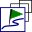

[Prev](AdvSetup) (Overview of setup and configuration options) | [Home](Home) | [Manual](DocMain) | [Index](AxAdvIndex) | (Frequently Asked Questions) [Next](DocFaq)
- - -

***Table of contents***

* [The QMapShack Toolbar](#the-qmapshack-toolbar)

* * * * * * * * * *
 
# The QMapShack Toolbar

This page lists all actions that can be started with the help of the QMS main toolbar. Using the toolbar is an easy way to start an action that should be started otherwise via the main menu.

To activate the toolbar click the main menu entry `Window - Toolbar` (toggle!).

The user can select the actions shown in the toolbar with the help of the mein menu entry `Window - Setup Toolbar`. During setup the user can decide, if the toolbar is visible in fullscreen mode, too.

*Icon*|*Action*|*Tooltip*|*Checkable*|
----|----|----|----|
  | About | About | - |  
  | Add empty project | Add empty project | - |  
  | Add Map View | Add Map View | - |  
  | Change Map View Name | Change Map View Name | - |  
  | Clone Map View | Clone Map View | - |  
  | Close | Close | - |  
  | Close all projects | Close all projects | - |  
  | Close Tab | Close Tab | - |  
  | Create Routino Database | Create Routino Database | - |  
  | Database | Database | true |  
  | Dig. Elev. Model (DEM) | Dig. Elev. Model (DEM) | true |  
  | Flip Mouse Wheel | Flip Mouse Wheel | true |  
  | Full Screen | Full Screen | - |  
  | Geosearch | Geosearch | true |  
  | Help | Help | - |  
  | Import Database from QLandkarte | Import QLandkarte GT database | - |  
  | Load GIS Data | Load projects from file | - |  
  | Load Map View | Restore view with active map and DEM list including the properties from a file | - |  
  | Map Tool Tip | Map Tool Tip | true |  
  | Maps | Maps | true |  
  | Min./Max Summary | Show the minimum and the maximum values of the track properties in a table. | true |  
  | Min./Max. Labels | Show the minimum and maximum values of the track properties along the track in the map view. | true |  
  | Night / Day | Night / Day | true |  
  | Online Wiki | Online Wiki | - |  
  | POI Text | POI Text | true |  
  | Quickstart Help | Quickstart Help | - |  
  | Realtime | Realtime | true |  
  | Routing | Routing | true |  
  | Save All GIS Data | Save all projects in the workspace | - |  
  | Save(Print) Map | Print a selected area of the map | - |  
  | Setup Coord. Format | Change the format coordinates are displayed | - |  
  | Setup DEM Paths | Setup DEM Paths | - |  
  | Setup Grid | Setup Grid | - |  
  | Setup Map Background | Setup Map Background | - |  
  | Setup Map Font | Setup Map Font | - |  
  | Setup Map Paths | Setup Map Paths | - |  
  | Setup Map View | Setup Map View | - |  
  | Setup Time Zone | Setup Time Zone | - |  
  | Setup Toolbar | Setup Toolbar | - |  
  | Setup Units | Setup Units | - |  
  | Setup Waypoint Icons | Setup path to custom icons | - |  
  | Setup Workspace | Setup save on exit. | - |  
  | Show Grid | Show Grid | true |  
  | Show Scale | Show Scale | true |  
  | Start QMapTool | Start QMapTool | - |  
  | Store Map View | Write current active map and DEM list including the properties to a file | - |  
  | Take Screenshot | Take a screenshot from the current active map view. | - |  
  | Toggle Docks | Toggle visibility of dockable windows | true |  
  | Toolbar | Toolbar | true |  
  | Track Highlight | Mark the highlighted track with a red border. | true |  
  | Track Info | Select what information is shown for a highlighted track. | - |  
  | Track Point Info | Mark track points with additional information by auto-numbered bullets. | true |  
  | Track Point Info Table | Show a legend for all track point info bullets along the track. | true |  
  | Track Profile | Show the track profile. | true |  
  | Track Profile as Window | Show the track profile in it's own window instead within the map view. | true |  
  | Track Summary | Show the track summary. | true |  
  | VRT Builder | GUI front end to gdalbuildvrt | - |  
  | Workspace | Workspace | true |  

(_Overview derived from commit 89511685 - 2020-03-21 17:11:30 +0100_) 

_Remarks:_

* Clicking the `Track Info` action icon opens a list where the user can select the specific type of track information to be displayed for a highlighted track in a map view.
* A value `true` in the column `Checkable` means that the action is a toggle (information/window/... visible or not visible).
* The icons for the actions `Close all projects` and `Close Tab` and for the actions `Help` and `Quickstart Help` are equalCheck the tooltips to choose the correct action!

- - -
[Prev](AdvSetup) (Overview of setup and configuration options) | [Home](Home) | [Manual](DocMain) | [Index](AxAdvIndex) | [Top](#) | (Frequently Asked Questions) [Next](DocFaq)
