[Prev](AdvTracks) (Tracks) | [Home](Home) | [Manual](DocMain) | [Index](AxAdvIndex) | (Track information) [Next](AdvTrkInfo)
- - -
[TOC]
- - -

# General information about tracks

_Valid starting with commit f611532bf9e0 (Thu Mar 28 18:50:18 2019 +0100)_ 

## Symbols for trackpoints

The points of a track may have different properties. These properties can be seen when left-clicking on a track
in a map view and then selecting the `Select a range` or `Edit position ...` icons from the track info window (if necessary, zoom in to see more details).

The next image shows the collection of possible trackpoint icons (slightly enlarged):

The meaning of the icons is as follows:

1. _Black square with yellow border._ Start point of track. Properties like big black square.
1. _Black square with green border._ Endpoint of track. Properties like big black square.
1. _Big black square._ Routing point of a track. Can be moved to new position after selection. Changes to red square if selected (clicked).
1. _Small black square._ Track subpoint automatically created by a routing engine. Can't be moved to new position. Is automatically readjusted
   if a neighboring routing point is changed.
1. _Red square._ Appears if the mouse pointer is moved on a routing point. Can be fixed to the mouse and moved to new position.
1. _Magenta circle with dark gray border._ Start or end of a track range.
1. _Small gray square._ Hidden trackpoint.

Icons 1 - 5 are related to the edit position mode. Icons 6 and 7 are related to the track range selection and hide trackpoint modes.
 
 
## Track actions

Various actions can be carried out with a track. This subsection gives an overview of actions that can be triggered from 

* the track context menu in the workspace _or from_
* a toolbar in a map view. 

To open the toolbar for a track in a map view proceed as follows:

* Display the track in a map view with a double-click on the track in the workspace.
* Click with the left mouse button on the track in the map view. An infobox with a toolbar pops up. If there are several tracks at the location of the mouse pointer, then an additional track selection help pops up showing the names of the tracks together with project they belong to. Select the track from here to open its infobox. Example:
  
    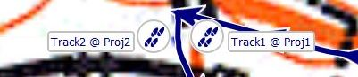
    
    The layout of the infobox can be seen in the following image:

        

The next table shows all actions that can be triggered from the toolbar.

*Action*|*Icon*|*Checkable*|
----|----|----|
 View details and edit properties of track. |  | - |   
 Copy track into another project. |  | - |   
 Delete track from project. |  | - |   
 Show on-screen profile and detailed information about points. |  | true |   
 Select a range of points. You can use that tool to: Hide or show points of a track. , You can copy the selected range. , You can choose an activity for the selected range  Note: If you want to fix bad points in a real GPS recording  this is the right tool. Simply select the section of bad points  (one is ok, too) and hide them. |  | - |   
 Edit the position of track points and use automatic routing  to create new track points. This is used to create new tracks  to plan a tour.  Note: This is the wrong tool to fix bad points of a real GPS  recording. Use the range tool.  |  | - |   
 Reverse track. |  | - |   
 Combine tracks. |  | - |   
 Cut track at selected point. You can use this to: remove bad points at the start or end of the track, use the track parts to plan a new tour, cut a long track into stages  |  | - |   
 Set an activity for the complete track. |  | - |   
 Add a description to the selected track point. The track point will be marked with an auto-numbered bullet. A table with all descriptions will be shown in the track details dialog and for highlighted tracks in the map view. |  | - |   
 Change the color of the track. |  | - |   
 Replace elevation by the view's DEM data. |  | - |   
 Copy track together with all attached waypoints into another project. |  | - |   
 Toggle Nogo-Line |  | true |   

(_Overview derived from commit f3dbcb2119e8 (Tue Apr 23 09:39:43 2019 +0200))_ 

_Comment:_ `true` in the column `Checkable` marks an action which has an on/off state (`checked/selected` or 
  `not checked/not selected`). 

Details of actions are described in the following subsections.  
  
## Add point to track

Given a track more points can be added to it using the following procedure:

* Display the track in a map view, e.g. by double-clicking the track name in the workspace.
* Click on the track in the map view to open the track actions toolbar.
* Click the `Edit position of track points` icon in the track info window.
* A new toolbar pops-up at the top of the map view. 
* Check if the settings for the used routing engine are correct.
* Click the `Add new points` icon in this toolbar. The cursor shows now a bold "__+__" icon.
* Move the mouse to the track. As soon as the mouse hits the track, the color of the track part between the closest routing trackpoints is changed to red. This is the smallest part of the track that can be recalculated by the routing engine. The neighboring routing trackpoints are shown as big red squares.
* With a click on the track a new routing trackpoint (big black square) is attached to the mouse at the selected location.
* Move the mouse to the wanted location of the new routing trackpoint. While moving the mouse the new trackpoint and its neighboring routing trackpoints are connected with straight line segments. As soon as the mouse comes to a standstill, the track is recalculated in accordance with the selected routing options (Avoid the `Snap line ...` routing option!).
* Click at the wanted location to add the new routing trackpoint to the track and to fix it at this location.
* Clicking `Save to original` or `Save as new` in the toolbar at the top of the map view saves the new track.

## Cut track

A track can be cut (split) into 2 parts. To do this use the following procedure:

* Double-click on the track name in the workspace window to display the track in the map window.
* Move the mouse to the trackpoint on the map at which the track should be cut. _Remark:_ If the mouse is on the track,
  then an info window pops-up giving some information about the nearest trackpoint of the track. The mouse pointer is located on a
  trackpoint, if it is located on the pointer of the info window.
  
    Mouse not on trackpoint | Mouse on trackpoint
    ------------------------|--------------------
    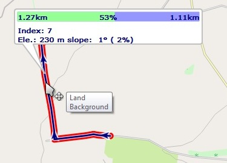 | 
  
* Left-click on the trackpoint. A toolbox window pops-up.

    

* Click the `Cut` icon in the toolbox. A new window pops-up in which some cut options should be selected.
  _Remark_: If this icon is inactive, then the mouse was not located on a trackpoint!

    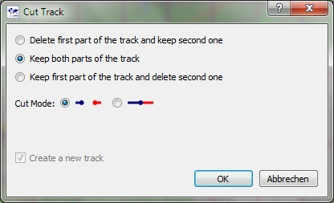

* The upper 3 radio buttons define how to handle the split parts (keep first/last/both parts).
* The 2 radio buttons for the cut mode define how to handle the track segment between the selected cut point and its predecessor
      trackpoint.
    * If the left mode is selected, then this segment is removed from the first part. _Remark:_ If the proposed default names
          for the split parts are used, then the point indices shown indicate the cut mode used (in the next image: 
          point 0 - 6 and 7 - 12, in the other mode this would be 0 - 7 and 7 - 12).
    * If the right mode is selected, then this segment remains in the first part.
  
        Track cut, segment removed | Removed segment in default track names
        ---------------------------|---------------------------------------      
        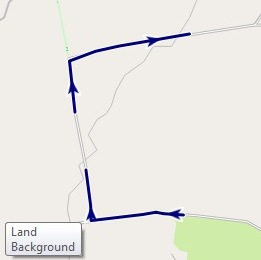 | 

    * The checkbox at the bottom of the window (`Create a new track`) is not active if both split parts should be kept. 
      If only one part should be kept and the checkbox is not selected, then the split part replaces the original track.
    
* In the next windows names and projects should be assigned to the split parts.
* _Remark:_ Cutting a track can also be started from the graphs in the track edit window using the context menu.

## Attach waypoints to a track to get additional track information

(_inspired by_ [QMS issues list](https://bitbucket.org/maproom/qmapshack/issues/169/distance-between-waypoints-popup-window))

Waypoints can be attached to tracks or more precisely to trackpoints of a given track.

There are several ways to do this:

* If the track does not yet exist but some waypoints for the track under constructions are already known:

    * Create the required waypoints within one project.
    * Select the waypoints in the workspace window.
    * Right-click and select the context menu entry `Create Route`.
    * In the `Create Route from Waypoints` window move the waypoints into the necessary order and click ok.
    * Enter a route name.
    * Select the target project (the project with the waypoints under consideration) and click ok.
    * Right-click on the new route in the workspace window and select the context menu entry `Convert to Track`.
    * Enter a track name.
    * Select the target project (the project with the waypoints under consideration) and click ok.
    * Delete the temporary route.

* If the track exists and is displayed in a map:

    * Double-click on the track in the workspace window.
    * Zoom the map in such a way that track details (trackpoints) become visible.
    * Move the mouse pointer to the required waypoint location on the track.
    * A bubble box pops up at the closest trackpoint.
    * Move the mouse pointer to the bubble box, right-click and select `Add waypoint` from the context menu. _Remark:_ If a selected waypoint has a distance of less than 50m to a trackpoint than it is attached to the track.

     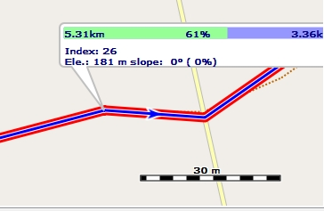

* If elevation data for the track is available:

    * Open the edit window for the track and ensure that the profile graph of the track is displayed.
    * Zoom the graph horizontally with the mouse wheel for better detail.
    * Move the mouse cursor on the profile graph to a location where the index shown in the upper left corner jumps to a new value (i.e. where a trackpoint is located).
    * Right-click and select `Add waypoint` to attach a waypoint to the track. _Remark:_ If a selected waypoint has a distance of less than 50m to a trackpoint than it is attached to the track.

Having waypoints attached to a track additional information about the waypoints is available in the [roadbook](AdvProjActions#working-with-project-roadbook) of the project.

Attached waypoints are also shown with their icons - or in the case that the cursor is located at the waypoint position with
their name - in the profile graph of the track (if elevation data is available). To see the profile graph open the edit window for the
track.

A track can be copied together with its attached waypoints to a new project by selecting the track context menu entry
`Copy Track with Waypoints`.

## Select a range of a track

The user can select in several ways a range of a track, that is a sequence of trackpoints of the track, for further handling:

* __Using a map window:__

     * Display the track in a map window.
     * Click with the left mouse button on the track and release the mouse button.
       An infobox pops up. Choose the "_Select a range of points_" icon in this
       infobox. The mouse cursor changes to the range selection icon.
     * Click with the left mouse button at the location of the start of the range to be selected in the track and
       release the mouse button. The clicked point is shown as a circle with red center.
     * Move the mouse to the location of the end of the range to be selected.
     * Left-click at the end of the range.
     * If the end of the range is not in the map view: left-click on the map and __don't release__ the mouse button.
     * The map is attached to the mouse.
     * Move the map to the wanted location and release the mouse button.
     * The map is fixed again.
     * Move the mouse to the wanted end of the range and left-click.
     * Select the necessary range operation (hide/show points, assign activity/copy) from the info window that pops-up.

     _Remarks:_

       * When selecting the start and end points of the range any trackpoint (ordinary trackpoints as well as subpoints
         created by a routing engine) can be selected.
       * This procedure is recommended for recorded tracks.

         

* __Using a graph in an edit window:__

    * Click with the left mouse button at the location of the start of the range to be selected in one of the track graphs and release the mouse button. A vertical red line jumps to the location of the nearest trackpoint of the track.
    * Move the mouse to the location of the end of the range to be selected __in the same graph__ and click with the left mouse button. _Warning:_ If a `No go!` icon pops up at the location of the mouse pointer then the mouse was moved out of the graph selected with the first click!

In both cases the selected range will be highlighted in green color and the required action for the trackpoint range
can be selected from the infobox that pops up. This infobox shows also some summary information about the range.

Select the action to perform with the track range from this info window:

* Hide trackpoints located in the range. The part of the track between start and end of the range will be
  replaced with a straight line. The track remains in the range selection mode, that is, more range selections
  can be made immediately.

    The hidden part of the track is shown as a gray track while in range selection mode.

* Show all trackpoints in the range
* Assign an activity type to the range
* Copy range into new track

If part of the track is hidden, then this is shown in the track infobox when moving the mouse pointer on the track
in a map window as shown in the following image:

Here, the numbers of visible and of total points are different.

## Select a range of a track in edit mode

This form of range selection can be used if the track is in the edit mode. It is different from the one described in the
previous subsection. _Remember when working in edit mode:_ The edit mode is intended to modify trackpoints.
Subpoints are - in contrast to
ordinary trackpoints - not designed to be modified manually.

This track range selection mode is useful when refining planned tracks.

* Display the track in a map window.
* Click with the left mouse button on the track and release the mouse button.
  An infobox pops up. Choose the "_Edit position of track points_" icon in this
  infobox. This starts the track edit mode. The mouse cursor changes to the edit position icon.
* In the toolbar that appears at the top of the map window click the "_Select a range of points_" icon.
  The mouse cursor changes to the range selection icon.
* Click with the left mouse button at an ordinary  trackpoint (big black square changed to red square if mouse is moved on it,
  not a subpoint with small black square!)
  as the start of the range to be selected in the track and release the mouse button.
* Move the mouse in the direction of the track. The color of the selected track range is changed to green.
  Left-click at the end of the wanted range.

    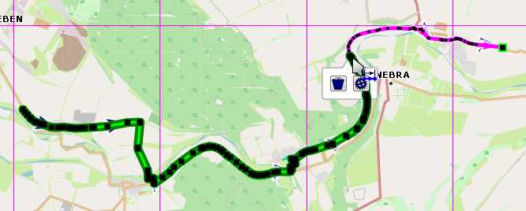

* An info window with 2 icons pops-up:
    * _Delete all points between first and last one_: If icon is active: The selected range of the track is
      replaced with a straight line segment between the first and the last ordinary trackpoint in the range.

        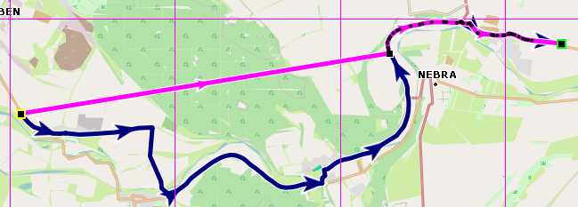

    * _Calculate a route between the first and last selected point_: Use the selected routing engine with the selected options
      and recalculate the track between the first and the last point of the track range. _Hint:_ If in a previous step
      one of the ordinary trackpoints had been deleted, then this does not re-establish the original track!

        

## Move track range to new location

The user can quickly move part of a track to a new location using a range of the track in edit mode. Proceed as
described below:

* Click the `Edit...` context menu of the track.
* Go to the `Filter - Miscellaneous - Convert subpoint to points` filter and apply this filter. Now, each trackpoint
  of the track is an ordinary trackpoint (big black square in edit mode) and can be edited. _Remark:_ If there are already
  enough ordinary trackpoints to select the track range, then this step is superfluous.
* Display the track in a map view.
* Zoom the map view so that you can see the wanted details of the track.
* Click with the left mouse button on the track and release the mouse button.
  An infobox pops up. Choose the "_Edit position of track points_" icon in this
  infobox. This starts the track edit mode.

    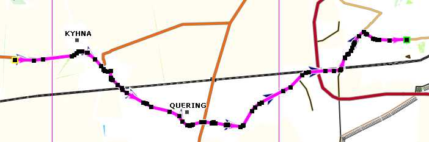

* In the toolbar that appears at the top of the map window click the "_Select a range of points_" icon.
  The mouse cursor changes to the range selection icon.
* Click with the left mouse button at the start of the range that should be moved to a new location and
  release the mouse button.
* Move the mouse in the direction of the track. The color of the selected track range is changed to green.
  Left-click at the end of the wanted range.

    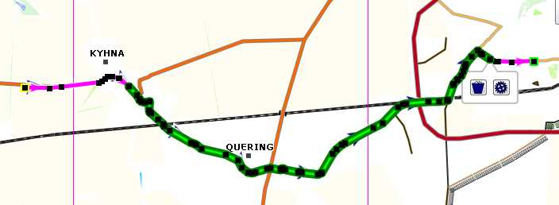

* Click the `Delete all points ...` icon. The first and the last point of the range are now connected
  with a straight line segment.

    

* Click the `Add new points` icon at the top of the map view.

* Move the mouse on the straight line segment.
* Left-click and release the mouse button. A new trackpoint is attached to the mouse.
* Move the mouse (i.e. the new trackpoint) to the wanted new location and left-click. The track is re-routed using
  this additional trackpoint.
* If necessary, repeat the last step to get the wanted new location of the track.

    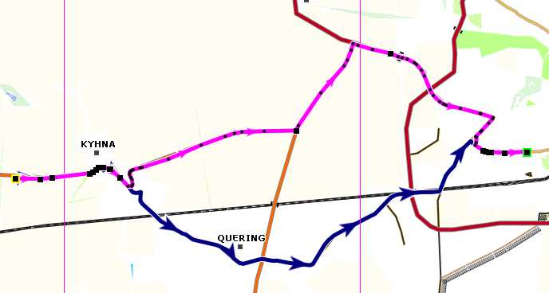

* Save the edited track by either clicking the `Save to original` or the `Save as new` button on top of the map view.

## Find the length of a track interval

**Source:** [Newsgroup discussion](https://sourceforge.net/p/qlandkartegt/mailman/message/36030297/)

A track interval (a part of a track between 2 trackpoints) is called **range** in the QMS terminology. Thus, to find the length of a track interval

* select a track range as described [here](AdvTrkGeneral#select-a-range-of-a-track) (compare also the instructions in the upper left corner of the map window),
* find the length of the track interval/range and some other information of the range in the info window that pops-up.

## Assign colors to track activities

**Source:** [Newsgroup discussion](https://sourceforge.net/p/qlandkartegt/mailman/message/35502464)

To assign an activity to a range of a track proceed as follows:

* Select a track range (for details see [here](#select-a-range-of-a-track)).
* In the bubble box that pops up click the `Select an activity` icon.
* Choose the activity from the list which appears.

The graphs in the track edit window show the track activity ranges (_light green background:_ activity is assigned, _icon:_ type of activity):

Selecting the `Activity` tab in the edit window shows various information about the activities:

Selecting `Activity` in the `Style` tab of the edit window allows to assign a color for each activity type:

* click the colored square for the activity under consideration,
* a list shows the supported colors,
* select one by clicking on it,
* if the list was opened but no color was changed then press the `ESC` to close the list.

Now the selected colors are displayed on the track (red color: color selected for the track itself - no activity was
assigned to red parts):

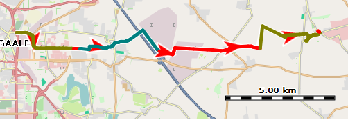

## Recorded and calculated track data

The type of track data recorded with the help of one GPS device differs from the type of track data recorded
by another GPS device. While the location and the timestamp is recorded for each trackpoint the recording of
other data such as

* elevation
* speed
* heart rate
* temperature

depend on the used device. There can be even a dependence between different data fields. Thus, speed can
be calculated from locations and timestamps and can be recorded directly.

QMS is in a position to visualize track data in form of graphs in the track edit window and in form
of various colors on the track in map windows. In the _Graphs_ and _Style_ tabs of the track edit window
the user can select the type of data to be displayed.

A track data field may have a star at the end of its name (_speed*_). This is an indication that the values for
this data field are calculated internally by QMS from other available data fields. The similar data field without a star
(_speed_) is for recorded data.

A track may have a calculated _speed*_ (if timestamps are available) and a recorded _speed_ data field at the same time
and both can be visualized in 2 different graphs.

When editing a track with the `Change timestamps of trackpoints` filter the recorded _speed_ data remain unchanged
whereas the calculated _speed*_ data will change their values.

## Avoid and remove invalid data in a track

QMS is a software for

* _managing and displaying of recorded waypoints and tracks_ (GPS data). A recorded track consists of a sequence of recorded
trackpoints. The trackpoint data consists of location, elevation, timestamp and some other data. Except for
rare failures caused by the recording GPS device this data is consistent (valid).

* _creating new waypoints and tracks_. The creation of a track requires a map so that track points can be properly located.
If elevation data should be added to the track, then this data (DEM data) should be available in QMS. Finally,
if routing should be used for track creation, then routing data should be available in QMS.

QMS offers quite a few easy ways to create and edit tracks. Among others

* move, add or delete trackpoints,
* cut track into pieces (segments),
* join tracks,
* add or replace elevation data,
* add or replace timestamps
* adding and deleting.

Track data may have inconsistencies. Typical reasons for track inconsistencies are

* failures when recording a track in a GPS device caused by missing or weak GPS signals or by technical problems in the device,
* editing a track within QMS.

QMS detects 4 types of inconsistent (invalid) track data:

* wrong positions,
* wrong or missing timestamps of trackpoints,
* wrong or missing elevations of trackpoints,
* wrong slopes along a track.

If there are invalid data in a newly created, edited or loaded track then QMS displays a red warning message in the track infobox:

When loading a GPX file with invalid data in a track, then a pop-up window informs about this fact for each loaded track. Clicking the `Show details` button in this window shows the list of trackpoints of the involved track. Trackpoints with invalid data are shown with red background:

Using the respective buttons in this window the user can with one click hide all invalid data in the track.

*Remark:* This window doesn't appear if there are no valid points in the track, for instance, because there are no elevations or no timestamps in the track.

To deal with invalid track data QMS offers some filters in the track edit window. With the help of these filters the user can

* hide or remove invalid trackpoints,
* replace invalid elevation data,
* define new timestamps for trackpoints.

Different approaches for avoiding or removing invalid elevations are described also
[here](AdvTrkElevation#handle-invalid-elevation-data).

## Tracks and no-go areas

When using the BRouter as routing engine for creating or editing tracks, then the tracks won't pass through no-go areas of all selected projects.
For details of no-go areas compare section ["Using no-go areas"](AdvRoutes#using-no-go-areas-and-lines)
.
 
- - -
[Prev](AdvTracks) (Tracks) | [Home](Home) | [Manual](DocMain) | [Index](AxAdvIndex) | [Top](#) | (Track information) [Next](AdvTrkInfo)
