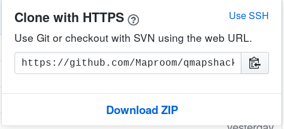

[Prev](DeveloperCodingGuideline) (Coding Guideline) | [Home](Home) | [Manual](DocMain) | [Index](AxAdvIndex) | (Add translations) [Next](DeveloperTranslate)
- - -

***Table of contents***

* [Process for Contributing Code](#process-for-contributing-code)
* [Commit Code](#commit-code)
    * [Fork the repository](#fork-the-repository)
    * [Create a local clone of your fork](#create-a-local-clone-of-your-fork)
    * [Configure Git to sync your fork with the original QMapShack repository](#configure-git-to-sync-your-fork-with-the-original-qmapshack-repository)
    * [Keep your fork synced](#keep-your-fork-synced)
    * [Open a new branch](#open-a-new-branch)
    * [Commit changes locally](#commit-changes-locally)
        * [Change commits](#change-commits)
    * [Push your commits](#push-your-commits)
    * [Rebase your branch](#rebase-your-branch)

* * * * * * * * * *
# Process for Contributing Code

* Create a ticket
* Use the ticket template even if you intend to work on the ticket. 
  And also if it is just a small fix. Violating that rule will encourage 
  others to do it as well. In the end fundamental information and 
  documentation is missing. A ticket that does not stick to that rule
  might be closed without further notice.
* Add the ticket number `QMS-XX` to each of your commits at the start
  of the short headline. And a meaningful description of what the commit 
  does.
* It's ok to have several commits if they form logical groups that 
  are kind of independent from each other. If not squash your commits.
* Open a pull request. Add the ticket number and the ticket headline
  as pull request headline.
* Use the template questionnaire to describe your pull request and to 
  check if you did not forget anything basic. Any pull request ignoring 
  this will be closed asap.
* From that point on the usual review procedure will take place. 

# Commit Code

- [Fork the repository](#fork-the-repository)
- [Create a local clone of your fork](#create-a-local-clone-of-your-fork)
- [Configure Git to sync your fork with the original QMapShack repository](#configure-git-to-sync-your-fork-with-the-original-qmapshack-repository)
- [Keep your fork synced](#keep-your-fork-synced)
- [Open a new branch](#open-a-new-branch)
- [Commit changes locally](#commit-changes-locally)
  - [Change commits](#change-commits)
- [Push your commits](#push-your-commits)
- [Rebase your branch](#rebase-your-branch)


**Fundamental rules:**
* **You need a GitHub account**
* **Please do not send patches! Use a pull request**
* **Each pull request needs a ticket**
* **Never work on the branches `master` or `dev`**
* **Always open a branch with name `QMS-<ticket number>`**
* **Do not merge `dev` into your branch. Do a rebase on `dev`**

This page will summarize the necessary steps.

## Fork the repository

based on [Fork a repo](https://help.github.com/en/articles/fork-a-repo)

1. Go to QMapShack's [code repository page](https://github.com/Maproom/qmapshack).
2. In the top-right corner of the page, click Fork.

  

## Create a local clone of your fork

Right now, you have a fork of the QMapShack repository, but you don't have the files in that repository on your computer. Let's create a clone of your fork locally on your computer.

1. On GitHub, navigate to your fork of the QMapShack repository.

2. Under the repository name, click **Clone or download**.

    


3. In the Clone with HTTPs section, click to copy the clone URL for the repository.

    

4. Open Terminal.

    Type `git clone`, and then paste the URL you copied earlier. It will look like this, with your GitHub username instead of `YOUR-USERNAME`:

    ```sh
    $ git clone https://github.com/YOUR-USERNAME/qmapshack.git
    ```

    Press Enter. Your local clone will be created.
    ```sh
    $ git clone https://github.com/YOUR-USERNAME/qmapshack.git
    > Cloning into `qmapshack`...
    > remote: Counting objects: 10, done.
    > remote: Compressing objects: 100% (8/8), done.
    > remove: Total 10 (delta 1), reused 10 (delta 1)
    > Unpacking objects: 100% (10/10), done.
    ```

Now, you have a local copy of your fork of the QMapShack repository!

## Configure Git to sync your fork with the original QMapShack repository

When you fork a project in order to propose changes to the original repository, you can configure Git to pull changes from the original, or upstream, repository into the local clone of your fork.

1. On GitHub, navigate to the [Maproom/qmapshack](https://github.com/Maproom/qmapshack) repository.

2. Under the repository name, click Clone or download.
    Clone or download button

3. In the Clone with HTTPs section, click to copy the clone URL for the repository.
    Clone URL button

4. Open Terminal.

5. Change directories to the location of the fork you cloned  [Create a local clone of your fork](#create-a-local-clone-of-your-fork)
    * To go to your home directory, type just `cd` with no other text.
    * To list the files and folders in your current directory, type `ls`.
    * To go into one of your listed directories, type `cd your_listed_directory`.
    * To go up one directory, type `cd ...`

6. Type `git remote -v` and press Enter. You'll see the current configured remote repository for your fork.

    ```sh
    $ git remote -v
    > origin  https://github.com/YOUR_USERNAME/qmapshack.git (fetch)
    > origin  https://github.com/YOUR_USERNAME/qmapshack.git (push)
    ```

7. Type `git remote add upstream`, and then paste the URL you copied in Step 2 and press Enter. It will look like this:

    ```sh
    $ git remote add upstream https://github.com/Maproom/qmapshack.git
    ```

8. To verify the new upstream repository you've specified for your fork, type git remote -v again. You should see the URL for your fork as origin, and the URL for the original repository as upstream.

    ```sh
    $ git remote -v
    > origin    https://github.com/YOUR_USERNAME/qmapshack.git (fetch)
    > origin    https://github.com/YOUR_USERNAME/qmapshack.git (push)
    > upstream  https://github.com/Maproom/qmapshack.git (fetch)
    > upstream  https://github.com/Maproom/qmapshack.git (push)
    ```


## Keep your fork synced

You might fork a project in order to propose changes to the upstream, or original, repository. In this case, it's good practice to regularly sync your fork with the upstream repository. To do this, you'll need to use Git on the command line. You can practice setting the upstream repository using the same Maproom/qmapshack repository you just forked! Based on [Syncing a fork](https://help.github.com/en/articles/syncing-a-fork)

1. Open Terminal.

2. Change the current working directory to your local project.

3. Fetch the branches and their respective commits from the upstream repository. Commits to `dev` will be stored in a local branch, `upstream/dev`.

    ```sh
    $ git fetch upstream
    > Von https://github.com/Maproom/qmapshack
    > * [neuer Branch]      Add_Geocaching_Attributes                                        -> upstream/Add_Geocaching_Attributes
    > * [neuer Branch]      Add_waypoint_summary                                             -> upstream/Add_waypoint_summary
    ...
    ```

4. Check out your fork's local dev branch.

    ```sh
    $ git checkout dev
    > Switched to branch 'dev'
    ```

5. Merge the changes from `upstream/dev` into your local `dev` branch. This brings your fork's `dev` branch into sync with the upstream repository, without losing your local changes.

    ```dev
    $ git merge upstream/dev
    > Updating a422352..5fdff0f
    > Fast-forward
    >  README                    |    9 -------
    >  README.md                 |    7 ++++++
    >  2 files changed, 7 insertions(+), 9 deletions(-)
    >  delete mode 100644 README
    >  create mode 100644 README.md
    ```

6. If your local branch didn't have any unique commits, Git will instead perform a "fast-forward":

    ```sh
    $ git merge upstream/dev
    > Updating 34e91da..16c56ad
    > Fast-forward
    >  README.md                 |    5 +++--
    >  1 file changed, 3 insertions(+), 2 deletions(-)
    ```

## Open a new branch

**Never work on the branches `dev` or `master`.** These are reserved. `dev` is the branch that digests all _pull request_. Unless you have administration rights you are not entitled to commit to `dev` directly. You have to start a _pull request_ with your own branch. `master` is the branch that digests all releases. It will be updated with all the changes in `dev` on a release.

First make sure there is a ticket for your contribution. If there is none create one on the [Issue page](https://github.com/Maproom/qmapshack/issues). The branch name will be named `QMS-<ticket number>` replacing `ticket number` by the actual number.

It is assumed that your local repository is up-to-date and the current branch is `dev`. To check do:

```sh
$ git branch
> * dev
```

To create a branch for a ticket with number 69 do:

```sh
$ git checkout -b QMS-69
```

```sh
$ git branch
> * QMS-69
>   dev
```

## Commit changes locally

Depending on your changes you might want to do one or several commits. Always consider several commits if your work can be grouped into several functional/logical groups. e.g. changes in the backend, changes in the GUI

In Git you can amend changes to any already existing commit of your branch. So please use that feature to sort in changes. Keep the commit history nice and clean.

To commit files you have to stage them first:

```sh
$ git status
> On branch dev_guide
> Changes not staged for commit:
>   (use "git add <file>..." to update what will be committed)
>   (use "git checkout -- <file>..." to discard changes in working directory)
>
>         modified:   DeveloperCommitCode.md
>
> Untracked files:
>   (use "git add <file>..." to include in what will be committed)
>
>         images/DeveloperCommitCode/
>
> no changes added to commit (use "git add" and/or "git commit -a")
```

```sh
$ git add DeveloperCommitCode.md
$ git add images/DeveloperCommitCode/
```

```sh
$ git status
> On branch dev_guide
> Changes to be committed:
>   (use "git reset HEAD <file>..." to unstage)
>
>         modified:   DeveloperCommitCode.md
>         new file:   images/DeveloperCommitCode/CloneRepoButton.png
>         new file:   images/DeveloperCommitCode/CloneWithHttps.png
>         new file:   images/DeveloperCommitCode/ForkRepo.png
```

Now you can use `git commit` to commit the staged files. Start the commit message with a single line quoting the ticket and a brief description of the change, e.g.:

```text
[QMS-69] Changed the backend

This is a detailed description of the commit. Explain
what you did and why you did it.

Please limit your line width to 50 characters each.
```
And yes, please obey the line limit of 50 characters for readability's sake.

### Change commits

You can easily amend the last commit by doing another commit with `--amend`:

```sh
$ git commit --amend
```

A much more sophisticated method is to use interactive `rebase`. Simply commit your changes with a bogus message. Let's see the log:

```sh
$ git log
> commit 265ddc4ed5b37a6c1ededef876e7496f5ad85d06 (HEAD -> dev_guide)
> Author: Oliver Eichler <oliver.eichler@dspsolutions.de>
> Date:   Wed Sep 18 17:30:30 2019 +0200
>
>     -
>
> commit a2d7bd6419b1e72c0825a3ddb3704b6a1a338a33
> Author: Oliver Eichler <oliver.eichler@dspsolutions.de>
> Date:   Wed Sep 18 17:30:19 2019 +0200
>
>     Update developer guide for code commits
>
>     Rewrite the complete section to fit GitHub/Git
>
> commit a38496e7ed826329a1bf075d149e26a318a62aca (origin/master, origin/HEAD, master)
> Author: wthaem <k-w.thaemelt@vodafone.de>
> Date:   Wed Sep 18 10:06:34 2019 +0200
>
>     update download link
```

The last two commits are my current work. And I would like to add the last commit to the previous. I could have used `--amend` but I forgot. But I can do a `rebase` of the last two commits:

```sh
$ git rebase -i HEAD~2
> pick a2d7bd6 Update developer guide for code commits
> pick 8291d32 -
>
> # Rebase a38496e..8291d32 onto a38496e (2 commands)
> #
> # Commands:
> # p, pick = use commit
> # r, reword = use commit, but edit the commit message
> # e, edit = use commit, but stop for amending
> # s, squash = use commit, but meld into previous commit
> # f, fixup = like "squash", but discard this commit's log message
> # x, exec = run command (the rest of the line) using shell
> # d, drop = remove commit
> #
> # These lines can be re-ordered; they are executed from top to bottom.
> #
> # If you remove a line here THAT COMMIT WILL BE LOST.
> #
> # However, if you remove everything, the rebase will be aborted.
> #
> # Note that empty commits are commented out
```

The help text says it all. In my case I will change `pick` of commit `8291d32` into `f`. This will remove the commit and amend it's changes to the previous `a2d7bd6` one. This is a very powerful command to reorganize your commits and it will help you to keep your commit history clean.

## Push your commits

If you push your new branch the first time you have to do:

```sh
$ git push --set-upstream origin <branch name>
```

Replace `<branch name>` with your branch's name, e.g. `QMS-69`.

If you want to push again you can do:

```sh
$ git push
```

unless you have used `rebase` or `--amend` to change the commit history. In that case you have to do:

```sh
$ git push --force
```

It is ok to use `--force` as this is your branch and you do not have to care about breaking the history for someone else.

## Rebase your branch

To get the latest changes of `dev` into your branch you do not merge them into your branch. You `rebase` on latest `dev`

```sh
$ git checkout dev
$ git fetch upstream
$ git merge upstream/dev
$ git checkout <your branch>
$ git rebase dev
```

Depending on the changes Git will ask you to resolve conflicts. It will tell you what to do. Basically you have to open the conflicting files in an editor and fix the code wherever a conflict is tagged. When done you `add` the file. After all files are repaired you can continue the rebase.


- - -
[Prev](DeveloperCodingGuideline) (Coding Guideline) | [Home](Home) | [Manual](DocMain) | [Index](AxAdvIndex) | [Top](#) | (Add translations) [Next](DeveloperTranslate)
