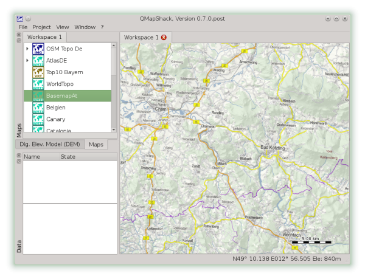
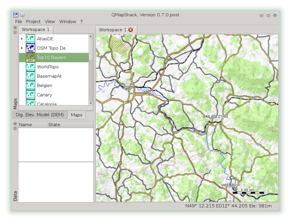
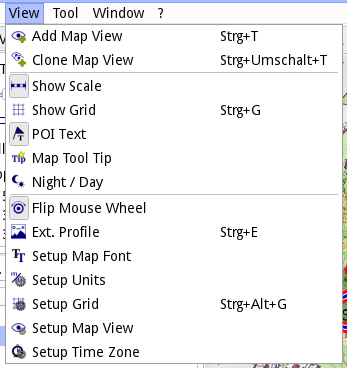
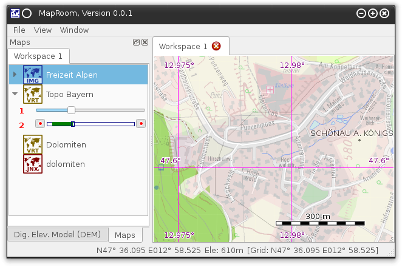
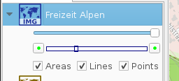
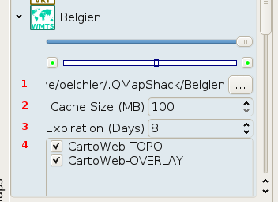
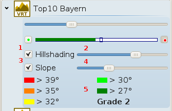
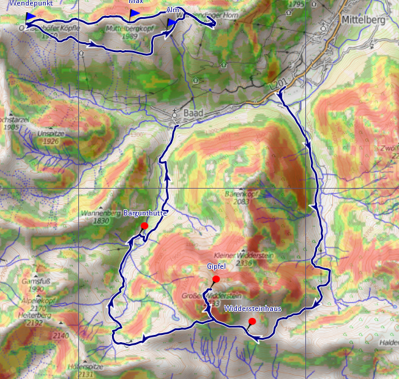

[Prev](DocBasicsMapDem) (Maps & DEM) | [Home](Home) | [Manual](DocMain) | [Index](AxAdvIndex) | (Sources of QMapShack-compatible maps and elevation data) [Next](DocMapDemSources)
- - -
 
***Table of contents***

* [Control of Maps and DEM Files](#control-of-maps-and-dem-files)
    * [Draw Order](#draw-order)
    * [Map Properties](#map-properties)
        * [Workspace](#workspace)
        * [Map and DEM](#map-and-dem)
        * [Vector Maps](#vector-maps)
        * [Online Maps](#online-maps)
        * [DEM Files](#dem-files)

* * * * * * * * * *
 
# Control of Maps and DEM Files

The render engine of QMapShack is quite flexible and lets you create map stacks with
maps of different binary geographic datum, projection and binary format. Additionally
it adds elevation information to the displayed maps if DEM data is loaded. The DEM data
is completely independent from the loaded map. However the same concepts as for maps
apply.

By opening additional workspaces you can have several different map stacks. This allows
you to quickly view your data on different maps.

## Draw Order

* Maps are handled by the topmost item fist, down to the bottom item last. Thus
the item at the bottom of the list will overlay all other items

* DEM files are handled by the topmost item fist, down to the bottom item last. Doing
an elevation data query the first match will stop the query. Thus the topmost item wins.
Doing hill shading or similar the item at the bottom will overlay all other items.

* The draw order can be changed by moving the item in the list via drag-n-drop.

 

## Map Properties

### Workspace

Some properties are set globally for all workspaces. You find them below the _View_ menu.

* **Add Map View** Add a new _View_ to display your data over a selection of maps. *Hint:* The default name of a view can be edited in a configuration file.
* **Clone Map View** Clone the current view.

The properties for the views:

* **Show Scale** A scalebar will be drawn in the right bottom corner of the map.
* **Show Grid**  A grid is drawn over the map. To setup the grid for the current visible workspace select **Setup Grid**
* **POI Text**   This applies to vector maps only. If inactive all labels on point of interest are not drawn.
* **Map Tool Tip** This applies to vector maps only. If active a tool tip with information about the element below the mouse cursor is displayed. If the map does not have any information at the position of the mouse cursor then nothing is displayed.
* **Night / Day ** This applies to vector maps only. Switch between night and day color scheme. This must be defined within the map, else nothing will happen.

Not really map related but workspace related:

* **Flip Mouse Wheel** This will change the zoom in and zoom out direction.
* **Ext. Profile** Switch on the extended profile view in an own window.
* **Setup Map Font** This will change the font used for any text drawn on the map.
* **Setup Units** Change the unit system to metric, imperial or nautical
* **Setup Grid** Setup the projection of the grid overlay.
* **Setup Map Workspace** Setup the projection of the current workspace. The default is Mercator/WGS84.
* **Setup Time Zone** Setup the current timezone or automatic time zone selection.

### Map and DEM

If you expand a map or DEM item you can see the  property setup of this item for the current workspace.

1. The slider on the top controls the opacity.

2. With the bar and the two buttons you can control the range of scale the map is visible. The blue square on the bar indicates the actual scale. Zoom to the minimum scale you want to see the map and press the left button. Now zoom to the maximum scale to display the map and press the right button. The green bar will indicate the range of visibility now.

### Vector Maps

Vector maps have additional properties.

Use the check boxes to control what major map elements are displayed. For example you can overlay your raster map with a vector map and display the points of interest only, to add more information to your map.

### Online Maps

1. The path to the tile cache. Each map has it's own path. The default is  _"<home_dir>/.QMapShack/<map_file_name>"_
2. The maximum tile cache size.
3. The maximum age of the tiles in the cache
4. If the map has more than one layer you can enable/disable the layers

### DEM Files

DEM Files have additional properties.

_Hillshading_ (1) will overlay the map with a gray shaded relief. You can fine tune the contrast of the hillshading with the slider (2). _Slope_ (3) will overlay the map with a color pattern for certain ranges of slopes. The patter reflects the ranges defined by the so called [DAV Snow Card](http://www.alpenverein.de/bergsport/sicherheit/skitouren-schneeschuh-sicher-im-schnee/dav-snowcard_aid_10619.html). This is a scheme to evaluate the risk of a snow avalanche commonly used in the European Alps. It knows 4 grades of risk. Use the slider (4) to select the grade. You will see the ranges in the legend (5). As a result the map will look a bit strange:

- - -
[Prev](DocBasicsMapDem) (Maps & DEM) | [Home](Home) | [Manual](DocMain) | [Index](AxAdvIndex) | [Top](#) | (Sources of QMapShack-compatible maps and elevation data) [Next](DocMapDemSources)
