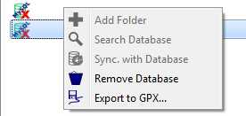
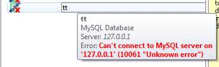

[Prev](DocFaqProjectSite) (Use of issue templates) | [Home](Home) | [Manual](DocMain) | [Index](AxAdvIndex) | (Data handling) [Next](DocFaqHandling)
- - -

***Table of contents***

* [Frequently Asked Questions - Databases and projects](#frequently-asked-questions---databases-and-projects)
    * [Why does QMapShack use a separate workspace.db to save data?](#why-does-qmapshack-use-a-separate-workspacedb-to-save-data)
    * [Why are there no checkboxes for data in workspace projects?](#why-are-there-no-checkboxes-for-data-in-workspace-projects)
    * [How to edit quickly the name of a project?](#how-to-edit-quickly-the-name-of-a-project)
    * [How to find the location of a database file used in QMapShack?](#how-to-find-the-location-of-a-database-file-used-in-qmapshack)
    * [How to find database to which a project belongs?](#how-to-find-database-to-which-a-project-belongs)
    * [Why does a database not allow creating new folders?](#why-does-a-database-not-allow-creating-new-folders)

* * * * * * * * * *
 
# Frequently Asked Questions - Databases and projects

## Why does QMapShack use a separate workspace.db to save data?

**Source:** [Newsgroup discussion about QMS INI information](https://sourceforge.net/p/qlandkartegt/mailman/message/35276035)

The philosophy of the QMS workspace concept is to support handling of temporary project data which exists only for a short time
period and for which there is no need to save it permanently into a user-defined database
(shown in the  "Database" dock widget).
In order to avoid the loss of such temporary project data without
forcing the user to save it as permanent data QMS uses the `workspace.db` database. This file contains all the data of the
current QMS workspace. Thus, this state of the workspace can be restored after a
restart of QMS.

The database setup is part of the configuration and saved in a configuration file (*.config or *.ini file, Windows registry). The workspace setup
is considered as temporary and therefore not part of the configuration.

**Warnings:**
* QMS maintains only one `workspace.db` file!
* The workspace data can be linked to data in a database. When restarting QMS with a different configuration
(with different databases) workspace data gets lost if a link to the database can't be restored!

## Why are there no checkboxes for data in workspace projects?

_(taken from discussion on [QMS issue 246](https://bitbucket.org/maproom/qmapshack/issues/246/feature-request-add-hide-and-show#comment-39109722))_

This question is directly related to the design philosophy of QMS and in particular its workspace.

There are 2 locations for GIS data in QMS with different purpose:

* the databases
* the workspace

QMS databases are used to keep all GIS data together in a structured way and to save it permanently. Except for deletion no data manipulation is possible in databases.

The QMS workspace is used for working with part of the data saved in databases (or in external files).

If there is a need to display some data or to edit it, then the necessary data items (tracks, routes, waypoints) should be selected with the help of checkboxes in the 
database window. Being selected the data items appear in the workspace window. Using this procedure guarantees that the workspace and as a consequence the map windows 
aren't cluttered with extra data. 

Loading all data objects into the workspace and then selecting the ones to work with would imply a much heavier load on the QMS rendering engine and thus lead to less performance.

## How to edit quickly the name of a project?

**Compare:** [QMS issues list](https://bitbucket.org/maproom/qmapshack/issues/160/update-of-diary-after-adding-a-waypoint)

Depending on the number of data objects (tracks, routes, waypoints) in a project in the workspace it may take a relatively long time
to open the project edit window (right click on the project name in the workspace and select `Edit` menu item).
The reason for this is that the project diary with all the selected data objects has to be created.

If the only goal is to edit the name of a project then open the project with just a few data objects. The project edit
window is then opened very quickly and the project name can be edited in it.

## How to find the location of a database file used in QMapShack?

Move the mouse pointer on the database name in the database window. A bubble box appears and shows the physical location of the
database file.

## How to find database to which a project belongs?

Move the mouse pointer on the project name in the workspace. An information box pops-up. The filename shown is the name of the
database to which the project belongs. If no filename is shown, then the project doesn't belong to any database.

## Why does a database not allow creating new folders?

When opening the context menu of a database it may happen that the menu entry `Add folder` is grayed out. Thus, no new folders can't be
created in this database.

At the same time a red "__X__" is shown on the database icon and, when moving the mouse on the database entry, an info window pops-up
with an error message

There can be several reasons for this error:

* Wrong installation of files related to MySQL database handling. For Windows users:
    * Check if there is a file `libmysql.dll` in the directory where `qmapshack.exe` is located. If not, move the file to this location. _Remark:_ Normally, this file is 
      part of a full MySQL installation. Find this file in the MySQL installation directory.   
    * Check if there is a file `sqldrivers\qsqlmysql.dll` relative to the directory where `qmapshack.exe` is located. If not, move the 
      file to this location. _Remark:_ Normally, this file is 
      part of a full Qt installation. Find this file in the Qt installation directory.   
* Check if MySQL version is 5.6.5 or greater.
* Check if your MySQL client is running. If not, start it.
* Check if your user name and password is correct.
* Check if your database exists in MySQL. If not, create it.
        
- - -
[Prev](DocFaqProjectSite) (Use of issue templates) | [Home](Home) | [Manual](DocMain) | [Index](AxAdvIndex) | [Top](#) | (Data handling) [Next](DocFaqHandling)
