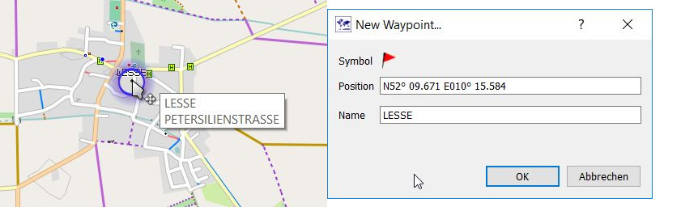
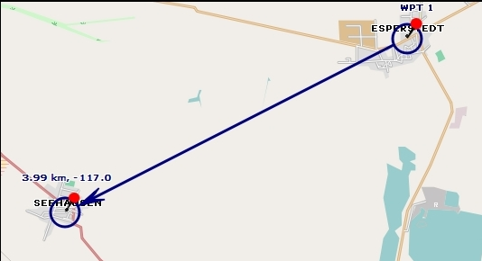
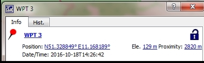
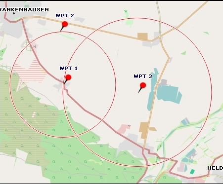
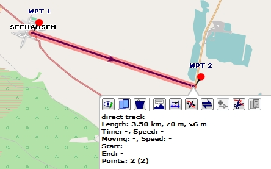
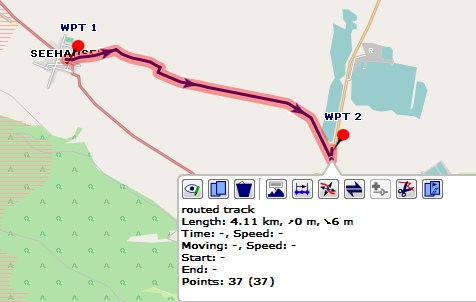
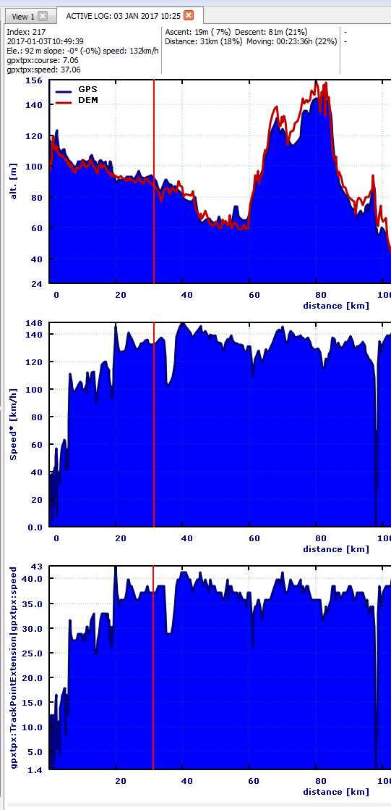

[Prev](DocFaqData) (Databases and projects) | [Home](Home) | [Manual](DocMain) | [Index](AxAdvIndex) | (Routing) [Next](DocFaqRouting)
- - -

***Table of contents***

* [Frequently Asked Questions - Data handling](#frequently-asked-questions---data-handling)
    * [How to create waypoint from POI (point of interest) in map?](#how-to-create-waypoint-from-poi-point-of-interest-in-map)
    * [How to find distance between waypoints](#how-to-find-distance-between-waypoints)
    * [Which track data is saved in GPX files?](#which-track-data-is-saved-in-gpx-files)
    * [How to access data from legacy Garmin devices?](#how-to-access-data-from-legacy-garmin-devices)
    * [What is the difference between speed and gpxtpx:speed?](#what-is-the-difference-between-speed-and-gpxtpxspeed)
    * [How to remove DEM info from elevation graph?](#how-to-remove-dem-info-from-elevation-graph)
    * [How to edit tracks without losing track data?](#how-to-edit-tracks-without-losing-track-data)

* * * * * * * * * *
 
# Frequently Asked Questions - Data handling

## How to create waypoint from POI (point of interest) in map?

If the mouse pointer is moved on a POI in a vector map, a small blue circle around this POI pops-up. Right-click to open the context menu and select the menu entry
`Add POI as waypoint`. The POI name and its coordinates are used in the new waypoint.

## How to find distance between waypoints

(_inspired by and partially copied from_ [QMS issues list](https://bitbucket.org/maproom/qmapshack/issues/169/distance-between-waypoints-popup-window))

* _Find the direct distance from a waypoint to some other point:_ set a waypoint and move it to the other point.
  This will give you the distance and the course (direction) to the other point. When done abort the operation (right mouse click) and remove the waypoint.

* _Find a defined distance from several waypoints:_ add the distance as proximity to the waypoints.

* _Find the street distance or the direct distance between several points:_ start to create a track with or without routing.

## Which track data is saved in GPX files?

(_valid starting with QMS patch version 7ac34c818ec1/2016-12-06_)

QMS supports 2 kinds of GPX files:

* GPX files that follow strictly the rules of the GPX 1.1 standard,
* GPX files using additional extensions (_special format_).

In both cases the following track data is saved in the GPX file:

* track name,
* location of each trackpoint,
* timestamp of each trackpoint (if available),
* elevation of each trackpoint (if available).

The additional extensions used in the _special format_ provide information about

* the track history (can't be re-activated when GPX file is re-loaded into QMS),
* the track display color
* the type of trackpoint (trackpoint created by routing engine (so-called subpoint) or
  trackpoint created by user interaction, hidden trackpoint, activity)

Trackpoints created by a routing engine can't be edited by the user whereas trackpoints
created by a user can be
edited (compare section ["Edit items with multiple points"](DocGisItemsEditMultiple)).

## How to access data from legacy Garmin devices?

_(inspired by [newsgroup discussion](https://sourceforge.net/p/qlandkartegt/mailman/message/35994128))_

The internal memory of legacy Garmin devices (e.g. the well-known Garmin GPS 60Csx) can't be connected as an USB drive to the computer even if they are connected 
via USB to the computer.. Thus, data in the internal
memory (e.g. the so-called ActiveLogs or waypoints saved in the device) can't be accessed directly from QMS.

[`GPSBabel`](https://www.gpsbabel.org) (available for Windows, MacOS and Linux) can be used to download tracks and waypoints stored the internal memory of
a Garmin GPS device by using the command:

    gpsbabel -t -w -i garmin -f usb: -o gpx -F gpsdata.gpx

Drag and drop the output file `gpsdata.gpx` to the QMS workspace or call

    qmapshack.exe gpsdata.gpx
    
to see the tracks and waypoints.

Compare the GPSBabel documentation for more details.

## What is the difference between speed and gpxtpx:speed?

Various GPS receivers record different data for trackpoints. Some Garmin navigators use for this purpose
a special [GPX trackpoint extension](http://www8.garmin.com/xmlschemas/TrackPointExtensionv2.xsd "Garmin gpxtpx trackpoint extension")
named `gpxtpx`. One of the data fields within this extension is `gpxtpx:speed`. It records the speed at the given trackpoint.
This speed is measured in meters per second whereas the calculated speed at a trackpoint is measured in kilometers per hour.

QMS reads this speed value and can display it in form of a graph in the track edit window.

A similar data field is `gpxtpx:course`. This field contains an angle measured in degrees in a clockwise direction from the true north line
(the _course_).

Compare also section 
[Recorded and calculated track data](AdvTrkGeneral#recorded-and-calculated-track-data).

## How to remove DEM info from elevation graph?

_(inspired by newsgroup discussion ["Option to disable DEM plot in track profile view"](https://sourceforge.net/p/qlandkartegt/mailman/message/35962352))_ 

Assume

* a (recorded) track has elevation information,
* DEM data is available for the area in which the track is located, 
* DEM data is activated in the view in which the track is displayed,
* the (extended) track profile is activated for the track.

Then the track elevation profile
displays the recorded elevation together with the elevation obtained from the DEM data (red line).

To remove the DEM data from the track profile proceed as follows:

* clone the existing view (use menu entries `View - Clone map view`),
* deactivate DEM data in the cloned view,
* open the track profile in the cloned view.

Now, the track profile shows only the elevation data of the track.

_Hint:_ Use the track profile in the map view, not the one in the track edit window!

## How to edit tracks without losing track data?

_(inspired by newsgroup discussion [How to edit this track?](https://sourceforge.net/p/qlandkartegt/mailman/message/35965052))_

Trackpoint data of tracks recorded by a GPS device consists not only of a position and a timestamp. Modern devices record different amounts of other (fitness) information
such as elevation, cadence, pulse rate, temperature ...

While recording a track on a GPS device, the quality of GPS signals may vary. Signals may be weak or even disappear due to various reasons. 
In such a case the recorded track data is not reliable or even completely wrong.
A need occurs to remove such non-reliable or wrong data by editing the track manually.

QMS offers the following track editing methods:

* Edit track in map window by going into the **track edit mode** and removing there single trackpoints. 

    This method is very convenient because it is easy to identify and remove wrong trackpoints.

    The _disadvantage_ of this method is that all trackpoint information except the position gets lost for all remaining trackpoints.

* Edit track using **range selection**.

    This method can be used in the map window or in the track edit window.

    If working in the map window:

    * click the track, 
    * click the range selection icon,
    * select the range of the track(points) that should be removed,

    By that the selected trackpoints are hidden and do not add to the statistics. If you want to remove them permanently:
  
      * goto the track edit window of the track,
      * click the `Filter` tab,
      * open the `Reduce visible points` filter group,
      * run the `Remove trackpoints` filter.

    This procedure removes the selected range of trackpoints from the track without losing information from other trackpoints.

* Edit track using the **cut tool (scissors)**.

    If working in the map window:

    * click the track, 
    * click the cut tool (scissors) icon at the first trackpoint that should be removed,  
    * select option `Keep both parts of the track` and click `Ok`. The range of trackpoints to be removed is now at the start of one of the track parts.
    * Cut the track again to remove the remaining wrong trackpoints at the start of the track part (use option `Delete first part ...` resp. `Keep first part ...` properly!).
    * If necessary, merge the remaining track parts into a new track.
        
    
_Warning:_ As long as you stay in the QMapShack universe - using the database or the QMS files - you can revert all these steps in the history. However, if you save to a GPX file the data will be lost permanently. In this case save a backup copy of the track before editing it!

Even as it is possible to remove erroneous recorded trackpoints with both methods, the later is the recommended one. The intended use-case for the track edit mode is to create artificial tracks to plan a tour. That is why additional data like timestamps and sensor data is removed as it won't be valid when moving points or combining different track fragments.

- - -
[Prev](DocFaqData) (Databases and projects) | [Home](Home) | [Manual](DocMain) | [Index](AxAdvIndex) | [Top](#) | (Routing) [Next](DocFaqRouting)
