[Prev](DocFaqRouting) (Routing) | [Home](Home) | [Manual](DocMain) | [Index](AxAdvIndex) | (Troubleshooting QMapShack) [Next](TroubleShooting)
- - -

***Table of contents***

* [Frequently Asked Questions - Maps](#frequently-asked-questions---maps)
    * [How to control visibility of POI info?](#how-to-control-visibility-of-poi-info)
    * [Why are waypoints shown with a blue dot icon?](#why-are-waypoints-shown-with-a-blue-dot-icon)
    * [How to find information about a position (a POI) in the Web?](#how-to-find-information-about-a-position-a-poi-in-the-web)
    * [What is the difference between `Copy position` and `Copy position (Grid)`?](#what-is-the-difference-between-copy-position-and-copy-position-grid)
    * [Is there a possibility to display small roads/tracks in a vector map without zooming in too much?](#is-there-a-possibility-to-display-small-roadstracks-in-a-vector-map-without-zooming-in-too-much)
    * [Does QMS support the use of single Garmin-style map tiles?](#does-qms-support-the-use-of-single-garmin-style-map-tiles)
    * [How to change the layout of vector maps?](#how-to-change-the-layout-of-vector-maps)
    * [Why is Google Terrain map a black-and-white map?](#why-is-google-terrain-map-a-black-and-white-map)
    * [Which raster map formats are supported?](#which-raster-map-formats-are-supported)
    * [How to use Russian military and similar raster maps with QMapShack?](#how-to-use-russian-military-and-similar-raster-maps-with-qmapshack)
    * [Why is a raster map not displayed?](#why-is-a-raster-map-not-displayed)
    * [How to find the location of a raster map?](#how-to-find-the-location-of-a-raster-map)
    * [Is it possible to use several VRT files?](#is-it-possible-to-use-several-vrt-files)
    * [When to use GDALWarp to get VRT file?](#when-to-use-gdalwarp-to-get-vrt-file)
    * [Is it possible to use EPSG codes for the coordinate system setup?](#is-it-possible-to-use-epsg-codes-for-the-coordinate-system-setup)

* * * * * * * * * *
 
# Frequently Asked Questions - Maps

## How to control visibility of POI info?

(_Inspired by_ [newsgroup discussion](https://www.naviboard.de/thread/61038-detailgrad-hier-freizeitkarte/))

The possibility to control the POI visibility in QMS map windows depends on the type of the displayed map:

* _Raster and online maps:_ All map info is hard-coded in the map. Visibility of map elements (POI, roads, ...) can't be changed within QMS.
* _Vector maps:_ The QMS user has various ways to control the display of the information contained in a map:
    * _Using the maps tab:_ (if closed, open it with the help of the menu entry `Window - Maps`) After clicking the small triangle at the front of an active map
      the following map display options can be modified:
        * _Map opacity_. Use slider to increase or decrease map opacity. This controls the visibility of maps in a stack of active maps.
        * _Zoom levels for map display_. Select minimum resp. maximum zoom level of map display by clicking the small buttons at the left resp. right of the scale.
          If the zoom level slider is in the green interval, then the map is displayed.
        * _Type of displayed map objects_. Use the checkboxes to switch on or off the display of areas, lines and points (POI).  
        * _Details level_. Use levels between -5 and 5 to select the amount of map objects for a given zoom level. 
    * _Using the main menu_. 
        * The menu entry `View - POI Text` is a toggle. If it is selected, then the name of a POI (if available in the map) is displayed. The font used can be changed
          with the help of the menu entry `View - Setup Map Font.`
        * The menu entry `View - Map Tool Tip` is a toggle. If it is selected, then after moving the mouse pointer to a map object (POI, line, area) in a vector map a small tool tip window pops-up with information about the object (typically, the name of the object is shown).
 
__Remarks:__

* Several (vector) maps may have the same data source (e.g. OpenStreetMap/OSM). It is up to the author/publisher of the map to select
    * the data to be included into the map, 
    * the style in which the data is displayed,
    * the zoom levels at which data objects are displayed. 
  
    Thus, it may happen that maps having the same data source have rather different
    content and layout. QMS cannot alter this map data. 

* Workspace GIS data (waypoints, tracks, routes, areas) is drawn on an extra layer on the map window. The rules described above for map data don't apply to GIS data.
  The display of GIS data is controlled via checkboxes in the workspace.

## Why are waypoints shown with a blue dot icon?

**Source:** [Newsgroup discussion](https://sourceforge.net/p/qlandkartegt/mailman/message/35441910/)

_Example:_

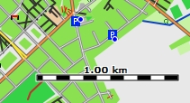

The blue dots shown on the map are not the icons of waypoints but they are used as indicators that at the given zoom level
of the map and at the given locations there are several waypoints on the map. Thus, cluttering of the map is avoided.

Changing the zoom level results in the display of all waypoints at the given location with the necessary icons (exception:
several waypoints with equal coordinates).

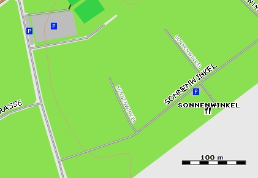

## How to find information about a position (a POI) in the Web?

__(valid starting with QMS commit c57ba23001c7,  Wed Jul 25 13:02:57 2018)__

* Open a map view and move the mouse to the position (location) of interest.
* Right-click the mouse to open the context menu (this menu is included in the waypoint context menu , too).
* Select `Search Web for position` and then one of the preconfigured web services that provide information about the position. The default browser opens the web service which displays information about the selected position (if available).

    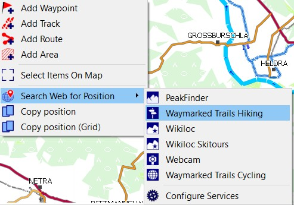
 
* Select the menu entries `Search Web for position - Configure services` to view the configuration of the default services and to add or remove web services with the help of the service configuration window:

    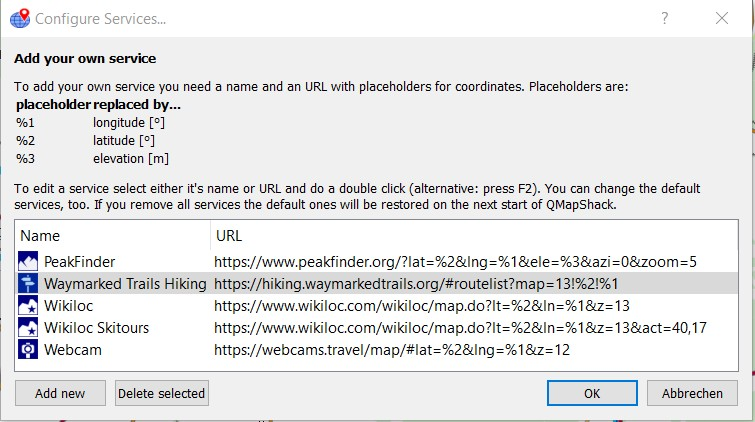

* To add a new service insert a name in the name field and a valid URL in the URL field. Use the placeholders %1, %2 resp. %3 in the URL for the longitude, latitude resp. elevation. QMS replaces the placeholders with the data of the selected position.

    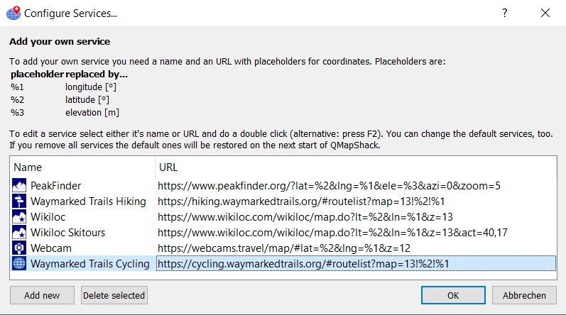

* Each web service (the default ones, too!) can be deleted. After deleting all web services QMS re-establishes the default configuration at the next start.

The configuration of web services is saved in the QMS INI file. 

Here is an overview of some web services (composed by Mitxel in the [QMapShack newsgroup](https://sourceforge.net/p/qlandkartegt/mailman/message/36444344), items labeled with an asterix are default web services in QMS):

* __Peakfinder (*)__
    
    _Purpose:_ Get 360° panorama with the names of all mountains visible from given location.
   
    _URL:_ https://www.peakfinder.org/?lat=%2&lng=%1&ele=%3&azi=0&zoom=5
   
    _Hints:_ As DEMs are not very accurate, sometimes the summit itself could hide your view. To avoid this add `&off=10` to the URL. This raises the viewpoint by 10m. 

* __Waymarked trails (*)__
    
    _Purpose:_ Get waymarked hiking trails near the given location.
    
    _URL:_ https://hiking.waymarkedtrails.org/#routelist?map=13!%2!%1

    _Hints:_ Clicking on the name in the track list opens additional information about the track and you can download the track. In the upper menu you can change the settings to get cycling trails, MTB trails,...

* __Waymarked cycling trails__
    
    _Purpose:_ Get waymarked cycling trails near the given location.
    
    _URL:_ https://cycling.waymarkedtrails.org/?lang=en#routelist?map=13!%2!%1

    _Hints:_ Just a second example for the waymarked trails server: display cycling trails and use English as language.
    
* __Wikiloc (*)__
    
    _Purpose:_ discover outdoor trails for hiking, cycling and many other activities near the given location.
    
    _URL:_ https://www.wikiloc.com/wikiloc/map.do?lt=%2&ln=%1&z=13

    _Hints:_ This lists all activities near the given location. A filter can be used for a more specific selection of trails.

* __Wikiloc Skitours (*)__

    _Purpose:_ discover ski tours near the given location.

    _URL:_ https://www.wikiloc.com/wikiloc/map.do?lt=%2&ln=%1&z=13&act=40,17
    
    _Hints:_ This pattern filters ski tour and snowshoe activities from Wikiloc. You can follow this sample to get other activities by changing the value `act=40,17` or add other filters, too.

* __Wikiloc MTB__

    _Purpose:_ discover MTB tours near the given location.
    
    _URL:_ https://www.wikiloc.com/wikiloc/map.do?lt=%2&ln=%1&z=13&act=2
    
    _Hints:_ This filters MTB activities from Wikiloc. When using filters you will be asked to log in.

* __Webcam (*)__

    _Purpose:_ Find webcams near the given location.
    
    _URL:_ https://webcams.travel/map/#lat=%2&lng=%1&z=12
    
    _Hints:_ If you don't see webcams near the chosen location, try zooming out with the mouse wheel.

* __MeteoBlue 7 days (*)__

    _Purpose:_ Get 7-day weather forecast at the given location.
    
    _URL:_ https://www.meteoblue.com/en/weather/forecast/week/%2N%1E
    
    _Hints:_ The default URLs points to the web page in English. You can change it easily. Example:  Replace `/en/` by `/es/` in the URL to get the Spanish version.

* __MeteoBlue 5 days (*)__

    _Purpose:_ Get 5-day weather forecast at the given location.

    _URL:_ https://www.meteoblue.com/en/weather/forecast/meteogramfive/%2N%1E

* __MeteoBlue Multi model (*)__

    _Purpose:_ Get 3/6/7-day weather forecast at the given location with data from different weather models.
    
    _URL:_ https://www.meteoblue.com/en/weather/forecast/multimodel/%2N%1E

* __MeteoBlue Map (*)__

    _Purpose:_ Get weather forecast maps for various weather parameters near the given location.

    _URL:_ https://www.meteoblue.com/en/weather/webmap/index/%2N%1E?level=surface&zoom=8
    
    _Hints:_ Once on the map site choose the map type to display: precipitation, wind, .. and you can see the evolution by hours.

* __Ventusky (*)__

    _Purpose:_  Get weather forecast maps for various weather parameters near the given location. Default map: rain.

    _URL:_ https://www.ventusky.com/?p=%2;%1;6&l=rain-3h

    _Hints:_ Once on the map site choose the type of map to display: precipitation, wind, etc. and you can see the evolution by hours. Clicking on a point displays a weather table for the clicked location.

* __Rome2Rio__

    _Purpose:_ Find public transport between two points including alternative routes with information about stops, transfers, schedules, and operators phone numbers and websites. 

    _URL:_ https://www.rome2rio.com/es/map/Bilbao/%2,%1
    
    _Hints:_ In the given URL Bilbao (Spain) is used as the start point and the selected location is the end point for the route. You must replace Bilbao with the name of your town or city. If the name is composed use hyphens, e.g.: Selva-di-Val-Gardena. You can also use your home coordinates  e.g.: `43.164,-1.236`.

* __Transport Públic de Catalunya__

    _Purpose:_ Find public transport between two points in Catalonia.

    _URL:_ https://mou-te.gencat.cat/index.html#/ca/transportProper/%1/%2
    
    _Hints:_ This is a local service for the Catalonia region. It looks for bus stops near the given point. Once in the web you can consult lines, timetables and A-B routes. If you live in Catalonia you could build a URL similar to the one for `Rome2rio` from your home to the given location.

* __GoogleMaps driving routes__

    _Purpose:_ Find  a route between two points including alternative routes with information about stops, transfers, ...
    
    _URL:_ https://www.google.com/maps/dir/?api=1&origin=Bilbao&destination=%2,%1&travelmode=driving
    
    _Hints:_ In the given URL Bilbao (Spain) is used as the start point and the selected location is the end point of the route. You must replace Bilbao with the name of your town or city. If the name is composed replace spaces with +, e.g.: Selva+di+Val+Gardena. You can also use your home coordinates  e.g.: `43.164,-1.236` (... but remind that this is Google!). Select the type of transportation in the Google maps window.

* __GoogleMaps__

    _Purpose:_ Show the Google map at the given location.
    
    _URL:_ https://www.google.es/maps/@%2,%1,16z?hl=en
    
    _Hints:_ Contributed by JOSEPV. Once in Google maps you can use the StreetView function.

* __StreetView__

    _Purpose:_ Show the StreetView image at the given location if available.
    
    _URL:_ https://www.google.com/maps/@?api=1&map_action=pano&viewpoint=%2,%1
    
    _Hints:_ Contributed by pdenessen. 

* __GoogleEarth__

    _Purpose:_ Show the GoogleEarth map at the given location.
    
    _URL:_ https://earth.google.com/web/@%2,%1,10000a,0d,35y,0h,0t,0r

    _Hints:_ Contributed by JOSEPV. For now it only opens in the Google Chrome browser!
 
 
## What is the difference between `Copy position` and `Copy position (Grid)`?

A right-click in a map window at a certain positions opens a context menu which offers (among others) the 2 choices:

* `Copy position`
* `Copy position (grid)`

In the first case the position is copied in the format used to display coordinates (see menu `View - Setup Coord. Format`),
e.g `N49° 21.734 E012° 44.146`

In the second case the position is copied as a pure grid coordinate.
For long/lat coordinates it is degrees (`49.599924 10.599991` or `-15.065344 -39.915421`). For northing/easting
coordinates it is meters. (`6307013m, 1415953m`)

_Remark:_ The copied position is the position selected with the mouse pointer in the map window. Its accuracy depends on the zoom level of the map. It is __not__ the position of a POI, waypoint or trackpoint at the same location!

## Is there a possibility to display small roads/tracks in a vector map without zooming in too much?

**Source:** [www.naviboard.de](https://www.naviboard.de/thread/59676-qmapshack-zeigt-kleinere-wege-nur-bei-relativ-gro%C3%9Fen-ma%C3%9Fst%C3%A4ben-an/)

This problem appears with a vector map like [Freizeitkarte](http://www.freizeitkarte-osm.de/) where smaller
roads/tracks are only visible at a zoom level where the overview gets lost.

There is no such possibility in QMapShack. The detail levels for vector map data are defined by the map author and can't be
changed within QMapShack.

Users reported about the following ways to improve the visibility of small roads:

* Choose the menu item `View - Setup Map View - Projections&Datum`
* Append to the given configuration string one of the following strings:
    * `+lat_ts=60` This sets the *latitude of true scale* for a Mercator projection. The closer you get to the polar regions the more the map will be skewed horizontally in comparison to the vertical scale. At the *latitude of true scale* (usually 0 for the equator) the scales are equal.
    * `+k_0=0.3` (**Source:** [gmane.comp.gis.qlandkartegt](http://article.gmane.org/gmane.comp.gis.qlandkartegt.user/2688))  This is an additional scale factor on the normal scale. A value of 1.0 will have no effect. Try to increase or decrease the given value to get the wanted result

## Does QMS support the use of single Garmin-style map tiles?

A map in the Garmin format consists of single map tiles plus a so-called _type file_ which describes how the elements
in the map should be displayed. The map tiles for a given area are typically packed together with a type file
into a special container format. A typical name for such a container file is _gmapsupp_xxx.img_.

QMS does support maps loaded from gmapsupp container files. It doesn't allow the use of single tiles.

## How to change the layout of vector maps?

**(valid starting with QMS version 1.9.0)**

The layout of a vector map in QMS is defined by rules found in a so-called _type file_. Type files are contained in the _gmapsupp.img_ files required for 
the display of a vector maps in QMS.
 
There is a strong relation between the object types used in the description of the map data and the object types defined in a type file used for the display of the map.

The layout of a vector map can be changed in QMS by loading a new type file in the following way:

* open the __Maps__ tab in the workspace (select menu entries `Window - Maps` if tab is closed),
* open the map features window of the activated map for which the layout should be changed,

    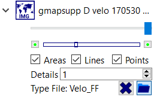
   
* click on the `Load external type file` icon in the Type file row of this window and select a type file (extension __TYP__),
* click the `Forget external type file` icon to return to the original map layout.

The following image shows various layouts of a vector map obtained by using 4 different type files.

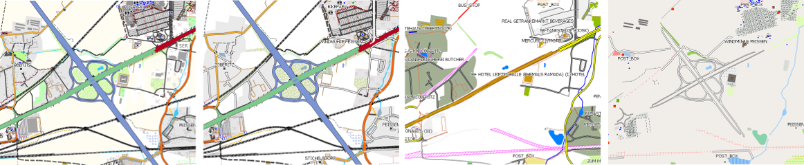

The first layout is the default one for the map, the second one displays the same map data as the first one but in a slightly different way.

The third and the forth layouts illustrate how important and even dangerous layout changes can be when changing to an incompatible type file. If wanted, certain object
types are not displayed anymore (a motorway might be of no interest for a bicycle user). The forth layout results from a type file not
built for the given vector map. As a result, even the motorway is not displayed correctly.

## Why is Google Terrain map a black-and-white map?

**Source:** [Discussion at https://sourceforge.net](https://sourceforge.net/p/qlandkartegt/mailman/message/36769269)

[Google maps](https://www.google.com/maps) offers different map layers as overlays to some basic map. Among the overlay layers is a *Terrain* layer. 

Using various [TMS files](http://www.mtb-touring.net/qms/onlinekarten-einbinden/) these maps and their layers can be visualized in QMS. The next image shows in its upper part a map of some mountainous area without any overlays.

In the middle of this image the Google terrain overlay is activated and shows the same area as the upper part. This overlay isn't a map in the proper sense of the word. It is used to show hillshading on some base map. The white/gray spots in this layer indicate hillshading.

Changing the opacity of the terrain layer with the help of the opacity slider reveals the hillshading on the base map (compare lower part of the next image with its upper and middle parts).

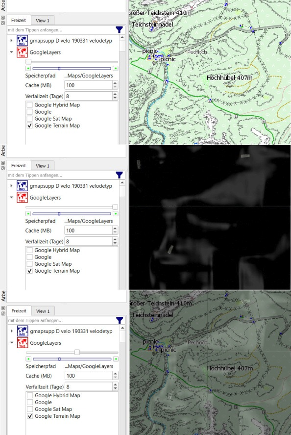

## Which raster map formats are supported?

There are various sources of raster maps in various formats.

QMS supports raster formats that are

* supported by the `GDAL` version used with QMapShack. Create a VRT file for the given raster map. Then it can be used in QMS. To get a list of formats supported 
  by `GDAL` run `gdaltransform.exe --formats` in a console window.
* of type RMAP, GEMF, JNX (formats directly loaded by QMS).

An advantage of the GEMF format is that reading the tiles from the map file is very fast.

The [MOBAC Mobile Atlas Creator](https://mobac.sourceforge.net/ "MOBAC main page") can be used as a source of raster maps. 
With the help of this application
the user can load tiles of online maps as well as some other map formats and save them as raster maps. Use GEMF or RMAP as output formats.
For details check the [MOBAC Wiki](https://mobac.sourceforge.net/wiki/index.php/Main_Page "MOBAC wiki main page").

The proprietary Mapsforge vector map format, which is rather popular on mobile phones, can be read by the latest version of MOBAC.
After converting a mapsforge map to a GEMF map with MOBAC, the GEMF map can be loaded with QMS. _Remark:_ This conversion can take
some time depending on the size and the structure of the map!

The [MAPC2MAPC64 map converter](https://mapc2mapc64.software.informer.com/5.1/ "MAPC2MAC64 map converter") is designed as a 
converter between various raster map formats.

**Remark about the QMS Windows version:** Many applications handling geodata use the `GDAL` package. Thus, it may happen that several different versions of this package
can be found on the computer with different support for raster map formats. In order to avoid version conflicts QMS works exclusively with the `GDAL` version in its
installation directory. Thus, a change of the `GDAL` related environment variables doesn't result in a change of the `GDAL`version used by QMS.

## How to use Russian military and similar raster maps with QMapShack?

**Source:** Newsgroup thread [sourceforge.net/p/qlandkartegt](https://sourceforge.net/p/qlandkartegt/mailman/message/34518807/)

* Calibrated Russian military and other raster maps can be downloaded from various locations.
Some servers are
    * [loadmap.net](http://loadmap.net)
    * [https://gpska.yapl.ru](https://gpska.yapl.ru)
    * [http://satmaps.info/us/map-detector.php](https://satmaps.info/us/map-detector.php)

  When downloading a map tile 2 files are created:
a GIF file (or other image file) with the raster map and an `OZIExplorer` MAP file with geodetic calibration data.

* QMapShack supports the use of raster maps via VRT files. These files can be created with the `GDALBuildVRT` tool
and can also be accessed from within QMapShack.
Doing so leads for the above-mentioned maps to an error message indicating that
georeference data can't be found within the MAP files.

* To make the raster map usable for QMapShack the following procedure (described for a Windows installation) can be used:
    * Ensure that the `GDAL` toolset and the `proj.dll` are in the QMapShack installation directory.
    * Add this directory to the PATH environment variable
    * Ensure that the `data` subdirectory of the QMapShack installation directory is properly installed
    * Add this directory to the GDAL_DATA environment variable
    * Move the image and the map file to a location where QMS is looking for maps or add the directory where
    these files are located to your QMapShack map paths.
    * Run

        `gdalwarp -of VRT full_path_to_your_raster_map.map full_path_to_your_raster_map.vrt`

    * _Remarks:_

        * It is unclear why `GDALBuildVRT` does not find the georeference information.
        * If there is a need to move the files discussed in this topic to a different location then repeat this procedure! The VRT file has a pointer to the relative or absolute path of the MAP file.

*  Raster maps may have borders. Use QMapTool to cut the map to the wanted shape without borders. For details compare section
   ["Raster maps"](DocMapsTipsRasterDEM#user-content-russian-army-maps)

## Why is a raster map not displayed?

**Source:** [http://article.gmane.org/gmane.comp.gis.qlandkartegt.user/2624](http://article.gmane.org/gmane.comp.gis.qlandkartegt.user/2624)

Consider the following hints:

* Use `gdalinfo` to verify if the required VRT file provides proper information. Keep in mind that the VRT file
  is just an XML wrapper around your
  real raster map file. It stores a path to that file. If the path changes,
  the VRT file has to be created again.
* If the map is loaded correctly, QMS may suppress drawing the map because it would take too long. In this case the map boundary is still visible as a black frame as shown on the left of the following images.

    To force drawing of the map zoom in into the map.

    Raster map not displayed | Raster map displayed
    --------|---------
    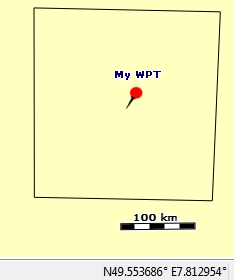 | 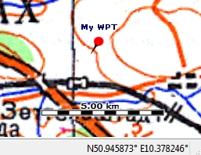

    If overview maps are supported (compare section [Basic knowledge about maps and DEM files](DocBasicsMapDem)) then the raster map is displayed with lower level of detail when zooming out.

    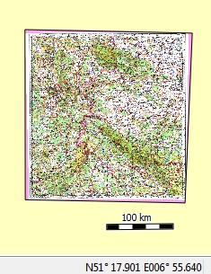

    Data of raster maps may be outdated. To assess the data quality use the possibility to overlay the raster map with a map providing recent data (e.g. online Google map) in QMS. The following example reveals that the German motorway A4 was reconstructed and avoids now some mountain area.

    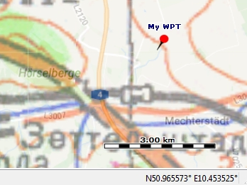

* If you have a layer of raster maps reading the files and scaling the content to an upper zoom level is
  getting more and more resource intensive the more you zoom out. To avoid endless map loading, QMS will
  skip the map if the effort to display it is getting too large.
  However, if QMS detects overview levels attached to the map it will use them. `gdaladdo` is the tool to do so.
  Things are getting a bit more difficult for insane large map collections. `gdaladdo` will create an overview
  file over all maps combined in the VRT file. That might get too large. In this case you have to create single
  overview files and combine them in a VRT file.

## How to find the location of a raster map?

A raster map requires a VRT file to display it in QMS. The location of a raster map is part of the information
of the VRT file.
The `gdalinfo` tool can be used to display this information in a readable way. Call the tool
from the commandline as follows:

    gdalinfo complete_path_to_vrt_file

Be sure the path to

* `gdalinfo` is set in the `PATH` environment variable,
* the GDAL `data` subdirectory is set in the `GDAL_DATA` environment variable.

Here is an example of the result:

    Files: c:\Maps\WT\500k--m32-2.vrt
           c:\Maps\WT\500k--m32-2.map
    ...
    Corner Coordinates:
      Upper Left  (  490191.757, 5773077.762) (  8d51'24.88"E, 52d 5'11.35"N)
      Lower Left  (  490191.757, 5534334.766) (  8d51'48.12"E, 49d56'25.79"N)
      Upper Right (  719872.602, 5773077.762) ( 12d12'17.72"E, 52d 2'34.72"N)
      Lower Right (  719872.602, 5534334.766) ( 12d 3'38.19"E, 49d54' 0.62"N)
      Center      (  605032.180, 5653706.264) ( 10d29'46.95"E, 51d 0'14.73"N)

The coordinates given help to identify the location of the raster map on the QMS map screen. An easy way to do so is to
define a waypoint in QMS with coordinates at the center of the raster map defined above and then to double-click on the
waypoint. This centers the map in QMS to the waypoint and thus to the raster map.

## Is it possible to use several VRT files?

**Compare:** [naviboard.de newsgroup](https://www.naviboard.de/thread/60385-h%C3%B6hendaten-in-qmapshack-einbinden/)

Raster maps and DEM (**D**igital **E**levation **M**odel) data are supported in QMS via corresponding VRT files.
Several VRT files can be used. It is up to the user to organize the files properly.

## When to use GDALWarp to get VRT file?

The fastest way to create a VRT file for a raster map is the VRT builder included in QMS (select menu `Tool - VRT Builder`). This tool calls the GDAL `GDALBuildVRT.exe` for the creation of the VRT file. For some raster maps the tool may fail with some error message, e.g. of the form

    Warning 6: gdalbuildvrt does not support rotated geo transforms.
    
The reason for this error message is that `GDALBuildVRT` can not create VRT files for raster maps that need additional projection transformations (in the example due to a rotated map). Such transformations can  be carried out with the help of `GDALWarp`. `GDALWarp` has VRT as one of its output formats. Thus, in the described situation run the following command from a commandline:

    gdalwarp -of VRT input_raster_file_name output_VRT_file_name
    
and use the VRT thus obtained in QMS.

_Remark:_ The VRT file obtained from `GDALWarp` has a more complicated structure than the one obtained from `GDALBuildVRT`. They show in the first line of the VRT file the additional info

    subClass="VRTWarpedDataset"
    
    

## Is it possible to use EPSG codes for the coordinate system setup?

_(inspired by [newsgroup discussion](https://sourceforge.net/p/qlandkartegt/mailman/message/36169806))_

Geodetic coordinate systems can be identified by a so-called EPSG code. If this code is known for a coordinate system, then it can be used
for the setup of the coordinate system used for the map or the map grid.

Examples:

* WGS 84, geographic:

        +init=epsg:4326
        
    more detailed proj.4 setting of this coordinate system:
  
        +proj=longlat +datum=WGS84 +no_defs
    
* WGS 84 / Pseudo-Mercator (selected in QMS/QMT via "World Mercator (OSM) - datum WGS_1984")

        +init=epsg:3857
    
    more detailed proj.4 setting of this coordinate system:

        +proj=merc +a=6378137 +b=6378137 +lat_ts=0.0 +lon_0=0.0 +x_0=0.0 +y_0=0 +k=1.0 +units=m +nadgrids=@null +wktext +no_defs  

Parts of the coordinate system (projection, datum ellipsoid) can be described in a similar way if the EPSG code is known.  
    
- - -
[Prev](DocFaqRouting) (Routing) | [Home](Home) | [Manual](DocMain) | [Index](AxAdvIndex) | [Top](#) | (Troubleshooting QMapShack) [Next](TroubleShooting)
