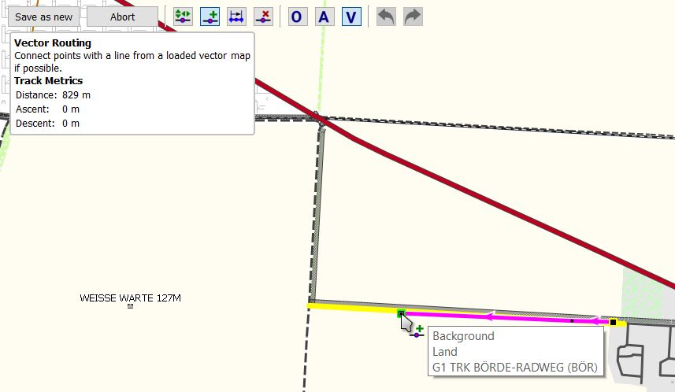

[Prev](DocFaqHandling) (Data handling) | [Home](Home) | [Manual](DocMain) | [Index](AxAdvIndex) | (Maps) [Next](DocFaqMaps)
- - -
 
***Table of contents***

* [Frequently Asked Questions - Routing with Routino router](#frequently-asked-questions---routing-with-routino-router)
    * [Why do route instructions use different languages?](#why-do-route-instructions-use-different-languages)
    * [Is there a possibility to choose the preferred road class when routing?](#is-there-a-possibility-to-choose-the-preferred-road-class-when-routing)
    * [Does QMapShack/Routino support cross-border routing?](#does-qmapshackroutino-support-cross-border-routing)
    * [Does the Routino router support _fly-as-a-bird_ routing?](#does-the-routino-router-support-fly-as-a-bird-routing)
    * [What can be the reason for unexpected Routino routing results?](#what-can-be-the-reason-for-unexpected-routino-routing-results)

* * * * * * * * * *
 
# Frequently Asked Questions - Routing with Routino router

## Why do route instructions use different languages?

The following image shows a route instruction in which 3 languages are used:

The reason for this is as follows:

* The first line with English time and distance information shows data provided by the used English QMS version. This is
the language of the operating system if QMS language files are available for this language or the default language
in all other cases.
* The second line with Russian routing instructions shows data provided by the Routino routing algorithm used in QMS.
The language for the routing algorithm was set by the user to Russian within QMS.
* The third line shows a German road name. This is data coming from the German map used by the Routino routing algorithm
(this map can be different from the map displayed in the QMS view!).

## Is there a possibility to choose the preferred road class when routing?

**Source:**

 * [www.naviboard.de](http://www.naviboard.de/vb/showthread.php?t=59418)
 * [www.naviboard.de](https://www.naviboard.de/showthread.php?t=61373)
 * [gmane.comp.gis.qlandkartegt.user](http://article.gmane.org/gmane.comp.gis.qlandkartegt.user/2626)

The Routino router in QMapShack depends on the [Routino](http://routino.org) package and this package does not offer an option to select a preferred road type.

Routing profiles are saved in an XML-file (/usr/share/routino/profiles.xml). Here the preferences/weights of
different road types can be modified by the user.

On Routino's homepage there is an online version where fine-tuning of all parameters can be tried. Once done, one can take over the values into 
the local `profiles.xml` file.

**Remarks:** 

* Change only values/weights in given profiles. 
* QMS doesn't support changing the names (text strings) used in profiles.
* QMS doesn't support adding new profiles.

## Does QMapShack/Routino support cross-border routing?

**Source:** Inspired by [newsgroup thread](https://sourceforge.net/p/qlandkartegt/mailman/qlandkartegt-users/thread/1450466213.2419.8.camel%40knibb.myzen.co.uk/#msg34706080)

Offline routing in QMapShack needs special routing databases. The easiest way to create these databases is with QMS itself
as described in the [Routes](DocGisItemsRte) section of the QMS Wiki. The required `*.pbf` input files can be downloaded per country/region.
If cross-country routing is wanted then the user should select the `*.pbf` files for all countries needed as described in the Wiki page
and then create one routing database for these countries. The resulting database supports cross-country routing. In the example shown
on the mentioned Wiki page cross-border routing all over Belgium and Luxembourg will be possible.

If a single routing database is created for each country then these databases don't support cross-border routing.

When creating the routing database QMS executes the following Routino commands:

    path_to\planetsplitter.exe --dir=\temp --prefix=MyRegions --tagging=path_to\tagging.xml --parse-only path_to\file1.osm.pbf
    path_to\planetsplitter.exe --dir=\temp --prefix=MyRegions --tagging=path_to\tagging.xml --parse-only --append path_to\file2.osm.pbf
    ...
    path_to\planetsplitter.exe --dir=\temp --prefix=MyRegions --tagging=path_to\tagging.xml --process-only

When using the standard QMS Windows installation then `planetsplitter.exe` is found in the same directory as `qmapshack.exe`,
`tagging.xml`is found in the `routino-xml` subdirectory of the `qmapshack.exe` directory.

These commands can be executed directly from a command line.

## Does the Routino router support _fly-as-a-bird_ routing?

No, it doesn't. 

Fly-as-a-bird routing means that the router is in a position to connect two arbitrary waypoints with a straight line not using any road network.

The Routino router supports only routing along a road network derived from OpenStreetMap GIS data for a certain region. 
This can be easily checked on a map area for which no Routino routing data
is available. This demonstrates also that the data of a vector map and the Routino routing data are completely independent.

## What can be the reason for unexpected Routino routing results?

The image below shows part of a vector map with a straight cycleway. An attempt is made to create a route along this cycleway with the help of
the Routino router. The result is obviously not the expected one.

Changing the routing mode to `Vector routing` by pressing `CTRL-V` reveals that the cycleway is contained in the map as polyline which can be used in
vector routing:

_Explanation:_

* Vector routing refers by definition to the data of the underlying vector map. There the cycleway is found and it can be used for vector routing.
* The Routino router is using its own routing data. This routing data and the data in the displayed vector map are completely independent even if both data 
  sets are based on the same
  initial GIS data (OpenStreetMap). Thus, due to different filter and conversion rules it may happen, that
  a vector map displays some polyline (cycleway in the given case) and that this polyline is not part of the Routino routing database.
* The described Routino routing issue is caused by a filter rule defined in the Routino `tagging.xml` configuration file. If appropriate, this rule can be changed
  and after that the Routino routing database can be recreated (in the given example the road is tagged `Agricultural` in OSM and roads tagged in this form are
  excluded from routing by a rule in the Routino configuration file. Changing this rule and recreating the Routino database removes the described Routino routing
  problem).  
  
 _Recommendations:_

* If the Routino router doesn't give the wanted or expected result, try one of the other routers offered by QMS.
* If the route is created with the help of the map context menu entry `Add route`, then the router works on-the-fly. The routing result can be checked immediately
  and appropriate action can be taken if the result is unexpected (select different routing engine, select different routing waypoint, ...).
* If the route is created with the help of the context menu entry `Create route` of a selected set of waypoints in the workspace, then only the final route 
  can be checked. 
    * If all selected waypoints are on road segments contained in the Routino routing database, then the calculated route should be the expected one.
    * If some waypoint is not on a road segment contained in the Routino routing database, then the Routino algorithm selects the closest waypoint to the given one
      that is on a road segment for routing. After getting the final route calculated by the Routino router, QMS inserts again the original waypoints into the route.
      This can imply some data inconsistency in the route (length of the route, route instructions). It is up to the user to accept or remove in this case the routing 
      result.
      
      
Some more information about this Routino router issue can be found in the [QMS issue tracker](https://bitbucket.org/maproom/qmapshack/issues/234/wrong-route-length).      

- - -
[Prev](DocFaqHandling) (Data handling) | [Home](Home) | [Manual](DocMain) | [Index](AxAdvIndex) | [Top](#) | (Maps) [Next](DocFaqMaps)
