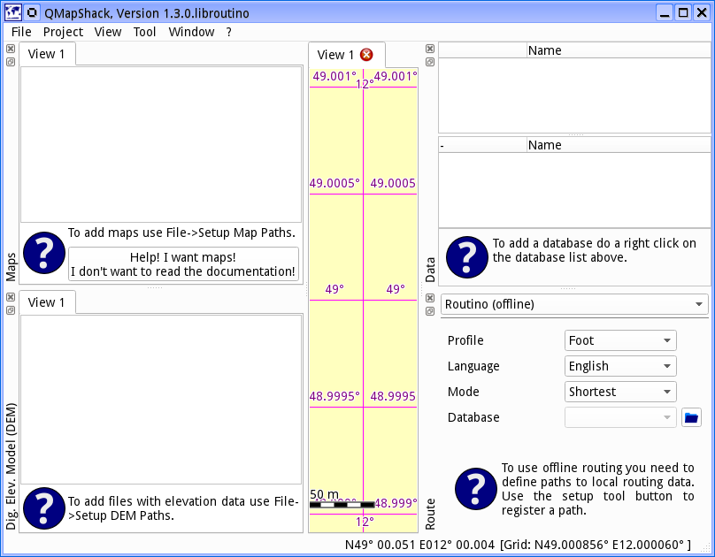
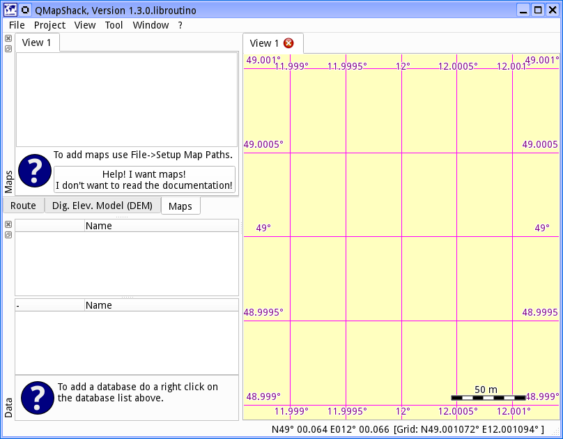
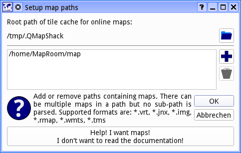
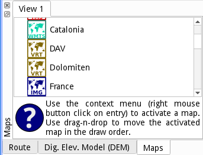
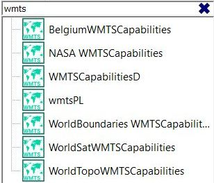
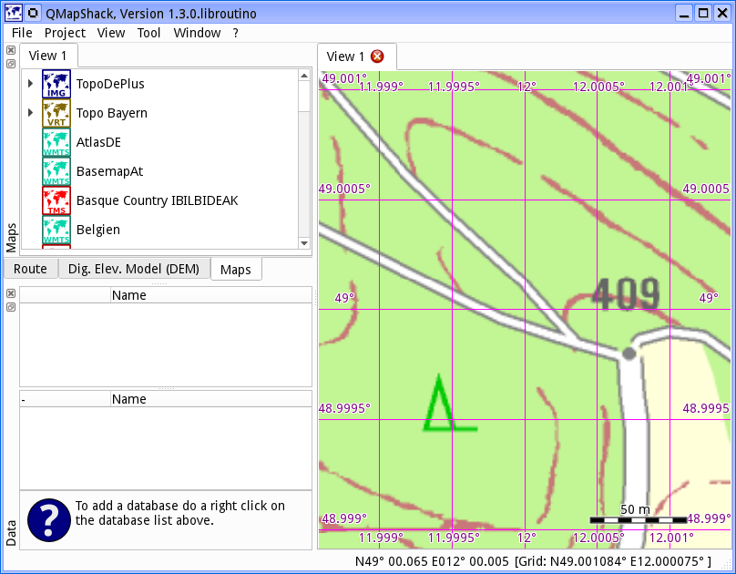
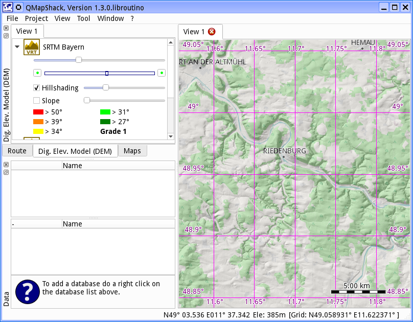

[Prev](OfflineDocumentation) (Create Offline Documentation) | [Home](Home) | [Manual](DocMain) | [Index](AxAdvIndex) | (Command line parameters) [Next](DocCmdOptions)
- - -
 
***Table of contents***

* [Getting started](#getting-started)
    * [Add maps](#add-maps)
    * [Add digital elevation model](#add-digital-elevation-model)

* * * * * * * * * *
 
# Getting started

This is what you get on the first start-up. 

All windows around the map workspace are docking windows. In other words you can move and re-group them as you like.

On first start-up you will see an empty workspace and empty lists for maps and elevation data.

## Add maps

For the impatient ones: There is big button to install a few online map. 

For the more lettered ones: You do not add a map file directly to QMapShack. You add the path containing one or more files. There can be several paths containing maps. To add a path you select _File->Setup Map Paths_

Use the _"+" button_ to add a new path. To remove paths you select one or more and pres the _trashcan button_. If you leave the dialog with _Ok_ the map list will be updated:

However the right hand canvas is still empty. To actually display a map you have to activate it by a right click on the entry in the list and selecting _Activate_. You can activate several maps
at a time. And you can use drag-n-drop to move the activated maps in the list. The top most 
map is drawn first. The one at the bottom of the active list is drawn last. 

Type some string in the edit field at the top of the maps tab to reduce the list of available maps to those matching the given string. A click on the cross at the right edge of the edit field clears the filter.

To move the viewport use the left mouse button in a press and drag action. Use the mouse wheel 
to zoom in and out. Alternatively you can use the arrow keys to move the map and the +/- keys
to zoom. 

To read more about maps see [_Basics about maps and DEM files_](DocBasicsMapDem) and
[_Control maps and DEM files_](DocControlMapDem)

## Add digital elevation model

If you want to know the elevation at the mouse cursor's position or you want to overlay some hill shading you need Digital Elevation Model (DEM) data.

Adding files for the Digital Elevation Model (DEM) is very similar to adding maps. This time
you have to select  _File->Setup DEM Paths_. As with the maps, you have to activate a DEM file before it is used by QMapShack. You do this by a right click on the DEM file entry in the list and selecting _Activate_. 

Type some string in the edit field at the top of the DEM tab to reduce the list of available DEM files to those matching the given string. A click on the cross at the right edge of the edit field clears the filter.

You can change the order of the active files via drag-n-drop. An elevation query will be done 
in the order of the files. First the top most file will be queried. On success the value will be 
used. If it fails the next file is used. And so on. Consequently you place your most accurate DEM files on top of the list.

To read more about DEM files see [_Basics about maps and DEM files_](DocBasicsMapDem) and
[_Control maps and DEM files_](DocControlMapDem)

- - -
[Prev](OfflineDocumentation) (Create Offline Documentation) | [Home](Home) | [Manual](DocMain) | [Index](AxAdvIndex) | [Top](#) | (Command line parameters) [Next](DocCmdOptions)
