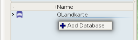
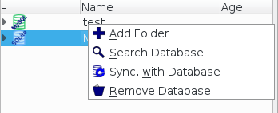
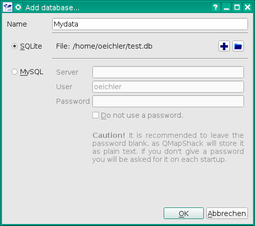
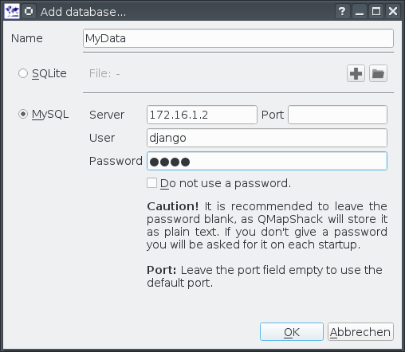
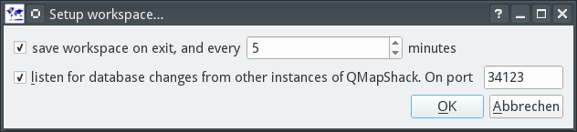

[Prev](DocGisDatabaseWorkspaceDatabase) (Workspace and Database) | [Home](Home) | [Manual](DocMain) | [Index](AxAdvIndex) | (Folders and Items) [Next](DocGisDatabaseFoldersItems)
- - -

***Table of contents***

* [Use of databases](#use-of-databases)
    * [Add/Remove a database](#addremove-a-database)
        * [SQLite](#sqlite)
        * [MySQL (>= 5.6.5)](#mysql--565)
    * [Multi-user access](#multi-user-access)
    * [Search the database](#search-the-database)

* * * * * * * * * *
 
# Use of databases

## Add/Remove a database

To add a database you do a right click with your mouse on some empty space in the database list. You will get a context menu with an option to add a database:



You can choose between a SQLite database or a MySQL database. For a single user or an installation on a laptop with no permanent access to a network, SQLite is the better choice. If you want multiple users to access the data via network, MySQL is the option to go.

To remove a database you do a right click on the root entry of the database and select *"Remove Database"*



This will remove the database from the database list, but not from your hard disk. You can load it later again.

### SQLite



The provided name must be unique.

| | |
|-|-|
|| Create a new database file|
|| Add an existing database file|


### MySQL (>= 5.6.5)

To use MySQL as database you need to enter some commands on the server first. To enter the MySQL console from the command line you do:


```bash
mysql -u root -p
```

You need at least one user with full access rights, as QMapShack will create the database structure on the first start.


```mysql
create user 'django'@'172.16.1.5' identified by '1234';
grant all privileges on *.* to 'django'@'172.16.1.5' with grant option;
```

Replace "django" with your user name. "172.16.1.5" with the address of your PC. And "1234" with a reasonable password. **Note: This is a very basic but fail safe setup. Please refer to the manual of your MySQL server for a more sophisticated setup.**

Keep in mind that every time QMapShack tells you that it has to migrate the database only a user with full access rights may perform the migration.

Next you want to create a database, e.g. MyData:


```mysql
create database MyData CHARACTER SET utf8mb4 COLLATE utf8mb4_unicode_ci;
```

You can remove a database, e.g. if something went wrong during the first start:


```mysql
drop database MyData;
```

Now it's time to add the database in QMapShack.




The provided database name must be the one of the MySQL database (e.g. MyData)

| | |
|-|-|
|**Server**| A host name or an IP address of the MySQL server|
|**User**| A user login for the server|
|**Password**| The user's password for the server|

## Multi-user access

The database can be used by multiple users at the same time. QMapShack will detect conflicts if items have been changed by two users at the same time and offer options for mitigation.

To see changes in the database by someone else as soon as they are saved to the database you can enable a UDP broadcast package based notification system. As notifications are distributed by QMapShack this will only work if all instances are in the same local network. To enable notifications you have to select *Project->Setup Workspace* from the menu.



Make sure your personal firewall allows UDP traffic on the given port.

You can trigger the resulting action on the notification manually, too. Do a right click on the root entry of the database and select *"Sync. with Database"*.


## Search the database

You can do a text search over items of a database. To start the search do a right click on the root entry of the database and select *"Search Database"*.


The search is performed over an internal text that combines:

* The item's name
* The item's short summary as seen in the bubbles.
* The item's description
* The item's comment
* For the activity if the item is a track

The search does **not** include project names and project descriptions.

- - -
[Prev](DocGisDatabaseWorkspaceDatabase) (Workspace and Database) | [Home](Home) | [Manual](DocMain) | [Index](AxAdvIndex) | [Top](#) | (Folders and Items) [Next](DocGisDatabaseFoldersItems)
