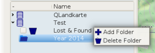
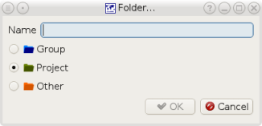
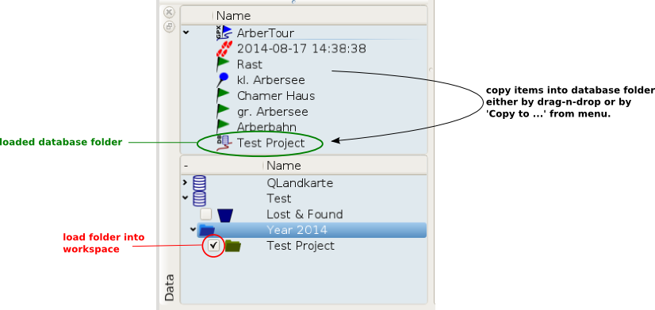
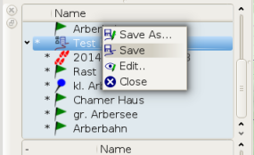
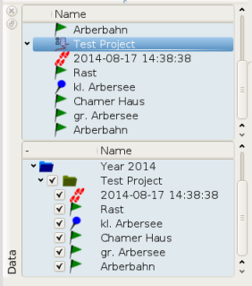
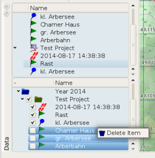
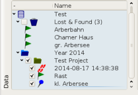

[Prev](DocGisDatabaseAddRemove) (Add/Remove/Synchronize/Search a Database) | [Home](Home) | [Manual](DocMain) | [Index](AxAdvIndex) | ('Lost & Found' Folder) [Next](DocGisDatabaseLostFound)
- - -

***Table of contents***

* [Folders and Items](#folders-and-items)

* * * * * * * * * *
 
# Folders and Items

You can add or delete folders by a right-click on the parent folder/database. Simply select from the context menu:

If you add a folder you have to select a name and a type:

This will create an empty folder in the database. To add items to the folder check the folder's checkbox. This will load it into the workspace. Now you can copy items from other projects into the empty folder.

The items won't be stored into the database unless you explicitly save the changes to the database folder. With 'Save As...' you can export the database folder into a file.

After saving  the project you will see the list of items in the database view. You load and unload single items by their checkboxes. The folders checkbox will  load or unload all items within the folder, but no subfolders.

If you delete items in a database project from the workspace the items are not deleted in the database. Just removed from the workspace. To delete the items in the database you have to select and to delete them in the database view.

If the items are not referenced by another folder they will be moved into the 'Lost & Found' folder.

- - -
[Prev](DocGisDatabaseAddRemove) (Add/Remove/Synchronize/Search a Database) | [Home](Home) | [Manual](DocMain) | [Index](AxAdvIndex) | [Top](#) | ('Lost & Found' Folder) [Next](DocGisDatabaseLostFound)
