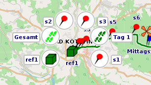
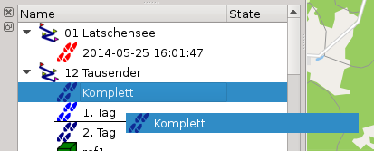
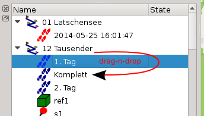
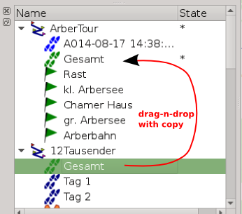
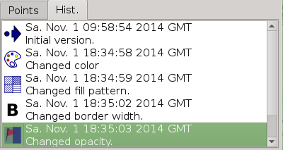

[Prev](DocSearchGoogle) (Geosearch) | [Home](Home) | [Manual](DocMain) | [Index](AxAdvIndex) | (Create new tracks, waypoints etc.) [Next](DocGisItemsNew)
- - -

***Table of contents***

* [Waypoints, Tracks & Co (A general word about GIS items)](#waypoints-tracks--co-a-general-word-about-gis-items)
    * [Cluttered items](#cluttered-items)
    * [Draw Order & Copy Items](#draw-order--copy-items)
    * [History of Changes & Undo/Redo](#history-of-changes--undoredo)

* * * * * * * * * *
 
# Waypoints, Tracks & Co (A general word about GIS items)

There are artificial items that are created on your computer. And there are items recorded in the field. The artificial ones are based on assumptions of maps and what you think the world looks like. And the ones from the field are created in reality, with an error typical to the GPS.

Both sources of information have their caveats. As long as you know the origin of the data you are able to do your own assumptions on the reliability. However if artificial and real sources get mixed without notice this can lead to very misleading results. 

Take the recording of a mountain trip, for example. On certain sections the signal conditions might be very bad. But you want to distribute that track. What are you doing now? You can replace the bad section by some artificial data, or move the track points to what ever position you believe that is right. But is that right? Is that a reliable source for anyone else to follow? Or would it be better to simply delete those bad points, showing the user that there is no good data for that section and leave it up to the user?

Anyway QMapShack is following a certain policy on that topic:

* If data is not created within QMapShack, it is locked. The user can unlock the data, but the data is marked as tainted. If data is tainted it will loose significant information. A track, for example, will loose it's timestamps, as timestamps don't make any sense if you have moved track points.

* Data created within QMapShack can be changed without tainting the element. 

* Each item does have a history. The history records each change with a timestamp.

## Cluttered items

Sometimes several items have the same coordinate or are very close by. That makes it hard to select a single one. If several items are highlighted (up to 8), simply do a left button click with your mouse. Each item will be shown in a circle with it's icon. Click on the circle you want. Or somewhere on the map to cancel the selection.

## Draw Order & Copy Items

All GIS items are grouped by projects. Currently a project equals to a GPX file. Within a project the items are grouped by their type:

1. Tracks
1. Routes
1. Waypoints

This order can't be changed. However you can change the order of items within a group. Items are drawn top most item first, bottom item last. Use drag-n-drop to change that order. For example you want to move a track. Left click on the item keeping the mouse button pressed and move the item. An indicator line will show you where the item will be inserted:

If you release the mouse button the item will be placed at the new location:

Of course you can use drag-n-drop between projects, too. In this case the item is not moved. A complete copy is created including a new key, making the new item a unique one.

## History of Changes & Undo/Redo

Each item has a _History of Changes_. You will find it in the _Edit Details_ dialog. The _History of Changes_ list is also an _Undo/Redo_ list. You can click on one of the entries and the item will change to that state. 

When saving the data to a QMS file the _History of Changes_ is stored completely. If stored to a GPX file only the informational part is stored and there is no way to restore one of the entries. 

- - -
[Prev](DocSearchGoogle) (Geosearch) | [Home](Home) | [Manual](DocMain) | [Index](AxAdvIndex) | [Top](#) | (Create new tracks, waypoints etc.) [Next](DocGisItemsNew)
