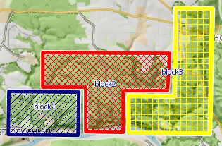
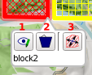
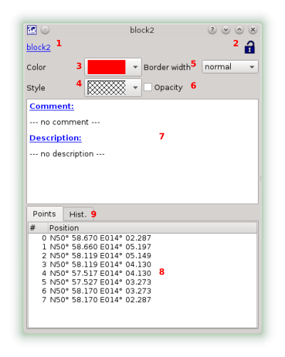

[Prev](DocGisItemsWpt) (Waypoints) | [Home](Home) | [Manual](DocMain) | [Index](AxAdvIndex) | (Edit items with multiple points (tracks, routes, areas)) [Next](DocGisItemsEditMultiple)
- - -
[TOC]
- - -

# Area Overlay

An area overlay is a polygon to mark an area on a map. Commonly used by search and rescue.

Of course you can try to play Tetris with area overlays, too.

If you click on the highlighted area you get a short on-screen-summary and a few options:

1. View / Edit area - See the full details about the area in a dialog with the option to edit the data.
2. Delete the area
3. Change the coordinates of the area. See ["Edit items with multiple points (tracks, routes, areas)"](DocGisItemsEditMultiple) for more details.

## View / Edit Details

1. The area name. Simply click on the highlighted name to edit.
2. As mentioned in Waypoints, Tracks & Co items are locked, when imported into QMapShack. You can edit them all the same if you unlock them by pressing the lock button.
3. The color of the area polygon. 
4. The fill pattern of the are. Next to some criss-cross patterns this can be solid or none.
5. The border with of the area polygon. 
6. The compete area polygon can be drawn with 30% or 100% opacity.
7. Add a comment or a description by clicking on the highlighted string. 
8. The coordinates of the area (read only)
9. This is the history list showing all changes applied to the area.

- - -
[Prev](DocGisItemsWpt) (Waypoints) | [Home](Home) | [Manual](DocMain) | [Index](AxAdvIndex) | [Top](#) | (Edit items with multiple points (tracks, routes, areas)) [Next](DocGisItemsEditMultiple)
