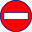

[Prev](DocGisItemsWpt) (Waypoints) | [Home](Home) | [Manual](DocMain) | [Index](AxAdvIndex) | (Realtime data) [Next](DocRealtime)
- - -

***Table of contents***

* [Areas in QMapShack](#areas-in-qmapshack)
    * [Create area](#create-area)
    * [View & edit details](#view--edit-details)
    * [Other actions](#other-actions)

* * * * * * * * * *
 
# Areas in QMapShack

An area in QMS can be used to define a region on a map in which, for instance, a search and rescue operation should take place or where access is prohibited (a so-called [no-go area][NoGo] as shown with `area1` in the following image).

![Areas in QMS][Area]

Of course, you can try to play Tetris with area overlays, too.

Areas are multi-point data items and share the [common features][DataMultiplePts] of such data.

## Create area

The creation of a new area is similar to the creation of a track or a route and is described [here][MultiPt]. The essential difference is that the last point created and the first one are joined by a line segment to get a closed line as border of the area.

The previous image shows some areas created without using a routing engine (toolbar option `O`). Here, the border of the area consists of straight line segments joining the clicked points. The following image was obtained using a [routing engine][Routing] (toolbar option `A`). The clicked points are joined by road segments found by the router (the meaning of the various black points on the area border is explained [here][TrkPts].

![Area in QMS with routing][AreaRoute]

## View & edit details

To get a short on-screen summary and a few toolbar options for handling an area

* select the area with a left-click on the area name in the workspace **or**
* left-click in a map window at a position without a GIS item to remove the selection of data items **and then**
* left-click on the area border in a map window.

![Short area info & action toolbar][AreaToolbar]

The meaning of the toolbar options is shown in the following table:

| Default icon |  Tooltip |
|---------|----------|
|   | View details and edit. |
|   | Set tags and rating. |
|   | Copy area into another project. |
|   | Delete area from project. |
|   | Edit shape of the area. |
|   | Toggle Nogo-Area |

When clicking the `View details ...` icon an additional windows pops-up giving more detailed information about the area. This window allows to edit some of the details:

![Area info window][AreaInfo]

1. Edit the area name. Simply click on the highlighted name to edit it.
1. This icon is a warning that the data item is not created in QMS but loaded from some file and then edited. Saving such data back to a file may lead to a loss of some detailed information because not all file types support saving of all information handled by QMS. If the area was created in QMS, then this icon isn't shown.
1. GIS items are locked, when imported into QMapShack. If the lock is closed, data editing is not possible. Press the lock icon to unlock (or lock) data for editing.
1. Select the color of the area. 
1. Select the border width of the area. 
1. Select the fill pattern of the area. Solid or no pattern can be found next to the criss-cross patterns.
1. Set the area to opaque.
1. The 3 tabs `Info, Points, Hist.` provide
    1. a description, a comment and links relevant for the area (click on the highlighted strings to edit them, for details see [here][EditMeta]),
    1. a read-only list of all points used to create the area (for editing these points, click the `Edit shape...` icon, for details see [here][EditPts]),
    1. the history of changes of the given area (for additional information about using this list see [here][Hist]).

## Other actions

_Remarks on other toolbar actions:_

* For details about the  `Set tags and rating` icon see [here][Tags].
* For details about the `Toggle no-go area` icon see [here][NoGo].

[EditMeta]: DocGisItems#create-data                         "Edit description and comment"
[EditPts]:  DocGisItemsEditMultiple#edit-line-points        "Edit shape of area"
[Hist]:     DocGisItems#undo--redo                          "Use of history list"
[Tags]:     DocDataSearch#tagging-data                      "Set and use tags"
[NoGo]:     DocGisItemsRouting#using-no-go-areas-and-lines  "Handling no-go areas"
[Routing]:  DocGisItemsRouting#description-of-routing-methods-in-qmapshack "Routing options in toolbar"
[TrkPts]:   DocGisItemsEditMultiple#line-edit-mode          "Meaning of points on track"
[MultiPt]:  DocGisItemsEditMultiple#create-new-data         "Create multi-point data"
[DataMultiplePts]: DocGisItemsEditMultiple                  "Multi-point data"

[Area]:        images/DocGisItemsArea/Area.jpg              "Area without routing"
[AreaRoute]:   images/DocGisItemsArea/AreaWithRouting.jpg   "Area with routing"
[AreaToolbar]: images/DocGisItemsArea/AreaActions.jpg       "Short area info & action toolbar"
[AreaInfo]:    images/DocGisItemsArea/AreaEdit.jpg          "Area info window"

- - -
[Prev](DocGisItemsWpt) (Waypoints) | [Home](Home) | [Manual](DocMain) | [Index](AxAdvIndex) | [Top](#) | (Realtime data) [Next](DocRealtime)
