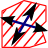
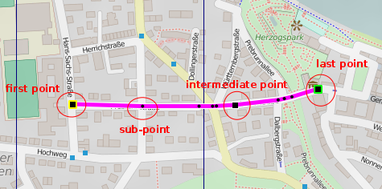
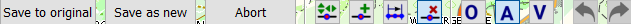
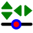
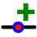
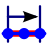
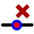
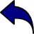
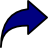

[Prev](DocGisItemsArea) (Areas) | [Home](Home) | [Manual](DocMain) | [Index](AxAdvIndex) | (Database) [Next](DocGisDatabase)
- - -

# Edit items with multiple points (tracks, routes, areas)(valid from version 1.3.0 or later)

  To edit the line of those items you have to switch into line edit mode. This will create a copy of the line. The copy can be changed and changes have to be saved to the original item or new item is created. Please be aware that especially for tracks additional data like timestamps and elevation will be lost when saving the changed line to the original item.

The line looks like:

The points that can be changed are marked by large black squares. The square under the mouse cursor is highlighted by a red square. Sub-points, introduced by auto-routing, are marked with small black dots. The first point of a line has a yellow frame. The last a green one.

In line edit mode several buttons are displayed on-screen. 

## Saving data ##

| | |
|-|-|
|**Save to original**| This will replace the original data by the one of the edited line. The edited line only holds the coordinates and the elevation from DEM files if one is loaded for the area. Especially a track can contain much more information for each point if it is a real recording. Therefore QMapShack is the wrong tool to spoof your track recordings. It's only good to visualize real tracks and draw and edit artificial ones.|
|**Save as new**|Create a new GIS item.|
|**Abort**|Leave the line edit mode without a change.|

Points and sub-points are stored different depending on the GIS item:

**Track** - On save all sub-points are converted to real points. 

**Area** -  On save all sub-points are converted to real points. 

**Route** - On save all points are stored as route waypoints. All sub-points are stored as intermediate route points. No navigation information is generated or stored. 

## Edit line ##
| | | |
|-|-|-|
|| Move a point| `CTRL+M` Move the mouse cursor over a point until it is highlighted. A left click will make the point stick to the mouse cursor. A right click will abort the operation. A second left click will drop the point at the new position. If routing is enabled the lines to and from the point are updated by sub-lines .|
|| Add a point| `CTRL++` Add a point to a line segment or at the start or end of the line. Move the mouse cursor over a line segment or a point to highlight it. A left click will add a new point that sticks to the mouse cursor.  A right click will abort the operation. A second left click will drop the point at the new position. If routing is enabled the lines to and from the point are updated by sub-lines.|
|| Select a range of points| `CTRL+R` Select the first and last point with a left click of your mouse. You will get two options to choose from.  Delete all points between the first and the last selected point.  Calculate a route between the first and the last point. Make sure the routing mode and router are setup properly to make it work.|
||Delete|`CTRL+-` Remove a highlighted point by a left click. If routing is enabled the lines to and from the point are updated by sub-lines.|

## Routing ##
When creating a track or a route different routing modes can be used and selected by the next buttons. The modes are described in the following table. If auto-routing is used then a properly configured offline router must be selected before the start of track/route creation process. The selected router (routing database)
should have the routing information for the region used in the map.

| | |
|-|-|
|**0**| `CTRL+O` No routing selected. Points are connected by a straight line.|
|**A**| `CTRL+A` Auto-routing. The points are connected by sublines derived by the router.|
|**V**| `CTRL+V` Vector-routing. To use vector-routing a vector map must be active for the area. The points are connected by the points of a polyline in the vector map. It is important that the first and the second line is part of the polygon. Else a straight line is used.|

The routing mode can be changed during the track/route creation by pressing the keys described.

## Undo/Redo ##

While in line edit mode all changes can be undone.

| | |
|-|-|
|| Undo last operation|
|| Redo last operation|

- - -
[Prev](DocGisItemsArea) (Areas) | [Home](Home) | [Manual](DocMain) | [Index](AxAdvIndex) | [Top](#) | (Database) [Next](DocGisDatabase)
