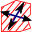
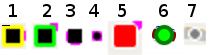
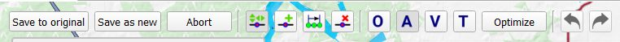
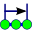

[Prev](DocGisItems) (Data in QMapShack) | [Home](Home) | [Manual](DocMain) | [Index](AxAdvIndex) | (Tracks) [Next](DocGisItemsTrk)
- - -

***Table of contents***

* [Create and edit multi-point data](#create-and-edit-multi-point-data)
    * [Create new data](#create-new-data)
    * [Line edit mode](#line-edit-mode)
    * [Line edit toolbar](#line-edit-toolbar)
    * [Save data](#save-data)
    * [Edit line points](#edit-line-points)
    * [Routing options](#routing-options)
    * [Undo/redo](#undoredo)

* * * * * * * * * *

 
# Create and edit multi-point data

This page describes the common approach used in QMS to create and edit tracks, routes and areas in map windows. Collectively these 3 data types are called *multi-point data*. 

Other information of these data objects can be edited with the help of the edit icon ![Edit general information][Edit].

## Create new data

To create a new multi-point data object proceed as follows:

* Go to the docked routing window and select a routing engine and its properties.
* Go to a map window and zoom it to the region in which the new object should be located.
* Right-click in the map window to open its context menu.
* Click the menu entry `Add track/route/area`. The mouse position will be taken as first point of the new data object. The mouse cursor will show that you are now in the line edit mode. 
* Select a [routing option][Routing] from the toolbar:
    * Press `O` to create the new object without routing (i.e. points are joined by straight line segments).
    * Press `A` to use the selected routing engine and its properties as established to create the new object. Points are joined by paths following some road.
* Left-click one after the other the required points. While doing so, the current layout of the new object is shown. If the new object is an area, then the last point clicked is joined with the first one to get a closed border line for the area.
* Finish with a right-click at the last point.
* Click the `Save as new` button in the toolbar to save the new multi-point object in a workspace project and to give the new object a name.

## Line edit mode

To edit the line of multi-point items (for an area its border line) you have to switch into line edit mode. This will create a copy of the line. The copy can be changed and changes have to be saved to the original or to a new data object. Please be aware that especially for recorded tracks additional data like timestamps, elevation or fitness data can be lost when saving the changed line to the original object.

To start the line edit mode proceed as follows:

* select the data item with a left-click on the its name in the workspace **or**
* left-click in a map window at a position without a GIS item to remove the selection of data items and then
* left-click on the line in a map window to get the action toolbar of the data item,
* left-click on the move points  resp. the edit shape icon  in the actions toolbar.

A piece of a track, route resp. area line in the line edit mode looks like shown in the next image:

The next image shows in a slightly enlarged form all possible icons of line points::

The meaning of the icons is as follows:

1. _Black square with yellow border._ Start point of data item. Properties like big black square.
1. _Black square with green border._ Endpoint of data item. Properties like big black square.
1. _Big black square._ Routing point of data item. Can be moved to new position after selection. Changes to red square, if selected (clicked).
1. _Small black square._  Subpoint automatically created by a routing engine. Can't be moved to new position. Is automatically readjusted,
   if a neighboring routing point is changed.
1. _Red square._ Appears if the mouse pointer is moved on a routing point. Can be fixed to the mouse and moved to new position.
1. _Green circle with dark green border._ (Tracks only) Last point selected in a track range.
1. _Small gray square._ (Tracks only) Hidden trackpoint.

_Remark:_ The last 2 types are used only in connection with [track ranges][TrkRange].

## Line edit toolbar
 
 
In line edit mode a toolbar with several buttons is displayed at the top of the map window: 

[Edit]: images/icons/EditDetails.png "Edit general information"
[TrkRange]: DocGisItemsTrkRange#user-content-track-ranges "Track ranges"

The next table gives a short description of the meaning of the toolbar buttons resp. icons. More details are given in the section ["Edit line points"][PtsEdit]

| Button/icon | Meaning/Tooltip |  
|-|-|  
|**Save to original**| This will replace the original data by the data of the edited line.  |
|**Save as new**| Save changed data to a new GIS item.|
|**Abort**|Leave the line edit mode without a change.|
|   | Move points. (Ctrl+M) |
|   | Add new points. (Ctrl++) |
|   | Select a range of points. (Ctrl+R) |
|   | Delete a point. (Ctrl+-) |
|   | No auto-routing or line snapping (Key: O) |
|   | Use auto-routing to between points. (Key: A) |
|   | Snap line along lines of a vector map. (Key: V) |
|   | Connect points with a line from a loaded track if possible. (Key: T) |
|   | Undo last change |
|   | Redo last change |
|**Optimize** | Optimizes the route by reordering the points using the router specified in the Routing tab. This is known as solving the Traveling Salesman Problem, however start and end are kept fixed here |

## Save data

The edited line only holds the coordinates and, if DEM data is available, the elevation. Timestamps are not saved because it is not possible to assign timestamps to changed line points. A track recorded by some GPS device can contain additional information for each point (e.g. temperature). This additional data gets also lost when trying to edit a recorded track. Therefore, QMapShack is the wrong tool to spoof track recordings. It is only good to visualize recorded tracks and to draw and edit artificial (planned) ones.

Points and subpoints are stored differently depending on the type of the GIS item and the storage type:

| Item type | Database, QMS file | GPX file with QMS extensions | GPX 1.1 file |
|-----------|--------------------|------------------------------|--------------|
| Track     | everything saved   | points and subpoints completely saved | subpoints saved as points |
| Route     | everything saved   | points saved, subpoints not saved | points saved, subpoints not saved | 
| Area      | everything saved   | subpoints converted to points, all points saved | data not saved |

__Recommendation:__ If any possible, save your data to a database and take advantage of the flexible and structured way of handling such data in QMS. 

## Edit line points

| Icon | Meaning | Description |
|--|--|--|
|   | Move a point | Hotkey: `CTRL+M`. Move the mouse cursor over a point until it is highlighted. A left-click will make the point stick to the mouse cursor. A right-click will abort the operation. A second left-click will drop the point at the new position. If routing is enabled, the paths to and from the moved point are updated by newly calculated paths.|
|   | Add a point| Hotkey: `CTRL++`. Add a point to a line segment or at the start or end of the line. Move the mouse cursor over a line segment or a point to highlight it. A left-click will add a new point that sticks to the mouse cursor.  A right-click will abort the operation. A second left-click will drop the point at the new position. If routing is enabled, the lines to and from the point are  newly calculated paths.|
|   | Select a range of points | Hotkey: `CTRL+R`. Select the first and last point with a left-click of the mouse. You will get two options to choose from: Click the delete icon  to delete all points between the first and the last selected point. Click the wheel icon  to calculate a route between the first and the last point. Make sure the routing mode and router are setup properly in advance to make this action work. |
|   |Delete a point| Hotkey: `CTRL+-`. Remove a highlighted point by a left-click. If routing is enabled, the lines to and from the point are updated by newly calculated paths. |

## Routing options

Different routing methods can be selected and used for editing multi-point data items with the help of the routing buttons. The different routing methods are described briefly in the following table. A detailed description can be found [here][RteModes].

If auto-routing is used, then a properly configured offline router must be selected before the start of the editing process. The selected router (more precisely, its routing database) should have routing information for the region used in the map.

|Button | Description |
|--|:--|
|**O**| Hotkey: `O`. No routing (routing switched off). Neighboring line points are connected by a straight line segment. |
|**A**| Hotkey: `A`. Auto-routing. Neighboring points are connected by a path calculated by the router selected in the routing tab. |
|**T**| Hotkey: `T`. If possible, connect neighboring points with a path taken from a loaded track. |
|**V**| Hotkey: `V`. Vector-routing. To use vector routing a vector map must be active for the given area. Neighboring points are connected by a polyline (a road) taken from in the vector map. It is important that the 2 points belong to the map polyline. Otherwise, a straight line is used. |

The routing mode can be changed during the track/route creation by pressing the keys described.

## Undo/redo

While in line edit mode the last change can be undone with a click on the undo icon . An undone change can be redone with a click on the redo icon .

[RteModes]:  DocGisItemsRouting#user-content-description-of-routing-methods-in-qmapshack "Routing methods"
[PtsEdit]:   #user-content-edit-line-points                                              "Edit line points"            
[Routing]:   DocGisItemsRouting#user-content-description-of-routing-methods-in-qmapshack "Routing"

- - -
[Prev](DocGisItems) (Data in QMapShack) | [Home](Home) | [Manual](DocMain) | [Index](AxAdvIndex) | [Top](#) | (Tracks) [Next](DocGisItemsTrk)
