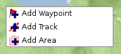
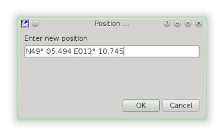
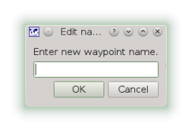

[Prev](DocGisItems) (Tracks, Waypoints & Co) | [Home](Home) | [Manual](DocMain) | [Index](AxAdvIndex) | (Tracks) [Next](DocGisItemsTrk2)
- - -

# Create new tracks, waypoints etc.

You can create your own GIS items in QMapShack by a simple right mouse click on the canvas.

Select the item to add from the menu.

## Waypoint

The default position of a new waypoint will be the right click position of the mouse cursor. The first dialog will show you the coordinates and you can change them if necessary.

Next you will be asked for a name. If you add more waypoints the name will be appended by a counter.  If you append the name with a number, the number will be incremented by the next new waypoint.

Now you have to select an icon for your waypoint. The last selected icon will be marked as default.

Finally you have to select a project for your new waypoint. You can select from a list of already loaded projects or create a new one.

## Track

If you select a track as new element the mouse position will be taken as first track point and the mouse cursor will enter the line edit mode. See  ["Edit items with multiple points (tracks, routes, areas)"](DocGisItemsEditMultiple) for more details.

## Area

If you select an area as new element the mouse position will be taken as first point and the mouse cursor will enter the line edit mode. See  ["Edit items with multiple points (tracks, routes, areas)"](DocGisItemsEditMultiple) for more details.

- - -
[Prev](DocGisItems) (Tracks, Waypoints & Co) | [Home](Home) | [Manual](DocMain) | [Index](AxAdvIndex) | [Top](#) | (Tracks) [Next](DocGisItemsTrk2)
