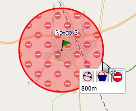
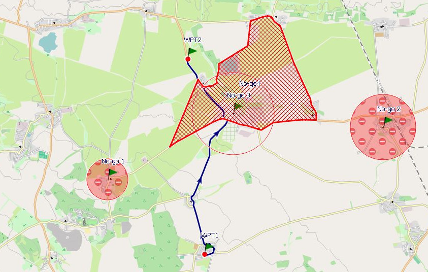

[Prev](DocGisItemsRte) (Routes and routing) | [Home](Home) | [Manual](DocMain) | [Index](AxAdvIndex) | (Waypoints) [Next](DocGisItemsWpt)
- - -

***Table of contents***

* [Routing in QMapShack](#routing-in-qmapshack)
    * [Description of routing methods in QMapShack](#description-of-routing-methods-in-qmapshack)
    * [Configuration of routing engines](#configuration-of-routing-engines)
        * [BRouter](#brouter)
        * [Routino](#routino)
            * [Create Routino database](#create-routino-database)
        * [MapQuest](#mapquest)
    * [Comparison of routing engines](#comparison-of-routing-engines)
    * [Other routing information](#other-routing-information)
    * [Using no-go areas and lines](#using-no-go-areas-and-lines)
        * [Purpose of no-go areas and lines](#purpose-of-no-go-areas-and-lines)
        * [Defining no-go areas/lines](#defining-no-go-areaslines)
            * [Disc-shaped no-go areas](#disc-shaped-no-go-areas)
            * [Polygon-shaped no-go areas  ](#polygon-shaped-no-go-areas)
            * [No-go lines](#no-go-lines)
        * [Activate no-go areas/lines](#activate-no-go-areaslines)
            * [Routing with no-go areas/lines](#routing-with-no-go-areaslines)     

* * * * * * * * * *

# Routing in QMapShack

## Description of routing methods in QMapShack

When creating or editing tracks, routes or areas, i.e. multi-point data items, the following 4 different routing methods can be used:

* off-road routing,
* auto(matic) routing,
* vector routing,
* track routing,

To get access to these methods the line edit toolbar in a map window must be used. This toolbar is available

* when creating a new multi-point object with the help of one of the map window context menu entries `Add waypoint/track/route/area`,
* when [editing a multi-line object][EditMode].


* _Method 1:_ Off-road routing:

    Select this method by clicking on the toolbar icon `O` or by pressing `O` (easier!).

    Consecutive points are connected by straight line segments ("off-road"), i.e. there is no routing at all. 

* _Method 2:_ Auto(-matic) routing:

    Select this method by clicking on the toolbar icon `A` or by pressing `A` (easier!).  
    
    This is the most used routing method. It needs special preparation of an offline or online router (a so-called routing engine) and its routing parameters (foot,  bicycle, motorcar, ...) as described in the section [Routing setup][AdvSetup]. The map is required only to locate the necessary routing points properly. Thus, raster maps (e.g. Russian military maps) can be used, too.

    * _Advantage of this method:_ Fast routing not depending on map data.
    * _Disadvantage:_ From time to time unexpected routes or tracks longer than necessary. There are many reasons for this behavior, e.g. incorrect map data or road types in the routing database or not precise enough location of the mouse pointer in the map window.

* _Method 3:_ Routing with vector map data (vector routing):

    Select this method by clicking on the toolbar icon `V` or by pressing `V` (easier!).
    
    This method can be used only with a vector map. A routing database as described in method 2 is not required.
    As soon as 2 consecutive points can be connected by a
    polyline (a sequence of straight line segments) contained in the map this polyline can be selected manually as part of
    the new data item connecting the points considered. If such a polyline is not found in the map, then a straight line
    segment will be used to connect the points.
    
    The manual polyline choice prevents automatic recalculation of routes created with this method. Thus, this method should be used mainly for track creation.

    The following image shows a first new route segment. Its endpoint is on a road of the map (a polyline of the map).
    The yellow part of the road is the extent of this polyline. If the next point is selected on this yellow part,
    then the route follows this road up to this point.

    

    * _Advantage of this method:_ Off-road and on-road routing can be mixed. No routing database required.
    * _Disadvantage:_ Quite often very short map polylines. Thus, many intermediate routing points are required.

* _Method 4:_ Routing with tracks (track routing):    
    
    Select this method by clicking on the toolbar icon `T` or by pressing `T`.
    
    As soon as 2 consecutive points can be connected by an existing part of a track contained in the map this track part is selected as part of the new data object. If such a track part is not found in the map, then a straight line segment will be used to connect the points.
    
    Here is an example for this routing method:
    
    There exist some track (blue line) on the map which should be used for the construction of a new route:
    
    
    
    Start creating a new route with track routing (icon `T` is selected). As soon as a new point is on an existing track, the track color is changed to yellow and the new route now may follow the yellow line
    
    
    
    Select the next new point somewhere on the track. The new route follows the track up to this point.
    
    
    
    Continue to the end of the new route (here using straight line segments again)
 
    
    
    Manual routing in a map view allows to change the routing method from step to step. In the next example autorouting was used for the first part of the route. At  second point the routing method was changed to track routing.
    
    
    
    For the final part of the route autorouting (icon `A` is selected) is used again. Thus, straight line segments have been avoided.
    
    
 
    * _Advantage of this method:_ New routes or tracks can use already existing track parts.

## Configuration of routing engines

QMS provides several routing engines with different routing strategies and properties for the creation of multi-point data objects. Some routing engines need an Internet server, others use a local routing database.

The selection and configuration of a routing engine for automatic routing takes place in the docked routing window (if closed, open it with the main menu entry `Window - Routing`).

![Routing window][RoutingWindow]

The following routing engines (routers) can be selected in the scrollbox on the top of this window::

* BRouter (online or offline),
* Routino (offline),
* MapQuest (online),

Offline routers use special routing databases. The preparation of these databases is part of the router setup (compare page [Overview of setup and configuration options][AdvSetup]). Typically, the data source for a routing database is [OpenStreetMap](https://www.openstreetmap.org/) data.

Each routing engine has its own set of routing properties.
 
 
### BRouter


BRouter has an offline and an online variant. To configure a variant of this router

* select `BRouter (...)` in the combobox on top of the router window,
* if the variant shown is not the one to be used, press the `Setup` button,
    * in the next window select `BRouter-Web` (online) or `local installation`,
    * go to the next windows and confirm or modify settings as necessary (if initial BRouter setup was correct and complete, than nothing has to be changed), 
    * the last setup window for the offline variant allows to [download routing database files][BRouterDatabase] (so-called RD5 files) for the regions under consideration,
* select a profile (a vehicle type) from the combobox,
* select an alternative (start with original, if not satisfied with obtained route, then select an alternative),
* decide about on-the-fly routing (should be used if data object is created in map window).

_Remarks:_ 

* The list of available profiles is defined by the user during the BRouter setup. 
* The user can [edit the profiles][BRouterProfile] or add new ones.
* Cross-border routing is supported in those regions for which routing data is available.


### Routino

Routino is an offline router written by Andrew M. Bishop. See the project [homepage](http://routino.org/) for more details. As it is working without an Internet connection it needs locally installed routing data. A Routino database for a region is composed of 4 files:

```
region_abbr-nodes.mem
region_abbr-relations.mem
region_abbr-segments.mem
region_abbr-ways.mem
```
Replace the "region_abbr" part with a descriptive name of the region to which the database belongs, e.g. "Europe" or "North_America". This will be the name displayed on the QMS GUI when selecting a routing database. An underscore in the name **"_"** will be replaced by a space **" "**.

To create a database use the `planetsplitter` tool from the Routino package. Currently, this tool is installed during the QMapShack installation. Please refer to the [Routino online documentation](http://routino.org/documentation/usage.html) on how to use planetsplitter.

Cross-border routing is possible within the region for which the selected routing database was built.

In the router configuration window select

* a profile (a vehicle type),
* a language used for route instructions,
* a mode (shortest resp. quickest),
* a routing database from a path defined with the `Open path` icon next to the database combobox.


#### Create Routino database

A Routino database is created from OSM data. The used input file format is *.pbf. You find files of this type for various regions at the
[GeoFabrik server](http://download.geofabrik.de/ "GeoFabrik as source of PBF files").

If you want to use planetsplitter within QMS to create the Routino database files from a PBF file, then select the main menu entry `Tool - Create Routino Database`. 


Add one or more *.pbf files to the input list. Select an output path and name prefix (descriptive region name). Press `Start` to 
compile a new database.

*Attention:* PBF files can be rather big. Their conversion into Routino databases can take a long time!


### MapQuest

MapQuest is an online router. It will answer to up to 15.000 requests each month without a charge. If that limit is exceeded, the requests from all QMapShack users will stop working until the end of the month. MapQuest is better for car routes compared to Routino or BRouter. For hike and bike tours Routino or BRouter are to be prefered. 


In the router configuration window select

* a profile (a vehicle type),
* a language used for route instructions,
* road types which should be avoided.
    
## Comparison of routing engines

(for a general comparison of routers in general see also [OSM router comparison matrix](https://wiki.openstreetmap.org/wiki/Routing/online_routers))

_Feature_| _BRouter_ | _Routino_ | _MapQuest_ | _Off-road_ | _Vector_ |
---------|-----------|-----------|------------|----------|:----------:|
choose in QMS with| Routing window / CTRL-A | Routing window / CTRL-A | Routing window / CTRL-A | CTRL-O | CTRL-V
Internet used | yes or no | no | yes | no | no
create route from list of routing points | yes | yes | yes | no | no
route instructions | no | yes | yes | no | no
use of elevation data in route calculation | yes | no | no | no | no
requires installation of routing database | yes (for offline router, download necessary tiles, no further data preparation required) | yes (download necessary regional data and run special database preparation tool) | no | no | no
requires vector map | no | no | no | no | yes
off-road routing | (yes) | no | no | yes | no
road class preferences | yes, in configuration files | yes, in configuration files | partially | no | manually
user configuration | in additional configuration files | in default configuration files | no | no | no |
cross-border routing | yes | within the region of a routing database | yes | yes | if map covers several countries
no-go areas | yes | no | no | yes - manually | yes - manually
on-the-fly routing | online: no, offline: yes, if switched on | yes | no | no | (yes)


## Other routing information

* The BRouter resp. Routino routing databases  and the (vector) maps displayed in QMS are completely independent. This may lead to some inconsistencies between a calculated route and a vector map (e.g. new road in the map but not yet in the routing database). OpenStreetMap data are updated quite frequently. To avoid such inconsistencies, it is recommended to update from time to time vector maps and routing databases.
  
    _BRouter (offline):_ The tile selection window (last setup window) shows the number of downloaded but outdated tiles. A tile is outdated, if a newer one is found on the 
    BRouter Internet server. This information is available only with Internet access. 
 
* Routino routing data must be downloaded from the Internet. The necessary routing database is created with the help of a special database preparation tool. *Warning:* When selecting large regions, the data volume downloaded and the runtime of the tool can be huge. To avoid this, use the BRouter for routing. Here, you can download the necessary routing data in form of tiles from the Internet and use them immediately without further data preparation steps.
* The user can change routing preferences in the configuration files of the BRouter and Routino routers. Special knowledge is needed for making changes to these configuration
  files.
* Routes (but not tracks) can be (re-)calculated. There are 2 methods to start route calculation:
    * Go to to the route object in the workspace window, open the context menu with a right-click and select `Calculate route`.
    * Click on the route in a map window and select the `Calculate route` icon  from the displayed toolbar.
* Recalculation is carried out with the router selected in the routing window. This router can be different to the one used in the original calculation.
* When saving a route (e.g. into a GPX file), only the routing points are saved. (Re-)Loading a saved route into QMS results in a route object with a list of routing points. Without recalculating the route it is displayed with straight line segments joining the routing points. After recalculation, the display changes to a _breadcrumb_ line. To save this line completely convert the route into a track using the context menu entry `Convert to track` of the route and save the track.
* The routing engines may fail to create a route or track. Some reasons for this are:
    * missing routing data for the region considered,
    * routing points are not located on roads,
    * the selected vehicle type (e.g. bicycle) is not allowed on the selected road type (e.g. motorway).
    
* _More BRouter information:_
    * BRouter can be used on- or offline. To switch between these variants click the `Setup` button and select the necessary variant in the next window.
    * _Offline variant:_ A click on the  icon in the routing window opens an additional widget which shows log messages 
      (commands send to the 
      BRouter server, error messages).
    * Click on the question mark (help) button next to the profile selection combobox to see information (the contents) about the selected profile.  
    * _Offline variant:_ The offline server can be started or stopped with the help of the  icon. The state of the server is shown in the 
      routing window. Normally, the server starts automatically.
    * The BRouter stand-alone version is automatically 
      installed when the BRouter engine is set up in QMS. If the offline server is started in QMS, then this server can also be used for a BRouter stand-alone version without using QMS for routing. Just open [brouter-web](http://brouter.de/brouter-web/) in a browser and proceed as described in the browser window.  
      
* _Recommendation on choice of router profiles:_
    * The BRouter and Routino routers offer different routing profiles with different routing results.
    * Good profiles for trekking and biking are:
        * BRouter: `trekking` or `shortest`,
        * Routino: `Foot` or `Bicycle`.
    * The user is advised to check the resulting route and, if necessary, improve it by inserting additional routing points.
    
* _More vector routing information:_
    * Routing is possible along any line type in the vector map, even those, that don't have the character of a road (e.g. power lines, rivers). Check
      carefully the line types of the map when using this routing method!
 

[RoutingWindow]:   images/DocGisItemsRte/RouterCfg.jpg  "Router window"

[BRouterDatabase]: AdvSetup#brouter-setup               "Download BRouter database files"
[AdvSetup]:        AdvSetup#routing-setup               "Routing setup"
[EditMode]:        DocGisItemsEditMultiple#line-edit-mode       "Line edit mode"

[BRouterProfile]:  http://brouter.de/brouter/costfunctions.html "BRouter profiles"


## Using no-go areas and lines

### Purpose of no-go areas and lines

A no-go area (an avoid-area) is an area which must be avoided by routes and tracks. A no-go (poly-)line (a no-trespass line) can't be intersected by a route or track.

The BRouter routing engine can handle no-go areas and lines defined in QMS.

No-go areas can be defined in form of

* a disc surrounding a waypoint or
* a polygon-shaped area.

No-go lines can be defined as tracks or routes.

The following image shows from left to right a disc (a circle) surrounding a waypoint, an arbitrary area and a red track. The no-go properties for these objects are not activated. In each case a route intersects the given data object.


Activating the no-go property of the given 3 objects adds a no-go sign to the objects. Rescheduling the 3 routes leads to the following result:


Now, the routes don't intersect anymore the no-go areas resp. the no-go line.

Several no-go areas and lines can be active at the same time.


### Defining no-go areas/lines

#### Disc-shaped no-go areas

* Define a waypoint as center of the no-go area.
* Click `Edit` in the waypoint context menu to open the waypoint edit window 
* In the waypoint edit window define the radius of the no-go area in the field `Proximity`. 
* Close the waypoint edit window. A thin circle around the waypoint shows the proximity
  range.
  
     

* In the waypoint context menu select `Toggle no-go area`. The proximity range is now shown as a filled circle.

    
  
* Clicking on the circle surrounding a no-go area opens a toolbox. The text in the toolbox shows the proximity radius. Using the toolbox icons the user can
    * change the radius of the no-go area with the mouse (click icon, move mouse to new size of no-go area, old radius size is still shown, left-click to confirm new size).
    * remove the proximity radius and thus the no-go area.
    * switch the no-go area property on or off.   
 
    These actions can also be triggered in the waypoint context menu (menu entries `Change radius`, `Toggle no-go area`, `Delete radius`).
  
        
 
#### Polygon-shaped no-go areas  

* Define a normal QMS area (routing options can be used). _Remark:_ The boundary of an area is a polygon (a closed polyline). 

#### No-go lines

* Define a normal track or route.

### Activate no-go areas/lines

Select the context menu entry `Toggle no-go area` resp. `Toggle no-go line` of the area resp. route/track in the workspace. 

If the no-go property of a data object is activated, then its icon in front of the object name in the workspace displays this state as shown here:


#### Routing with no-go areas/lines

As soon as no-go areas and/or lines are defined any route or track constructed with BRouter avoids each of the no-go areas/lines in __all selected__ projects in the workspace. 
No-go areas/lines defined in unselected workspace projects are inactive while routing.
_Attention:_ This statement is true only if no routing
point lies inside the no-go area. If a routing point is inside a no-go area, then the router creates a route through this routing point irrespective of the no-go area.

Example of a route connecting 2 waypoints without crossing a no-go area:

  


Example of the same route with additional no-go area:

  
 
- - -
[Prev](DocGisItemsRte) (Routes and routing) | [Home](Home) | [Manual](DocMain) | [Index](AxAdvIndex) | [Top](#) | (Waypoints) [Next](DocGisItemsWpt)
