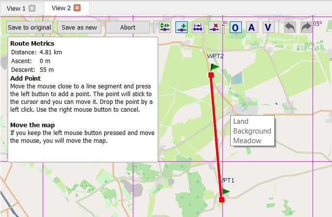
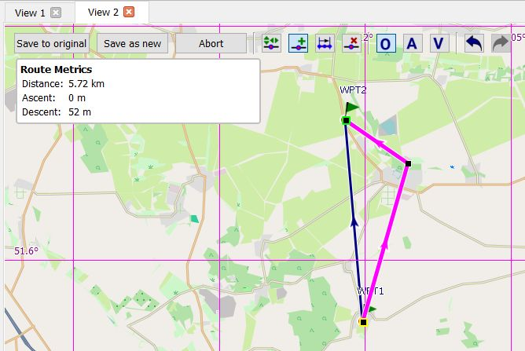

[Prev](DocGisItemsTrkFilters) (Track filters) | [Home](Home) | [Manual](DocMain) | [Index](AxAdvIndex) | (Routing in QMapShack) [Next](DocGisItemsRouting)
- - -

***Table of contents***

* [Routes and routing](#routes-and-routing)
    * [Introduction](#introduction)
    * [Create route](#create-route)
        * [Select autorouting](#select-autorouting)
        * [Use list of routing points](#use-list-of-routing-points)
        * [Use map window](#use-map-window)
    * [View & edit details](#view--edit-details)
    * [Get route instructions](#get-route-instructions)
    * [Save route in GPX file](#save-route-in-gpx-file)
    * [Other actions](#other-actions)
    * [Optimize route](#optimize-route)    
    
   
    
* * * * * * * * * *
 
# Routes and routing

## Introduction

A route is used to plan a trip. It consists of

* an ordered list of waypoints (routing points) through which the user wants to pass,
* a strategy how to move from one routing point to the next one.

When selecting a routing strategy, the user has to decide about features like

* used routing engine (no routing, online or offline routing, routing algorithm),
* used road network (used map),
* preferred or avoided road types (motorways, toll roads, unpaved roads, ...),
* used transportation type (foot, bicycle, car, ...),
* fastest or shortest route etc.

Having the routing points and having selected the routing strategy (a routing engine) the route can be constructed (calculated) by the routing algorithm. After a change of the routing strategy,
the route can be recalculated. The last possibility distinguishes routes from planned tracks in QMS. 

The dependence of a route on the routing data and also on the routing engine makes the transfer of a route to a GPS device or to another software that handles GIS data difficult. For instance, when saving a route to a GPX file or a GPS device, only the routing points and not the results of the routing algorithm (route instructions, roads to follow etc.) are saved or transferred. The GPS device or the other GIS software do have, in general, a different routing algorithm and different routing data taken from some map. Thus, the paths in the GPS device joining the routing points will be different to the ones used when creating the route.

The user of a route must always pay attention to this fact. He must remember that reconstruction of the original route from the list of routing points alone is not possible. He has to decide when to use a route and when to use a track for data transfer to a GPS device. Some more discussion about the relation between routes and tracks can be found [here][RteTrk].

Tracks consist of an ordered list of waypoints (trackpoints). In addition to position, elevation and a timestamp trackpoints may contain also other information
(e.g. various fitness data, if track has been recorded by a fitness device). Thus, a track is a standalone geospatial data object, which does not require 
additional information like a routing engine when using it.

Typically, a track, especially a recorded one, contains much more points (factor 10 ... 100) than a route. That implies, that it is easier to make changes to a route than to a track when planning
a tour. After the final edit step, the route can easily be converted into a track in QMS.

QMS offers tools to create and edit both routes and tracks.

[RteTrk]: DocGisItemsTrk#tracks-vs-routes "Route vs. track" 

## Create route

After the installation and the [setup][RouterSetup] of routers for automatic routing, 2 different approaches are offered for route creation:

* Create route from a list of routing points (waypoints). This approach is supported by the BRouter, Routino and MapQuest routers.
* Define routing points one after the other in a map window. This approach is supported by all routing engines.

### Select autorouting

Autorouting is the default routing in QMS. 

To check if autorouting is active or to activate it proceed as follows:

1. Right click in a map view and select `Add route` from context menu.
1. If the `A` icon in the toolbar is pressed, then autorouting is active. If not, press `A` to activate autorouting.
1. Press twice `Esc` to leave the edit mode again.

### Use list of routing points

1. [Prepare all routing points][CreateWpt] required for the route. Ensure that all routing points are located within 1 project in the `Workspace` docked window.
1. Ensure that the `Routing` docked window is open (if necessary, open it with the main menu entry `Window - Routing`).
1. Select one of the routers in the listbox on the top of the `Routing` window.
1. Select the wanted [routing strategy][RouterCfg] using the offered choices (each router has its own choices!).
1. Goto the `Workspace` docked window and select all routing points required for the route.
1. Right-click on one of the selected waypoints to open the context menu and select `Create route`.
1. If necessary, re-order the routing points in the next window.
1. When closing this window, a new route is constructed. Give the route a name  and assign it to a project.
1. Goto to the newly created route object in the workspace, open the context menu with a right-click, and select `Calculate route` (this step is not necessary, if the route has been calculated on-the-fly!). 
1. To see the new route in a map window double-click on the route name in the workspace window. The map will be zoomed so that the complete route is visible.

### Use map window

(see also the section ["Create new multi-point objects"][CreateMultiPt])

1. Open a map view and zoom it to the region in which the new route should be located.
1. Case _Autorouting_:
    1. Ensure that the `Routing` window is open (if necessary, open it with the main menu entry `Window - Routing`).
    1. Select one of the routers in the listbox on the top of the `Routing` window.
    1. Select the wanted [routing strategy][RouterCfg] using the offered choices (each router has its own choices!).
1. Move the mouse pointer to the first waypoint of the route in the map view.
1. Right-click the mouse and select `Add route` from the context menu which pops-up. A [toolbox][LineEditToolbar] appears on the top of the map
   view.
1. Press `A` (autorouting), `O` (off-road routing) or `V` (vector routing) to select a routing method
   (described in detail [here](DocGisItemsRouting#description-of-routing-methods-in-qmapshack)).
1. Move the mouse pointer to the next routing point in the map view and left-click the mouse. After a short moment, the path connecting the previous with the current waypoint is shown (maybe in form of a straight line). _Remark:_ The first waypoint is shown with a yellow border, the last one with a green border. Waypoints between the first and the last one are shown as big black rectangles. A change of the routing method during the route creation procedure is allowed. The newly selected method will be applied to all further waypoints.
1. Repeat the previous step up to the end of the route.
1. After reaching the last waypoint of the route right-click the mouse. This stops the creation of new routing points.
1. Select `Save as new` in the toolbar on the top of the map window, assign a name and a project to the new route.

While creating a route bubble boxes provide additional information about the meaning of an option or about possible next steps.

If an online router is used, then the selected routing points are first connected by straight lines. After saving the new route (more precisely: the list of its routing points), left-click on the route in the map window. In the toolbox shown select `Calculate route` (wheel icon). After a short time interval, the online router returns its result and the final route is shown in the map window. The same procedure should be used, if the on-the-fly option for the BRouter (offline) is not selected.

_Remark:_ The router may fail by various reasons to find a route between 2 adjacent routing points. In case of BRouter an infobox inform about such an event:

![BRouter fails to route][BRouterNoRte]

Routino informs in a similar way:

![Routino fails to route][RoutinoNoRte]

Here, the router had to find a bicycle route to a junction where bicycle traffic is not allowed. Thus, routing to this routing point is not possible. 

## View & edit details

(compare also the section ["Line edit mode"][LineEdit])

To get a short on-screen-summary and a few toolbar options for handling a route

* select the route with a left-click on the route name in the workspace **or**
* left-click in a map window at a position without a GIS item to remove the selection of any data items and then
* left-click on the route in a map window.

![Short route info][RteToolbar]

The meaning of the toolbar options is shown in the following table:

| Default icon |  Tooltip |
|---------|----------|
|   | View details and edit. |
|   | Set tags and rating. |
|   | Copy route into another project. |
|   | Delete route from project. |
|   | Show instructions and details. |
|   | Calculate route. |
|   | Reset route calculation. |
|   | Move route points. |
|   | Reverse Route |
|   | Convert route to track |
|   | Toggle Nogo-Line |

When clicking the `View details ...` icon an additional window pops-up that informs about some details of the route and that supports editing of some of the them:

![Route details][RteDetails]

The underlined blue fields can be edited (click on the blue text to get an edit window).

Editing of routes is described in this section only for the case of autorouting. Other routing methods are described [here][Routing].

An existing route in a project selected in the workspace can be modified and edited in various ways:

* _Change of the routing method/recalculation of route:_
    1. Change [router configuration][RouterCfg] in routing window.
    1. Right-click on the route in the workspace and select `Calculate route` from the context menu. The route will be recalculated using the newly selected router configuration.
* _Change location of route waypoints (repeats and extends the description of [editing multi-point objects][EditMultiPts]):_
    1. Left-click on the route in a map view. This selects the route.
    1. Left-click on the route again to open a toolbox.
    
         
       
    1. Choose `Move route points` from the toolbox. Routing points are shown as big black squares.
    1. Waypoints shown with a big black square (routing points) can be moved with the mouse to a new location. When moving the mouse on such a waypoint, the color of the square 
      is changed to red.
    1. Click on such a waypoint to fix it to the mouse. Move the point with the mouse to a new location.
    1. Left-click at the new location to fix the waypoint.
    
        ![Move routing point][RteMovePt]
    
    1. Repeat previous 2 steps as long as necessary.
    1. When finished, click `Save to original` or `Save as new` from the toolbox at the top of the map window.
    1. If necessary, recalculate route.
    
* _Add routing point:_
    1. Open the toolbox and select `Move route points` as described in the previous point.
    1. Press `CTRL-+` or click the `Add new points` icon in the toolbar to activate adding of new routing points.
    
         
       
         The info box below the toolbar gives some information about possible actions.
       
    1. Click on the route at a location where a new routing point should be added and move the mouse to the location of the new routing point.  
 
         
 
    1. Left-click to fix the new routing point.
    1. Repeat previous steps to add more routing points.    
    1. When finished, click `Save to original` or `Save as new` from the toolbox at the top of the map window.
    1. If necessary, recalculate route.
    
       
## Get route instructions

If the route was constructed with the Routino or the MapQuest router, then route instructions are available. To get them, proceed as follows:

1. Open some map view which can display the route under consideration.
1. Double-click the route name in the workspace to see the route on the map.
1. Right-click on the route name and select the context menu entry `Route Instructions` _or_ left-click on the route
   in the map window and select `Route instructions` from the toolbar.
1. Points on the route with instructions are shown in light-blue.
1. Move the mouse pointer on a light-blue point.
1. See the instructions for the given point in a bubble box.

  

## Save route in GPX file

Routes can be saved in GPX files (and in other formats, too). When checking the information in such a GPX file, it can be seen that only the ordered
list of route waypoints is contained in the route part of the file. This fact needs some explanation.

When following a route, the user expects at all junctions (and only there) information about the necessary
turn in the selected language
(next direction, road number, distance to next junction, ...). No additional information is needed and therefore
no additional information is shown between 2 junctions.

In the following picture the selected waypoints are shown as red dots on the route. Blue dots on the route show
junctions with routing information.

Having the ordered list of route waypoints and the map data (more precisely the routing data of a map and also the
routing engine and its settings) the route
can easily be recalculated by the routing algorithm. This is the reason why when saving a route in form of a portable
GPX file
only the route waypoints are saved. In addition to this the GPX data format does not support the type of information
mentioned above for junctions.

When loading a route from a GPX file into QMS (or into another tool - the file format is portable!), the route has to
be recalculated.
An implication of this is that a transfer of a route
in form of a GPX file from one soft- or hardware tool to another one can lead to a different route due to a different
routing algorithm or different map (routing) data.

QMS can transform a route into a track. This track shows exactly the path to follow but doesn't include the above mentioned
routing information for junctions. This track can be stored together with the route (more precisely the route waypoints)
in a GPX file. In this file the route and the track are 2 independent objects!

_Remark:_ There are some software applications saving a route together with this track in a proprietary
non-portable format which links route and track data.

## Other actions

_Remarks on other toolbar actions:_

* When selecting `Reset route ...` from the context menu of a route or from the action toolbar in a map window, then all paths between routing points are replaced by straight line segments (this means no routing at all or off-line routing).
* When selecting `Calculate route` from the context menu of a route or from the action toolbar in a map window, then the selected routing engine for autorouting is restarted with the current configuration. Routing points are joined by road segments.
* When selecting `Convert to track` from the context menu of a route or from the action toolbar in a map window, then a track is created from the route. The route itself remains unchanged. This is quite a comfortable way to create a new track from a few given routing points.
* For details about the  `Set tags and rating` icon see [here][Tags].
* For details about the `Toggle no-go area` icon see [here][NoGo].

 

## Optimize route

One of the most important applications of optimization is the so-called [traveling salesman problem][TSP] (TSP), in which a series of waypoints has to be visited starting from a given waypoint and ending at a given waypoint (in the original formulation of the problem start and end are the same points). The goal is to find an optimal, i.e. shortest route passing through all of the given waypoints.

QMS offers an approximation algorithm for solving this problem. To use this algorithm carry out the following steps:

* Create a route from the start to the end point passing through all the other given waypoints. To do this 
    * select all waypoints in the workspace,
    * right-click on a selected waypoint and click the menu entry `Create route` from the context menu,
    * press `Ok` in the next window and assign the new route to a project and give it a name.
* Open the [line edit mode][LineEdit] for the route.
* Press the `Optimize` button to run the optimization algorithm.
* At the end of the optimization run you get an optimized version of the route. Keep in mind that the algorithm uses some stop criterion to avoid an extreme duration of the run. Thus, the new route is, in general, only suboptimal. 
* Save the optimized route. 

__Hints:__ 

* Keep in mind the mathematical difficulty of this optimization problem. If a large number of waypoints is given, computation time can be considerable!
* A progress bar is shown for longer optimization runs which allows to cancel the run.

Here is an example of route optimization:

* Given are randomly located waypoints on the Berlin A10 motorway ring road, the red ones are the start and the end points of the route:
 
    ![A10 waypoints][A10_1]
    
* Initial route through all waypoints in the given order without using a routing engine demonstrates the random order of the waypoints:
    
    ![A10 straight line route][A10_2]
    
* Initial route through all waypoints in the given order using the Routino router with profile `Goods` and mode `Quickest` results in a route with length of 686 km, converting the route into a track and looking at the track profile or in the project roadbook one can see that different sections of the route are used repeatedly:   

    ![A10 initial route][A10_3]
    
    Route profile:
    
    ![A10 initial route profile][A10_5]
        

* Route with optimized order of waypoints found by the optimization algorithm results in a route with length of 259 km:

    ![A10 optimized route][A10_4]

[TSP]: https://en.wikipedia.org/wiki/Travelling_salesman_problem "Traveling salesman problem"

[A10_1]: images/DocGisItemsRte/RteA10_Wpts.jpg     "A10 waypoints"
[A10_2]: images/DocGisItemsRte/RteA10_Straight.jpg "A10 straight line route"
[A10_3]: images/DocGisItemsRte/RteA10_Routed.jpg   "A10 initial route"
[A10_4]: images/DocGisItemsRte/RteA10_Opt.jpg      "A10 optimized route"
[A10_5]: images/DocGisItemsRte/RteA10_Profile.jpg  "A10 profile of initial route"

[RteMovePt]:    images/DocGisItemsRte/RteMovePt.jpg       "Move routing point"
[RoutinoNoRte]: images/DocGisItemsRte/RteRoutinoNoRte.jpg "No route found"
[BRouterNoRte]: images/DocGisItemsRte/RteBrouterNoRte.jpg "No route found"
[RteToolbar]:   images/DocGisItemsRte/RteActions.jpg      "Short route info & toolbar"
[RteDetails]:   images/DocGisItemsRte/RteEditDetails.jpg  "Route details"    

[NoGo]:          DocGisItemsRouting#using-no-go-areas-and-lines                 "Handling no-go areas"
[Routing]:       DocGisItemsRouting#description-of-routing-methods-in-qmapshack "Routing options in toolbar"
[EditMultiPts]:  DocGisItemsEditMultiple#edit-line-points                       "Edit multi-point objects"    
[LineEdit]:      DocGisItemsEditMultiple#line-edit-mode                         "Line edit mode"    
[Tags]:          DocDataSearch#tagging-data                                     "Add tags to data"    
[CreateWpt]:     DocGisItemsWpt#create-waypoint                                 "Create waypoint"
[CreateMultiPt]: DocGisItemsEditMultiple#create-new-data                        "Create multi-point object"
[RouterSetup]:   AdvSetup#routing-setup                                         "Router setup"
[RouterCfg]:     DocGisItemsRouting#configuration-of-routing-engines            "Router configuration"
[LineEditToolbar]: DocGisItemsEditMultiple#line-edit-toolbar                    "Line edit toolbar"

- - -
[Prev](DocGisItemsTrkFilters) (Track filters) | [Home](Home) | [Manual](DocMain) | [Index](AxAdvIndex) | [Top](#) | (Routing in QMapShack) [Next](DocGisItemsRouting)
