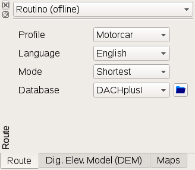
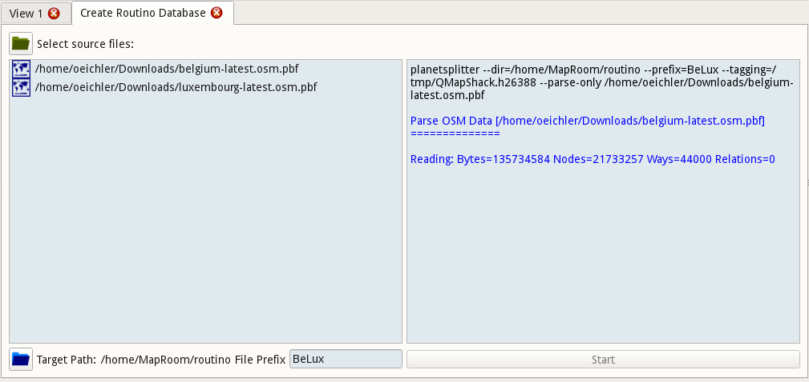
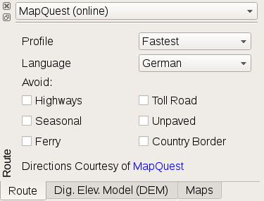

[Prev](DocGisItemsTrk2) (Tracks) | [Home](Home) | [Manual](DocMain) | [Index](AxAdvIndex) | (Waypoints) [Next](DocGisItemsWpt)
- - -

***Table of contents***

* [Routes](#routes)
    * [Create route](#create-route)
    * [Routing Engines](#routing-engines)
        * [Routino](#routino)
            * [Create Own Routino database](#create-own-routino-database)
        * [MapQuest](#mapquest)

* * * * * * * * * *
 
# Routes

## Create route

A route is a collection of waypoints with an order. The path between each point is usually a straight line. With routing information a path using the street network can be derived. The calculation can be done by a server (online routing) or with a local database (offline routing).

 

If you click on the highlighted route you get a short on-screen-summary and a few options:


 Edit details about route.

 Copy the route into another project.

 Delete the route from the project.

 Highlight route and see instructions.

 Calculate the route. The current router selection and configuration is used. 

 Reset the route to waypoints connected with straight lines.

 Edit the route. Move waypoints, add waypoints, delete waypoints.

## Routing Engines #

Currently Routino is supported as offline router and MapQuest as online routing service.

### Routino ##



Routino is an offline router written by Andrew M. Bishop. See the project's [homepage](http://routino.org/) for more details. As it is working without an Internet connection it needs routing data locally installed. A database needs 4 files:

```
*-nodes.mem
*-relations.mem
*-segments.mem
*-ways.mem
```

Replace the "*" with a name of the database, e.g. "Europe" or "North_America". This will be the name displayed on the GUI. The "_" will be replaced by " ".

To create a database use planetsplitter from the Routino package. Currently this is installed with the QMapShack installation. Please refer to the [online documentation](http://routino.org/documentation/usage.html) on how to use planetsplitter.


#### Create Own Routino database ###

A Routino database is created from OSM data. The used file format is *.pbf. You find these files at 
[GeoFabrik](http://download.geofabrik.de/ "GeoFabrik as source of PBF files").

If you want to use planetsplitter select the menu `Tool - Create Routino Database`. 



Add one or more *.pbf files to the input list. Select an output path and name prefix. Press start to 
compile a new database.

### MapQuest ##



MapQuest is an online resource. It will answer to up to 15.000 requests each month without a charge. If that limit is exceeded the requests from all QMapShack users it will stop working until the end of the month. Compared to Routino MapQuest is better for car routes. For hikes and bike tours Routino is prefered. 

- - -
[Prev](DocGisItemsTrk2) (Tracks) | [Home](Home) | [Manual](DocMain) | [Index](AxAdvIndex) | [Top](#) | (Waypoints) [Next](DocGisItemsWpt)
