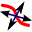
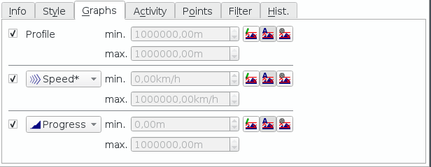
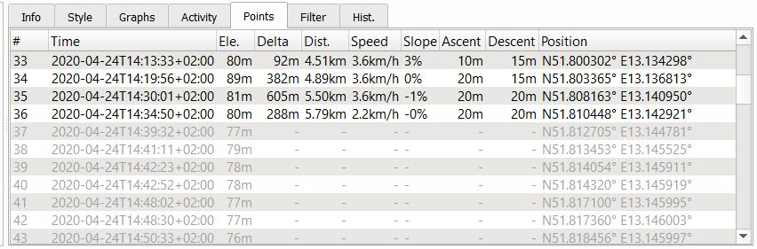

[Prev](DocGisItemsEditMultiple) (Create and edit multi-point data)) | [Home](Home) | [Manual](DocMain) | [Index](AxAdvIndex) | (Track information) [Next](DocGisItemsTrkInfo)
- - -

***Table of contents***

* [Tracks in QMapShack](#tracks-in-qmapshack)
    * [General information about tracks](#general-information-about-tracks)
        * [Definition of a track](#definition-of-a-track)
        * [Tracks vs. routes](#tracks-vs-routes)
        * [Recorded and calculated tracks](#recorded-and-calculated-tracks)
    * [Sources of tracks](#sources-of-tracks)    
    * [Create track](#create-track)
    * [View & edit details](#view--edit-details)
    * [Handling of track segments](#handling-of-track-segments)
    * [Avoid and remove invalid data in a track](#avoid-and-remove-invalid-data-in-a-track)
    * [Other actions](#other-actions)
        * [Cut track](#cut-track)
        * [Combine tracks](#combine-tracks)
        * [Attach waypoints to a track to get additional track information](#attach-waypoints-to-a-track-to-get-additional-track-information)
        * [Assign colors to track activities](#assign-colors-to-track-activities)
    * [Tracks and no-go areas](#tracks-and-no-go-areas)

* * * * * * * * * *

This is the start page for the discussion of track features in QMapShack (QMS). The discussion continues on the following pages:

* [Track information](DocGisItemsTrkInfo)
* [Track graphs](DocGisItemsTrkGraphs)
* [Track filters](DocGisItemsTrkFilters)
* [Track ranges](DocGisItemsTrkRange)
* [Track elevation data](DocGisItemsTrkElevation)

# Tracks in QMapShack

## General information about tracks

### Definition of a track

A track is an ordered list of points with coordinates that describe a path. To illustrate this, it is often referred to as a breadcrumb trail. The counterpart of a track is the route, which is a planned path and consists of a sequence of (mostly) independent waypoints. 

Conceptually, tracks are typically a record of where a person has been and routes are suggestions about where they might go in the future. For example, each point in a track may have a timestamp (because someone recorded where and when they were there), but the points in a route are unlikely to have timestamps (other than estimated trip duration) because a route is a suggestion which might never have been traveled.

Tracks are also created artificially to be used for navigation and planning. 

There may be hundreds or thousands of points in a track, but they are all anonymous. They don't have names and you can't easily get the location of any particular one.

A track is made of a sufficient number of trackpoints to precisely draw every bend of a path. It is the raw output of, for example, a GPS recording the course of one's trip, or the rearrangement of such points to remove excess ones, or data from any source such as extracted from a vector map.

If you load a track to the GPS, you can navigate from a track by following the track line on the map. As has already been said, because it's just a series of points, a track can go anywhere, it doesn't need roads (or a map with road information). But navigating a track on a GPS does not announce turns etc. It is up to you to follow the colored line on the GPS.

Technically, a track consists of at least one track segment containing an ordered list of trackpoints. To represent a single GPS track where GPS reception was lost, or the GPS receiver was turned off, a new track segment is started for each continuous span of track data.

### Tracks vs. routes

Routes are generally made up of a series of significant points (waypoints representing a series of significant turn or stage points) along your path. The GPS will tell you the bearing and distance to the next point in sequence as you navigate along your route.  Each point is usually named (in fact, a route is usually just a sequence of waypoints). There are usually at most a few tens of points in a route.  

A route is a path that you plan, and a track is a path that you took.

Routes are pre-defined and created manually using some routing software.

A route is a set of instructions to get you from one place to another - it doesn't necessarily go through any particular points along the way. Because it is a set of instructions, it can give you turn-by-turn directions as you follow it (unlike the track, which is just a line drawn on the map). A route can also be recalculated to go a different way (if you miss a turn for example), whereas the track will remain as the same line on the map.
Because routes are calculated according to the map you are using, and the settings on your device, the same route file can give totally different sets of directions when loaded onto different devices, or used with different maps, which means you have to be careful how you create them if you plan to share them with other people (assuming you want the other people to go the same way as you), but a track is going to look the same no matter what maps or settings you are using.

The route points may be crossings or junctions or as distant as stopover towns, such as those making a trip project. Hence, such a project can be saved and reloaded in a GPX file. A process called routing computes a route and may produce a GPX route made of the route points where some driver action takes place (turn left, enter a roundabout, limit speed, name of the next direction road, etc...). The GPX points may contain the text of those instructions.

QMapShack offers many ways to work with tracks whereas only a few actions can be carried out with routes. 

### Recorded and calculated tracks

QMS can

* manage and display tracks recorded by a GPS device,
* create new tracks.

The artificial new tracks are based on assumptions of maps and what you think the world looks like. And the ones from the field are created in reality, with an error typical to the GPS. Both sources of information have their caveats. As long as you know the origin of the data you are able to do your own assumptions on the reliability. However, if artificial and real sources get mixed without notice this can lead to very misleading results. 

Take the recording of a mountain trip, for example. On certain sections the signal conditions might be very bad. But you want to distribute that track. What are you doing now? You can replace the bad section by some artificial new data, or move the trackpoints to whatever position you believe that is right. But is that right? Is that a reliable source for anyone else to follow? Or would it be better to simply delete those bad points, showing the user that there is no good data for that section and leave it up to the user? 

Anyway QMapShack is following a certain policy on that topic: 

* If data is not created within QMapShack, it is locked. The user can unlock the data, but the data is marked as tainted. If data is tainted it will loose significant information. A track, for example, will loose it's timestamps, as timestamps don't make any sense if you have moved trackpoints. 

* Data created within QMapShack can be changed without tainting the element. 

* Each data item does have a history. The history records each change with a timestamp. 

The type of track data recorded with the help of one GPS device differs from the type of track data recorded
by another GPS device. While the location and the timestamp is recorded for each trackpoint the recording of
other data such as

* elevation
* speed
* heart rate
* temperature

depend on the used device. There can be even a dependence between different data fields. Thus, speed can
be calculated from locations and timestamps and can be recorded directly.

Timestamps and elevation data can be attached to tracks created in QMS.

QMS is in a position to visualize track data in form of graphs in the track edit window and in form
of various colors on the track line in map windows. In the _Graphs_ and _Style_ tabs of the track edit window
the user can select the type of data to be displayed.

A track data field may have a star at the end of its name (_speed*_). This is an indication that the values for
this data field are calculated internally by QMS from other available data fields. The similar data field without a star
(_speed_) is for recorded data.

A track may have a calculated _speed*_ (if timestamps are available) and a recorded _speed_ data field at the same time
and both can be visualized in 2 different graphs.

When editing a track with the `Change timestamps of trackpoints` filter the recorded _speed_ data remain unchanged
whereas the calculated _speed*_ data will change their values.

## Sources of tracks

Sources of tracks are the ones described for [GIS items][TrkSource] in general.

## Create track

After the installation and the [setup of routers][RouterSetup] for automatic routing, 2 different approaches are offered for track creation:

* Create track from a list of  trackpoints (waypoints). To do so, first [create a route][CreateRte4Wpts] from the list of waypoints and then [convert the new route to a track][Rte2Trk]. This approach is supported by the BRouter, Routino and MapQuest routers.
* Define trackpoints one after the other in a map window. This approach is supported by all routing engines and is the same as for routes. It is described in detail [here][RteCreate].
 

## View & edit details

(compare also the section ["Line edit mode"][LineEdit])

There are 2 locations in the QMS GUI where information about a track can be found in graphical form:

* a map view displaying the track line from which various information can be derived (for details see [here][TrkLine]),
* the edit and information window belonging to the track discussed in this section.

To get a short on-screen-summary and a toolbar with possible actions for handling a track

* select the track with a left-click on the track name in the workspace **or**
* left-click in a map window at a position without a GIS item to remove the selection of any data items and then
* left-click on the track in a map window. If there are several data objects at the location of the mouse pointer, then an additional selection help pops up showing the names and the types of the objects together with the projects they belong to. Select the track from here to open its edit and info window. _Example:_
  
     
    
The layout of the infobox can be seen in the following image:    

![Short track info][TrkToolbar]

Instead of starting an action from the toolbar you can start it from the track context menu, too.

The meaning of the toolbar options is shown in the following table:

| Default icon |  Tooltip |
|---------|----------|
|   | View details and edit properties of track. |
|   | Set tags and rating. |
|   | Copy track into another project. |
|   | Delete track from project. |
|   | Show on-screen profile and detailed information about points. |
|   | Select a range of points. You can use that tool to: ... |
|   | Edit the position of track points and use automatic routing  ... |
|   | Reverse track. |
|   | Combine tracks. |
|   | Cut track at selected point. You can use this to: ... |
|   | Set an activity for the complete track. |
|   | Add a description to the selected track point. The track point will be marked with an auto-numbered bullet. A table with all descriptions will be shown in the track details dialog and for highlighted tracks in the map view. |
|   | Change the color of the track. |
|   | Replace elevation by the view's DEM data. |
|   | Copy track together with all attached waypoints into another project. |
|   | Toggle Nogo-Line |

When clicking the `View details ...` icon the track info and edit window opens:

![Track info and edit window][TrkInfo]

Here is an overview of the information displayed in this window:

1. Track summary information relative to the location of the red line in the graphs.
1. More track summary information relative to the location of the red line in the graphs.
1. Track information for a selected [track range][TrkRange].
1. Up to 3 [graphs][TrkGraphs] showing various track information (elevation, speed, slope, ...) as function of time or distance. Use one of the graphs to add new waypoints, assign activity for track range, ... .
1. Track summary information. Edit track name here. Icon at bottom right corner opens window for calculating energy use for cycling tours.
1. Tainted icon. If shown: the track has been imported and was changed.
1. Lock. If closed: editing not possible. Click on icon to open lock.
1. Track line. Red dot shows location of red line in graph.
1. Description, comments, links belonging to the graph. Edit by clicking on blue underlined label.
1. List of [trackpoints with additional information][TrkptInfo].
1. Tabs for more information of the track or for more actions with the track:
    * _Info:_ The tab described above.
    * _Style:_ Define draw style of tracks in map window. In the style tab you can setup how the track is drawn on the map. You can select the color of the track. This selection is portable to most of the applications/devices. Alternatively, you can select a trackpoint property (elevation, slope, activity, ...) to colorize the track. This selection will be saved with the track, but is not portable to any other application/device.
    
    
    
    * _Graphs:_ In the graph tab you can select how many graphs are displayed and what trackpoint property to display. The graph on the top will always show the elevation profile of the track. Using the icons the user can select whether the selections are valid just for the selected or for all tracks.
    
     

    * _Activity:_ Set [activity][TrkActivity] for the whole track by pressing the `Set track activity` button. An overview of track activities is shown on right side.  
    
    The idea behind activities is to differentiate the track statistics of a track. On some recordings you might have used several different vehicles. This influences the average speed etc. By assigning activities you get statistics per activity.  

    Usually you select an activity for the complete track by checking one of the activities in the list that opens after a click on the button. Next you use the mouse to select a range of the track in a graph and apply another activity to that range only.
    
    

    * _Points:_ List of trackpoints with their timestamps, positions, elevations, and some other properties. Adjust elevation of a single trackpoint in this window.
    
    

    _Remark:_ Trackpoints shown in gray color are hidden trackpoints.

    * _Filters:_ A collection of filters that can be applied to the given track. Track filters allow complex manipulation of track data, e.g. removing unnecessary points from a track, changing timestamps or elevations of trackpoints and other. Details about track filters can be found [here][TrkFilters]. 
    
    

    * _Hist.:_ The [Track history][TrkHist]. A list of all track changes. Can be used for undo and redo operations.
    
    

## Handling of track segments 

As mentioned in the [first section][TrkDef] disruption of data recording in a GPS may result in a recorded track consisting of several track segments. Each track segment is a continuation of the previous one. Therefore, when visualizing such a track in a map view QMS joins the track segments with a straight line.

Quite often tracks are downloaded from some track server. Such tracks may consist of several track segments, too. For such tracks it may happen that the order of the segments is not the natural one and the orientation of the track segments within the track may vary. This leads to confusing graphical results when joining the track segments as shown in the upper part of the following image:

![Wrong order of track segments][TrkSeg]

This track consists of 3 segments. The orientation of the second one is the opposite to the orientation of the other two. QMS offers the `Split segments into tracks` filter to cope with this situation. Applying this filter to the given track results in the 3 tracks with 1 segment each as shown in the second image. The orientation of the second segment (the red one) is opposite to the orientation of the other two segments. Using the context menu entry `Reverse track` for the second segment and joining after that all segments properly with the help of the context menu entry `Combine tracks` creates a new track with one segment only as shown at the bottom of the previous image.

## Avoid and remove invalid data in a track

QMS is a software for

* _managing and displaying of recorded waypoints and tracks_ (GPS data). A recorded track consists of a sequence of recorded
trackpoints. The trackpoint data consists of location, elevation, timestamp and some other data. Except for
rare failures caused by the recording GPS device this data is consistent (valid).

* _creating new waypoints and tracks_. The creation of a track requires a map so that trackpoints can be properly located.
If elevation data should be added to the track, then this data (DEM data) should be available in QMS. Finally,
if routing should be used for track creation, then routing data should be available in QMS.

QMS offers quite a few easy ways to create and edit tracks. Among others

* move, add or delete trackpoints,
* cut track into pieces (segments),
* join tracks,
* add or replace elevation data,
* add or replace timestamps
* adding and deleting.

Track data may have inconsistencies. Typical reasons for track inconsistencies are

* failures when recording a track in a GPS device caused by missing or weak GPS signals or by technical problems in the device,
* editing a track within QMS.

QMS detects 4 types of inconsistent (invalid) track data:

* wrong positions,
* wrong or missing timestamps of trackpoints,
* wrong or missing elevations of trackpoints,
* wrong slopes along a track.

If there are invalid data in a newly created, edited or loaded track then QMS displays a red warning message in the track infobox:

When loading a GPX file with invalid data in a track, then a pop-up window informs about this fact for each loaded track. Clicking the `Show details` button in this window shows the list of trackpoints of the involved track. Trackpoints with invalid data are shown with red background:

Using the respective buttons in this window the user can with one click hide all invalid data in the track.

*Remark:* This window doesn't appear if there are no valid points in the track, for instance, because there are no elevations or no timestamps in the track.

To deal with invalid track data QMS offers some filters in the track edit window. With the help of these filters the user can

* hide or remove invalid trackpoints,
* replace invalid elevation data,
* define new timestamps for trackpoints.

Different approaches for avoiding or removing invalid elevations are described also
[here](#user-content-avoid-and-remove-invalid-data-in-a-track).

 

## Other actions

### Cut track

A track can be cut (split) into 2 parts. To do this use the following procedure:

* Double-click on the track name in the workspace window to display the track in the map window.
* Move the mouse to the trackpoint on the map at which the track should be cut. _Remark:_ If the mouse is on the track,
  then an info window pops-up giving some information about the nearest trackpoint of the track. The mouse pointer is located on a
  trackpoint, if it is located on the pointer of the info window.
  
    Mouse not on trackpoint | Mouse on trackpoint
    ------------------------|--------------------
     | 
  
* Left-click on the trackpoint. A toolbox window pops-up.

    

* Click the `Cut` icon in the toolbox. A new window pops-up in which some cut options should be selected.
  _Remark_: If this icon is inactive, then the mouse was not located on a trackpoint!

    

* The upper 3 radio buttons define how to handle the split parts (keep first/last/both parts).
* The 2 radio buttons for the cut mode define how to handle the track segment between the selected cut point and its predecessor trackpoint.
    * If the left mode is selected, then this segment is removed from the first part. _Remark:_ If the proposed default names for the split parts are used, then the point indices shown indicate the cut mode used (in the next image: point 0 - 6 and 7 - 12, in the other mode this would be 0 - 7 and 7 - 12).
    * If the right mode is selected, then this segment remains in the first part.
  
        Track cut, segment removed | Removed segment in default track names
        ---------------------------|---------------------------------------      
         | 

    * The checkbox at the bottom of the window (`Create a new track`) is not active if both split parts should be kept. 
      If only one part should be kept and the checkbox is not selected, then the split part replaces the original track.
    
* In the next windows names and projects should be assigned to the split parts.
* _Remark:_ Cutting a track can also be started from the graphs in the track edit window using the context menu.
 
### Combine tracks

Several tracks can be combined into a single one. To do so

* Select the tracks in the workspace.
* Right-click to open the context menu.
* Select the context menu entry `Combine tracks`. A new windows opens in which the user can change the order of the selected tracks:

    ![Combine tracks - wrong order][TrkCombine1]

    The small window at the bottom shows the layout of the new track. Here, it can be checked, if the order of the tracks is correct. In the example shown in the previous image the straight line is an indicator for some misordering (caused by a wrong orientation of one of the tracks). Reverting `Trk2` and then choosing the correct track order leads to the following image with a correct layout of the combined track:

    ![Combine tracks - correct order][TrkCombine2]

* Give the new track a name and assign it to an existing or new project.

When combining tracks, the track segments of all tracks involved are copied in the selected order into the new track. Thus, combining several tracks leads to tracks with several [segments][TrkSegments]. 

### Attach waypoints to a track to get additional track information

Waypoints can be attached to tracks or more precisely to trackpoints of a given track.

There are several ways to do this:

* If the track does not yet exist but some waypoints for the track under constructions are already known:

    * Create the required waypoints within one project.
    * Select the waypoints in the workspace window.
    * Right-click and select the context menu entry `Create Route`.
    * In the `Create Route from Waypoints` window move the waypoints into the necessary order and click ok.
    * Enter a route name.
    * Select the target project (the project with the waypoints under consideration) and click ok.
    * Right-click on the new route in the workspace window and select the context menu entry `Convert to Track`.
    * Enter a track name.
    * Select the target project (the project with the waypoints under consideration) and click ok.
    * Delete the temporary route.

* If the track exists and is displayed in a map:

    * Double-click on the track in the workspace window.
    * Zoom the map in such a way that track details (trackpoints) become visible.
    * Move the mouse pointer to the required waypoint location on the track.
    * A bubble box pops up at the closest trackpoint.
    * Move the mouse pointer to the bubble box, right-click and select `Add waypoint` from the context menu. _Remark:_ If a selected waypoint has a distance of less than 50m to a trackpoint than it is attached to the track.

     

* If elevation data for the track is available:

    * Open the edit window for the track and ensure that the profile graph of the track is displayed.
    * Zoom the graph horizontally with the mouse wheel for better detail.
    * Move the mouse cursor on the profile graph to a location where the index shown in the upper left corner jumps to a new value (i.e. where a trackpoint is located).
    * Right-click and select `Add waypoint` to attach a waypoint to the track. _Remark:_ If a selected waypoint has a distance of less than 50m to a trackpoint than it is attached to the track.

Having waypoints attached to a track additional information about the waypoints is available in the [roadbook](AdvProjActions#user-content-working-with-project-roadbook) of the project.

Attached waypoints are also shown with their icons - or in the case that the cursor is located at the waypoint position with
their name - in the profile graph of the track (if elevation data is available). To see the profile graph open the edit window for the
track.

A track can be copied together with its attached waypoints to a new project by selecting the track context menu entry
`Copy Track with Waypoints`. 
 
### Assign colors to track activities

To assign an activity to a range of a track proceed as follows:

* Select a track range (for details see [here](DocGisItemsTrkRange)).
* In the bubble box that pops up click the `Select an activity` icon.
* Choose the activity from the list which appears.

The graphs in the track edit window show the track activity ranges (_light green background:_ activity is assigned, the activity type is shown by an icon):

Selecting the `Activity` tab in the edit window shows various information about the activities:

Selecting `Activity` in the `Soucre` listbox of the edit window `Style` tab allows to assign a color for each activity type:

* click the colored square for the activity under consideration,
* a list shows the supported colors,
* select one by clicking on it,
* if the list was opened but no color was changed, then press the `ESC` to close the list.

Now the selected colors are displayed on the track (red color: color selected for the track itself - no activity was
assigned to red parts):

 
 
 

## Tracks and no-go areas

When using the BRouter as routing engine for creating or editing tracks, then the tracks are not routed through no-go areas defined in all selected projects. For details of no-go areas compare section ["Using no-go areas"](DocGisItemsRouting#user-content-using-no-go-areas-and-lines).

[TrkSeg]:      images/DocAdv/TrkSegments.jpg          "Wrong order of track segments"
[TrkInfo]:     images/DocGisItemsTrk/TrkInfoEdit.jpg  "Track info and edit window"
[TrkToolbar]:  images/DocGisItemsTrk/TrkToolbar.jpg   "Short track info and toolbar"
[TrkCombine1]: images/DocGisItemsTrk/CombineTrks1.png "Combine tracks - wrong order"
[TrkCombine2]: images/DocGisItemsTrk/CombineTrks2.png "Combine tracks - correct order"

[RteCreate]:      DocGisItemsRte#user-content-use-map-window             "Create route in map window"
[Rte2Trk]:        DocGisItemsRte#user-content-other-actions              "Convert route to track"
[CreateRte4Wpts]: DocGisItemsRte#user-content-use-list-of-routing-points "Create route from waypoints"
[TrkDef]:         #user-content-definition-of-a-track                    "Definition of a track"
[LineEdit]:       DocGisItemsEditMultiple#user-content-line-edit-mode    "Line edit mode"   
[TrkRange]:       DocGisItemsTrkRange                                    "Track range information"
[TrkGraphs]:      DocGisItemsTrkGraphs                                   "Track graphs"
[TrkptInfo]:      DocGisItemsTrkInfo                                     "Trackpoints with additional information"
[TrkActivity]:    DocGisItemsTrk#user-content-view--edit-details         "Track activity"
[TrkFilters]:     DocGisItemsTrkFilters                                  "Track filters"
[TrkHist]:        DocGisItems#user-content-undo--redo                    "Use of history list"
[TrkLine]:        DocGisItemsTrkInfo#user-content-trackpoint-information-for-highlighted-tracks  "Information from track line"
[TrkSource]:      DocGisItems#user-content-sources-of-data               "Sources of data"
[RouterSetup]:    AdvSetup#user-content-routing-setup                    "Router setup"
[TrkSegments]:    #user-content-handling-of-track-segments               "Handling of track segments"

- - -
[Prev](DocGisItemsEditMultiple) (Create and edit multi-point data)) | [Home](Home) | [Manual](DocMain) | [Index](AxAdvIndex) | [Top](#) | (Track information) [Next](DocGisItemsTrkInfo)
