[Prev](DocGisItemsNew) (Create new tracks, waypoints etc.) | [Home](Home) | [Manual](DocMain) | [Index](AxAdvIndex) | (Routes) [Next](DocGisItemsRte)
- - -
[TOC]
- - -

# Tracks #

A track is a list of points recorded while moving along. Tracks are also created artificially to be used for navigation and planning.

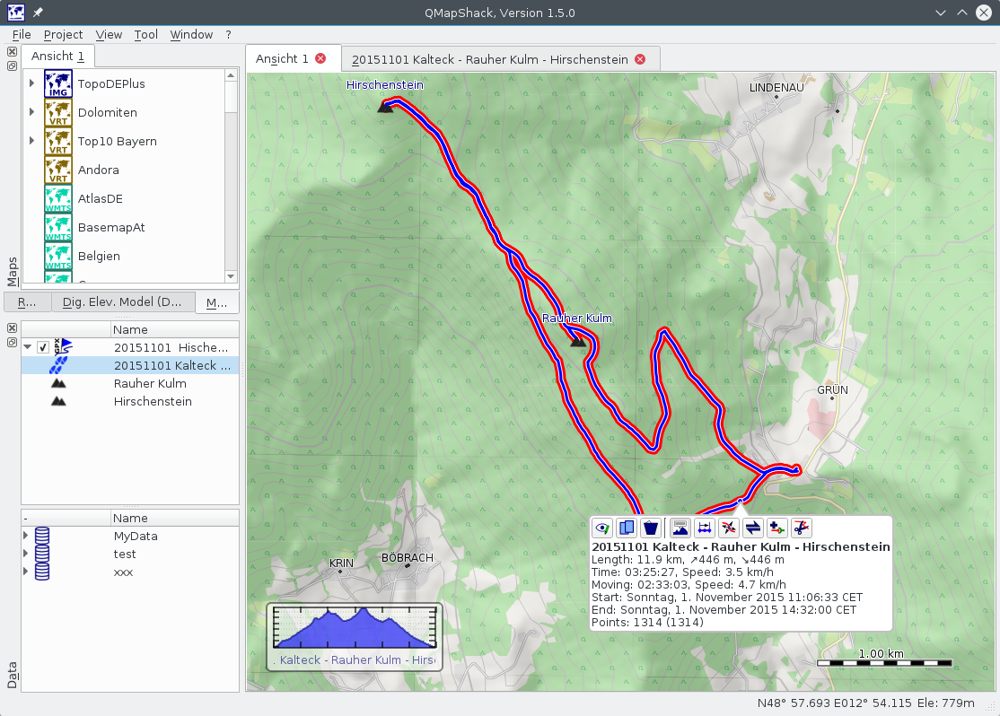

If you click on the track line in the map view you open a short on-screen-summary and a few options:

|   |   |   |
|---|---|---|
|   | Edit/Show Details | Show details of the track and edit data attached to the track. [More...](DocGisItemsTrk2#track-details-dialog)|
|          | Copy              | Copy the track into another project.  |
| 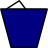    | Delete            | Delete the track. |
| 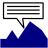   | Profile           | Highlight the track and show the on-screen track profile. The key combination "ctrl+e" will make the profile a sizable and movable widget. Use the same key combination to switch back.|
| 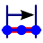  | Range             | Select a range of track points for information about that range and some additional functions (hide, show, activity, copy) |
|      | Edit              | Edit the line of the track by moving track points. See [Edit items with multiple points (tracks, routes, areas)](DocGisItemsEditMultiple) for details.|
| 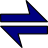      | Reverse           | Create a reversed copy of the track.|
| 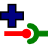      | Combine           | Combine this track with other tracks in the project |
| 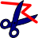       | Cut               | Cut the track at the selected point. You can use that to delete points at the start or the end of the track. Or to split a track into stages. |

## Track Details Dialog ##

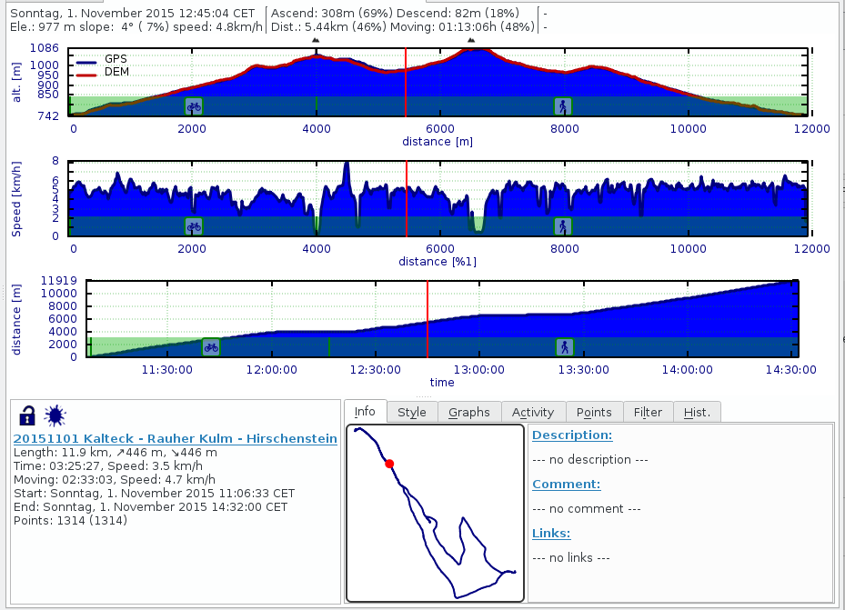

The dialog has 3 areas:

1) The graph area with up to three graphs. The profile graph on top is static and can't be changed. The other two graphs can display arbitrary track properties.

2) The track information area on the left bottom. It displays the same information as the on-screen summary. There are two icons:

   *  If he lock is closed the track is read only. To edit track data you have to press it.
   *  If the track has been imported and was changed it is considered tainted. If the ink spot is visible you know the track has been altered.

Note about displayed cumulative elevation gain :
As this value is derived from raw data, some filtering is necessary to avoid exaggerated results.
Because measured elevation often fluctuates even when GPSr is placed at a constant elevation, it would make no sense to take into account each measured bump.
It was decided in QMS to use a threshold of 5 meters : elevation is accumulated only if elevation grows more than 5 meters.

3) In the tab widget on the right bottom you will find more information about the track and various tools to edit the track data and how it is presented.

### Graph Area ###

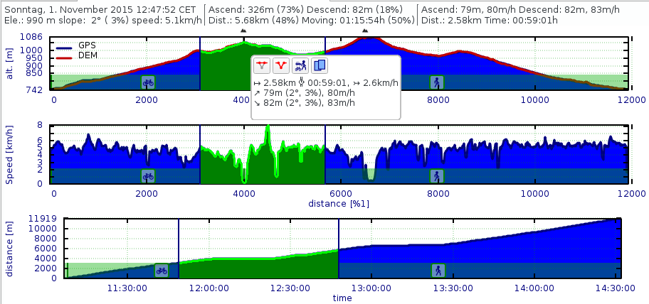

If you move the mouse over the graph area you will see some information about the current point in the text field on top. You can start a selection with a left click of your mouse. You define the end of the range by a second click. This will give you some additional information about the selected range and a few options to apply to the range.

|   |   |   |
|---|---|---|
|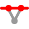|Hide| Hide the selected track points|
||Show| Show all track points between the first and last point of the selection |
|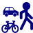|Activity| Mark the selected track points to be part of an activity to be selected|
||Copy| Copy selected track points as a new track|

Another left click on the graph will abort. Doing a right click on the graph will display a context menu:

|   |   |   |
|---|---|---|
||Reset zoom|You can zoom on the x-axis with your mouse wheel. This can be reset by this menu item|
||Abort selection| This is another way to stop the range selection|
||Save| Save the graph as image.|

### Info ###

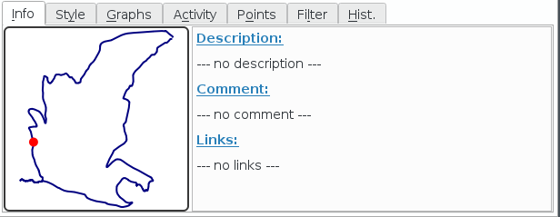

In the info tab you can see a small representation of your track. The red dot is the current position selected by the mouse on the graphs. You can edit the description and comment. Or add Web links. On some devices the link can be used to reference additional data.

### Style ###

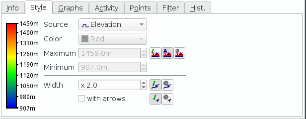

In the style tab you can setup how the track is drawn on the map. You can select the color of the track. This selection is portable to most of the applications/devices. Alternatively you can select a track point property to colorize the track. This selection will be saved with the track, but is not portable to any other application/device.

### Graphs ###

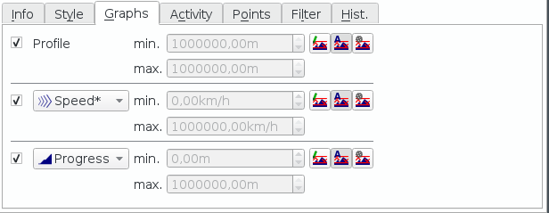

In the graph tab you can select how many graphs are displayed and what track point property to display. Graph 1 will always show the track's profile. 

### Activity ###

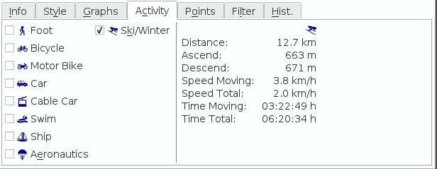

The idea behind the activities is to differentiate the track statistics of a track. On some recordings you might have used several different vehicles. This influences the average speed etc. By assigning activities you get statistics per activity. 

Usually you select an activity for the complete track by checking one of the activities in this tab. Next you use the mouse to select a range of the track and apply another activity to that range.

### Points ###

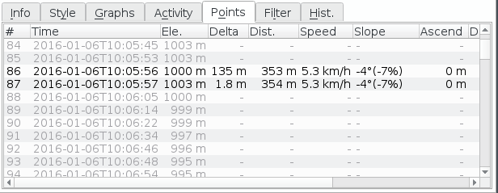

This is a simple table of recorded data with the most common properties. It's just informational and has no other function.

### Filter ###

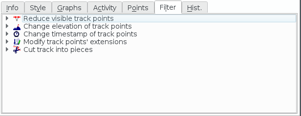

In the filter tab you can apply algorithms to alter the visibility, elevation and timestamps of your track. More [details on filters](DocGisItemsTrk2#track-filter) here

### History ###

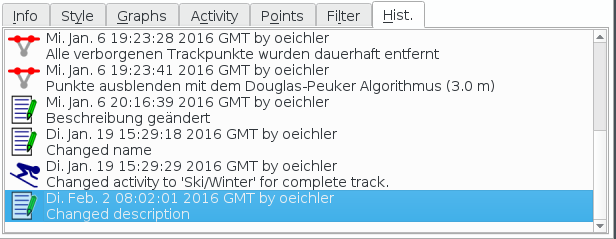

In the history tab you can see all changes applied to your track. You can revert the track data to a certain state by selecting the entry in the history. To cut the history at a selected state do a right click.

## Track Filter ##

Track filter are little macros that process on the track's data to enhance it. They are grouped by function. To apply a filter press the button with the gear. Most filter results can be reverted by the [history](DocGisItemsTrk2#history)

### Points ###

With these filters you can weed out bad points or reduce the number of track points without changing the overall appearance of your track.

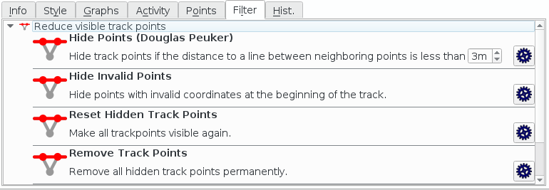

### Elevation ###

Elevation filter can smooth your profile, fix an offset or even add artificial elevation data from a file.

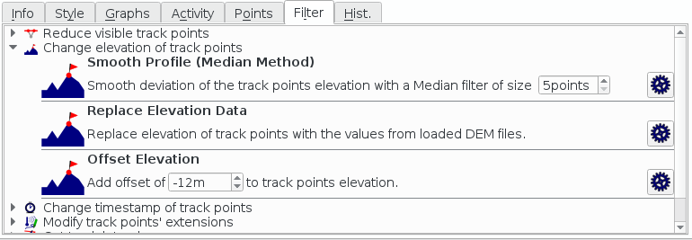

### Timestamps ###

You can obscure timestamps if you want to publish a track and keep as much privacy as possible. Add timestamps to your planned tracks.

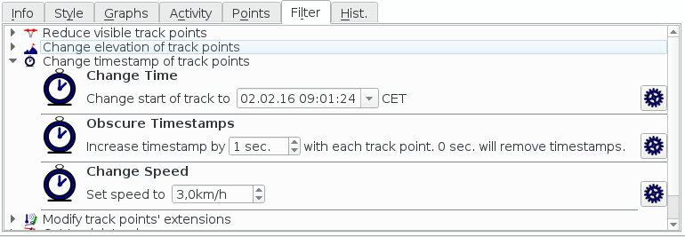

### Extensions ###

You can remove a track point extension e.g. your heart rate if you want to publish your tracks.

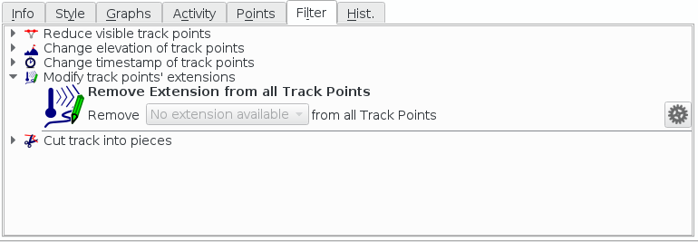

### Split Track ###

Cut a track into several tracks using its track segments.

Tracks consist of one or more track segments. Each track point belongs to a track segment. 

Sources of track segments can be
 
* tracks imported into QMapShack consisting of several track segments (e.g. in GPX files),
* track operations within QMapShack (e.g. combining several tracks into one).

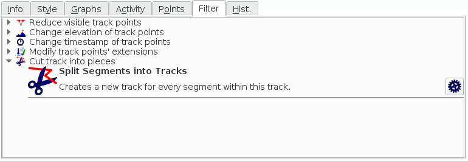

- - -
[Prev](DocGisItemsNew) (Create new tracks, waypoints etc.) | [Home](Home) | [Manual](DocMain) | [Index](AxAdvIndex) | [Top](#) | (Routes) [Next](DocGisItemsRte)
