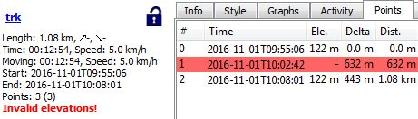
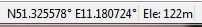
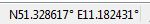
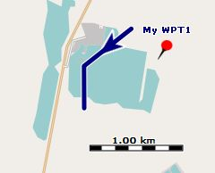
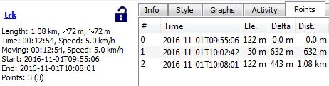

[Prev](DocGisItemsTrkGraphs) (Working with track graphs) | [Home](Home) | [Manual](DocMain) | [Index](AxAdvIndex) | (Track ranges) [Next](DocGisItemsTrkRange)
- - -

***Table of contents***

* [Track elevation data](#track-elevation-data)
    * [Manually edit elevation of a track point](#manually-edit-elevation-of-a-track-point)
    * [Assign elevation using DEM data](#assign-elevation-using-dem-data)
    * [Handle invalid elevation data](#handle-invalid-elevation-data)

* * * * * * * * * *
 
# Track elevation data

## Manually edit elevation of a track point

* open the [edit window][TrkEdit] of the track,
* ensure that track data can be edited (open lock in description part of edit window - if lock is closed, click it!)
* go to the _Points_ tab,
* find the track point to be edited,
* double-click in the elevation column,
* set the new elevation in the pop-up window.

## Assign elevation using DEM data

If tracks (or waypoints) don't have elevation data, this data can be easily assigned to selected tracks (and waypoints) as follows:

* Activate DEM data.
* Select tracks (and waypoints) in the QMS workspace window.
* Right-click on one of the selected items to open the context menu.
* Click `Replace elevation by DEM` to assign elevation data to the selected items.

## Handle invalid elevation data

Assume DEM (**D**igital **E**levation **M**odel) data is available in QMS for the area under consideration. Create
a track in this area. Then QMS adds automatically elevation data to the track that can be checked in the track profile and
in the trackpoint list of the track edit window.

It may happen that the trackpoint list shows a warning of the form __"Invalid elevations!"__ and some trackpoints do not have
an elevation assigned to them as can be seen in the following image (once a waypoint is marked as invalid don't look at
other elevation-dependent data - they are invalid, too!):

A similar situation can be noticed in the status line. If the mouse pointer is at a location in the map, then normally the
status line shows the coordinates of the location and its elevation:

In some cases the elevation can be missing in the status line:

The area (map) in which the track is located doesn't show anything special:

The reason for the missing elevation data is the source of the elevation data (in the example discussed
a file `N51E011.hgt`). Elevation data
is normally taken from satellite measurement (SRTM data) and this data may have gaps (elsewhere called voids), i.e. small areas without valid elevation
data. These gaps are marked in the HGT files as `NODATA` areas. If a trackpoint is located in such an area then QMS can't
assign an elevation to this trackpoint.

If there is an urgent need to avoid these missing elevation values, the user can select one of the following procedures:

* (_optimal procedure_) Try to find a source of DEM (SRTM) data with improved quality, i.e. with data where the
above mentioned gaps have been removed using various techniques. For Germany the
[opendem.info](https://opendem.info/download_srtm.html) server is such a source.
* Use the QMS __Reduce visible track points__ filter to __hide invalid track points__. Check if
the resulting changes of the track can be accepted. If so, use this filter again to finally __remove
invalid points__.

* Use the QMS __Change elevation of track points__ filter to __interpolate elevation data__. Check in the __preview__
if the resulting interpolated (smoothed) track profile can be accepted. If so, apply the filter.

* (_tedious procedure_) Manually edit elevation data with data taken from a different source (e.g. raster map
with elevation data).

* (_unreliable procedure_) If the area is rather flat then gaps in HGT files can be filled in with a default average elevation
value with the help of the `GDAL` package. On a command line 2 steps have to be executed:

    * Convert the `NODATA` value of the source file to the wanted average value (in the example 50m, use full paths!)

             gdalwarp N51E011.hgt -of VRT N51E0111.hgt -dstnodata 50

    * Unset the `NODATA` flag in the HGT file so that 100 is considered as a regular value.

             gdal_translate N51E0111.hgt -of VRT N51E01111.hgt -a_nodata none

    * Use the new HGT file (more precisely: its VRT file) in QMS

  The result of this procedure is shown in the following images:

  

[TrkEdit]: DocGisItemsTrk#view--edit-details "Track edit window"

- - -
[Prev](DocGisItemsTrkGraphs) (Working with track graphs) | [Home](Home) | [Manual](DocMain) | [Index](AxAdvIndex) | [Top](#) | (Track ranges) [Next](DocGisItemsTrkRange)
