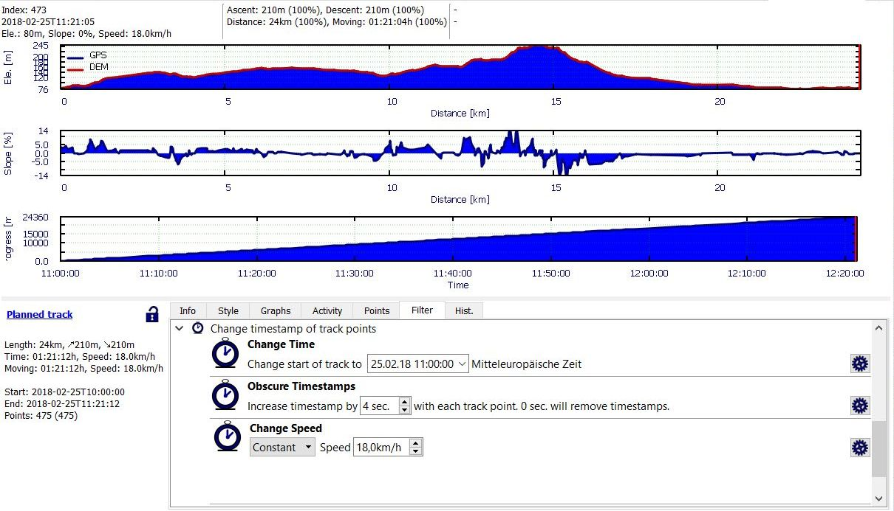
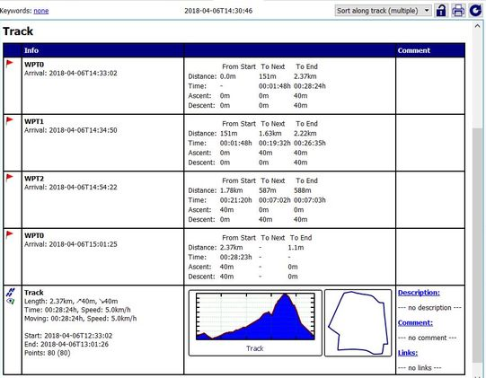

[Prev](DocGisItemsTrkRange) (Track ranges) | [Home](Home) | [Manual](DocMain) | [Index](AxAdvIndex) | (Routes and routing) [Next](DocGisItemsRte)
- - -

***Table of contents***

* [Track filters](#track-filters)
    * [Point filters](#point-filters)
        * [Douglas-Peuker filter](#douglas-peuker-filter)
        * [Zero speed drift knot filter](#zero-speed-drift-knot-filter)
    * [Elevation filters](#elevation-filters)
        * [Median filter](#median-filter)
        * [Interpolation filter](#interpolation-filter)
        * [Replace elevation data](#replace-elevation-data)
        * [Offset elevation](#offset-elevation)
    * [Timestamps filters](#timestamps-filters)
        * [Change time](#change-time)
        * [Obscure timestamps](#obscure-timestamps)
        * [Change speed](#change-speed)
            * [Constant](#constant)
            * [Cycling](#cycling)
            * [Hiking](#hiking)
    * [Miscellaneous filters](#miscellaneous-filters)
        * [Remove extension from all trackpoints](#remove-extension-from-all-trackpoints)
        * [Split segments into tracks](#split-segments-into-tracks)
        * [Convert track subpoints to points](#convert-track-subpoints-to-points)
        * [Calculate terrain slope](#calculate-terrain-slope)
        * [Change start point](#change-start-point)
        * [Cycling energy use](#cycling-energy-use)

* * * * * * * * * *
 
# Track filters

Track filters are tools to manipulate a track in a predefined way. QMS supports track filters for elevation,
timestamps, splitting of tracks and others.

To apply a track filter proceed as follows:

* Right click on the track name in the workspace
* Select the context menu entry `Edit...`

_or_

* Click on the track in a map window
* Click the `View details and edit properties of track` icon in the track info window that pops up.

_In both cases_

* Click on the `Filter` tab in the lower part of the edit window to see a list of available track filters.

To apply (run) a filter click the  icon at the right border of the filter. Most filter results can be reverted with the help of the [track history][History].

[History]:  DocGisItems#undo--redo  "Use of history list"

## Point filters

![Point filter][FilterPoints]

### Douglas-Peuker filter

This is a filter for reducing the number of trackpoints in a track. When moving on a straight line (road) the track recorded by a GPS device has typically trackpoints that are not on this straight line but slightly outside due to erratic behavior of the GPS receiver. The user can define a threshold in meters. When applying the Douglas-Peuker filter to a track, then all trackpoints with a distance from the straight line less than the threshold will be hidden. The upper part of the next image shows a recorded track with erratic deviations from a straight line. The blue track in the lower part of the image is the result of the application of the Douglas-Peuker filter to the original track.

### Zero speed drift knot filter

_(valid starting with QMS patch version e93a9deb03ff (Sun Dec 09 10:52:01 2018 +0000))_

Recorded tracks may include breaks, i.e. time intervals without motion. Typically, during the break erratic positions around the true position are recorded by the GPS device. This happens especially, if recording of trackpoints is carried out at a high rate (e.g. 1 trackpoint per second to have high precision of the track in a mountainous area with a lot of switchbacks). At a proper zoom level these points appear as a point cluster (a so-called _zero speed knot_). These erratic points influence track statistics (length, ascent, ...). The given filter identifies zero speed knots (in the following discussion simply called _knots_) and hides them. The filter has 2 parameters:

* A _distance_ parameter: a sequence of consecutive trackpoints is considered as a candidate for a knot, if each distance between 2 consecutive trackpoints in the sequence is less than this parameter.
* A _ratio_ parameter: having found a candidate for a knot its length (along the track) is compared with the (direct) distance between the start and the end point of the candidate sequence. If the length along the track is greater than the direct distance between start and end point multiplied by the ratio parameter, then the candidate is considered as a knot resulting from erratic GPS behavior. Otherwise, the length along the track is relatively close to the direct distance. Such a candidate can result from slow motion along a straight line (road) with erratic positions (compare the image in the previous section). Such a candidate can't be removed from the track.

The distance parameter describes the precision of the GPS receiver: The higher the receiver precision the smaller the distance parameter can be.

The default value of the ratio parameter is 2. The bigger this value the more knot candidates are considered as slow motion parts of the track.

The track in the upper part of the following image reveals at a proper zoom level a break. The position varies slightly in a certain time interval. Setting the distance parameter to 8m, the ratio parameter to 2 and applying this filter hides (removes) the erratic trackpoints during the break as shown in the lower part of the image (the hidden track part is still visible in gray color).

_Remark:_ When using this filter with inappropriate parameter settings it may happen that some part of the track is hidden although it is not related to a pause with erratic trackpoint behavior. Examples are small loops or roundabouts. Therefore, the user should compare carefully the original track with the filtered one to avoid loss of data. If necessary, you can undo the filter operation with the help of the history tab in the track edit window.

## Elevation filters

![Elevatuion filters][FilterElevation]

Track elevation filters can be found under the header `Change elevation of track points` in the filter tab.

QMapShack offers the following filters for track elevation:

* Smooth profile (Median method)
* Interpolate elevation data
* Replace elevation data
* Offset elevation

### Median filter

This is a filter for smoothing the elevation profile of a (recorded) track.

The user has to select a number of trackpoints (5, 7, or 9) as a parameter to the filter.

The new elevation of a trackpoint is the median of the elevations of the selected number of trackpoints
around the trackpoint. Assuming 5 points then 2 trackpoints before and 2 trackpoints after the given one
are selected, the 5 elevations are ordered and the middle one (the _median_) is used as new elevation.

A lower number of selected points results in a smoother elevation profile as can be seen in the following
images (showing the original profile and the results of the 5, 7, and 9 points filter).
A higher number of selected points results in an elevation profile closer to the original one.

This filter requires a sufficiently large number of trackpoints in the track under consideration,
otherwise it can't be used.

### Interpolation filter

This is a filter for smoothing the elevation profile of a (recorded) track.

The user has to select if he wants to apply a coarse, medium or fine filter.

The new elevation of a trackpoint is calculated from a cubic spline interpolation.

The smoothness of the elevation profile increases in the order _fine - medium - coarse_. The fine interpolation filter
results in an elevation profile closer to the original one than the elevation profile obtained from the coarse filter
as can be seen in the following images (showing the original profile and the results of the coarse, medium, and fine
filter).

This filter requires a sufficiently large number of trackpoints in the track under consideration,
otherwise it can't be used.

### Replace elevation data

This filter replaces the elevation data of the given track with elevation data taken from the DEM data loaded
into QMS. Each map view may have its own elevation data (or none at all). The combobox in the filter allows to select a map view from which elevation data is taken for the filter operation.

If a track doesn't have elevation data, then elevation data can be added to the track with the help of this filter.

### Offset elevation

A fixed value selected by the user is added to the elevation of each trackpoint.

## Timestamps filters

![Timestamp filters][FilterTimestamps]

Timestamp filters are used to assign timing to a track while planning the track.

Timestamp filters can be found under the header `Change timestamps of track points` in the filter tab.

QMapShack offers the following timestamp filters:

* Change time
* Obscure timestamps
* Change speed

### Change time

This filter requires a track with timestamps assigned to trackpoints.
It is used for shifting the timestamps of trackpoints so that the track starts at a user-defined timestamp. Insert the new date and time for the track start
into the edit field of this filter. Clicking the icon at the right end of the edit field opens a calendar widget where the necessary date can be selected.

_Remark:_ The time zone for the timestamp is the one of the operating system, in the example shown it is Central European Time (Mitteleuropäische Zeit). The time zone of the start time shown in the track summary may be different to the one used in the filter: that one is the time zone set in the menu `View - Setup time zone`, in the example shown it is UTC.

### Obscure timestamps

This filter is mainly used for recorded tracks with timestamps that should be published somewhere but not with real timing or even without timestamps at all.

To achieve this the time distance between 2 subsequent trackpoints is set to the constant value inserted in the edit field of the filter, thus obscuring the real timing. If this value is set to 0, then the timestamps are removed from the track.

### Change speed

(_valid starting with QMS 1.12.0_)

When applying this filter to a planned track, the timestamps of the trackpoints are calculated in such a way that the speed of the track matches the selected criterion.

The following criteria can be selected in the first combobox of this filter:

#### Constant

The timestamps of the track points are calculated so that the movement on the track takes place at a constant speed defined in the edit field of the filter.

    
#### Cycling

With this filter variant the speed at a track point depends on the track slope at the given trackpoint. This filter can be used to get more realistic information about the duration of a track. 

There are 4 predefined speed types (City, Trekking, Sportive, Mountain).

These types and 3 user-defined ones can be selected in the `Type` (the second) combobox of the filter.
    
The right part of the filter widget shows the settings used in the speed calculation for the selected speed type:  
    
* speed at zero slope (_plain speed_),
* _minimum speed_ at a given positive slope (minimal ascent speed),
* _maximum speed_ at a given negative slope (maximal descent speed).
    
The settings are read-only for the predefined types.
    
The calculated speed on the track is always between the given minimum and maximum values.
    

* If one of the user-defined types `Custom 0` - `Custom 2` is used, then the speed values as well as the slopes for which they are used can be selected by the user. Clicking the button `Set min./max. slopes from track` transfers the minimum and maximum slopes of the given track into their respective edit fields.
     
    
    
_Hint:_ Quite often, the elevation profile of a planned track is by various reasons considerably rugged. This implies, that the slope profile and the
    speed profiles derived from the elevation profile are rugged, too. To avoid this use the elevation filters `Smooth profile` and/or `Interpolate elevation data` to smooth the elevation profile before applying the speed filter.   
    
_Some background information about the filter:_
    
The filter has been designed mainly for bicycle tracks. Setting appropriate user-defined values it can be applied for other types of sport, too.
    
The basic ideas of the used filter algorithm are:
    
* to use the slope value of each trackpoint for the calculation of an individual speed value for each trackpoint,
* to use a base speed (_plain speed_) when moving on flat ground with a slope equal to zero,
* when moving uphill: decrease the speed from _plain speed_ down to a given _minimum speed_ which will be reached at a given _maximum slope_ (slope at minimum speed). In other words: Decrease the speed up to the minimum reached at the slope where you will get off the bike and push the bike by hand (keep the _minimum speed_ at trackpoints with slopes greater than _maximum slope_),
* when moving downhill: increase the speed from the _plain speed_ up to a given _maximum speed_ which will be reached at a given _minimum slope_ (slope at maximum speed). In other words: Increase the speed up to a maximum reached at the slope where you will take your brakes to be safe on the road (keep the _maximum speed_ at trackpoints with slopes lower than _minimum slope_),
* the calculation formula will use a quadratic approach instead of a linear one to get a more realistic calculation,

The implementation will calculate the speed depending on the slope in five scenarios for each trackpoint:

1. slope at trackpoint < 0 __AND__ slope at trackpoint < _minimum slope_ (downhill) ==> speed at trackpoint equals _maximum speed_,
1. slope at trackpoint < 0 __AND__ slope at trackpoint >= _minimum slope_ (downhill) ==> speed at trackpoint is calculated using quadratic approach,
1. slope equals 0 (plain level) ==> speed at trackpoint equals _plain speed_,
1. slope at trackpoint > 0 __AND__ slope at trackpoint <= _maximum slope_ (uphill) ==> speed at trackpoint is calculated using quadratic approach,
1. slope at trackpoint > 0 __AND__ slope at trackpoint > _maximum slope_ (uphill) ==> speed at trackpoint equals _minimum speed_.
    
_Notes:_
    
* In reality many other factors (like fitness of the cyclist, wind, sun, rain, road surface quality, etc.) will have great impact on the speed when cycling. This, of course, is not considered in the algorithm.
* In order to get proper results the _maximum speed_ has to be greater than the _plain speed_ and the _minimum speed_ has to be lower than the _plain speed_.

#### Hiking

This filter estimates the time needed to complete a hike with an algorithm that takes into account distance and accumulated slope, therefore the track must have valid elevation data. 

The algorithm is characterized by 3 values: 

* __Speed on zero slope__: your usual speed on flat terrain. (Km/h)
* __Ascending__: your usual elevation gain going uphill (m/h)
* __Descending__: your usual elevation loss going downhill (m/h)

The filter has four predefined profiles or speed types with usual values based on way types and how difficult is to walk:

| Type | Speed on flat | Ascending | Descending | 
|:----|:----|:----|:----|
|Road or Track| 5.5 Km/h| +600 m/h| -850 m/h|
|Path | 4.5 Km/h| +500 m/h| -700 m/h|
|Difficult Path | 3.6 Km/h| +400 m/h| -560 m/h|
|Off path or Rocks| 2.9 Km/h| +320 m/h| -450 m/h|

There are also three other user-defined types, for which you can define your own values. 

_Usage:_

* Select `Hiking` and set the `Type` that suits better for your track focusing in how difficult is to walk (not the slope). The right part of the filter widget shows the values used in the speed calculation. The settings are read-only for the predefined types. If one of the user-defined types `Custom 0` - `Custom 2` is selected, then the values can be edited by the user.

   

* Click on the gear button. Then the filter will use the given values to estimate the speed from one point to the next one taking into account the distance and slope between them. This way you can get a more realistic time data not only for the total track but also for each intermediate point.

_Hints:_

* Predefined types are suitable for mountaineers with reasonable fitness and under normal conditions.  If you have a very good fitness you might consider to shift one type up and probably it will suit for you. In the other hand, if you are hiking with a big group, with kids, or with a big backpack you might consider to shift one type down to get a more realistic estimation. Each predefined type is about a 20% slower than the precedent one.

*  When predefined types don't suit your needs you can take an user-defined one and set the values based on your own experience. QMapShack can also help you to know your usual values (if you don't know them yet):
    * Take a real track registered by yourself on a hike you know well and  Open the _Profile_ and _Progress over time_ graphs.
    * To get your values uphill select a representative range where the slope is over 25% and there is no gaps (stops) in the _Progress over time_ graph.
    * The pop-up will show the accumulated data for that range. In the second line you can read elevation gain, average slope, and ascending m/h
    * You can do the same for downhill and flat sections, and check some more well known tracks to get an idea about your usual values

* Once you have applied this filter you can also [set a starting time](#change-time). Then open the project properties tab (Right click on the project - Edit) and you will get a pretty project diary with detailed info about estimated time for all Waypoints on the track. Taking this in your head ( or in a paper) can help you to check and take right decisions at place. 

* The purpose of this filter is to evaluate and compare tracks for planning your outings. However, real life is complex and the filter cannot determine how many times and how long you will stop to take pictures or rest.  

_Some background information about the filter:_
   
*  The algorithm estimates one by one the speed and time from one point to the next one. It takes into account the distance and slope between them to use the values _Flat speed_, _Ascending_, or _Descending_  according to these criteria:
   

|| | |
|:----|:----|:----|
|__Steep Downhill__| up to -25%| _Descending_ value is applied|
|__Moderate Downhill__| from -25% to -5%| A combination of _Flat speed_ and _Descending_ values are applied according to a mathematical formula.|
|__Flat Terrain__| from -5% to 0%| Flat speed is applied|
|__Moderate Uphill__| from 0% to +20%| A combination of _Flat speed_ and _Asceding_ values are applied according to a mathematical formula.|
|__Steep Uphill__| more than +20%| _Ascending_ value is applied|

* The following graphs show an overview of the  predefined types:

## Miscellaneous filters

![Other filters][FilterOther]

### Remove extension from all trackpoints

Depending on their source trackpoints may have different sets of properties.
This makes it possible to add fitness data to trackpoints. These additional properties are saved as extensions
in a GPX file.

This filter displays for a given track a list of available extensions (properties). Applying the filter
removes the selected extension (temperature, heart rate, recorded speed, ...) from the trackpoint data.

### Split segments into tracks

This filter can be seen as the reverse operation to combining (joining) of tracks.

Each track consists of at least one track segment.
When combining tracks, the track segments of all tracks involved are copied in the selected order into the new track.
Thus, combining several tracks leads to tracks with several segments.

When applying the given filter to a track, then each track segment is converted to a separate track. The project
in which the new tracks are saved can be defined by the user. The new tracks get the name of the original track
with a _(segment xx)_ suffix.

### Convert track subpoints to points

(_valid starting with QMS patch version 7ac34c818ec1/2016-12-06_)

When creating a track, the user creates with the help of mouse clicks (ordinary) trackpoints. Depending on the selected
[routing method](DocGisItemsRouting#description-of-routing-methods-in-qmapshack)
additional trackpoints are being added automatically by the routing algorithm. These additional trackpoints are
called _subpoints_.

Ordinary trackpoints (marked with a big black square when editing a track) can be moved to a new location or deleted
while editing the track.

Subpoints (marked with a small black square when editing a track) can't be edited. They are adjusted automatically
if a neighboring ordinary trackpoint has changed.

The given track filter converts each subpoint to an ordinary trackpoint.

### Calculate terrain slope

(_valid starting with QMS patch version a735e8ee30c8/2017-06-29_)

Calculate slope of the terrain based on loaded DEM data for the trackpoints of the track under consideration.

The terrain slope of a track (if assigned with this filter) can be visualized with the help of a graph in the track edit window (select 
`Terrain slope` in one of the listboxes in the `Graphs` tab of the edit window). It is also displayed in tooltip windows at trackpoints.

When saving the track (more precisely the project of the track) into a GPX file, the terrain slope appears in a special trackpoint extension.

_Attention:_ The _terrain slope_ depends only on the geographical location and the DEM (elevation) data, whereas the _slope_ (also denoted by _slope*_)
is calculated from the position and elevation data of a track!

### Change start point

(_valid starting with QMS commit 8ddec3217899 (Wed Apr 04 17:38:39 2018 +0200)_)

Assume you have a track that is a round-trip (start point equals end point). This filter allows to change the start of the track to a different trackpoint. When doing so, the start time and the speed on the track won't be changed.

To use this filter proceed as follows:

* Define a new waypoint on the track as new start point. The new waypoint should be saved in the project used for the track. It should be close to the track so that it is seen as [attached waypoint](DocGisItemsTrk#attach-waypoints-to-a-track-to-get-additional-track-information) (distance < 50m from the track). 

    The next image shows a round-trip track with its original start point (WPT0) and 2 attached waypoints on the track (WPT1, WPT2). To check, if the new start point is attached to the track, use the project diary (the project edit window). 

     

* Open the track edit window with a right click on the track name in the workspace (select `Edit`).

    
    
* Click the `Filter` tab and open the `Miscellaneous` part of the filters.
* The `Change start point` filter displays in a combobox those waypoints that can be used as new start points. Select one of them (WPT2 in the example) and start the filter (click the wheel icon at the right).
* The start of the track is moved to the selected waypoint (track point). The start time and the speed on the track are not changed. The example shows the new track with start point WPT2

    
 
* Use the `History` tab of the track edit window to undo the filter operation.

### Cycling energy use

This filter is slightly different from the other track filters. Instead of modifying a recorded cycling track it calculates the energy use for the cycling tour taking into account various parameters.

To calculate the energy use for a recorded cycling track open the track edit window and then click the filter icon  in the lower right corner of the track summary. A window pops-up where the user can set all necessary parameters:

After setting the parameters properly (some default values are shown after opening the window) the right part of the pop-up window displays various information on which the energy use is based and, finally, in the lower right part the used energy is shown with the units `kJ`(oule) and `kcal`.

Clicking on the question mark in the header line of the window opens a help window giving some insight in the procedure used for calculating the energy use.

[FilterPoints]:     images/DocGisItemsTrk/FilterPoints.jpg     "Point filters"
[FilterElevation]:  images/DocGisItemsTrk/FilterElevation.jpg  "Elevation filters"
[FilterTimestamps]: images/DocGisItemsTrk/FilterTimestamps.jpg "Timestamp filters"
[FilterOther]:      images/DocGisItemsTrk/FilterOther.jpg      "Other filters"

- - -
[Prev](DocGisItemsTrkRange) (Track ranges) | [Home](Home) | [Manual](DocMain) | [Index](AxAdvIndex) | [Top](#) | (Routes and routing) [Next](DocGisItemsRte)
