[Prev](DocGisItemsTrk) (Tracks) | [Home](Home) | [Manual](DocMain) | [Index](AxAdvIndex) | (Working with track graphs) [Next](DocGisItemsTrkGraphs)
- - -

***Table of contents***

* [Track information](#track-information)
    * [Track states](#track-states)
    * [Trackpoint information for highlighted tracks](#trackpoint-information-for-highlighted-tracks)
        * [Overview](#overview)
        * [Adding trackpoint information](#adding-trackpoint-information)
        * [Get additional track information in highlighted state](#get-additional-track-information-in-highlighted-state)
        * [Select display of track information in main menu](#select-display-of-track-information-in-main-menu)
    * [Additional sources of track information](#additional-sources-of-track-information)
        * [Track information in normal state](#track-information-in-normal-state)
            * [Using the workspace window](#using-the-workspace-window)
            * [Using the track edit/info window](#using-the-track-editinfo-window)
        * [Track information in selected state](#track-information-in-selected-state)

* * * * * * * * * *
 
# Track information

The focus of this page is on track information that can be found in a map view. For more information compare also the ["General information about tracks"](DocGisItemsTrk) and ["General project actions"](AdvProjActions#user-content-working-with-project-roadbook) pages.

## Track states

A single track shown in a map view can be in 3 different states:

*State*                                |*Layout*                                 | *How to get to state* | *How to get back to default state* |
---------------------------------------|-------------------|----------------|-------|
 **Default (normal):** borderless line | 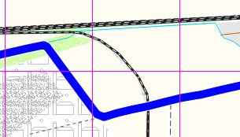  | single left-click in track-free part of map window to remove selected state, double left-click to remove highlighted state| - |
 **Selected:** opaque red border       | 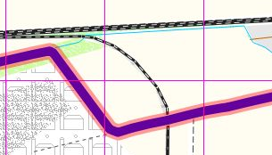    | left-click on track in workspace or in map view |  single left-click in track-free part of map window |
 **Highlighted:** red border           | 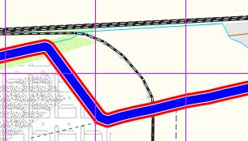 | double-click on track in workspace window _or_ click on track in a map view window and then click the track information icon  in the toolbar. **Remark:** If the red border is missing, then click the main menu entry `View - Track Info - Track highlight` to activate it!  | double left-click in track-free part of map window |

Only one track can be in the selected resp. highlighted state.

The available track information depends heavily on the correct selection of the track state.

_Remark:_ When moving the mouse pointer on a track in a map view, then the track gets already an opaque red border. This does not yet indicate a state change. To change the state a left-click must be done first.

## Trackpoint information for highlighted tracks

### Overview

**NOTE**: This section is about a _highlighted_ track. To highlight a track double-click on it in the workspace or use the track information icon  of the track options toolbar of a map view. You can select what features are shown for a highlighted track in the [main menu](#user-content-select-display-of-track-information-in-main-menu) `View- Track Info`. 

Here is a screenshot with all features enabled:

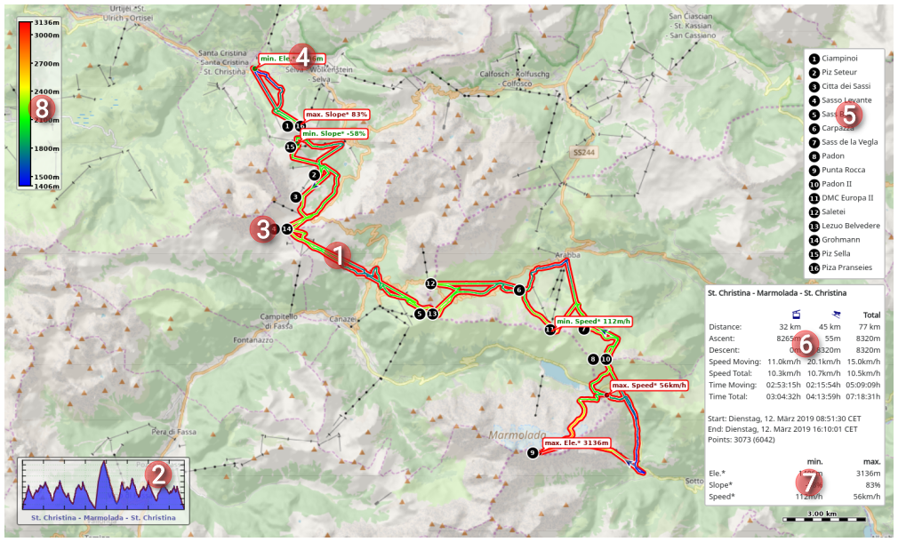 

The numbers mark the different features that can be selected.

1. This is the highlighted track itself. It has a solid red border to mark it as highlighted. This is useful  for every days work but you might prefer a borderless track when you create screenshots to document your track. You can toggle the red border with the main menu entry `View - Track Info - Track Highlight` or with the main toolbar icon .

1. For a highlighted track the track profile can be shown. You can toggle visibility of the track profile with the `View - Track Info - Track Profile` main menu entry or with the main toolbar icon . The profile has two modes: the on-screen mode as shown in the screenshot and the window mode. You can switch between these modes with `CTRL-E`, with the menu entry `View - Track Info - Track Profile as Window` or with the main toolbar icon .
 
      If you click on the on-screen profile you will jump directly into the edit/details dialog of the track. 
    
      If you need to see more details in the profile graph you switch to the window version (_CTRL-E_) and adjust the window size to your liking. 

1. These are trackpoints with additional text information. They are marked with auto-numbered black bullets. You can create such points by two methods:

     * Click on the track and the track options menu will open at the clicked point. Select the toolbar button  to open a dialog where you can enter a short text. 
     * Right-click on a profile plot (either the on-screen one, the one in a separate window or the one in the track edit/details dialog and select the `Add Trackpoint Info` menu entry to open a dialog where you can enter a short text.

     You can toggle visibility of the bullets with the `View - Track Info - Trackpoint Info` main menu entry or with the main toolbar icon .

     More details about trackpoint information can be found in section [Adding trackpoint information](#user-content-adding-trackpoint-information).
    
1. These are labels for the minimum and maximum values of track properties like elevation, speed, etc. You can toggle visibility with the `View - Track Info - Min./Max. Labels` main menu entry, via keyboard hotkey `CTRL-N`, or with the main toolbar icon .

1. This is a list of all trackpoints with additional text (some kind of legend). You can toggle visibility with the `View - Track Info - Trackpoint Info Table` main menu entry or with the main toolbar icon .

1. The track summary. You will get the same as tool tip for the track in the workspace list or in the edit/details dialog. You can toggle visibility with the `View - Track Info - Track Summary` main menu entry or with the main toolbar icon .

1. The summary of the minimum and maximum values of the track properties like elevation, speed, etc. You can toggle visibility with the `View - Track Info - Min./Max. Summary` main menu entry or with the main toolbar icon .

1. The color bar for track coloring. The color bar has to be enabled in the track's edit/details dialog. Use the track options toolbar icon  to open this dialog. Select the `Style` tab in the edit window and select one of the track properties as source, e.g. elevation or slope. 
user-content-select-display-of-track-information-in-main-menu) for a list of all menu entries described in this section.

__Remark:__ Access to the actions in the main toolbar requires a proper configuration of the toolbar with the help of the menu entry `Window - Setup toolbar` (activate the necessary icons).

If you want to have the complete view with the selected track information as a screenshot you can select it with the main menu entry `File - Take Screenshot` or with the main toolbar icon . The result will depend on the selected mode for the profile plot. If the profile is shown in a separate window, then a large profile will be appended to the screenshot.

 Screenshot with on-screen profile | Screenshot with profile in separate window |
 ---- | ---- |
 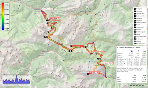 | 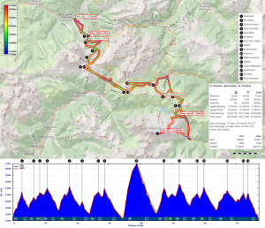 |
 
Section [Get additional track information in highlighted state](#user-content-get-additional-track-information-in-highlighted-state) describes some more information that can be obtained from a track.

### Adding trackpoint information

Short descriptions can be added to points of a track (this information is saved in the trackpoint description field and not in a waypoint!). 

To do this proceed as follows:

* Ensure that the track is in normal state.
* Click on the trackpoint in the map view to which a description should be added.
* Click on the `Add description` icon in the new toolbar and add the description in the pop-up window.

    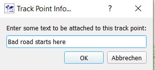

* Close this pop-up window.

Trackpoints with added description are displayed with a numbered black bullet in a map window:

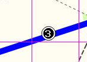

They are also shown in the elevation graph of the track edit window.

The numbers of the bullets have the same order as the trackpoints (not the order of definition!). 

_Remarks:_ 

* Trackpoint descriptions can be added also using the context menu of a graph in the track edit window.
* If the bullets are missing in the map view or the track edit window, then click the main menu entry `View -Track info - Trackpoint info`.
* Trackpoints with description are shown also in the [roadbook of the project](AdvProjActions#user-content-working-with-project-roadbook) to which the track belongs. They are not [(attached) waypoints](DocGisItemsTrk#user-content-attach-waypoints-to-a-track-to-get-additional-track-information)!
* Never add a description to a trackpoint that has the same location as a waypoint!
 

### Get additional track information in highlighted state

* If some track is in highlighted state: left-click in track-free part of the map view to get the normal state.
         
* If track is in normal state: double-click on the track name in the workspace window. The map view is zoomed so that the complete track is displayed in the map view window.
* Move the mouse pointer on the track
* An info window pops up that shows information about the closest trackpoint:
    * Distance run from start and distance remaining to the end of the track
    * Time run from start and remaining time to the end of the track
    * Index of the trackpoint
    * Time at the trackpoint
    * Elevation, slope, speed and fitness data at the trackpoint
* If a track elevation graph is displayed, then a red slider shows the elevation at the selected location in the graph.    
        
    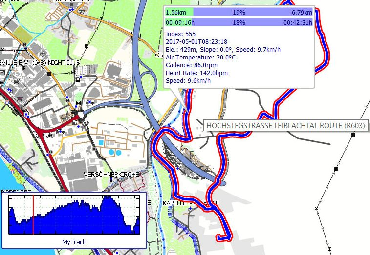
       
* With a left-click on the track the summary information described in section [Track information in selected state](#user-content-track-information-in-selected-state) is displayed.

If the track was not recorded by a GPS device, then some of this information can be missing.

### Select display of track information in main menu

Additional track information (mainly summary information) can be displayed in a map view for a highlighted track with the help of the submenu of the menu entry `View - Track info `.

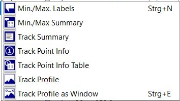

Most of the entries are toggles. Their meanings are the following:

*Submenu entry*                                |*Meaning*                         |        
---------------------------------------|-----------------------------------------|
Min./Max.Labels | Show locations on the track where some data field of the trackpoint reaches its minimum or maximum |
Min./Max.Summary | Show global minimum resp. maximum values of trackpoint data fields in track summary |
Track summary | Show track summary in map view with items selected in given submenu |
Trackpoint info | Show numbered bullets on track for trackpoints with additional descriptions |
Trackpoint info table | Show list of all trackpoint descriptions (requires that menu entry `Trackpoint info` is selected) |
Track profile | Show track profile in map view |
Track profile as window | Show track profile in separate window (requires that menu entry `Track profile` is selected) |

Here is again a snapshot of an almost complete track summary for a track with activity assignment:

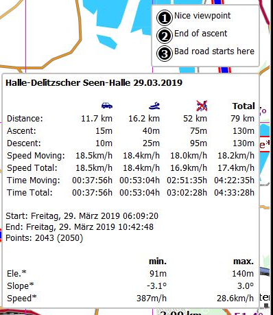
       
      
## Additional sources of track information
      
There are more ways to get information about a track. Some of these are described in this section.      
      
### Track information in normal state

#### Using the workspace window
* Move mouse on the name of a track
* An info window pops up. This window gives summary information about the track:
    * Track name
    * Length
    * Total ascent/descent
    * Total and moving time
    * Total and moving average speed
    * Start and end time
    * Number of visible and total trackpoints in the track

    Some of this information can be missing, if the track was not recorded by a GPS device.
  
    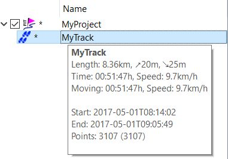

#### Using the track edit/info window
* Open the track edit window with a right-click on the track name in the workspace window and select the `Edit...`
  menu entry in the context menu.
* In the graphs tab select with the help of comboboxes up to 3 track properties (speed, slope, elevation, fitness data, ...) to be displayed as graphs.
  
    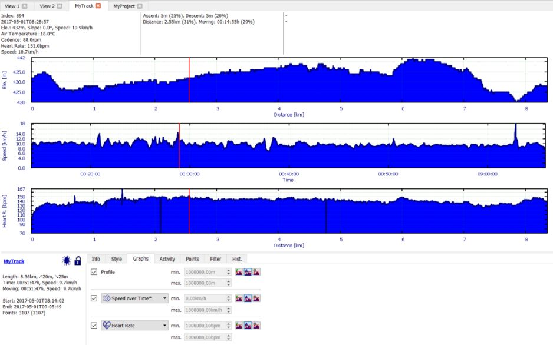
 
* _Description of information:_
    * Data in the lower left corner of the window are totals for the whole track (the same data as in the workspace window).
    * A red vertical slider can be moved over the graphs.
    * The information given in the upper part of the window is track data for the location resp. time selected with the slider
      (horizontal graph axes show either the distance from the start of the track or the time). The data shown for ascent, descent, distance, and moving are 
      totals from the start of the track up to the selected location/time.

* If trackpoint information has been added to some trackpoints, then the rightmost part of the `Info` tab in the lower part of the track info window shows a list of all trackpoint descriptions (if the list is missing, then click the main menu entry `View -Track info - Trackpoint info`):

    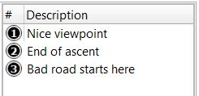
    
    Right-click on a description in this window and use the context menu to edit or delete a description.

* In the `Style` tab of the track edit window the user can select one of the track properties (speed, slope, elevation, fitness data, ...) to be used for coloring the track.

    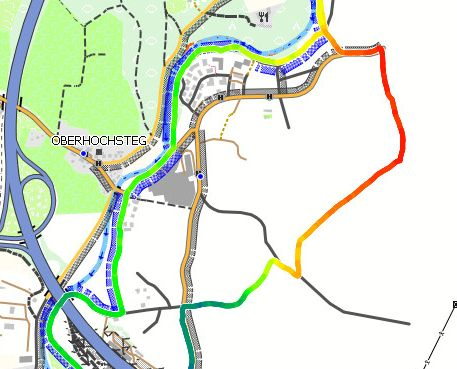
       
* Selecting the menu entry `View - Track info - Min./Max. Labels` or pressing `CTRL-N` (toggle!) adds bubble boxes to the track showing the locations and the minimal resp. maximal values of the available track data fields.
      
    _Hint:_ Use this feature with an as small as possible number of tracks in the workspace. Otherwise, the map view gets cluttered with too many infoboxes.
      
    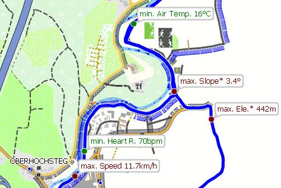

    
### Track information in selected state

* If track is in highlighted state: left-click in track-free part of the map view to get the normal state.

* If track is in normal state: left-click on the track in the map view to select it.

* Assume, activities are not assigned to the track. An info window pops up that shows the same info as shown in the workspace window.

    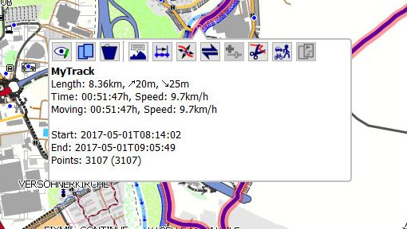
       
    If activities have been assigned to the track, then the information is grouped by activity type:
        
    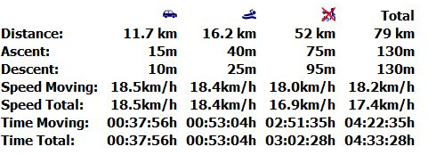
        
    With the help of the icons shown in this info window the user can carry out various [actions](DocGisItemsTrk#user-content-view--edit-details) with the track.
       
       
       
- - -
[Prev](DocGisItemsTrk) (Tracks) | [Home](Home) | [Manual](DocMain) | [Index](AxAdvIndex) | [Top](#) | (Working with track graphs) [Next](DocGisItemsTrkGraphs)
