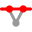
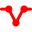
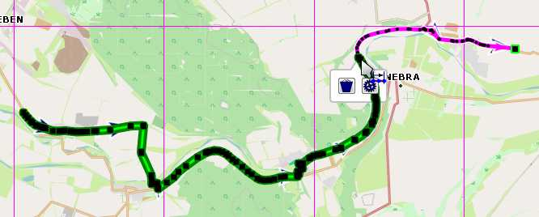
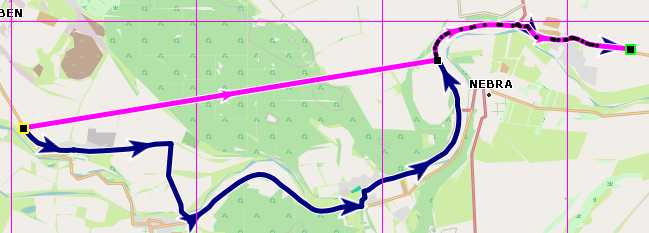
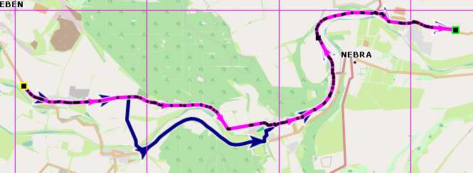
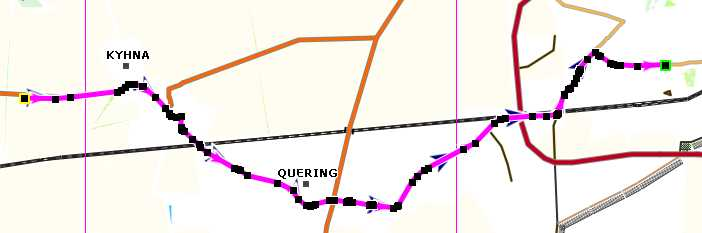
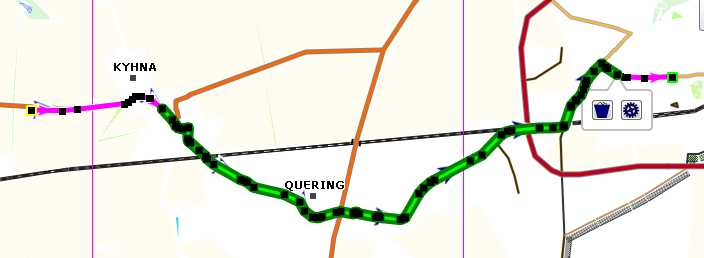
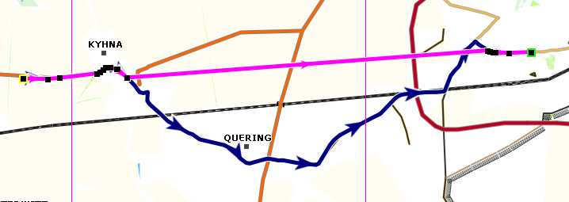
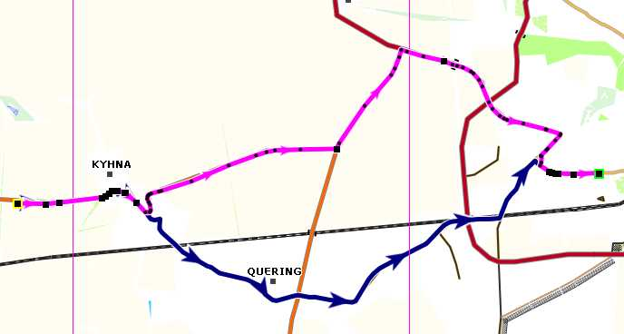

[Prev](DocGisItemsTrkElevation) (Editing elevation data) | [Home](Home) | [Manual](DocMain) | [Index](AxAdvIndex) | (Track filters) [Next](DocGisItemsTrkFilters)
- - -

***Table of contents***

* [Track ranges](#track-ranges)
    * [Select track range in map view](#select-track-range-in-map-view)
    * [Select track range in edit window](#select-track-range-in-edit-window)
    * [Actions for a track range](#actions-for-a-track-range)
        * [Hide or show trackpoints in range](#hide-or-show-trackpoints-in-range)
        * [Assign activity to range](#assign-activity-to-range)
        * [Copy or delete trackpoints in range](#copy-or-delete-trackpoints-in-range)
    * [Select a range of a track in edit mode](#select-a-range-of-a-track-in-edit-mode)
        * [Move track range to new location](#move-track-range-to-new-location)

* * * * * * * * * *

# Track ranges

A track range is a connected part of a track between 2 trackpoints. With a track range the following actions can be performed:

* Hide or show trackpoints in the range.
* Assign activity to the range.
* Copy or delete trackpoints in the range.

A track range can be selected either in a map view or in the edit window of the track. __Attention:__ When selecting a range in one location all handling of this range __must__ be done at this location! Otherwise, a prohibition sign ![Not possible][NotPossible] in a new location will indicate that nothing can be done with the range at the new location.

## Select track range in map view

(Recommended, if precise and quick position of range is essential. This is the most versatile range selection tool.)

* Display the track in a map window (double-click on track in workspace).
* Click with the left mouse button on the track and release the mouse button. An infobox pops up. 

    ![RangeIcon.jpg][RngIco]

    Choose the "_Select a range of points_" icon ![Range selection][RngSel0] in the toolbar. 

    The mouse cursor changes to the range selection icon and the range tool window pops-up which supports the selection of the track range and which allows to perform the required range actions. The range tool window offers again a toolbar. Move the mouse on one of the icons to see a bubble box explaining the meaning of the icon. The left part of the toolbar is for range actions, the right part can be used to select precisely the wanted range.

    ![RangeTool.jpg][RngTool]
    
    The meaning of the toolbar icons is as follows:
    
    | Icon  | Meaning   |
    |-------|-----------|
|   | Hide selected trackpoints. |
|   | Show selected trackpoints. |
|   | Select activity for selected range. |
|   | Copy selected trackpoints. |
|   | Delete selected trackpoints. |
|   | Setup range tool behavior. |
|   | Move start of range toward start of track. If you keep the key pressed the action is repeated.  |
|   | Move start of range toward end of track. If you keep the key pressed the action is repeated.  |
|   | Start a new range right at the end of the selected range. |
|   | Reset selected range. |
|   | Start a new range right at the start of the selected range. |
|   | Move end of range toward start of track. If you keep the key pressed the action is repeated.  |
|   | Move end of range toward end of track. If you keep the key pressed the action is repeated.  |

  

* Click with the left mouse button at the location of the start of the range to be selected in the track and release the mouse button. The clicked trackpoint is shown as a green circle.
* Move the mouse to the location of the end of the range to be selected.
* Left-click at the end of the range.
* If the end of the range is not in the map view: left-click on the map and __don't release__ the mouse button.
    * The map is attached to the mouse.
    * Move the map to the wanted location and release the mouse button.
    * The map is fixed again.
    * Move the mouse to the wanted end of the range and left-click.
* Use the arrow icons ![Move start of range towards start of track][RngSt2St],  ![Move start of range towards end of track][RngSt2End], ![Move end of range towards start of track][RngEnd2St], ![Move end of range towards end of track][RngEnd2End] in the right part of the toolbar to refine the selection.   

    _Remarks:_
    
    * Use the first 2 icons to move the start of the range trackpoint by trackpoint either to the start or to the end of the track.
    * Use the last 2 icons to move the end of the range trackpoint by trackpoint either to the start or to the end of the track.
    * Keeping the key pressed on an icon repeats the operation.
    * The trackpoint list at the bottom of the range tool gives the location of the point moved and its datetime (if available).

* Before taking any action in the range tool it is recommended to check the setup of the tool by clicking the wheel icon ![Range setup icon][RngSetup] in the middle of the toolbar.

    In the upper part of the setup window a matrix can be used to define what happens with the selected range after performing an action. A checkbox at the bottom of the setup window is used to define the map behavior when selecting a range. If the checkbox is selected then the map is centered always on the last range point selected. Otherwise, it isn't moved.

    ![Range Setup][RngSettings]

* Select the necessary action for the range operation from the left part of the range window toolbar.
* Stop the range handling with a right-click in the map window. The mouse cursor returns to its default icon.
* Use the track history in the track edit window to undo any range action on the track.
* If no trackpoint is selected for a range, then part of the icons in the toolbar can be inactive (gray) and the list of trackpoints can be empty. As soon as a range is selected all icons are active again and the list of trackpoints highlights the last range point selected.

[NotPossible]: images/DocAdv/NotPossible.png     "Not possible"
[RngIco]:      images/DocAdv/RangeIcon.jpg       "Range icon in track toolbar"
[RngTool]:     images/DocAdv/RangeTool.jpg       "Range tool"
[RngSettings]: images/DocAdv/RangeToolSetup.jpg  "Range tool setup"
[RngSel0]:      images/icons/SelectRange.png       "Range selection icon"

[RngSt2St]:    images/icons/SelectStartNextPoint.png   "Move start of range towards start of track"
[RngSt2End]:   images/icons/SelectStartPrevPoint.png   "Move start of range towards end of track "
[RngNewS]:     images/icons/SelectStartPoint.png       "Start a new range at the start of the range"
[RngNewE]:     images/icons/SelectEndPoint.png         "Start a new range at the end of the range"
[RngEnd2St]:   images/icons/SelectEndPrevPoint.png     "Move end of range towards start of track"
[RngEnd2End]:  images/icons/SelectEndNextPoint.png     "Start a new range at the end of the range"
  
[RngCopy]:     images/icons/Copy.png                   "Copy range"
[RngDel]:      images/icons/DeleteOne.png              "Delete range"
[RngAct]:      images/icons/Activity.png               "Select activity"
[RngHide]:     images/icons/PointHide.png              "Hide range"
[RngShow]:     images/icons/PointShow.png              "Show hidden points"
[RngSetup]:    images/icons/Apply.png                  "Range tool setup"

## Select track range in edit window

(Recommended, if one of the track graphs should be used for range selection)

* Open the edit window of the track either from the track context menu in the workspace (use menu entry `Edit`) or with a left-click on the track in a map view and then a click of the `Edit` icon (the first track toolbar icon).

* Click with the left mouse button at the location of the start of the range to be selected in one of the track graphs and release the mouse button. A vertical red line jumps to the location of the nearest trackpoint of the track.
* Move the mouse __in the same graph__ to the location of the end of the range to be selected and click with the left mouse button. _Warning:_ If a prohibition sign ![Not possible][NotPossible] pops up at the location of the mouse pointer, then the mouse was moved out of the graph used for the first click!

In both cases the selected range will be highlighted in green color in the graph and the required action for the trackpoint range
can be selected from the infobox that pops up. This infobox shows also some summary information about the range.

__Attention:__ The range of the track selected in the edit window is also shown with green color on the track in a map window but range handling can be done exclusively in the graph where the range has been selected and not in the map window!

![Range actions menu][RngGraph]

Select the action to perform with the track range from this info window.

[RngGraph]: images/DocAdv/RangeInGraph.jpg "Range actions menu"

To finish the range selection click the menu entry `Reset range` in the context menu of the used graph.

## Actions for a track range
### Hide or show trackpoints in range

* Clicking the hide trackpoints icon ![Hide range][RngHide] replaces the part of the track between start and end of the range by a straight line. The hidden part of the track is shown as a gray track while in range selection mode. Hidden trackpoints are shown with gray color in the trackpoint list.

    ![Hidden trackpoints][RngHidden]

    If part of the track is hidden, then this can be seen in the track infobox when moving the mouse pointer on the track
in a map window as shown in the following image:

    ![Hidden trackpoints in track info][RngHiddenInfo]

    Here, the index of the trackpoint shows a value for the visible and another one for the total amount of trackpoints. This means, that some part of the track in front of the selected trackpoint is hidden.
 
* To show hidden trackpoints again
    * select again a range including those hidden trackpoints that has be to be shown again (range selection follows the gray line!),
    * click the show selected trackpoints icon ![Show hidden points][RngShow]. The hidden and gray part is shown again as part of the original track.

### Assign activity to range

Clicking the activity selection icon ![Select activity][RngAct] opens a list from which an activity can be selected and assigned to the range.

Especially for this action, the 2 start new range icons ![Start a new range at the end of the range][RngNewE], ![Start a new range at the start of the range][RngNewS] are helpful. Using them, the user can select a successor or a predecessor range and assign activities to these ranges. 

### Copy or delete trackpoints in range

* Clicking the copy icon ![Copy range][RngCopy] copies the selected part of the track to a new track. The user can define the name of the new track and can attach the new track to an existing or new project in the workspace.
* Clicking the delete icon ![Delete range][RngDel] deletes all trackpoints in the range with the exception of the first and the last one from the track. The first and the the last point in the range are joined by a straight line.

[RngHidden]:     images/DocAdv/HideTrkPts.jpg "Hidden trackpoints"
[RngHiddenInfo]: images/DocAdv/TrkPtInfo.jpg "Hidden trackpoints in track info"

## Select a range of a track in edit mode

This form of range selection can be used if the track is in the edit mode. It is different from the one described in the
previous subsection. _Remember when working in edit mode:_ The edit mode is intended to modify trackpoints.
Subpoints are - in contrast to
ordinary trackpoints - not designed to be modified manually.

This track range selection mode is useful when refining planned tracks.

* Display the track in a map window.
* Click with the left mouse button on the track and release the mouse button.
  An infobox pops up. Choose the "_Edit position of trackpoints_" icon in this
  infobox. This starts the track edit mode. The mouse cursor changes to the edit position icon.
* In the toolbar that appears at the top of the map window click the "_Select a range of points_" icon.
  The mouse cursor changes to the range selection icon.
* Click with the left mouse button at an ordinary  trackpoint (big black square changed to red square if mouse is moved on it,
  not a subpoint with small black square!)
  as the start of the range to be selected in the track and release the mouse button.
* Move the mouse in the direction of the track. The color of the selected track range is changed to green.
  Left-click at the end of the wanted range.

    

* An info window with 2 icons pops-up:
    * _Delete all points between first and last one_: If icon is active: The selected range of the track is
      replaced with a straight line segment between the first and the last ordinary trackpoint in the range.

        

    * _Calculate a route between the first and last selected point_: Use the selected routing engine with the selected options
      and recalculate the track between the first and the last point of the track range. _Hint:_ If in a previous step
      one of the ordinary trackpoints had been deleted, then this does not re-establish the original track!

        

### Move track range to new location

The user can quickly move part of a track to a new location using a range of the track in edit mode. Proceed as
described below:

* Click the `Edit...` context menu of the track.
* Go to the `Filter - Miscellaneous - Convert subpoint to points` filter and apply this filter. Now, each trackpoint
  of the track is an ordinary trackpoint (big black square in edit mode) and can be edited. _Remark:_ If there are already
  enough ordinary trackpoints to select the track range, then this step is superfluous.
* Display the track in a map view.
* Zoom the map view so that you can see the wanted details of the track.
* Click with the left mouse button on the track and release the mouse button.
  An infobox pops up. Choose the "_Edit position of trackpoints_" icon in this
  infobox. This starts the track edit mode.

    

* In the toolbar that appears at the top of the map window click the "_Select a range of points_" icon.
  The mouse cursor changes to the range selection icon.
* Click with the left mouse button at the start of the range that should be moved to a new location and
  release the mouse button.
* Move the mouse in the direction of the track. The color of the selected track range is changed to green.
  Left-click at the end of the wanted range.

    

* Click the `Delete all points ...` icon. The first and the last point of the range are now connected
  with a straight line segment.

    

* Click the `Add new points` icon at the top of the map view.

* Move the mouse on the straight line segment.
* Left-click and release the mouse button. A new trackpoint is attached to the mouse.
* Move the mouse (i.e. the new trackpoint) to the wanted new location and left-click. The track is re-routed using
  this additional trackpoint.
* If necessary, repeat the last step to get the wanted new location of the track.

    

* Save the edited track by either clicking the `Save to original` or the `Save as new` button on top of the map view.

- - -
[Prev](DocGisItemsTrkElevation) (Editing elevation data) | [Home](Home) | [Manual](DocMain) | [Index](AxAdvIndex) | [Top](#) | (Track filters) [Next](DocGisItemsTrkFilters)
