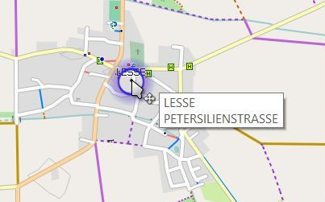
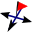
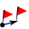
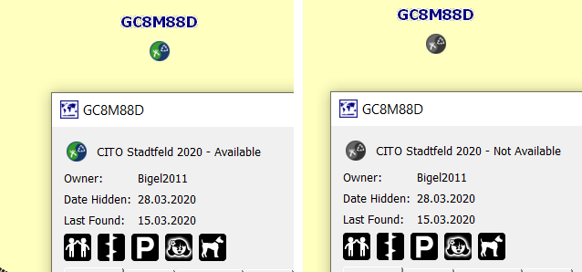

[Prev](DocGisItemsRouting) (Routing in QMapShack) | [Home](Home) | [Manual](DocMain) | [Index](AxAdvIndex) | (Areas) [Next](DocGisItemsArea)
- - -

***Table of contents***

* [Waypoints](#waypoints)
    * [Create waypoint](#create-waypoint)
    * [View & edit details](#view--edit-details)
        * [Custom icons](#custom-icons)
        * [The photo album](#the-photo-album)
    * [Other actions](#other-actions)     
        * [Move waypoint](#move-waypoint)
        * [Project waypoint](#project-waypoint)
        * [Remarks on other actions](#remarks-on-other-actions)
    * [Geocaches](#geocaches)

* * * * * * * * * *
 
 
# Waypoints

A waypoint is a coordinate with data attached. This can be a point of interest, a geocache or a georeferenced image. If you move the mouse close enough to a waypoint in a map window it gets highlighted by a red circle:

[Geocaches](#user-content-geocaches) are handled  in QMS as waypoints with special features.

## Create waypoint

The creation of a new waypoint is similar to the creation of a [track][TrkCreate] or a [route][RteCreate]. 

To create a new waypoint proceed as follows:

* Go to a map window and zoom it to the region in which the new waypoint should be located.
* Right-click in the map window to open its context menu.
* Click the menu entry `Add waypoint`.
* Select 
    * a new or existing project for the waypoint,
    * in case of a new project its type (QMS, GPX file or database).

    ![Project for waypoint][WptProject]
    
* Click `Ok` to go to the next window.

    
    
* Insert by clicking on the blue underlined labels proper information  for
    * waypoint name, description, comment and links relevant for the waypoint,
    * elevation (if not automatically filled-in),
    * a proximity distance (used by a GPS device to warn when approaching the waypoint or used as radius of a waypoint-based [no-go area][NoGo]),
    * the position shown is the one clicked when opening the map window context menu. If necessary, click to edit it.
    
* Choose waypoint icon by a click on the icon symbol at the upper left corner of the window. Choose one from the list which pops-up:

    ![Select waypoint icon][WptIcon]
    
* Insert images linked to the waypoint by clicking the `Add image` icon ![Add image][AddImg] near the bottom of the left window border.    
    
If a vector map is used, then a waypoint can be created from a point of interest (POI) in the map:

* move the mouse pointer on a POI in a vector map, a small blue circle around this POI pops-up,
* right-click to open the context menu and select the menu entry `Add POI as waypoint`. The POI name and its coordinates are used in the new waypoint.

 

## View & edit details

If you click on the highlighted waypoint you get a short on-screen summary of the waypoint information and a toolbar with a few handling options:

The meaning of the toolbar options is shown in the following table:

| Default icon |  Tooltip |
|---------|----------|
|   | View details and edit. |
|   | Set tags and rating. |
|   | Copy waypoint into another project. |
|   | Delete waypoint from project. |
|   | Show content as static bubble. |
|   | Move waypoint to a new location. |
|   | Clone waypoint and move clone a given distance and angle. |
|   | Replace elevation by the view's DEM data. |
|   | Edit radius of circular area |
|   | Delete circle defined by waypoint |
|   | Switch between proximity and nogo-area |
|   | Search for information about the waypoint's position on selected websites. |
|   | Copy position of waypoint to Clipboard. |

When clicking the `View details ...` icon the window which has been already used when creating a waypoint pops-up again giving more detailed information about the waypoint. This window allows to edit some of the waypoint details.

In the upper right part of the windows 2 icons are shown with the following meaning:

|   |   |
|---|---|
|  | When shown, the waypoint was imported from a file and modified. |
|        | When shown, the waypoint is locked - that is, it can't be modified until unlocked. Click to unlock for editing |

### Custom icons

QMapShack ships with a bunch of default icons, which are likely to be displayed correctly on most GPS devices.

If you want to use your own icons, then there are 2 ways to do this:

* _Use default icon directory:_
    * Add icon files to
        * `~/.config/QLandkarte/WaypointIcons` (*nix-type systems)
        * `c:\Users\my_user_name\.config\QLandkarte\WaypointIcons` (Windows)
        * `???` (OSX)
* _Use other icon directory:_
    * Put your icons in some directory.
    * Start QMapShack.
    * Go to menu entry  `Workspace - Setup waypoint icons`.
    * In the pop-up windows click the `Open` icon and define your directory path where QMapShack can find the additional user-defined waypoint icons.
    * _Remark:_ As soon as a path is defined in this way, the default directory mentioned in the previous point isn't used anymore for loading icons.
    
Icon files must be in PNG or BMP format with size 22x22. 

When adding an icon `Photo.png`, the icon will be listed as `Photo` in QMapShack.

### The photo album

In addition to general information, such as position, name and a description, QMapShack allows attaching photos to a waypoint.
This functionality comes with several limitations, as it is primarily meant to provide a quick overview over the specific location - it is not intended to organize your collection of photos.

|   |   |   |
|---|---|---|
|  | Add (a) new image(s)  | Imports one or more new images. **Photos are scaled down on import** |
|  | Delete selected image | Remove selected image (i.e. the image with the yellow frame) |

**Photos are not exported to GPX.** Use either a database or the QMS format for saving photos along with waypoints.

## Other actions

### Move waypoint

To move a waypoint to a new location 

* left-click the waypoint on the map.
* Select the `Move waypoint to new location` icon  from the info window that pops-up.
* The mouse cursor changes to the `Move` icon.
* Move the mouse pointer to the new location (don't click).
* The distance of the new to the old waypoint and the direction of change are shown.
* If the new location is not in the map view: left-click on the map and __don't release__ the mouse button.
* The map is attached to the mouse.
* Move the map to the wanted location and release the mouse button.
* The map is fixed again.
* Move the mouse to the wanted new location of the waypoint.
* Left-click to fix the new position of the waypoint.

### Project waypoint

This action is triggered by click on the `Clone waypoint ...` icon . It will create a clone of the waypoint. You have to give an explicit distance and a bearing to define the location of the cloned  waypoint. You might want to change the icon and the name of the cloned waypoint.

### Remarks on other actions

* _Show content as static bubble:_ Replace the default waypoint layout in a map window

![Waypoint default layout][WptDflt]

with a more informative layout in form of a bubble box

![Waypoint bubble layout][WptBubble]

* _Edit radius of circular area:_ Change the proximity radius of the waypoint in a map view: click icon, move mouse to new size of proximity area, old radius size is still shown, left-click to confirm new size. 
* _Switch between proximity and no-go area:_ If the waypoint has a proximity radius > 0, then the proximity range can be converted to a no-go area and vice versa.
* _Search for information about the waypoint position on selected websites:_ When choosing this action a web service from the list of configured [web services][WebServ] can be selected which displays information about the waypoint location in a web browser.

## Geocaches

Geocaches are waypoints with special additional information and features. If this additional information is saved in a typical `<groundspeak:cache>` extension block of a waypoint in a GPX file, it can be displayed by QMS.

The waypoint icon shows the type of the geocache (traditional cache, multi-cache, virtual cache, webcam cache, ...).

The edit window differs from the one of a normal waypoint. It displays additional geocache information in read-only mode using several tabs:

_Remarks:_ 

* There are no fixed rules for defining attributes of geocaches. QMS supports only the handling of attributes defined in conformity with the rules used in [https://www.geocaching.com](https://www.geocaching.com/play). 
* The status of a geocache (available, not available, archived) is appended to the name field of the geocache in the geocache edit window. If the status is ` available` then then geocache icon shown in the edit and in the map window are colored ones. Otherwise they are gray:

[WptDflt]:    images/DocGisItemsWpt/WPTNormal.jpg   "Default waypoint layout"
[WptBubble]:  images/DocGisItemsWpt/WPTBubble1.jpg  "Waypoint bubble layout"
[AddImg]:     images/icons/AddImage.png             "Add image"
[WptIcon]:    images/DocGisItemsWpt/WptIcons.jpg    "Select waypoint icon"
[WptProject]: images/DocGisItemsWpt/WptProject.jpg  "Select project for waypoint"

[TrkCreate]:  DocGisItemsTrk#user-content-create-track           "Create a track"
[RteCreate]:  DocGisItemsRte#user-content-create-route           "Create a route"
[WebServ]:    DocFaqMaps#user-content-how-to-find-information-about-a-position-a-poi-on-the-web "Get location information from web service"
[NoGo]:       DocGisItemsRouting#user-content-using-no-go-areas-and-lines  "Handling no-go areas"

- - -
[Prev](DocGisItemsRouting) (Routing in QMapShack) | [Home](Home) | [Manual](DocMain) | [Index](AxAdvIndex) | [Top](#) | (Areas) [Next](DocGisItemsArea)
