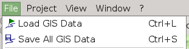
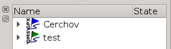
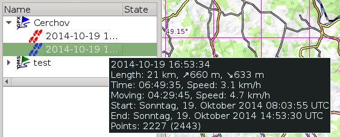
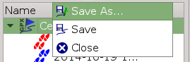

[Prev](DocWorkingWithProjects) (Working with Projects) | [Home](Home) | [Manual](DocMain) | [Index](AxAdvIndex) | (Geosearch) [Next](DocSearchGoogle)
- - -

# Handle GPX and QMS Files

Despite all deficiencies, GPS manufacturers support this format. A common format is a good approach in general, but TopoGrafix, the company behind GPX, fails miserably to evolve their format to the needs of today's GPS systems. Anyway, GPX is it to be. QMapShack does support the GPX definition version 1.1 and some of the proprietary extensions to GPX. And it adds a few more. But due to the sheer rank growth of extensions, caused by a lack of guidance, it can't support everything. Keep this in mind when you load and save GPX files that do not origin from QMapShack. You will loose information.

QMS is QMapShack's own binary format. You will never loose information using it, but of course it is not compatible to any other application. 

## Load GPX Files

There are two ways to load GPX or QMS files. 

1) When you start QMapShack from the command line you can add a list of GPX and QMS files

    qmapshack file1.gpx file2.qms
    
2) Use the menu _File->Load GIS Data_ (GIS = Geographic Information Systems)

FIT, SLF and TCX files can be loaded in the same way.

## Data view

Each file will create a new top level item in the data view's workspace list. 

If you expand the item you can see the elements like waypoints, tracks, routes and so on. If you let the mouse hover over an element you get more information.
Mind that checking the `Show on Map` checkbox to the left of the GIS
item in the data view's workspace list does **not** move the map to
where the objects of your GIS file are located on the globe!  To achieve
this expand the GIS item and then double click on one of its tracks,
routes, or waypoints.

## Save GPX Files

You can either save all files in the workspace via _Save All GIS Data_. Or you can save a single file by a right click on the item in the data view's workspace list.

- - -
[Prev](DocWorkingWithProjects) (Working with Projects) | [Home](Home) | [Manual](DocMain) | [Index](AxAdvIndex) | [Top](#) | (Geosearch) [Next](DocSearchGoogle)
