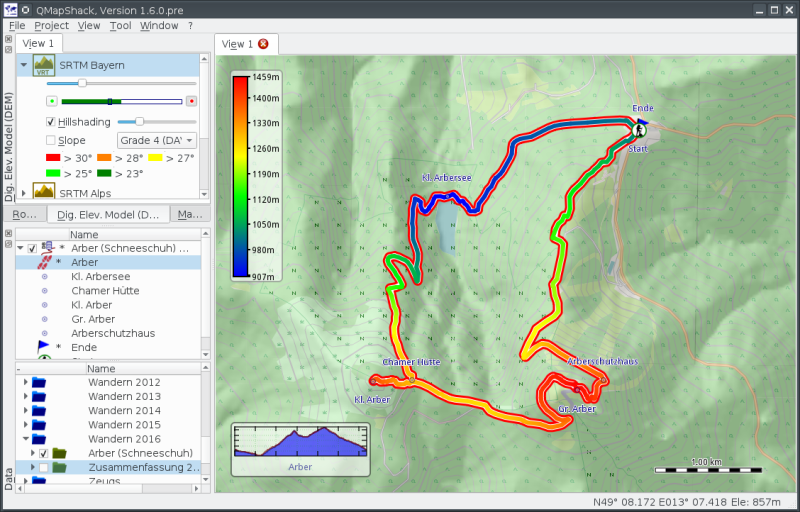

Prev () | [Home](Home) | [Manual](DocMain) | [Index](AxAdvIndex) | (Install QMapShack) [Next](DocGetQMapShack)
- - -

# QMapShack Manual

**Note**: As the software is subject to a constant development progress, this manual will
always reflect just a snapshot of the current state. Screenshots seen in this manual might 
not reflect the current appearance of the program. The manual will be updated if there are 
large changes to the GUI. However, smaller changes will be ignored. 

Users can find short quickstart help here:

*   [__Quick start__](DocQuickStartEnglish "English quickstart description")
*   [__Schnellstartanleitung__](DocQuickStartGerman "German quickstart description")
*   [__Быстрый старт__](DocQuickStartRussian "Russian quickstart description")
*   [__Guía de Inicio__](DocQuickStartSpanish "Spanish quickstart description")

## Basic usage

* Installing QMapShack

    * [Install QMapShack](DocGetQMapShack)
    * Compile instructions
        * [Windows with VisualStudio 2013](BuildWindowsVisualStudio2013)
        * [Windows with VisualStudio 2017](BuildWindowsVisualStudio)
            * [GDAL support for additional map formats](BuildWindowsGdalWithAdditionalFormats)
        * [Ubuntu-14.04](Ubuntu-14.04-HowTo)
        * [Ubuntu-18](Ubuntu-18-HowTo)
        * [Linux Mint 19.x](BuildLinuxMint19)
        * [OSX](BuildOSX)
    * [Create Offline Documentation](OfflineDocumentation)

* Using QMapShack

    * [Getting started](DocGettingStarted)
    * [Commandline parameters](DocCmdOptions)
    * [Install Maps & DEM Data](DocInstallMapDem)
        * [Maps & DEM](DocBasicsMapDem)
        * [Control maps and DEM files](DocControlMapDem)   
        * [Sources of QMapShack-compatible maps and elevation data](DocMapDemSources)
    * [Working with Projects](DocWorkingWithProjects)
        * [Handle GPX and QMS files](DocHandleGpxFiles)
        * [Search data](DocDataSearch)
        * [Geosearch](DocSearchGoogle)
    * [Data in QMapShack](DocGisItems)
        * [Create and edit multi-point data)](DocGisItemsEditMultiple)
        * [Tracks](DocGisItemsTrk)
            * [Track information](DocGisItemsTrkInfo)
            * [Working with track graphs](DocGisItemsTrkGraphs)
            * [Editing elevation data](DocGisItemsTrkElevation)       
            * [Track ranges](DocGisItemsTrkRange)            
            * [Track filters](DocGisItemsTrkFilters)     
        * [Routes and routing](DocGisItemsRte)
            * [Routing in QMapShack](DocGisItemsRouting)
        * [Waypoints](DocGisItemsWpt)
        * [Areas](DocGisItemsArea)
        * [Realtime data](DocRealtime)   
    * [Database](DocGisDatabase)
        * [Workspace and Database](DocGisDatabaseWorkspaceDatabase)
        * [Add/Remove/Synchronize/Search a Database](DocGisDatabaseAddRemove)
        * [Folders and Items](DocGisDatabaseFoldersItems)
        * ['Lost & Found' Folder](DocGisDatabaseLostFound)
    * [GPS Devices](DocGisDevices)
    * [Text Editor Templates](DocGisTemplates)

## Advanced usage

* [Databases and projects](AdvProjects)
    * [General Actions](AdvProjActions)
* [Details of map use](AdvMapDetails)
    * [Tips & tricks for online maps](DocMapsTipsOnline)
    * [Tips & tricks for raster maps, vector maps, and elevation data](DocMapsTipsRasterDEM)       
* [Overview of setup and configuration options](AdvSetup)     
* [Overview of toolbar actions](AdvToolbarAct)  
       
## Getting Help

* [Frequently Asked Questions](DocFaq)
    * [Configuring and running](DocFaqConfig)
    * [Use of issue templates](DocFaqProjectSite)
    * [Databases and projects](DocFaqData)
    * [Data handling](DocFaqHandling)
    * [Routing](DocFaqRouting)
    * [Maps](DocFaqMaps)
* [Troubleshooting QMapShack](TroubleShooting)
* [Reporting a bug](ReportBugs)
* [Requesting a feature](RequestFeatures)

## Developing QMapShack

* [Coding Guideline](DeveloperCodingGuideline)
* [Contribute Code](DeveloperCommitCode)
* [Add translations](DeveloperTranslate)
* [Developing Documentation](DevelopingDocumentation)
    * [Recommendations for editing QMS Wiki pages](AxMaintainAutoPages)
    * [Maintaining the QMS Wiki Index](AxMaintainIndex)
    * [Maintaining TOCs on Wiki pages](AxMaintainPageTOC)
* [Discussion of extended activity system](DocActivityPlanning)    
* [Playground - start your new Wiki page](DocPlayground)
* [How to piss off open source developers](DocPissOffDevelopers)

## Appendix

* [Hotkeys](AxHotkeys) 
* [Main and context menu overview](AxMenuStructure)
* [Complete table of contents](AxAdvToc)
* [Glossary](AxGlossary)
* [Index](AxAdvIndex)
    
- - -
Prev () | [Home](Home) | [Manual](DocMain) | [Index](AxAdvIndex) | [Top](#) | (Install QMapShack) [Next](DocGetQMapShack)
