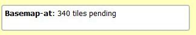
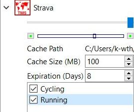

[Prev](AdvMapDetails) (Details of map use) | [Home](Home) | [Manual](DocMain) | [Index](AxAdvIndex) | (Tips & tricks for raster maps, vector maps, and elevation data) [Next](DocMapsTipsRasterDEM)
- - -
[TOC]
- - -

# Tips & tricks for online maps

Various institutions offer online map services. Often, the capabilities of these services are described in form of `WMS, WMTS` or `TMS` files.
The formats used vary considerably between different providers.

QMS can handle some of these formats. The content of this page is based on user experience with different map servers in several countries.

If you have a hot tip for free maps or a spiffy trick about what to do with maps add a few words here.

## Map service file formats

### WMS

__WMS__ stands for **W**eb **M**ap **S**ervice. It is a standard protocol for serving (over the Internet) georeferenced map images which a map server generates 
using data from a GIS database.

There is no direct support for WMS in QMS but some tricks described in this page may help to use WMS servers via WMTS or TMS.

### WMTS

__WMTS__ stands for **W**eb **M**ap **T**ile Service. It is a standard protocol for serving pre-rendered georeferenced map tiles over the Internet.

QMS does support a limited number of WMTS formats.

### TMS

TMS stands for **T**ile **M**ap **S**ervice. It is a standard protocol for tiled web maps. TMS is most widely supported by web mapping clients and servers.

QMS does support TMS.

## Basic procedure for using WMTS or TMS files

* _Assumption:_ A WMTS or TMS file is available for use.
* Connect to the Internet.
* Put the WMTS resp. TMS file (with extensions `wmts` resp. `tms`) in a QMS map path.
* Right-click in the QMS docked map window to open the map context menu and click `Reload maps`.
* Find the name of the WMTS/TMS file in the list of maps in the map window and right-click on the map name to open the context menu. The icon in front of the map name shows the type of the map (
 or ).
* Click the menu entry `Activate`. 
* Map data will be downloaded from the Internet and rendered in the map view. A small box at the top left corner of the map view shows the progress (the number of pending tiles) of the data download:

    

* To deactivate the map go again to the map name context menu and click `Deactivate`.
* In some cases the user can select different layers included in the map. To do so, click the small triangle in front of the map name in the map window and select the required layers as shown in the following image:

    

## Overview of map regions mentioned on this page

| Country | Regions | Remarks |
|---------|---------|---------|
|World   |[various in package 1](#sources-of-wmts-and-tms-map-files)| Strava heatmaps, maps based on OpenStreetmap |
|Europe  |[various in package 1](#sources-of-wmts-and-tms-map-files)|  maps based on OpenStreetmap|
|Austria |[various in package 1](#sources-of-wmts-and-tms-map-files)|  maps based on OpenStreetmap and other Austrian servers|
|Belgium |[list of WMTS services with data for Belgium and wordwide](https://gitlab.com/GIS-projects/Belgium-WMTS), [IGN](http://www.ngi.be/cartoweb/1.0.0/WMTSCapabilities.xml) | topo map |
|Czech Republic|[MTBMap.cz in package 1](#sources-of-wmts-and-tms-map-files)| mountain bike |
|France  |[IGN](#wmts-configuration-for-french-ign-maps), [BRGM](#use-wms-server-as-tms-server)| IGN, geological service |
|Germany |[various in package 1](#sources-of-wmts-and-tms-map-files), [North Rhine-Westphalia](#use-wms-server-as-tms-server) | maps based on OpenStreetmap and some German servers |
|Italy   |[Italy](#use-arcgis-server-as-tms-server)| topo map|
|Norway  |[Norway](#tms-configuration-for-norwegian-topo-maps)| topo map|
|Spain   |[various in package 2](#sources-of-wmts-and-tms-map-files), [IGN](#use-wmts-server-as-tms-server) [Spain orthophotos](#tms-for-spanish-orthophoto-maps)| various Spanish servers |


## Sources of WMTS and TMS map files

Some ready made WMTS and TMS files for different regions and for different purposes can be downloaded from the Internet (unpack the ZIP files and copy all files to a QMS map path):

* [Package 1 (contributed by Emi):](http://www.mtb-touring.net/qms/onlinekarten-einbinden) Most of the offered maps are based on OpenStreetMap data. They reflect different areas of interest and use different map servers.
    * OSM Base: hikebikemap, humanitarian, landscape, openstreetmap (Mapnik, German & French style), opencyclemap, oepnvkarte (German public transport), outdoors, skobbler, OSM Topo, World Topo (Esri), Alpenkarte (alps map), 4UMaps.eu, MTBMap.cz (Czech mountain bike map), Reit- und Wanderkarte (hike and horse ride map for Germany), Maptoolkit, maps.refuge.info
    * Waymarkedtrails: Inlineskating, mountain biking, cycling, horse riding, hiking, wintersports
    * Overlay: Hillshading, openrailwaymap, openseamap
    * Strava: Running & cycling heatmap, water & winter sports heatmap
    * Satellite: Bing, Esri
    * Google: Google Hybrid Maps, Google Maps, Google Sat Map, Google Terrain Map 
    * Geoland.at: Basemap, Basemap Overlay, Basemap Grey, Basemap High DPI & Basemap Orthofoto (Austria)
    * Kartverket.no: Kartverket N50 Topo4, Kartverket Toporaster3 (Norway)

* [Package 2 (contributed by Mitxel):](https://www.dropbox.com/s/sfzxdehmdqfs784/ESP_IGN_QMS_onlinemaps.zip?dl=0) Maps using Spanish map servers.
    * ESP IGN:  Ortofoto, Topo map, Historical maps
    * Other: Topo Euskal Herria, Gipuzkoa_5bm , Catalunya topo

## Tips for some widely used server types

### Use WMS server as TMS server

QMapShack's TMS file specification allows Java Script to build URLs. This can be used to build a WMS URL if the WMS server supports the projection commonly used for TMS. This is either EPSG:3857 (WGS84 Web Mercator) or EPSG:900913 (equivalent to EPSG:3857, deprecated).

This is an example how to do it for the WMS server of North Rhine-Westphalia, Germany (download from [here](Downloads/NRW.tms)):

```
#!XML
<TMS>
<Layer idx="0">
<Title>NRW DTK Sammeldienst</Title>
<Script><![CDATA[(
function convert(z1,x1,y1)
{ function M(n){return 256*n*(156543.03392804062/(1<<z1))-20037508.342789244}
  y=(1<<z1)-1-y1;
  bbox=M(x1)+','+M(y)+','+M(x1+1)+','+M(y+1);
  return "http://www.wms.nrw.de/geobasis/wms_nw_dtk?LAYERS=nw_dtk_col&FORMAT=image/png&SRS=EPSG:3857&EXCEPTIONS=application/vnd.ogc.se_inimage&SERVICE=WMS&VERSION=1.1.1&REQUEST=GetMap&BBOX=" + bbox + "&WIDTH=256&HEIGHT=256";
}
)]]></Script>
</Layer>
<Copyright>Geobasis NRW 2015</Copyright>
</TMS>

```

You have to replace the URL in front of the string

    &BBOX=" + bbox + "&WIDTH=256&HEIGHT=256

with whatever is needed for the WMS server. This might be a bit tricky.

The official documentation of WMS standard can be found on [http://www.opengeospatial.org/standards/wms](http://www.opengeospatial.org/standards/wms).

The following version loads the French BRGM (Bureau de Recherches Géologiques et Minières) WMS map tiles (download from [here](Downloads/BRGM.tms)):

```
#!XML
<TMS>
<Layer idx="0">
<Title>IGN BRGM France</Title>
<Script><![CDATA[(
function convert(z1,x1,y1)
{ function M(n){return 256*n*(156543.03392804062/(1<<z1))-20037508.342789244}
  y=(1<<z1)-1-y1;
  bbox=M(x1)+','+M(y)+','+M(x1+1)+','+M(y+1);
  return "http://mapsref.brgm.fr/wxs/refcom-brgm/refign?LAYERS=FONDS_SCAN&FORMAT=image/png&SRS=EPSG:3857&SERVICE=WMS&VERSION=1.1.1&REQUEST=GetMap&BBOX=" + bbox + "&WIDTH=256&HEIGHT=256";
}
)]]></Script>
</Layer>
<Copyright>France IGN BRGM</Copyright>
</TMS>

```

### Use WMTS server as TMS server

The approach for accessing a WMTS server via TMS is similar to the one described in the previous section for WMS servers. Here is an example for Spanish IGN raster maps (download from [here](Downloads/ESP_IGN_Topografico.tms)):
 
```
#!XML
<TMS>
<Layer idx="0">
<Title>IGN topografico</Title>
<Script><![CDATA[(
function convert(z1,x1,y1)
{y=(1<<z1)-1-y1;
  return "http://www.ign.es/wmts/mapa-raster?request=getTile&format=image/png&layer=MTN&TileMatrixSet=GoogleMapsCompatible&TileMatrix="+z1+"&TileCol="+x1+"&TileRow="+y1;
}
)]]></Script>
</Layer>
<Copyright>IGN</Copyright>
</TMS>

```

For most cases you only have to replace the URL in front of the string 

    &TileMatrix=
    
with the URL of your server.    

Note that WMTS request is `getTile` instead of `getMap`, so there is no need to define a BBOX, but the `TileMatrix`, `TileRow`, and  `TileCol` parameters must be included.

This is a useful workaround, if loading a map with its WMTSCapabilities.xml file fails.

### Use ArcGIS server as TMS server

The same logic as in the previous two sections can be implemented on the `export` command of ArcGIS server maps. Here is an example URL for the Geoportale Nazionale server (Italy) (download from [here](Downloads/ItalyGeoPortale.tms)):

```
<TMS>
<Layer idx="0">
<Title>Geoportale Nazionale, Italy</Title>
<Script><![CDATA[(
function convert(z1,x1,y1)
{ function M(n){return 256*n*(156543.03392804062/(1<<z1))-20037508.342789244}
  y=(1<<z1)-1-y1;
  bbox=M(x1)+','+M(y)+','+M(x1+1)+','+M(y+1);
  return "http://www.pcn.minambiente.it/arcgis/rest/services/immagini/IGM_25000/MapServer/export?dpi=96&transparent=true&format=png8&bbox=" + bbox + " &bboxSR=3857&imageSR=3857&size=256,256&f=image";
}
)]]></Script>
</Layer>
<Copyright>Geoportale Nazionale, Italy</Copyright>
</TMS>
```

In most cases the request will work as expected, even though the native projection wouldn't be epsg:3857 (Web Mercator).

For documentation of the `export` command refer to the
[ArcGis Export map service reference](http://resources.arcgis.com/en/help/arcgis-rest-api/index.html#/Export_Map/02r3000000v7000000/).


### Use MapProxy to access many maps as TMS

Preparing your next outdoors adventure using all available information sources in a single software like QMapShack is quite useful. For some parts of the world, access to local topo maps may even be paramount to your safe return. 

This section describes how to coerce most online maps with the help of the MapProxy software package into a format that QMapShack can use.

Pros:

* Can use maps in SRS (projections) incompatible with QMapShack. QMapShack can only use the web-standard EPSG:3857 and EPSG:900913.
* Can access maps through different protocols. QMapShack only supports natively Web-TMS, and WMS-C through hacks.
* Can rescale a layer, for example, if you prefer to have an overview with that rich topo map scaled down to 1:100k rather than an 1:100k OSM map that's empty in that part of the world.
* No JavaScript hackery.

Cons:

* It requires an extra piece of software to run along QMapShack.

#### Gathering information

Required information for each map layer you want to display:

* Layer name.
* Source URL.
* Source SRS, EPSG:xxxx.
* Bounding box of the served map.
* Size of the served tiles, in pixels.
* Supported resolutions (in pixels per ground unit).

Most public map servers are configured to serve only map tiles already in their cache. Otherwise, the server would consume a lot of resources to reproject, scale and tile the source material to meet your requirements.

So, please double-check that your requests match precisely (coordinates etc.) the usage examples you found, even if "it works": not only it wouldn't be fair to other users, but you'd probably attract unwanted attention and get yourself banned. If it doesn't work or your requests are wrong, you probably got one of the above parameters above wrong.

#### MapProxy basic usage

This example uses the free [MapProxy](https://mapproxy.org) software. See its documentation for installation options, configuration etc. In its simplest deployment option, just start it like this:

    mapproxy-util serve-develop ./myconf.yaml

And configure this URL as a TMS source in QMapShack:

    http://localhost:8080/tiles/base_EPSG3857/%1/%2/%3.png?origin=nw

You can also access `http://localhost:8080/` for a basic web GUI ("demo") with an OpenLayer demo of your setup.

#### Configuration template

Here is a template for myconf.yaml, with the following fictious values. Adapt it to suit your needs.

* Layer name: mylayer.
* Source SRS, EPSG:1234.
* Bounding box of the served map: `0,0` -> `24000000,42000000` in the EPSG:1234.
* Size of the served tiles, in pixels: 256x256.
* Supported resolutions: 2 (only).

NB: There is a `fallback` OSM-based source for areas or resolutions not covered by `upstream` (the target web map). That fallback is useful when testing the configuration with the MapProxy built-in "demo" page (see above). You can strip it out of the configuration once it works.

```yaml
services:
  demo:
  tms:

sources:
  upstream_mylayer:
    # That server is speaking WMS-C, but the tile type will let us mimic the
    # example URL exactly.
    type: tile
    url: https://example.com/mapserver/wms?KEY=&SERVICE=WMS&VERSION=1.1.1&REQUEST=GetMap&STYLES=&FORMAT=image%%2Fpng&LAYERS=mylayer&SRS=EPSG%%3A1234&BBOX=%(bbox)s&WIDTH=256&HEIGHT=256
    grid: upstream_mylayer_grid
    # Upstream's native resolution for this layer is 2. We *don't* set this
    # here, it's already in the upstream_mylayer_grid definition. Instead, we
    # specify that content from this source is to be used scaled, down to res
    # 10 if needed (larger res numbers mean lower-detail map!).
    # min/max_res in sources is the key to setting which source serves which
    # resolution.
    min_res: 10
    coverage:
      bbox: [ 0, 0, 24000000, 42000000 ]
      srs: 'EPSG:1234'
  fallback:
    type: tile
    url: https://tile.thunderforest.com/landscape/%(tms_path)s.png
    grid: GLOBAL_WEBMERCATOR
    # We don't restrict resolutions here: we're only a fallback. upstream will
    # get precedence because of the cache source order and will serve all
    # resolutions we allowed for it.

layers:
  - name: base
    title: base
    sources: [output_cache]

grids:
  upstream_mylayer_grid:
    # Adapt `origin` to the actual origin in EPSG:1234.
    srs: 'EPSG:1234'
    origin: sw
    tile_size: [ 256, 256 ]
    # That's the only resolution we're interested into in this layer.
    # This will prevent MapProxy from attempting to fetch higher/lower
    # resolutions for this layer. Instead, it'll scale up/down the 2 res as
    # needed.
    res: [ 2 ]
    bbox: [ 0, 0, 24000000, 42000000 ]
    max_shrink_factor: 16

caches:
  output_cache:
    sources: [fallback, upstream_cache]
    grids: [GLOBAL_WEBMERCATOR]
  upstream_cache:
    sources: [upstream_mylayer]
    grids: [upstream_mylayer_grid]

globals:
  cache:
    # upstream does not support this, and MapProxy whines if we compose a layer
    # from caches with different such settings.
    meta_size: [1, 1]
    meta_buffer: 0
  http:
    ssl_no_cert_checks: true
```

#### Troubleshooting

* No map for `upstream`:
    * Check the MapProxy log for errors.
    * Try one of the upstream GET requests in your browser: most likely you'll get an error message that may hint at which parameters you got wrong.
    * Double-check your parameters from "Gathering information" (yes, again) and how you filled them in the configuration template.
    * Some map servers may reject requests that do not originate from their web-based map viewer, based on HTTP headers like User-Agent and Referrer. Check what your regular browser sends for these and replicate them in `sources.upstream_mylayer.http.headers` (see the [MapProxy documentation](https://mapproxy.org/docs/nightly/sources.html#id7)).
* No map for `fallback`:
    * ThunderForest announced they would require an API key in the URLs in early 2017, try adding one.
* Tiles are misplaced or upside-down:
    * Check that `grids.upstream_mylayer_grid.origin` is correct: where is the 0,0 point in that SRS? Top-left or bottom-left?
    * Make sure that you are passing `?origin=nw` in your requests to MapProxy.
    * Do not attempt to customize the resolution list for real web-TMS sources (those with a %z parameter). At least, it didn't work for the author of this section (user error or MapProxy bug?). It's OK to use a subset of available resolutions for WMS-C sources however (those with a bounding box).


## Country-specific tips

### WMTS configuration for French IGN maps

As an individual, you can apply for a free non-commercial access to the French IGN WMTS servers (for example through their "Géoportail API", but also works with other WMTS clients like QGIS and QMapShack). Lots of thanks to them for this free access because their maps are truly awesome. The original source of information about this is at the following URL (in French):

[https://dogeo.fr/wmts_ign/](https://dogeo.fr/wmts_ign/)

The terms of use enforce a few restrictions listed at the following URL:

[http://professionnels.ign.fr/conditions](http://professionnels.ign.fr/conditions)

You can register for this free "licence géoservices IGN pour usage grand public" at the following URL (_hint:_ the content of the linked page seems to change frequently, look for a link similar to "_Commander une clé de géoservices_"):

[http://professionnels.ign.fr/user/register](http://professionnels.ign.fr/user/register)

You will be prompted to select which layers you want. Although the same procedure probably applies to any of the available layers, the process described here has only been tried with the map layer called "cartes IGN" (or "GEOGRAPHICALGRIDSYSTEMS.MAPS" on the WMTS server).

Note that you will also need to provide your IP address (external IP: that is the IP of your Internet router) during the application process. Usually you can easily find this IP in your router status page, or alternatively you can visit websites such as 

[www.howtofindmyipaddress.com](http://www.howtofindmyipaddress.com/) or

[ip4.me](http://ip4.me/)

The WMTS access may be denied, if you try to connect from another IP address (and this may be a problem if your ISP keeps changing your IP address). This problem can be diagnosed by trying to access a map tile directly from a web browser (use the sample URL below). In case of IP address mismatch you will obtain an error message saying "wrong IP address" instead of the map tile. The registered IP address can be modified on the "IGN Espace Pro" website, under your account, you should click on "mes commandes" and then "modifier mon contrat". Note that they say it can take up to 12h 
before the new IP address is actually activated.

Shortly after your order (less than one hour), you will receive a confirmation e-mail, and you will be able to retrieve a personal ID (24 character key) from your personal account on the IGN website.

You can test the WMTS access directly in your web browser by fetching a random map tile, for example:

[https://wxs.ign.fr/__[YOUR_ID]__ /wmts?LAYER=GEOGRAPHICALGRIDSYSTEMS.MAPS&EXCEPTIONS=text/xml&FORMAT=image/jpeg&SERVICE=WMTS&VERSION=1.0.0&REQUEST=GetTile&STYLE=normal&TILEMATRIXSET=PM&&TILEMATRIX=1&TILECOL=0&TILEROW=0](https://wxs.ign.fr/[YOUR_ID]/wmts?LAYER=GEOGRAPHICALGRIDSYSTEMS.MAPS&EXCEPTIONS=text/xml&FORMAT=image/jpeg&SERVICE=WMTS&VERSION=1.0.0&REQUEST=GetTile&STYLE=normal&TILEMATRIXSET=PM&&TILEMATRIX=1&TILECOL=0&TILEROW=0)

(don't forget to replace **[YOUR_ID]** with your actual 24 character personal key)

The WMTS "capabilities" can then be fetched at the following URL:

[https://wxs.ign.fr/__[YOUR_ID]__/geoportail/wmts?SERVICE=WMTS&REQUEST=GetCapabilities](https://wxs.ign.fr/[YOUR_ID]/geoportail/wmts?SERVICE=WMTS&REQUEST=GetCapabilities)

(don't forget to replace **[YOUR_ID]** with your actual 24 character personal key)

If your request is denied by IGN, it's maybe because QMapShack don't send the right headers, you can specify them manually with the `<RawHeader>` XML node, compare section ["Basic knowledge about maps and DEM files"](DocBasicsMapDem#wmts-maps).

Unfortunately, unlike other WMTS servers, this capabilities file does not directly work in QMapShack (although it works "as is" in QGIS). To work around this, you will have to modify it with a text editor to include a <ResourceURL> line at the end of the layer description (just before the </Layer> directive) for the "GEOGRAPHICALGRIDSYSTEMS.MAPS" layer (must be adjusted and tested for other layers).

**WMTS example download: [IGN_GEOGRAPHICALGRIDSYSTEMS.wmts](Downloads/IGN_GEOGRAPHICALGRIDSYSTEMS.wmts)**

(again, don't forget to replace the 3 occurrences of **[YOUR_ID]** with your actual 24 character personal key)

Note that this file was working as of September 22, 2015 but may stop working in the future in case IGN changes its WMTS server configuration.

You can find some more complete WMTS and TMS files for IGN here :

* **WMTS IGN download: [IGN.wmts](Downloads/IGN.wmts)**
* **TMS IGN download: [IGN.tms](Downloads/IGN.tms)**

(again, don't forget to replace **all** the occurrences of **[YOUR_ID]** with your actual 24 character personal key)

Note that this file was working as of Jully 28, 2018 but may stop working in the future in case IGN changes its WMTS or WMS server configuration.

See [IGN Online Ressources](https://geoservices.ign.fr/documentation/ressources.html) if you want more information about IGN WMTS ans WMS layers. 


### TMS configuration for New Zealand topo maps

The following TMS file allows loading New Zealand topo maps into QMS (download from [here](Downloads/NZ.tms)):

```
<TMS>
	<Title>NZTopo</Title>
	<MinZoomLevel>6</MinZoomLevel>
	<MaxZoomLevel>15</MaxZoomLevel>
	<Layer idx="0">
		<Title>NZTopo</Title>
		<Script><![CDATA[(
		function convert(z1,x1,y1)
		{  return "http://nz1.nztopomaps.com/" + z1 + "/" + x1 + "/" + ((1<<z1) - y1 - 1) + ".png";
		}
		)]]></Script>
	</Layer>
</TMS>
```
The script inside the TMS file prepares the correct URL form in accordance with [OSGEO TMS](http://www.maptiler.org/google-maps-coordinates-tile-bounds-projection/)
(Optimized by KartenFreak).

### TMS configuration for Norwegian topo maps

The following TMS file allows loading Norwegian topo maps into QMS (download from [here](Downloads/Norway.tms)):


```
<TMS>
  <Title>Norvege</Title>
  <MinZoomLevel>1</MinZoomLevel>
  <MaxZoomLevel>22</MaxZoomLevel>
  <Layer idx="0">
   <Title>Toporaster 3</Title>
   <ServerUrl>http://opencache.statkart.no/gatekeeper/gk/gk.open_gmaps?layers=toporaster3&amp;zoom=%1&amp;x=%2&amp;y=%3</ServerUrl>
   <MinZoomLevel>1</MinZoomLevel>
   <MaxZoomLevel>22</MaxZoomLevel>
  </Layer>
   <Copyright>Kartverket, Norway</Copyright>
</TMS>
```
 
An example of a WMTS file for the same server can be downloaded [here](Downloads/Norway_topo.wmts). 
 

### TMS for Spanish orthophoto maps

The following TMS file allows loading Spanish orthophoto maps into QMS (download from [here](Downloads/ESP_IGN_Ortofoto.tms)):

```
<TMS>
<Layer idx="0">
<Title>ESP_IGN_Ortofoto</Title>
<Script><![CDATA[(
function convert(z1,x1,y1)
{ function M(n){return 256*n*(156543.03392804062/(1<<z1))-20037508.342789244}
  y=(1<<z1)-1-y1;
  bbox=M(x1)+','+M(y)+','+M(x1+1)+','+M(y+1);
  return "http://www.ign.es/wmts/pnoa-ma?request=getTile&layer=OI.OrthoimageCoverage&TileMatrixSet=GoogleMapsCompatible&TileMatrix="+z1+"&TileCol="+x1+"&TileRow="+y1+"&format=image/jpeg&WIDTH=256&HEIGHT=256";
}
)]]></Script>
</Layer>
<Copyright>IGN, Spain</Copyright>
</TMS>
```

- - -
[Prev](AdvMapDetails) (Details of map use) | [Home](Home) | [Manual](DocMain) | [Index](AxAdvIndex) | [Top](#) | (Tips & tricks for raster maps, vector maps, and elevation data) [Next](DocMapsTipsRasterDEM)
