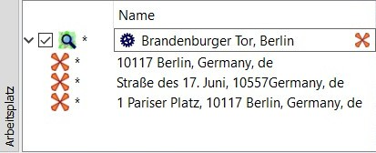

Prev () | [Home](Home) | [Manual](DocMain) | [Index](AxAdvIndex) | () Next
- - -

***Table of contents***

* [Quickstart](#quickstart)
    * [Basic QMS features](#basic-qms-features)
    * [Download files from Internet](#download-files-from-internet)
    * [Installation](#installation)
    * [Steps after the first start](#steps-after-the-first-start)
    * [Some typical operations in QMS](#some-typical-operations-in-qms)
        * [Zoom and move map](#zoom-and-move-map)
        * [Load GPX file and show data](#load-gpx-file-and-show-data)
        * [Create new database](#create-new-database)
        * [Data organization in the database](#data-organization-in-the-database)
        * [Create track ](#create-track)
        * [Display track information](#display-track-information)
        * [Create track (route) through waypoints](#create-track-route-through-waypoints)
        * [Find waypoint ](#find-waypoint)

* * * * * * * * * *
 
# Quickstart
___(Short summary for Windows users)___

_Valid from QMapShack commit 8ddec3217899 (Wed Apr 04 17:38:39 2018 +0200)._

_Except for the parts relating to the QMapShack installation itself this summary is valid for non-Windows operating systems, too._

QMapShack (in brief QMS) for Windows is a 64-bit application and requires therefore a 64-bit Windows operating system.

This summary is kept as short as possible in order to quickly get the user to work with QMS. Many of the described
actions can also be performed in a different way. The discussion of these possibilities is suppressed.

Detailed information on QMS is available in the [Wiki](DocMain "QMS Wiki").

Users having an already installed QMS will find a welcome page at the first QMS start. From there some of the installation steps described on this page can be carried out, too.

## Basic QMS features

* Easy and flexible use of vector, raster, and online maps
* Use of elevation data (offline and online)
* Creation/planning of routes and tracks with different routers
* Analysis of recorded data (tracks) from various navigation and fitness devices
* Editing of planned routes and tracks
* Structured saving of data in databases or files
* Direct read and write connection to up-to-date navigation and fitness devices

## Download files from Internet

_Hints_:

* The version numbers mentioned can change. The latest available version should always be selected.
* Often, files can be selected for specific regions on the specified pages. The user should find the region he is interested in.
* The recommendations given here are examples. There are many other options available!

The following links are recommendations for files which allow comfortable work with QMS and which can be downloaded from the Internet.

* _QMapShack_:

    * [Load QMS from server](https://github.com/Maproom/qmapshack/releases "Load QMS installation file").
      Download the file `QMapShack_Win64bit_1.13.2.exe` from this site (approximately 100 MB, version number can be different).

* _Use of maps (recommended)_:

    * [Load vector map Germany (Freizeitkarte)](http://download.freizeitkarte-osm.de/garmin/latest/DEU_de_gmapsupp.img.zip "Freizeitkarte Deutschland"). 
      (Choose your region! This links to a file! Approximately 1.4 GB, if a Garmin navigation device is used, a suitable file `gmapsupp*.img` may already exist
       and can be used in this step)
    * _Optional:_ [Load links to on-line maps](http://www.mtb-touring.net/qms/onlinekarten-einbinden/ "On-line maps"). 
      _Hint:_ Click field `Download online maps`! Result is a downloaded file `Onlinemaps.zip`.
    
* _Routing support (recommended for creation of new routes and tracks)_:

    * [Load Routino data](http://download.geofabrik.de/europe/germany.html "Load Routino data"). On this page, go e.g. to line `Berlin` 
      (choose your region!) and 
      click in this line on `.osm.pbf`. The file `berlin-latest.osm.pbf` is downloaded.
    
* _Elevation data (recommended, if elevations should be assigned to new tracks)_:     

    * [Load tiles with elevation data](https://dds.cr.usgs.gov/srtm/version2_1/SRTM3/Eurasia "Load elevation tiles"). 
      Use coordinates to choose necessary file(s), e.g. `N51E012.hgt.zip`. The coordinates in the file name describe the south-western 
      corner of a tile. 
    
        _Or:_
      
    * [Load elevation data for a region](http://www.viewfinderpanoramas.org/Coverage%20map%20viewfinderpanoramas_org3.htm "Load DEM data for region"). 
      On the displayed map select your region and click on it.
      E.g. a file `N32.zip` is downloaded. Here, `N32` is the name of the so-called UTM zone.

    _Hint:_ Download as many files as needed for your region!  
      
## Installation
* All downloaded files are saved in the user's download directory.
* Find the file `QMapShack_Install_Windows64bit__1.13.2.exe` in the download directory.
* Start this installation file by double-clicking the filename.
* Confirm the information in the first installation windows.
* In the `Select Components window`, select `MSVC ++ 2013 SP1 runtime` (this can be omitted if 
  this runtime environment has been already installed).
* Confirm starting the installation of the runtime environment. _Hint:_ The installation may take a few minutes!
* At the end of the installation of the runtime environment, finish this installation with the `Close` button. 
  The QMS installation is then continued and QMS is installed completely.
* **Hint:** *Never use non-ASCII characters in installation directory names!*  
* QMS can already now be started from the Start menu. However, it is recommended to perform still the following steps.
* Create a directory where the user has write permission. In the following discussion
  this directory is called `QMS`. _Note:_ The user has no
  full write permission for the default installation directory, so in this step a
  separate directory for data must be created.
* Add the following subdirectories to the directory `QMS`:
    * `Maps`,
    * `Routino`,
    * `BRouter`,
    * `DEM`,
    * `Databases`,
    * `GPX`.
* Open the file `DEU_de_gmapsupp.img.zip` (or the vector map you downloaded) with the leisure map of Germany and copy 
  the file `gmapsupp.img` into the `Maps` folder.    
* Rename the file `gmapsupp.img` to `LeisureMap_DE.img`.
* _Optional:_ Open the file `Onlinemaps.zip` and copy the files contained in it into the `Maps` folder.
* _Optional:_ Move the file `berlin-latest.osm.pbf` (or the Routino data you downloaded) to the `Routino` folder.
* _Optional:_ Open the file `N51E012.hgt.zip` or ` N32.zip` and copy the files in it into the `DEM` folder.

## Steps after the first start

* Start QMS from the Start menu (Choose `QMapShack - QMapShack`).

    
  
* The empty QMS user interface (GUI) appears. QMS tries to use the language of the operating system. If this language is not supported
  by QMS, then English is used as language of the QMS interface.  
 
    

    The middle part of the user interface is designed for map display, for data editing windows, and for some other purposes. At the first start a welcome page is shown here, as mentioned above.
  
    Each of the 6 subwindows on the left and right edges (`Maps`, ` Dig.Elev.Model(DEM)`, `Workspace`, `Database`, `Routing`, `Realtime`) can be moved and
    docked at the left resp. right edge of the main window or used as floating window (so-called docked windows). You can open and close these windows using the `Window` menu item or the corresponding icons in the toolbar. The toolbar is a docked window, too. It can be moved to new locations.

* The welcome page allows you to perform some of the installation steps described here directly from the QMS GUI. The welcome page disappears as soon as a map is activated. It can be made visible again by deactivating all activated maps. 
* When working with QMS, the user often receives information about actions to be performed in the form of info bubbles when pointing the mouse to a displayed object.
* _Activate vector maps and choose level of map details:_
    * Go to the `Maps` window with your mouse.
    * Open the context menu with a right click and select `Setup map paths`.
    * Open the folder `QMS\Maps` and select this folder.
    * In the map window appears a new entry `LeisureMap DE`.
    * Open the context menu with a right click on the map name and select `Activate`.
    * Move the map to a position that is contained in the map. The map should be visible.
    * A double-click on the name of an activated vector map opens the display of configurable map properties:
      * Opacity of the map (slider).
      * Display of areas, lines and points.
      * Level of map details display (between -5 and 5).
      * Layout of map objects (selection of a `TYP` file).
    * _Remark:_ Open more map windows and configure them independently of each other with the help of the menu entry `View - Add map view`.  
      
* _Optional: Activate on-line maps: (requires selection of the map folder in the previous step!)_
    * Go to the `Maps` window with your mouse.
    * Open the context menu with a right click and select `Reload Maps`.
    * In the map window appears a new entry, in the example `4UMaps-eu` (maybe appeared already during the activation of the vector map!).
    * Open the context menu with a right click on the map name and select `Activate`.
    * If an Internet connection is active, then the selected on-line map is now loaded (this can take some time, progress is shown in 
      the middle window!)

      
    
    
* _Optional: Activate Routino routing support:_
    * Choose menu entry `Tool - Create Routino Database`.
    * A new window will open.
    * Select `QMS\Routino\berlin-latest.osm.pbf` as source file and ` QMS\Routino` as target path (_Paths shown in the snapshot are different!_).
    * Type `BE` as file prefix.
    * Click the `Start` button.
    * In the right column of the window you can follow the executed actions. This process can take some time!
      The completion of the operation is shown.
    * Go to the `Routing` window and add the `QMS\Routino` folder using the 'Open' icon.
    * Open the database selection list in the `Routing` window and select `BE`.
    * Routes and tracks can now be created with the support of the off-line Routino router (in the area covered by the
      selected database, in the example for Berlin!).
      
      
      
      
* _Optional: Activate support for digital elevation data:_    
    * Choose the menu entry `Tool - VRT Builder`.
    * A new window will open.
    * Select `QMS\DEM\N51E012.hgt` as source file (multiple selections for further HGT files possible!) and `QMS\DEM\N51E012` as target file
      (the extension `.vrt` is added automatically). _Paths shown in the snapshot are different!_
    * Click the `Start` button. The completion of the operation is shown.

      

    * Move the mouse to the `Dig.Elev.Model (DEM)` window.  
    * Open the context menu with a right click and choose `Setup DEM paths`.
    * Choose `QMS\DEM` as folder.
    * In the `Dig.Elev.Model (DEM)` window now appears, among others, an entry `N51E012`.
    * Open the context menu with a right click on this name and select `Activate`.
    * Elevation data is now available for the selected area (in the example the south-west corner of the area has the coordinates 
      51° North, 12° East and extends over 1° in both directions).
    * The existence of elevation data at the location of the mouse pointer is indicated in the status line by an existing elevation specification.
 
        Status line without elevation data:
      
        
    
        Status line with elevation data:
      
        
      
    
    
With these steps, a workable state of QMS is reached.
   
## Some typical operations in QMS

### Zoom and move map

* _With the keyboard:_ 
    * Arrow keys move the map in the selected direction.
    * The keys "__+__" and "__-__" increase or decrease the map scale (zoom in and out).
* _With the mouse:_
    * Press and hold the left mouse button to fix the map to the mouse. When moving the mouse (without releasing the pressed key),
      the map is moved. Once the desired map position has been reached, release the mouse button.
    * Use the mouse wheel to zoom in or out.
    
### Load GPX file and show data

* _Assumption:_ There exists a GPX file `QMS\GPX\MyProject.gpx`.
* __Remark:__ Files with GIS data in some other formats (TCX, FIT, ...) can be loaded in a similar way!
* Choose the menu entry `File - Load GIS Data` and select `QMS\GPX\MyProject.gpx` in the file selection window.
* In the workspace window appears a new project entry with name ` MyProject`.
* After opening the project, the waypoints and tracks present in the GPX file (that is, the project) are displayed.
* If you move the mouse pointer to one of the displayed lines, you get some information about the selected object.
* A double click on a waypoint or track centers the selected map around this object.

     

### Create new database

QMS provides various forms of data storage. A recommended and powerful form is storing the data in
a database. The following steps are required to create a database:

* Go with the mouse to the database window.
* Open the context menu with a right click and select `Add Database`.
* In the next window, select a database name and a file name in the form `QMS\Databases\MyDatabase.db`
  (leave `SQLite` selected!).
* The selected database name appears as a new line in the database window.

### Data organization in the database

QMS databases are appropriate for a clear tree-like data structure similar to that in a folder tree.
The nodes of the tree (also called folders) can have one out of three different types used for a clearer organization of the data:

* _Group:_ Is only used to keep together subordinate folders. Groups can only contain subfolders, but no data.
* _Project, Other:_ Can contain subfolders and data. Data can be displayed and edited in the workspace window.

Physically saved are databases. Saving can be done manually or, if properly setup with the help of the menu entry `Workspace - Setup workspace`,
automatically within certain time intervals.

_Example:_

The names selected in the example describe the purpose of the database or the folders.

The group _Bicycle_ can be filled with an analogous structure.
   
The creation of databases was described in the previous step.   

To create group, project and other folders follow these steps:  
 
* Open the context  menu with a right click on the database or folder name.
* Choose the menu entry `Add folder`.
* In the next window, select a folder name and a folder type (different types use different folder colors).
 
_Further information:_ 

* By setting a hook in the field in front of the folder name, the folder 
  is opened in the workspace window and the data contained in it (if also selected) is shown in the map window. 
  For a clearer identification of the source of the project (folder) the name of the next higher folder is appended 
  to the folder name after the separator "__@__".
  This additional information is not appended to top-level folders.
  The described procedure allows a target-oriented and structured display of selected data in the workspace and in the map windows.
* Editing and deleting data is done in the workspace window.
  If the data of a folder has been edited, then this is indicated by a dot in front of the folder name and the data name (in the example the
  edited track _Süßer See_ is not yet saved to the database). Edited projects
  should be saved regularly to the database using the context menu entry `Save`.
* Complete deletion of data has to take place in the database window. Deleted data is moved to the automatically created
  Folder `Lost & Found` and final deletion should be done from this folder.
  Deletion in the workspace window deletes the data from the displayed project, but not from the database.
* In addition to folders (projects) that belong to databases, there are still projects that are saved directly in a GPX or QMS file.

### Create track 

* _Assumption:_ Routing support has been installed.
* Move the mouse to the `Routing` window.
* In the selection list at the top of the window select `Routino (offline)`.
* In the other lists select the profile (the kind of movement), the language (for turn-by-turn instructions), the mode (quickest/shortest) 
  and one of the
  existing Routing databases (in the example `BE`).
* Move the mouse to the starting point of the track in the map window.
* Open the context  menu with a right click and select `Add Track`.
* Press `A` on the keyboard (this selects the automatic routing mode).
* Move the mouse to the wanted next intermediate point of the track and fix it with a left click. An intermediate track segment is 
  automatically calculated in accordance with the selected routing options between the last two
  selected points. This segment is displayed in the map window.
* Repeat the previous step until the end of the track is reached.
* Right click to finish the new track.
* Select `Save as new`  from the toolbar at the top of the map window.
* Enter a track name.
* Select a new project name and `Database` as the project type.
* Select the available database.
* Select a name for a database folder.
* A new project with the selected name is displayed in the workspace window. This project contains the newly created track.
* The database window shows a new folder for the used database.
* Open the context menu with a right click on the project name and select `Save`. The project with its
  data is permanently saved in the selected database folder. The saved track appears as a line in the database folder.

### Display track information

Track information is provided in various forms and with different detail level.

* _In the workspace window:_ If the mouse pointer is located on the track name in the workspace window, then a summary of track information is shown.
* _In the map window:_ A double click on the track name in the workspace window moves and zooms the map so that the track is completely shown in the map window.
  Moving the mouse to the track in the map window gives the distance of the selected trackpoint to the begin and the end of the track as well as some additional
  information (elevation, speed, ...) of the trackpoint.
* _In the track info (edit) window:_ To open this window select `Edit...` from the track context menu in the workspace window. It shows summary 
  information of the track and up to 3 graphs. Depending on data availability track speed, elevation, slope, ... can be shown as function of the distance or the time.
  Select the form of the graph with the help of the tab `Graphs`. This window also provides in the tab `Filter` a series of filters for editing track data.
  

### Create track (route) through waypoints

* _Task:_ Find track through given series of waypoints.
* _Assumption:_ Routing support has been installed and activated.
* Copy, if necessary, all required waypoints into 1 project.
* Choose in the window `Routing` the wanted router (Routino (offline)) and its options.
* Select while holding the CTRL-key down the required waypoints in the wanted order.
* Open with a right-click on a selected waypoint the context menu and select `Create Route`.
* Check and change, if necessary, the order of the waypoints in the window `Create route from waypoints`.

    

* Press `Ok` to start the creation of a route through the given waypoints.
* Assign a name and project to the new route.
* Open with a right-click on the new route the context menu and select `Convert to Track`.
* Assign a name and a project to the new track.

### Find waypoint 
  
* _Assumption:_ Connection to the Internet is available.
* Select menu entry `Workspace - Geosearch` to open an edit field in the workspace window.
* Type name resp. address of the waypoint if the form used for Internet searches and press the `Return` key.
  
    
  
* If the waypoint could be found, then the result is shown as a new waypoint (maybe even as several waypoints) below the edit field.
* Copy the new waypoint into a normal project for saving.
* A click on the search setup icon opens a window in which the user can select between several supported search engines and provide required user data for the search engines. Details about this setup can be found in the section [Geosearch](DocSearchGoogle "Geosearch") of this Wiki. 

- - -
Prev () | [Home](Home) | [Manual](DocMain) | [Index](AxAdvIndex) | [Top](#) | () Next
