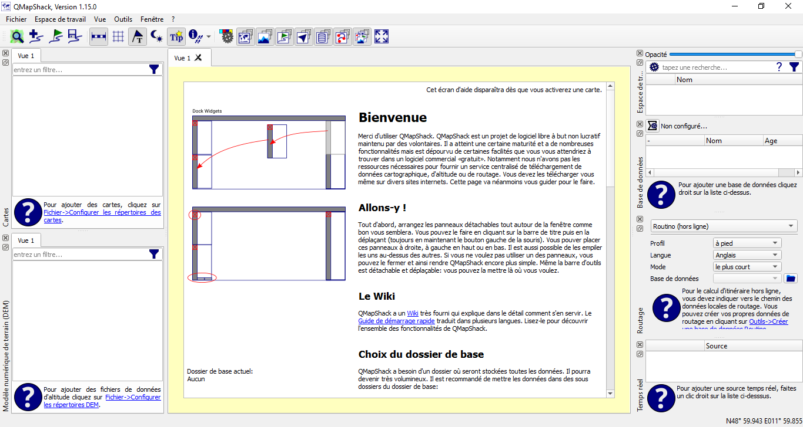
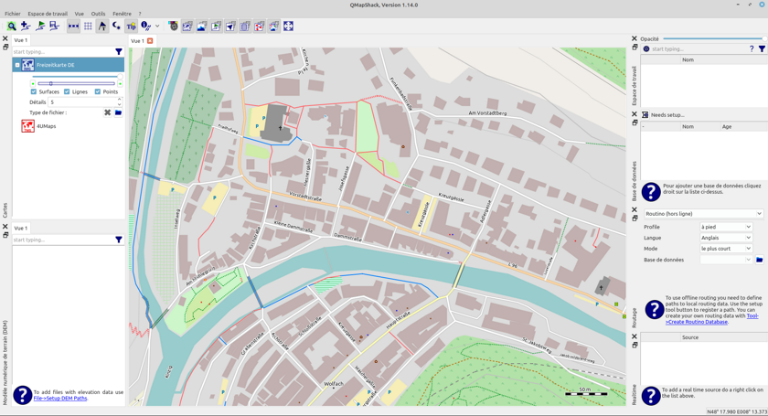
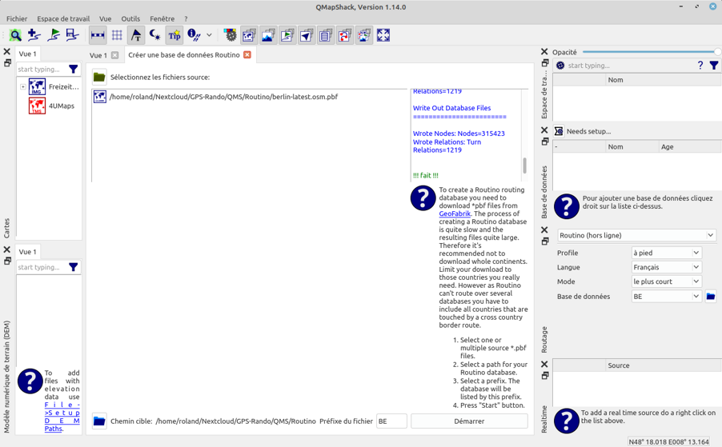
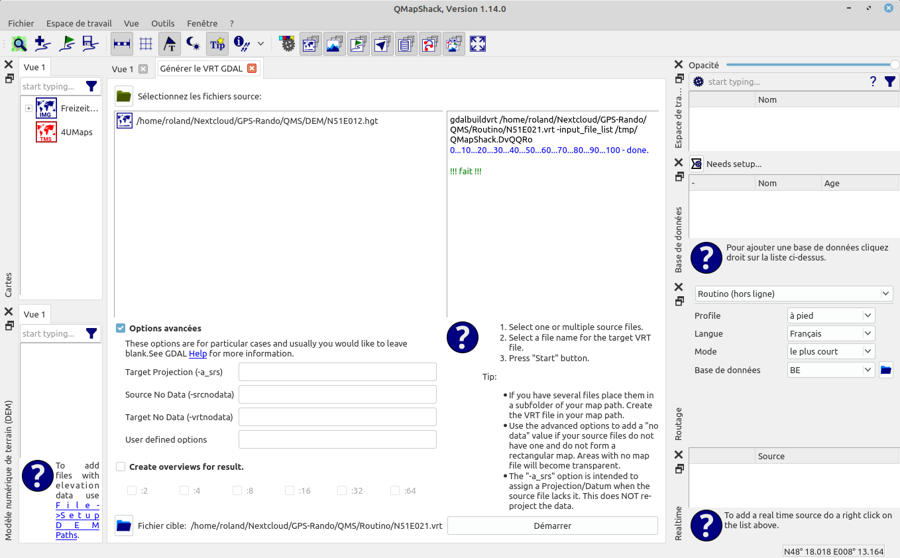
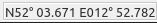
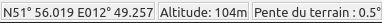
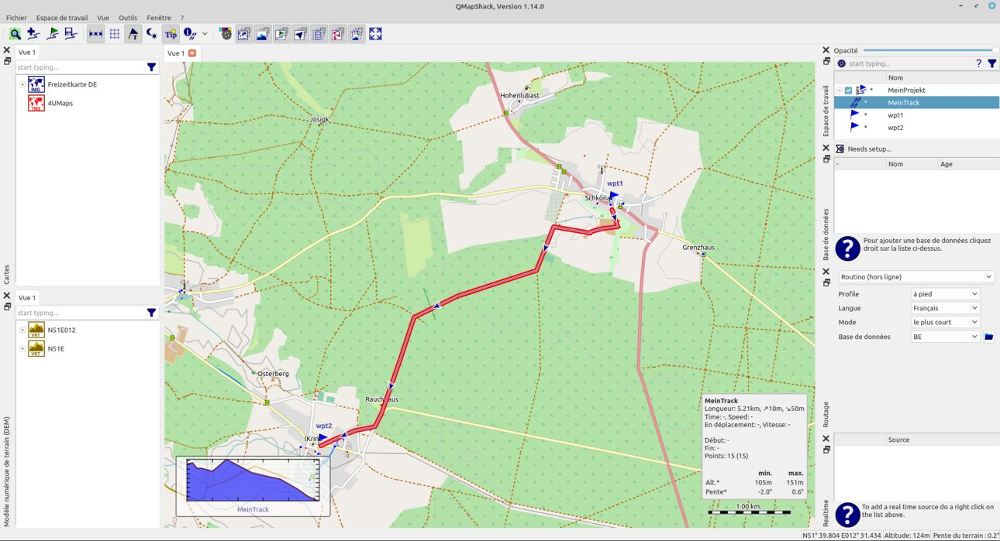
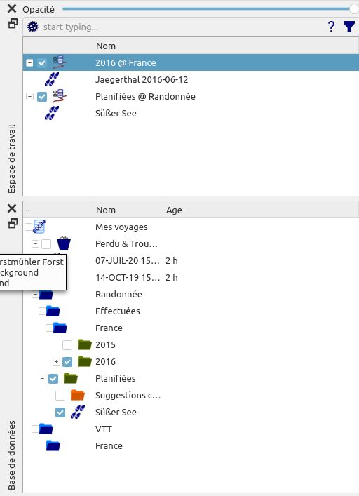
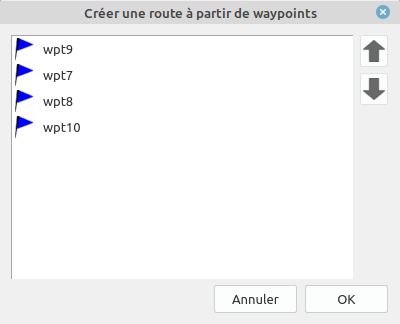
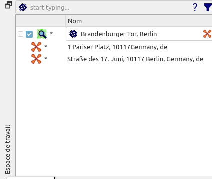

Prev () | [Home](Home) | [Manual](DocMain) | [Index](AxAdvIndex) | () Next
- - -

***Table of contents***

* [Démarrage rapide](#démarrage-rapide)
    * [Caractéristiques importantes de QMS](#caractéristiques-importantes-de-qms)
    * [Télécharger des fichiers depuis Internet](#télécharger-des-fichiers-depuis-internet)
    * [Installation](#installation)
    * [Étapes après le premier démarrage](#user-content-Étapes-après-le-premier-démarrage)
    * [Quelques étapes de travail typiques](#quelques-étapes-de-travail-typiques)
         * [Déplacer et agrandir la carte](#déplacer-et-agrandir-la-carte)
         * [Charger le fichier GPX et afficher les données](#charger-le-fichier-gpx-et-afficher-les-données)
         * [Créer une base de données](#créer-une-base-de-données)
         * [Organisation des données dans la base de données](#organisation-des-données-dans-la-base-de-données)
         * [Créer une trace](#créer-une-trace)
         * [Afficher les informations de piste](#afficher-les-informations-de-piste)
         * [Créer une trace (route) à l'aide de waypoints](#créer-une-trace-route-à-laide-de-waypoints)
         * [Trouver un waypoint](#trouver-un-waypoint)

* * * * * * * * * *
             
# Démarrage rapide
___(Instructions en français pour les utilisateurs de Windows)___

*Valide à partir du commit QMapShack 8ddec3217899 (mercredi 04 avril 17:38:39 2018 +0200).*

*À l'exception des parties liées à l'installation de QMapShack lui-même, ces instructions s'appliquent également aux systèmes d'exploitation non Windows.*

QMapShack (QMS en abrégé) pour Windows est une application 64 bits et nécessite donc un système d'exploitation Windows 64 bits.

Ces instructions sont aussi courtes que possible afin d'initier rapidement l'utilisateur au travail avec QMS. De nombreuses actions décrites peuvent également être exécutées sous d'autres formes. Il n'y a pas de discussion à ce sujet.

Des informations détaillées sur QMS peuvent être trouvées dans le [wiki](DocMain) en anglais.

Les utilisateurs qui disposent d'un QMS déjà installé trouveront une page d'accueil lorsqu'ils démarreront le système pour la première fois et pourront directement effectuer les différentes étapes d'installation décrites sur cette page à partir de là.

## Caractéristiques importantes de QMS

* Utilisation simple et flexible des cartes vectorielles, matricielles et en ligne

* Utilisation des données d'altitude (hors ligne et en ligne)

* Génération / planification d'itinéraires et de pistes avec différents routeurs

* Évaluation des données enregistrées (traces) de divers appareils de navigation et de fitness

* Modification des itinéraires et des tracés planifiés

* Stockage structuré des données dans des bases de données ou des fichiers

* Connexion directe en lecture et en écriture à des équipements de navigation et de fitness modernes
     
## Télécharger des fichiers depuis Internet

*Conseils :*

* Les numéros de version mentionnés sont susceptibles d'être modifiés. La dernière version disponible doit être sélectionnée.  

* Souvent, des fichiers pour des régions spécifiques peuvent être sélectionnés sur les pages spécifiées. L'utilisateur doit sélectionner la région qui l'intéresse.

* Les recommandations faites ici sont des exemples. Il y a beaucoup plus de choix!

Les liens suivants sont des recommandations pour les données qui facilitent l'utilisation de QMS et qui peuvent être téléchargées à partir d'Internet.

* *QMapShack:*
    * [Chargez le fichier d'installation de QMS à partir du serveur](https://github.com/Maproom/qmapshack/releases "QMS Installationsdatei laden"). Chargez le fichier `QMapShack_Win64bit_1.15.0.exe` à partir de cette page (environ 100 Mo, le numéro de version peut être différent).

* *Prise en charge de la carte (recommandée)* :
    * [Chargez la carte vectorielle de l'Allemagne (Freizeitkarte)](http://download.freizeitkarte-osm.de/garmin/latest/DEU_de_gmapsupp.img.zip "Freizeitkarte Deutschland"). (Lien direct vers un fichier, environ 1,4 Go! Si un appareil de navigation Garmin est utilisé, un fichier `gmapsupp*.img` approprié peut déjà être disponible et peut être utilisé pour cette étape).
    * _Facultatif:_ [Chargez les liens cartographiques en ligne](http://www.mtb-touring.net/qms/onlinekarten-einbinden/ "Online-Karten"). Remarque: cliquez sur le champ `Download Onlinemaps`! Fournit le fichier `Onlinemaps.zip`.

* *Prise en charge du routage (recommandé pour créer de nouvelles routes)* :
    * [Chargez les données Routino](http://download.geofabrik.de/europe/germany.html "Routino-Daten laden"). Sur cette page, par ex. allez à la ligne `Berlin` et cliquez sur `.osm.pbf` dans cette ligne. Fournit le fichier `berlin-latest.osm.pbf`.

* *Données d'altitude (recommandées si des informations d'altitude sont requises pour de nouveaux itinéraires)* :
 
    * [Chargez les tuiles pour les données d'altitude](https://dds.cr.usgs.gov/srtm/version2_1/SRTM3/Eurasia/ "Einzelne Kacheln"). Sélectionnez le(s) fichier(s) approprié(s) en utilisant les coordonnées, par ex. `N51E012.hgt.zip`. Les coordonnées données décrivent le coin sud-ouest d'une tuile.

        **Ou:**

    * [Chargez les données d'altitude pour les régions](http://www.viewfinderpanoramas.org/Coverage%20map%20viewfinderpanoramas_org3.htm "DEM Höhendaten für Regionen"). Sélectionnez la région appropriée sur la carte affichée et cliquez dessus. Par exemple un fichier `N32.zip` sera téléchargé. `N32` est le nom de la zone nommée UTM.

    _Remarque:_ tous les fichiers requis pour la région sélectionnée doivent être téléchargés !

## Installation

* Tous les fichiers téléchargés se trouvent généralement dans le répertoire `Téléchargements` de l'utilisateur.

* Recherchez le fichier `QMapShack_Install_Windows64bit__1.15.0.exe` dans le répertoire de téléchargement.

* Démarrez ce fichier d'installation en double-cliquant sur le nom du fichier.

* Confirmez les informations dans les premières fenêtres d'installation.

* Dans la fenêtre `Sélectionner les composants`, l'élément d'exécution `MSVC++ 2017 runtime` doit être sélectionné (cela peut être omis si cet environnement d'exécution est déjà installé sur l'ordinateur utilisé).

* Confirmez le début de l'installation de l'environnement d'exécution. *Remarque*: l'installation peut prendre quelques minutes !

* À la fin de l'installation de l'environnement d'exécution, cette installation doit se terminer par `Close`. L'installation de QMS se poursuivra alors et QMS sera entièrement installé.

* **Attention:** *Les caractères non ASCII ne peuvent pas être utilisés dans les noms des répertoires d'installation !*

* QMS peut déjà être démarré via le menu `Démarrer`. Cependant, il est recommandé d'effectuer les étapes suivantes au préalable.

* Créez un répertoire dans lequel l'utilisateur a un accès en écriture. Dans la suite de ce mode d'emploi, ce répertoire est appelé `QMS`. _Remarque:_ L'utilisateur ne dispose pas des droits d'écriture complets pour le répertoire d'installation standard, donc un répertoire distinct pour les données doit être créé à cette étape.

* Créez les sous-répertoires suivants dans le répertoire QMS:
    * `Maps`,
    * `Routino`,
    * `BRouter`,
    * `DEM`,
    * `Databases`,
    * `GPX`.
    
* Ouvrez le fichier `DEU_de_gmapsupp.img.zip` avec la carte des loisirs de l'Allemagne et copiez le fichier `gmapsupp.img` qu'il contient dans le répertoire `Maps`.

* Renommez le fichier `gmapsupp.img` en `Freizeitkarte_DE.img`.

* _Facultatif:_ Ouvrez le fichier `Onlinemaps.zip` et copiez les fichiers qu'il contient dans le répertoire `Maps`.

* _Facultatif:_ Déplacez le fichier `berlin-latest.osm.pbf` dans le répertoire `Routino`.

* _Facultatif:_ Ouvrez le fichier `N51E012.hgt.zip` ou `N32.zip` et copiez les fichiers qu'il contient dans le répertoire `DEM`.

## Étapes après le premier démarrage

* Démarrez QMS via le menu `Démarrer` (sélectionnez `QMapShack - QMapShack`).

* L'interface QMS encore vide apparaît. Si la langue du système d'exploitation est l'français, l'français est également utilisé comme langue dans l'interface QMS.

    

    La partie centrale de la surface est utilisée pour les affichages cartographiques, pour les fenêtres d'édition des données et à d'autres fins. Lorsque vous démarrez QMS pour la première fois, une page d'accueil s'affiche ici, comme mentionné ci-dessus.

    Les 6 fenêtres partielles sur le bord gauche et droit (`Cartes`, `Modèle numérique de terrain (DEM)`, `Espace de travail`, `Base de données`, `Routage`, `Realtime`) peuvent être déplacées individuellement et disposées différemment sur le bord gauche ou droit de la fenêtre principale ainsi que flottant librement (fenêtres dites ancrées). Ils peuvent être ouverts et fermés à l'aide de l'élément de menu `Fenêtre` ou des icônes correspondantes dans la barre d'outils. La barre d'outils est également une fenêtre ancrée et peut être positionnée ailleurs.

* La page d'accueil vous permet d'effectuer certaines des étapes d'installation décrites ici directement à partir de la surface de travail QMS. La page d'accueil disparaît dès qu'une carte est activée. Il peut être rendu visible à nouveau en désactivant toutes les cartes activées.

* Lorsque vous travaillez avec QMS, vous recevez souvent des informations sur les actions à effectuer sous forme de bulles d'informations lorsque vous pointez la souris sur un objet affiché.

* *Activez les cartes vectorielles et définissez le niveau de détail:*
    * Utilisez la souris pour accéder à la fenêtre `Cartes`.
    
    * Cliquez avec le bouton droit de la souris pour ouvrir le menu contextuel et choisissez `Configurer les répertoires des cartes`.

    * Ouvrez le répertoire `QMS\Maps` et sélectionnez ce répertoire.

    * La nouvelle entrée `Freizeitkarte DE` apparaît dans la fenêtre de carte.

    * Cliquez avec le bouton droit sur le nom de la carte pour ouvrir le menu contextuel et sélectionnez `Activer`.

    * Déplacez la carte vers un emplacement inclus sur la carte. La carte doit être visible.

    * Un double clic sur le nom d'une carte vectorielle activée ouvre l'affichage des propriétés de la carte à définir:
        * Transparence de la carte (curseur).

        * Affichage des zones, des lignes et des points.

        * Affichage des détails de la carte (réglable entre -5 et 5).

        * Forme de représentation des objets cartographiques (sélection d'un fichier `TYP`).

    * Remarque: En utilisant l'élément de menu `Vue - Ajouter une vue cartographique`, des fenêtres cartographiques supplémentaires peuvent être ouvertes et configurées indépendamment les unes des autres en fonction des besoins de l'utilisateur.

* *Facultatif: Activer les cartes en ligne: (nécessite la sélection du répertoire de cartes à l'étape précédente!)*

    * Utilisez la souris pour accéder à la fenêtre `Cartes`.

    * Cliquez avec le bouton droit pour ouvrir le menu contextuel et sélectionnez `Recharger les cartes`.

    * Une nouvelle entrée apparaît dans la fenêtre de la carte, par ex. `4UMaps-eu` (peut-être déjà apparu lors de l'activation de la carte vectorielle!).

    * Cliquez avec le bouton droit sur le nom de la carte pour ouvrir le menu contextuel et sélectionnez `Activer`.

    * Si une connexion Internet est active, la carte en ligne sélectionnée est chargée (cela peut prendre un certain temps, l'indicateur de progression apparaît!) Et affichée dans la fenêtre du milieu.

        

* *Facultatif: activer la prise en charge du routage de routino :*
    * Sélectionnez l'élément de menu `Outil - Créer une base de données Routino`.
    * Une nouvelle fenêtre s'ouvre.
    * Sélectionnez `QMS\Routino\berlin-latest.osm.pbf` comme fichier source et `QMS\Routino` comme chemin cible (d'autres chemins sont indiqués dans l'image suivante pour des raisons techniques !).
    * Entrez comme préfixe de fichier, par exemple `BE`.
    * Choisissez `Démarrer`.
    * Dans la colonne de droite de la fenêtre, vous pouvez suivre les actions en cours. Ce processus peut prendre un certain temps! La fin de l'opération s'affiche.
    * Accédez à la fenêtre `Routage` et ajoutez le répertoire `QMS\Routino` à l'aide de l'icône d'ouverture de dossier.
    * Ouvrez la liste de sélection de la base de données dans la fenêtre `Routage` et sélectionnez `BE`.
    * Avec le support du routeur Routino hors ligne, des pistes et des routes peuvent maintenant être créées (dans la zone couverte par la base de données sélectionnée, dans l'exemple pour Berlin !).
    
        
    
* *Facultatif : activez la prise en charge des données numériques d'altitude :*
    * Sélectionnez l'élément de menu `Outils - Générateur de VRT`.
    * Une nouvelle fenêtre s'ouvre.
    * Sélectionnez `QMS\DEM\N51E012.hgt` comme fichier source (sélection multiple pour d'autres fichiers HGT possible !) Et `QMS\DEM\N51E012` comme fichier cible (l'extension `.vrt` est ajoutée automatiquement). Pour des raisons techniques, d'autres chemins sont illustrés dans l'image suivante.
    * Choisissez démarrer. La fin de l'opération s'affiche.
    
            

    * Utilisez la souris pour accéder à la fenêtre `Modèle numérique de terrain (DEM)`.
    * Cliquez avec le bouton droit pour ouvrir le menu contextuel et choisissez `Spécifier les répertoires DEM`.
    * Sélectionnez `QMS\DEM` comme répertoire.
    * Dans la fenêtre `Modèle numérique de terrain (DEM)` apparaît désormais entre autres une entrée `N51E012`.
    * Cliquez avec le bouton droit sur ce nom pour ouvrir le menu contextuel et sélectionnez `Activer`.
    * Les données d'altitude sont maintenant disponibles pour la zone sélectionnée (le coin sud-ouest de la zone dans l'exemple a les coordonnées 51 ° nord, 12 ° est et s'étend sur 1 ° dans les deux directions).
    * La présence de données d'altitude à l'emplacement du pointeur de la souris est indiquée dans la ligne d'état par une information d'altitude existante.

    Ligne d'état sans données d'altitude :
    
    

    Ligne d'état avec données d'altitude:
    
    
  
Avec ces étapes, QMS est prêt à fonctionner.

## Quelques étapes de travail typiques

### Déplacer et agrandir la carte
* Avec le clavier :

    * Les touches fléchées déplacent la carte dans la direction sélectionnée.

    * Les boutons "+" et "-" augmentent ou diminuent l'échelle de la carte.

* Avec la souris :

    * Appuyer sur le bouton gauche de la souris et le maintenir enfoncé permet de déplacer la carte avec la souris. Lorsque la position souhaitée sur la carte est atteinte, relâchez le bouton de la souris.

    * La carte peut être agrandie ou réduite à l'aide de la molette de la souris.

### Charger le fichier GPX et afficher les données

* *Exemple :* un fichier GPX `QMS\GPX\MeinProjekt.gpx` est disponible.

* __Remarque :__ les fichiers SIG dans certains autres formats (TCX, FIT, ...) peuvent également être chargés de la même manière !

    * Sélectionnez l'élément de menu `Fichier - Charger des données SIG` et sélectionnez `QMS\GPX\MeinProjekt.gpx` dans la fenêtre de sélection de fichier.

    * Une nouvelle entrée nommée `MeinProjekt` apparaît dans la fenêtre `Espace de travail`.

    * Après avoir ouvert le projet par un double clic, les objets de données (waypoints, traces, routes, etc.) dans le fichier GPX (c'est-à-dire le projet) sont affichés.

    * Si vous déplacez le pointeur de la souris sur l'une des lignes affichées, vous obtenez des informations sur l'objet en question.

    * Un double clic sur un waypoint ou une trace centre la carte sélectionnée autour de cet objet.

    

### Créer une base de données

QMS propose différentes formes de stockage de données. Une forme recommandée et puissante consiste à stocker des données dans une base de données. Les étapes suivantes sont nécessaires pour créer une base de données:

* Accédez à la fenêtre `Base de données` avec la souris.

* Cliquez avec le bouton droit pour ouvrir le menu contextuel et choisissez `Ajouter une base de données`.

* Dans la fenêtre suivante, donnez un nom de base de données (dans l'exemple `Mes voyages`) et un nom de fichier au format `QMS\Databases\MyDatabase.db` comme emplacement de stockage (gardez SQLite sélectionné !).

* Le nom de la base de données sélectionnée apparaît comme une nouvelle ligne dans la fenêtre de la base de données.

### Organisation des données dans la base de données

Les bases de données QMS permettent une disposition claire des données en forme d'arborescence similaire à celle d'une arborescence de répertoires. Les nœuds de l'arborescence (également appelés dossiers) peuvent se voir attribuer l'un des trois types différents pour une organisation plus claire des données :

* *Groupe :* sert uniquement à regrouper les dossiers subordonnés. Ne peut contenir que des sous-dossiers, mais pas de données.

* *Projet, autre :* peut contenir des sous-dossiers et des données. Les données peuvent être affichées et modifiées dans la fenêtre de l'Espace de travail.

Les bases de données sont stockées physiquement. L'enregistrement peut être effectué manuellement ou, après réglage via l'élément de menu `Espace de travail - Configurer l'espace de travail`, également automatiquement à intervalles réguliers.

*Exemple :*

Les noms choisis dans l'exemple décrivent le but de la base de données et des différents dossiers.

Le groupe `VTT` peut être créé avec une structure analogue.

La création de bases de données a été décrite à l'étape précédente.

La création de groupes, projets et autres dossiers suit le même schéma :

* Ouvrez le menu contextuel en cliquant avec le bouton droit sur la base de données ou le nom du dossier.

* Sélectionnez l'élément de menu `Ajouter un dossier`.

* Dans la fenêtre suivante, sélectionnez le nom du dossier et le type de dossier (différents types affichent des couleurs de dossier différentes).

*Informations additionnelles :*

* En cochant le champ devant le nom du dossier, le dossier est ouvert dans la fenêtre de l'espace de travail et les données qu'il contient sont affichées dans la fenêtre de la carte (si elles sont également sélectionnées). Pour identifier plus clairement l'origine du dossier, le nom du dossier suivant est ajouté au nom du dossier après le séparateur "@". Cet ajout ne s'applique pas aux dossiers du niveau supérieur. Cette procédure permet un affichage ciblé et structuré des données sélectionnées dans l'espace de travail et dans la fenêtre cartographique.

* La modification et la suppression des données ont lieu dans la fenêtre de l'espace de travail. Si les données d'un dossier ont été éditées, cela est indiqué par un point devant le nom du dossier et le nom des données (dans l'exemple, la trace `Jaegerthal` a été éditée mais pas encore enregistrée dans la base de données). Les projets modifiés doivent être régulièrement enregistrés dans la base de données via l'entrée de menu contextuel `Enregistrer`.

* La suppression complète des données doit être effectuée dans la fenêtre de la base de données. Les données supprimées sont déplacées vers le dossier `Lost & Found` créé automatiquement et peuvent être supprimées définitivement à partir d'ici. Supprimer dans la fenêtre de l'espace de travail supprime les données du projet affiché, mais pas de la base de données.

* En plus des dossiers (projets) appartenant à des bases de données, il existe également des projets qui sont enregistrés directement dans un fichier GPX ou QMS.

### Créer une trace

* *Exemple :* La prise en charge du routage a été installée et est activée.
    
* Utilisez la souris pour accéder à la fenêtre `Routage`.
    
* Sélectionnez `Routino (hors ligne)` dans la liste déroulante supérieure de la fenêtre.
    
* Dans les autres listes, sélectionnez le profil (le moyen de déplacement), la langue (pour les directions étape par étape), le mode (le plus court / le plus rapide) et l'une des bases de données de routage existantes (BE dans l'exemple).
    
* Déplacez la souris vers le point de départ du tracé dans la fenêtre de la carte.

* Cliquez avec le bouton droit pour ouvrir le menu contextuel et sélectionnez `Ajouter une trace`.
    
* Appuyez sur `A` sur le clavier (cela sélectionne le mode de routage automatique).
    
* Déplacez la souris sur le point intermédiaire souhaité suivant de la piste et fixez-le avec un clic gauche. Entre les deux derniers points sélectionnés, un itinéraire intermédiaire est automatiquement déterminé et affiché en fonction des options d'itinéraire sélectionnées.
    
* Répétez l'étape précédente jusqu'à ce que vous atteigniez la fin de la trace.
    
* Cliquez avec le bouton droit pour terminer l'ajout de nouveaux points de trace.
    
* Sélectionnez `Enregistrer sous...` dans la barre d'outils en haut de la fenêtre de la carte.
    
* Entrez un nom de trace.
    
* Choisissez un nouveau nom de projet et `Base de données` comme type de projet.
    
* Choisissez la base de données disponible.
    
* Choisissez un nom pour un dossier de base de données.

* Un nouveau projet portant le nom sélectionné s'affiche dans la fenêtre de l'espace de travail. Celui-ci contient la trace nouvellement créée.
    
* Un nouveau dossier pour la base de données utilisée s'affiche dans la fenêtre de la base de données.
    
* Cliquez avec le bouton droit sur le nom du projet pour ouvrir le menu contextuel et sélectionnez `Enregistrer`. Le projet avec ses données est enregistré en permanence dans le dossier de base de données sélectionné. La trace enregistrée apparaît sous forme de ligne dans le dossier de la base de données.

### Afficher les informations de piste

Les informations de suivi sont disponibles sous différentes formes et niveaux de détail:

* *Dans la fenêtre de l'espace de travail :* Si le pointeur de la souris est placé sur le nom de la trace, des informations récapitulatives sur la trace s'affichent.
    
* *Dans la fenêtre de la carte :* en double-cliquant sur le nom de la trace dans la fenêtre de l'espace de travail, la fenêtre de la carte est paramétrée de manière à ce que la trace s'affiche en entier. Si vous placez le pointeur de la souris sur le tracé dans la fenêtre de la carte, la distance au début et à la fin du tracé ainsi que les informations sur le point de tracé sélectionné (altitude, vitesse, ...) sont affichés pour le point de tracé sélectionné.
    
* *Dans la fenêtre info / édition de trace :* Cette fenêtre s'ouvre via le menu contextuel de trace dans la fenêtre du poste de travail à l'aide de l'élément de menu `Éditer...` En plus des informations récapitulatives, il affiche jusqu'à 3 courbes de progression. En fonction des disponibilités : l'altitude, la vitesse, la pente peuvent être affichées graphiquement sur la distance ou le temps. La sélection se fait via l'onglet `Graphiques`. Cette fenêtre prend également en charge l'édition des pistes planifiées via une série de filtres qui peuvent être sélectionnés dans l'onglet `Filtre`.

### Créer une trace (route) à l'aide de waypoints

* *Tâche :* Le but est de trouver une trace à travers une série donnée de waypoints.

* *Hypothèse :* La prise en charge du routage a été installée et est activée.

* Si nécessaire, copiez tous les waypoints à utiliser dans 1 projet.

* Dans la fenêtre `Routage`, sélectionnez le routeur souhaité (`Routino (hors ligne)`) et les options de routage souhaitées.

* Dans l'espace de travail, tout en maintenant la touche `CTRL` enfoncée, sélectionnez les waypoints que vous souhaitez parcourir dans l'ordre souhaité.

* Cliquez avec le bouton droit sur un waypoint sélectionné pour ouvrir le menu contextuel et sélectionnez `Create une route`.

* Vérifiez et, si nécessaire, modifiez l'ordre des waypoints dans la nouvelle fenêtre `Créer une route à partir de waypoints`.

    

* Sélectionnez `OK` pour créer une route à travers les waypoints.

* Donnez un nom à la nouvelle route et attribuez-la à un projet.

* Cliquez avec le bouton droit de la souris sur la nouvelle route dans le projet pour ouvrir le menu contextuel et sélectionnez `Convertir en trace`.

* Donnez un nom à la nouvelle trace et attribuez-la à un projet.

### Trouver un waypoint

* *Hypothèse :* une connexion Internet est disponible.

* Sélectionnez l'élément de menu `Espace de travail - Geosearch`. Un champ de saisie s'ouvre dans la fenêtre du lieu de travail.

* Saisissez l'emplacement ou l'adresse du waypoint que vous recherchez sous la forme habituelle sur Internet et confirmez votre saisie avec la touche `Entrée`.

    

* Si le waypoint souhaité est trouvé à l'aide de la recherche géographique, le résultat apparaît comme un waypoint sous le champ de saisie (plusieurs résultats peuvent également être affichés).

* Copiez le nouveau waypoint dans un projet normal pour l'enregistrer.

* Cliquer sur l'icône des paramètres de recherche ouvre une fenêtre dans laquelle différents moteurs de recherche peuvent être sélectionnés et les données utilisateur requises peuvent être saisies. Les détails peuvent être trouvés dans la section Geosearch de ce Wiki.

- - -
Prev () | [Home](Home) | [Manual](DocMain) | [Index](AxAdvIndex) | [Top](#) | () Next
