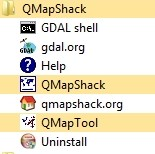
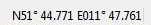

Prev () | [Home](Home) | [Manual](DocMain) | [Index](AxAdvIndex) | () Next
- - -
[TOC]
- - -

# Schnellstart
___(deutsche Anleitung für Windows-Nutzer)___

_gültig ab QMapShack commit 8ddec3217899 (Wed Apr 04 17:38:39 2018 +0200)_

_Mit Ausnahme der Teile, die sich auf die Installation von QMapShack selbst beziehen, gilt diese Anleitung auch für 
nicht-Windows-Betriebssysteme._ 

QMapShack (kurz QMS) für Windows ist eine 64-bit-Anwendung und erfordert deshalb ein 64-bit Windows Betriebssystem.

Diese Anleitung ist möglichst kurz gehalten, um den Nutzer rasch an die Arbeit mit QMS heranzuführen. Viele der beschriebenen
Aktionen können auch in anderer Form ausgeführt werden. Auf eine Diskussion dazu wird verzichtet.

Ausführliche Informationen zu QMS erhält man im englischsprachigen [Wiki](DocMain "QMS Wiki").

Nutzer, die über ein bereits installiertes QMS verfügen, finden beim ersten Start eine Willkommensseite und können von dort aus direkt verschiedene der Installationsschritte ausführen, die auf dieser Seite beschrieben werden.

## Wichtige Eigenschaften von QMS

* Einfache und flexible Nutzung von Vektor-, Raster- und Onlinekarten
* Nutzung von Höhendaten (offline und online)
* Erzeugung/Planung von Routen und Tracks mit verschiedenen Routern
* Auswertung aufgezeichneter Daten (Tracks) aus unterschiedlichen Navigations- und Fitnessgeräten
* Bearbeitung geplanter Routen und Tracks
* Strukturierte Speicherung von Daten in Datenbanken oder Dateien
* Direkte Lese- und Schreibverbindung zu modernen Navigations- und Fitnessgeräten

## Dateien aus dem Internet herunterladen

_Hinweise_:

* Die genannten Versionsnummern können sich ändern. Es sollte jeweils die neueste verfügbare Version gewählt werden.
* Häufig können auf den angegebenen Seiten Dateien für bestimmte Regionen ausgewählt werden. Der Nutzer sollte die ihn
  interessierende Region auswählen. 
* Die hier gemachten Empfehlungen sind Beispiele. Es gibt viele weitere Auswahlmöglichkeiten!  

Die folgenden Links sind Empfehlungen für Dateien, die ein bequemes Arbeiten mit QMS ermöglichen und die aus dem Internet 
heruntergeladen werden können.

* _QMapShack_:

    * [QMS vom Server laden](https://www.pling.com/p/1127946 "QMS Installationsdatei laden").
      Von dieser Seite Datei `QMapShack_Win64bit_1.13.2.exe	` laden (etwa 100 MB, Versionsnummer kann verschieden sein).

* _Kartenunterstützung (empfohlen)_:

    * [Vektorkarte Deutschland (Freizeitkarte) laden](http://download.freizeitkarte-osm.de/garmin/latest/DEU_de_gmapsupp.img.zip "Freizeitkarte Deutschland"). 
      (Direkter Dateilink, etwa 1.4 GB! Falls Garmin Navigationsgerät benutzt wird, ist eine geeignete Datei `gmapsupp*.img` möglicherweise schon vorhanden 
      und kann für diesen Schritt benutzt werden)
    * _Optional:_ [Online-Kartenlinks laden](http://www.mtb-touring.net/qms/onlinekarten-einbinden/ "Online-Karten"). _Hinweis:_ Feld `Download online maps`
      klicken! Liefert Datei `Onlinemaps.zip`.
    
* _Routingunterstützung (empfohlen zum Erstellen neuer Strecken)_:

    * [Routino-Daten laden](http://download.geofabrik.de/europe/germany.html "Routino-Daten laden"). Auf dieser Seite z.B. in Zeile `Berlin` gehen und 
      in dieser Zeile auf `.osm.pbf` klicken. Liefert Datei `berlin-latest.osm.pbf`.
    
* _Höhendaten (empfohlen, falls Höhenangaben für neue Strecken erforderlich sind)_:     

    * [Kacheln für Höhendaten laden](https://dds.cr.usgs.gov/srtm/version2_1/SRTM3/Eurasia "Einzelne Kacheln"). Über die Koordinaten passende
      Datei(en) auswählen, z.B. `N51E012.hgt.zip`. Die angegebenen Koordinaten beschreiben die südwestliche Ecke einer Kachel.
    
        _Oder:_
      
    * [Höhendaten für Regionen laden](http://www.viewfinderpanoramas.org/Coverage%20map%20viewfinderpanoramas_org3.htm "DEM Höhendaten für Regionen"). 
      Auf der
      angezeigten Karte passende Region wählen und auf diese klicken. Es wird z.B. eine Datei `N32.zip` heruntergeladen. `N32` ist dabei
      die Bezeichnung für die sogenannte UTM-Zone.

    _Hinweis:_ Es sollten alle für die gewählte Region erforderlichen Dateien heruntergeladen werden!
    
## Installation
* Alle heruntergeladenen Dateien sind im Download-Verzeichnis des Nutzers zu finden.
* Finde die Datei `QMapShack_Install_Windows64bit__1.9.1.exe` im Download-Verzeichnis.
* Starte diese Installationsdatei durch einen Doppelklick auf den Dateinamen.
* Bestätige die Informationen in den ersten Installationsfenstern.
* Im Fenster `Komponenten auswählen` muss der Punkt `MSVC++ 2013 SP1 runtime` ausgewählt werden (dies kann unterbleiben, wenn auf dem
  benutzten Rechner bereits diese Laufzeitumgebung installiert ist). 
* Bestätige das Starten der Installation der Laufzeitumgebung. _Hinweis:_ Die Installation kann einige Minuten dauern!
* Am Ende der Installation der Laufzeitumgebung muss mit `Close` diese Installation beendet werden. Die QMS Installation wird daraufhin fortgesetzt
  und QMS wird vollständig installiert. 
* Bereits jetzt kann QMS über das Startmenü gestartet werden. Es wird aber empfohlen, vorher 
  noch die folgenden Schritte auszuführen.
* Lege ein Verzeichnis an, in dem der Nutzer Schreibrechte hat. In der folgenden Diskussion wird 
  dieses Verzeichnis `QMS` genannt. _Anmerkung:_ Der Nutzer hat keine 
  vollständigen Schreibrechte für das Standardinstallationsverzeichnis, deshalb muss in diesem Schritt ein 
  gesondertes Verzeichnis für Daten angelegt werden.
* Lege im Verzeichnis `QMS` die folgenden Unterverzeichnisse an:
    * `Maps`,
    * `Routino`,
    * `BRouter`,
    * `DEM`,
    * `Databases`,
    * `GPX`.
* Öffne die Datei `DEU_de_gmapsupp.img.zip` mit der Freizeitkarte Deutschland und kopiere die darin enthaltene Datei `gmapsupp.img` 
  in das Verzeichnis `Maps`.
* Benenne die Datei `gmapsupp.img` in `Freizeitkarte_DE.img` um.
* _Optional:_ Öffne die Datei `Onlinemaps.zip` und kopiere die darin enthaltenen Dateien in das Verzeichnis `Maps`.
* _Optional:_ Verschiebe die Datei `berlin-latest.osm.pbf` in das Verzeichnis `Routino`.
* _Optional:_ Öffne die Datei `N51E012.hgt.zip` bzw. `N32.zip` und kopiere die darin enthaltenen Dateien in das Verzeichnis `DEM`.

## Schritte nach dem ersten Start

* Starte QMS über das Startmenü (`QMapShack - QMapShack` wählen).

    
  
* Es erscheint die noch leere QMS Oberfläche. Ist die Betriebssystemssprache deutsch, so wird auch deutsch als Sprache in 
  der QMS Oberfläche benutzt.
  
    

    Der mittlere Teil der Oberfläche wird für Kartendarstellungen, für Fenster zum Editieren von Daten und für einige weitere Zwecke benutzt. Beim ersten Start von QMS wird hier, wie oben erwähnt, eine Willkommensseite angezeigt. 
  
    Die 6 Teilfenster am linken und rechten Rand (`Karten`, `Dig. Höhenmodell (DEM)`, `Arbeitsplatz`, `Datenbank`, `Streckenführung`, `Echtzeit`) können einzeln verschoben und
    anders am linken oder rechten Rand des Hauptfensters sowie frei schwebend angeordnet werden (sog. _angedockte Fenster_). Mithilfe des Menüpunkts `Fenster` bzw. der entsprechenden Ikonen der Werkzeugleiste können sie geöffnet und geschlossen werden. Die Werkzeugleiste ist ebenfalls ein angedocktes Fenster und kann an anderer Stelle positioniert werden.

* Die Willkommensseite ermöglicht es, einige der hier beschriebenen Installationsschritte auch direkt aus der Arbeitsoberfläche von QMS auszuführen. Die Willkommensseite verschwindet, sobald eine Karte aktiviert wird. Sie kann durch deaktivieren aller aktivierten Karten wieder sichtbar gemacht werden.
* Beim Arbeiten mit QMS erhält man häufig Hinweise über auszuführende Aktionen in Form von Infoblasen, wenn man mit der Maus auf ein angezeigtes Objekt weist. 
* _Vektorkarten aktivieren und Detailgrad einstellen:_ 
    * Gehe mit der Maus in das Fenster `Karten`.
    * Öffne mit Rechtsklick das Kontextmenü und wähle `Kartenverzeichnis angeben`.
    * Öffne das Verzeichnis `QMS\Maps` und wähle dieses Verzeichnis aus.
    * Im Kartenfenster erscheint als neuer Eintrag `Freizeitkarte DE`.
    * Öffne mit Rechtsklick auf den Kartennamen das Kontextmenü und wähle `Aktivieren`.
    * Verschiebe Karte zu einer Position, die in der Karte enthalten ist. Die Karte sollte zu sehen sein.
    * Ein Doppelklick auf den Namen einer aktivierten Vektorkarte öffnet die Anzeige einzustellender Karteneigenschaften:
      * Transparenz der Karte (Schieberegler).
      * Anzeige von Gebieten, Linien und Punkten.
      * Anzeige von Kartendetails (einstellbar zwischen -5 und 5).
      * Form der Darstellung von Kartenobjekten (Auswahl einer `TYP`-Datei).
    * _Bemerkung:_ Mittels des Menüpunkts `Ansicht - Kartenansicht hinzufügen` können weitere Kartenfenster geöffnet und unabhängig voneinander nach Nutzerwünschen eingerichtet werden.
    
* _Optional: Online-Karten aktivieren: (setzt Wahl des Kartenverzeichnisses in vorhergehenden Schritt voraus!)_
    * Gehe mit der Maus in das Fenster `Karten`.
    * Öffne mit Rechtsklick das Kontextmenü und wähle `Karten erneut laden`.
    * Im Kartenfenster erscheint als neuer Eintrag z.B. `4UMaps-eu` (war möglicherweise schon während der Aktivierung der Vektorkarte
      erschienen!).
    * Öffne mit Rechtsklick auf den Kartennamen das Kontextmenü und wähle `Aktivieren`.
    * Falls eine Internetverbindung aktiv ist, wird die gewählte Onlinekarte geladen (kann etwas dauern, Verlaufsanzeige erscheint!) 
      und im mittleren Fenster angezeigt.

      
    
    
* _Optional: Routino Routingunterstützung aktivieren:_
    * Wähle den Menüpunkt `Werkzeug - Routino Datenbank erstellen`.
    * Es öffnet sich ein neues Fenster.
    * Wähle als Quelldatei `QMS\Routino\berlin-latest.osm.pbf` und als Zielpfad `QMS\Routino` aus (_im nachfolgenden Bild werden aus technischen Gründen andere Pfade gezeigt!_).
    * Gib als Dateipräfix z.B. `BE` ein.
    * Wähle `Starten`.
    * In der rechten Spalte des Fensters kann man die ablaufenden Aktionen verfolgen. Dieser Vorgang kann einige Zeit dauern!
      Der Abschluss der Operation wird angezeigt.
    * Gehe zum Fenster `Streckenführung` und füge über die Öffnen-Ikone das Verzeichnis `QMS\Routino` hinzu.
    * Öffne die Datenbankauswahlliste im Fenster `Streckenführung` und wähle `BE`.
    * Es können jetzt mit Unterstützung des offline Routino-Routers Tracks und Routen erstellt werden (in dem Bereich der durch die 
      gewählte Datenbank abgedeckt wird, im Beispiel für Berlin!).
      
      
      
      
* _Optional: Unterstützung für digitale Höhendaten aktivieren:_    
    * Wähle den Menüpunkt `Werkzeug - VRT Builder`.
    * Es öffnet sich ein neues Fenster.
    * Wähle als Quelldatei `QMS\DEM\N51E012.hgt` (Mehrfachauswahl für weitere HGT-Dateien möglich!) und als Zieldatei `QMS\DEM\N51E012` aus
      (die Endung `.vrt` wird automatisch angefügt). _Im nachfolgenden Bild werden aus technischen Gründen andere Pfade gezeigt!_.
    * Wähle `Start`. Der Abschluss der Operation wird angezeigt.

      

    * Gehe mit der Maus zum Fenster `Dig. Höhenmodell (DEM)`.
    * Öffne mit Rechtsklick das Kontextmenü und wähle `DEM Verzeichnisse angeben`.
    * Wähle `QMS\DEM` als Verzeichnis aus.
    * In dem Fenster  `Dig. Höhenmodell (DEM)` erscheint jetzt u.a. ein Eintrag `N51E012`.
    * Öffne mit Rechtsklick auf diesen Namen das Kontextmenü und wähle `Aktivieren`.
    * Es stehen jetzt Höhendaten für den gewählten Bereich zur Verfügung (die südwestliche Ecke des Bereichs hat im Beispiel die Koordinaten 
      51° Nord, 12° Ost und erstreckt sich jeweils über 1° in beide Richtungen).
    * Das Vorhandensein von Höhendaten am Ort des Mauszeigers wird in der Statuszeile durch eine vorhandene Höhenangabe angezeigt.

        Statuszeile ohne Höhendaten:
      
        
    
        Statuszeile mit Höhendaten:
      
        
      
    
    
Mit diesen Schritten ist ein arbeitsfähiger Zustand für QMS hergestellt.

   
## Einige typische Arbeitsschritte

### Karte bewegen und zoomen

* _Mit der Tastatur:_ 
    * Pfeiltasten bewegen die Karte in die jeweilige Richtung.
    * Die Tasten "__+__" und die "__-__" vergrößern bzw. verkleinern den Kartenmaßstab.
* _Mit der Maus:_
    * Linke Maustaste drücken und gedrückt halten fixiert die Karte an der Maus. Beim Bewegen der Maus (ohne Loslassen der gedrückten Taste)
      wird die Karte bewegt. Ist die gewünschte Kartenposition erreicht, Maustaste loslassen.
    * Mit dem Mausrad kann die Karte vergrößert oder verkleinert werden.  
    
    
### GPX-Datei laden und Daten anzeigen

* _Annahme:_ Es ist eine GPX-Datei `QMS\GPX\MeinProjekt.gpx` vorhanden.
* __Hinweis:__ Es können auch GIS-Dateien in einigen anderen Formaten (TCX, FIT, ...) in ähnlicher Weise geladen werden!
* Wähle Menüpunkt `Datei - GIS Daten laden` und wähle `QMS\GPX\MeinProjekt.gpx` im Dateiauswahlfenster aus.
* Im Fenster `Arbeitsplatz` erscheint ein neuer Eintrag mit Namen `MeinProjekt`.
* Nach Öffnen des Projekts durch Doppelklick werden die in der GPX-Datei (d.h. die im Projekt) vorhandenen Datenobjekte (Wegpunkte, Tracks, Routen, ...) angezeigt.
* Bewegt man den Mauszeiger auf eine der angezeigten Zeilen, so erhält man einige Informationen über das jeweilige Objekt.
* Ein Doppelklick auf einen Wegpunkt oder einen Track zentriert die gewählte Karte um dieses Objekt.

     

### Datenbank anlegen

QMS bietet verschiedene Formen der Datenspeicherung an. Eine empfohlene und leistungsfähige Form ist das Speichern von Daten in
einer Datenbank. Zum Anlegen einer Datenbank sind folgende Schritte erforderlich:

* Gehe mit der Maus in das des Fenster `Datenbank`.
* Öffne mit einem Rechtsklick das Kontextmenü und wähle `Datenbank hinzufügen`.
* Wähle im nächsten Fenster einen Datenbanknamen (im Beispiel `Meine Touren`) und einen Dateinamen in der Form `QMS\Databases\MeineDatenbank.db` als Speicherort 
  (`SQLite` ausgewählt lassen!). 
* Der gewählte Datenbankname erscheint als neue Zeile im Datenbankfenster.

### Datenorganisation in der Datenbank

QMS Datenbanken ermöglichen eine übersichtliche baumförmige Datenanordnung ähnlich der in einem Verzeichnisbaum. 
Den Knoten des Baums (auch als Ordner bezeichnet) 
kann einer von drei verschiedene Typen 
zur übersichtlicheren Organisation der Daten zugeordnet werden:

* _Gruppe:_ dient lediglich zur Zusammenfassung von untergeordneten Ordnern. Kann nur Unterordner, aber keine Daten enthalten.
* _Projekt, Sonstige:_ Kann Unterordner und Daten enthalten. Anzeige und Bearbeitung von Daten im Arbeitsplatzfenster möglich.

Physisch gespeichert werden Datenbanken. Speichern kann manuell oder nach Einstellung über den Menüpunkt `Arbeitsplatz - Arbeitsplatz konfigurieren`
auch automatisch innerhalb bestimmter Zeitintervalle erfolgen.

_Beispiel:_

Die im Beispiel gewählten Namen beschreiben den Zweck der Datenbank bzw. des jeweiligen Ordners.

Die Gruppe _Radfahren_ kann mit einer analogen Struktur angelegt werden.
   
Das Anlegen von Datenbanken wurde im vorangegangenen Schritt beschrieben.
  
Das Anlegen von Gruppen-, Projekt und sonstigen Ordner erfolgt nach dem gleichen Schema:
 
* Mit Rechtsklick auf Datenbank- bzw. Ordnernamen Kontextmenü öffnen.
* Menüpunkt `Ordner hinzufügen` auswählen.
* Im nächsten Fenster Ordnername und Ordnertyp (unterschiedliche Typen zeigen unterschiedliche Ordnerfarben) auswählen.
 
_Weitere Informationen:_ 

* Durch Setzen eines Hakens im Feld vor dem Ordnernamen wird der Ordner im Arbeitsplatzfenster geöffnet und die darin enthaltenen Daten
  werden (so sie ebenfalls ausgewählt sind) im Kartenfenster angezeigt. Zur deutlicheren Kennzeichnung der
  Herkunft des Ordners wird an den Ordnernamen nach dem Trennzeichen "__@__" der Name des nächsthöheren Ordners angefügt. 
  Dieser Zusatz entfällt bei Ordnern auf
  der obersten Ebene. Dieses Vorgehen ermöglicht ein gezieltes und strukturiertes Anzeigen ausgewählter Daten im Arbeitsplatz- und im Kartenfenster.
* Ändern und Löschen von Daten erfolgt im Arbeitsplatzfenster. 
  Wurden Daten eines Ordners bearbeitet, so wird das durch einen Punkt vor dem Ordner- und dem Datennamen angezeigt (im Beispiel ist der
  Track _Süßer See_ bearbeitet worden, aber noch nicht in der Datenbank gespeichert). Geänderte Projekte
  sollten regelmäßig über den Kontextmenüeintrag `Speichern` in der Datenbank gespeichert werden.
* Vollständiges Löschen von Daten hat im Datenbankfenster zu erfolgen. Gelöschte Daten werden in den automatisch angelegten 
  Ordner `Verloren & Gefunden` verschoben und können von hier
  aus endgültig gelöscht werden. Löschen im Arbeitsplatzfenster löscht die Daten aus dem angezeigten Projekt, aber nicht aus der
  Datenbank.  
* Außer Ordnern (Projekten), die zu Datenbanken gehören, gibt es noch Projekte, die direkt in einer GPX- oder QMS-Datei gespeichert werden. 

### Track erzeugen

* _Annahme:_ Die Routingunterstützung wurde installiert und ist aktiviert.
* Gehe mit der Maus zum Fenster `Streckenführung`.
* Wähle in der obersten Auswahlliste des Fensters `Routino (offline)`.
* Wähle in den weiteren Listen das Profil (die Fortbewegungsart), die Sprache (für Abbiegehinweise), den Modus (kürzeste/schnellste) 
  sowie eine der
  vorhandenen Routingdatenbanken (im Beispiel `BE`) aus.
* Verschiebe die Maus zum Anfangspunkt des Tracks im Kartenfenster.
* Öffne mit Rechtsklick das Kontextmenü und wähle `Track hinzufügen`.
* Drücke `Strg-A` auf der Tastatur (dies wählt den automatischen Routingmodus aus).
* Bewege die Maus zum nächsten gewünschten Zwischenpunkt des Tracks und fixiere diesen mit einem Linksklick. Zwischen den zwei zuletzt
  gewählten Punkten wird automatisch in Übereinstimmung mit den gewählten Routingoptionen eine Zwischenstrecke ermittelt und angezeigt.
* Wiederhole den vorhergehenden Schritt solange, bis das Ende des Tracks erreicht ist.
* Schließe mit einem Rechtsklick das Hinzufügen neuer Trackpunkte ab.
* Wähle aus der Werkzeugleiste am oberen Rand des Kartenfensters den Punkt `Als neu speichern`.
* Gib einen Tracknamen ein.
* Wähle einen neuen Projektnamen und `Datenbank` als Typ des Projekts.
* Wähle die verfügbare Datenbank.
* Wähle einen Namen für einen Datenbankordner.
* Im Arbeitsplatzfenster wird ein neues Projekt mit dem gewählten Namen angezeigt. In diesem ist der neu erzeugte Track enthalten.
* Im Datenbankfenster wird ein neuer Ordner für die benutzte Datenbank angezeigt.
* Öffne mit einem Rechtsklick auf den Projektnamen das Kontextmenü und wähle `Speichern`. Das Projekt mit seinen
  Daten wird in dem gewählten Datenbankordner permanent gespeichert. Der gespeicherte Track erscheint als Zeile im Datenbankordner.
  
### Trackinformationen anzeigen

Trackinformationen sind in unterschiedlicher Form und Detailliertheit verfügbar:

* _Im Arbeitsplatzfenster:_ Wenn der Mauszeiger auf den Tracknamen geschoben wird, so werden summarische Informationen zum Track angezeigt.
* _Im Kartenfenster:_ Durch Doppelklick auf den Tracknamen im Arbeitsplatzfenster wird das Kartenfenster so eingestellt, dass der Track vollständig angezeigt wird. 
  Schiebt man den Mauszeiger auf den Track im Kartenfenster, so werden für den gewählten Trackpunkt die Entfernung zu Anfang und Ende des Tracks sowie Informationen zum gewählten
  Trackpunkt (Höhe, Geschwindigkeit, ...) angezeigt.
* _Im Trackinfo-/Editfenster:_ Dieses Fenster wird über das Trackkontextmenü im Arbeitsplatzfenster mittels des Menüpunkts `Bearbeiten...` geöffnet. Es zeigt neben 
  summarischen Informationen 
  bis zu 3 Verlaufskurven. Je nach Verfügbarkeit kann die Höhe, die Geschwindigkeit, der Anstieg, ... über der Entfernung bzw. der Zeit grafisch dargestellt werden.
  Die Auswahl erfolgt über den Reiter `Diagramme`.
  Dieses Fenster unterstützt über eine Reihe von Filtern, die im Reiter `Filter` ausgewählt werden können, auch das Bearbeiten geplanter Tracks.

### Track (Route) durch Wegpunkte erzeugen

* _Aufgabe:_ Es soll Track durch eine vorgegebene Reihe von Wegpunkten gefunden werden.
* _Annahme:_ Die Routingunterstützung wurde installiert und ist aktiviert.
* Kopiere, falls erforderlich, alle zu benutzenden Wegpunkte in 1 Projekt.
* Wähle im Fenster `Streckenführung` den gewünschten Router (`Routino (offline)`) und die gewünschten Routingoptionen.
* Wähle bei gedrückter Steuerungstaste die zu durchlaufenden Wegpunkte in der erforderlichen Reihenfolge.
* Öffne mit Rechtsklick auf einen ausgewählten Wegpunkt das Kontextmenü und wähle `Route erstellen`.
* Kontrolliere und ändere, falls erforderlich, die Reihenfolge der Wegpunkte im neuen Fenster `Route aus Wegpunkten erstellen`.

    

* Wähle `Ok`, um eine Route durch die Wegpunkte zu erzeugen.
* Gib der neuen Route einen Namen und ordne sie einem Projekt zu.
* Öffne mit Rechtsklick auf die neue Route im Projekt das Kontextmenü und wähle `In einen Track umwandeln`.
* Gib dem neuen Track einen Namen und ordne ihn einem Projekt zu.

### Wegpunkt suchen  
  
* _Annahme:_ Internetverbindung ist verfügbar.
* Wähle Menüpunkt `Arbeitsplatz - Geosuche`. Es öffnet sich ein Eingabefeld im Arbeitsplatzfenster.
* Gib Ort bzw. Adresse des gesuchten Wegpunkts in der im Internet üblichen Form ein und bestätige die Eingabe mit der Eingabetaste.

    

* Wird der gesuchte Wegpunkt über die Geosuche gefunden, so erscheint das Ergebnis als Wegpunkt unter dem Eingabefeld (ggf. werden auch mehrere Ergebnisse angezeigt).
* Kopiere den neuen Wegpunkt in ein normales Projekt zum Speichern.  
* Durch einen Klick auf die Ikone für Sucheinstellungen öffnet sich ein Fenster, in dem unterschiedliche Suchmaschinen ausgewählt und erforderliche Nutzerdaten eingegeben werden können. Details hierzu findet man im Abschnitt [Geosearch](DocSearchGoogle "Geosearch") dieses Wiki.
  

- - -
Prev () | [Home](Home) | [Manual](DocMain) | [Index](AxAdvIndex) | [Top](#) | () Next
