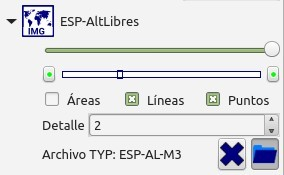

Prev () | [Home](Home) | [Manual](DocMain) | [Index](AxAdvIndex) | () Next
- - -

***Table of contents***

* [Guía de inicio](#guía-de-inicio)
    * [Descargar lo necesario desde Internet](#descargar-lo-necesario-desde-internet)
    * [Organización de las carpetas de datos y mapas](#organización-de-las-carpetas-de-datos-y-mapas)
    * [Instalación del programa](#instalación-del-programa)
    * [Primeros pasos tras el primer arranque de QMS](#primeros-pasos-tras-el-primer-arranque-de-qms)
        * [Configurar carpetas de mapas](#configurar-carpetas-de-mapas)
        * [Configurar carpetas DEM](#configurar-carpetas-dem)
        * [Configurar y Activar creación automática de rutas](#configurar-y-activar-creación-automática-de-rutas)
    * [Manejo básico de QMS](#manejo-básico-de-qms)
        * [Cargar un archivo GPX y mostrar su contenido](#cargar-un-archivo-gpx-y-mostrar-su-contenido)
        * [Activar mapas](#activar-mapas)
        * [Trabajar con varias Vistas de Mapa](#trabajar-con-varias-vistas-de-mapa)
        * [Activar un Modelo Digital del Terreno (DEM)](#activar-un-modelo-digital-del-terreno-dem)
            * [Uso de un MDT (DEM) online](#uso-de-un-mdt-dem-online)
        * [Ejemplo de uso de Vistas con mapas y DEMs](#ejemplo-de-uso-de-vistas-con-mapas-y-dems)
        * [Hacer zoom y mover el mapa](#hacer-zoom-y-mover-el-mapa)
        * [Dibujar un track nuevo     ](#dibujar-un-track-nuevo)
        * [Crear un Waypoint](#crear-un-waypoint)
        * [Trabajar con Proyectos y con Bases de Datos](#trabajar-con-proyectos-y-con-bases-de-datos)
        * [Copiar datos entre Bases de datos y Proyectos](#copiar-datos-entre-bases-de-datos-y-proyectos)
        * [Conexión con la unidad GPS](#conexión-con-la-unidad-gps)
            * [Cargar tracks y waypoints al GPS ](#cargar-tracks-y-waypoints-al-gps)
            * [Descargar tracks y waypoints desde el GPS ](#descargar-tracks-y-waypoints-desde-el-gps)
        * [Renombrar los tracks y waypoints ](#renombrar-los-tracks-y-waypoints)
    * [Para saber más](#para-saber-más)

* * * * * * * * * *
 
# Guía de inicio

* Esta es una guia breve para instalar y dar los primeros pasos con QMapShack (abreviado QMS)

* La guía está orientada a los usuarios de Windows, pero también es valida para usuarios de otros sistemas operativos, salvo en aquellos apartados referentes a la instalación propiamente dicha.
* QMS es una aplicación de 64-bit y por tanto requiere un sistema operativo de 64-bit.
* Muchas de las acciones descritas pueden hacerse de otra forma, o tienen mas opciones. La explicación de estas opciones se ha omitido para hacer una guía breve.
* La guía se ha estructurado como un tutorial paso a paso, se recomienda seguirla en orden.
  

## Descargar lo necesario desde Internet

Aqui tienes una lista con los enlaces para descargar el programa y una serie de mapas y datos muy útiles  para empezar a usar QMS de forma práctica. De momento puedes ir dejando todo en tu carpeta de descargas, más adelante se indica donde hay que poner y que hay hacer con cada cosa. 

* _Los números de versión indicados pueden cambiar. Siempre se debería elegir la versión mas reciente disponible._
* _Algunas de las paginas mencionadas ofrecen mapas o datos para diferentes regiones, elige lo que se ajuste a tus intereses._
* _Las recomendaciones son ejemplos. Hay muchas otras opciones disponibles._
* _Algunas de las recomendaciones son necesarias para seguir la guía paso a paso y además te ayudarán a usar QMS de forma eficiente._

**QMapShack:**

* [Instalador QMS](https://github.com/Maproom/qmapshack/releases "Descarga Instalador QMS"). En esta pagina se muestra el histórico de versiones de QMS, siendo la que aparece arriba la mas reciente.  A continuación del nombre de la versión se muestra una lista con su historial de cambios y debajo  el apartado **Assets**, donde  aparecen todas las descargas disponibles.  Para Windows elige el fichero `QMapShack_Win64bit_1.14.0.exe` (99 Mb aprox.) El numero de versión puede ser diferente.

__Mapas:__

* [Mapa alternativaslibres.org](https://alternativaslibres.org/es/downloads.php "Alternativas Libres Garmin").  Busca en la lista la fila España y elige la opción  "Topográfico" en su versión "Archivo para copiar en el GPS". Esto bajara un archivo `.zip`  Para España aproximadamente unos 750 Mb

* [Mapas y ortofoto online (IGN_España y otros)](https://mega.nz/file/wQNTSA7Y#EylkAiopjif0qe0BFD-yL9bcO6tYSSsXM3bhdjjypjQ "ESP_QMS_onlinemaps"). Desde este enlace se descarga el fichero `ESP_QMS_onlinemaps.zip`.
* [Mapas y ortofoto online (mundo)](http://www.mtb-touring.net/qms/onlinekarten-einbinden/ "On-line maps"). En esta pagina, pincha`Download online maps`, y se descarga el fichero `Onlinemaps.zip`.
    
__Ficheros OSM__ 
( son la base para el calculo automático de rutas y tracks)

* [Routino_IBERIA_202012.zip](https://mega.nz/file/tMNzGCKa#rtME_jV5iMh3AIQzkQvQRVz12VvDG77LqEmJvNJZaqA "Routino_Iberia_fecha.zip") (500 Mb aprox.) (RECOMENDADO para seguir esta guía) Este fichero no se actualiza diariamente, sin embargo ofrece la ventaja de traer los datos de enrutamiento ya cocinados y listos para usar en QMS directamente y ahorrarás mucho tiempo. Cubre Portugal, España, Andorra, y sur de Francia.
   
   
__Datos de elevación DEM / MDT:__ 
(Recomendado para asignar alturas a los tracks y calcular pendientes y desniveles)
 
* [IGN-MDT25_Peninsula](https://mega.nz/#!lRNQmCKT!ssCQBzkjp5tDYHfhXr71atNxINiswigov2U148Reln4 "IGN-MDT25_Peninsula"). (572 Mb) Un fichero ünico para toda la Península con los datos del MDT25 (25x25m).

* [Viewfinderpanoramas. Resolución 1 arc second ](http://www.viewfinderpanoramas.org/Coverage%20map%20viewfinderpanoramas_org1.htm "Load DEM data for region"). Estos datos solo están disponibles para algunas zonas de montaña. En esta guía vamos a usar como ejemplo los correspondientes al Pirineo. Haz click sobre el mapa para descargarlos, son dos ficheros `.zip`. (180 Mb aprox)

__Datos de ejemplo__

* [QMS-datos-ejemplo.zip](https://mega.nz/#!xEl1wT7D!p8eFAUt7UKs2NuuAvWHGXnnTAnD4EEwUf5qJqwFORqI "QMS-datos-ejemplo.zip") (2 Mb aprox) (RECOMENDADO) Contiene varios archivos que facilitan seguir esta guía paso a paso.

## Organización de las carpetas de datos y mapas
Es muy recomendable crear una estructura de carpetas para almacenar de forma organizada nuestros mapas y datos siguiendo el esquema que se explica a continuación. Para ahorrarte trabajo puedes [descargar este fichero .zip](https://mega.nz/#!0N0wjQ4C!B2rxoZSUuuBodYw2WbFIwdDUVR1-542kQp7B0A82pAU) que ya contiene la estructura de carpetas recomendada y copiarla en tu PC.

**Estructura de carpetas recomendada**

* En una unidad de disco o carpeta en la que tengas permiso de escritura se crea la carpeta `CARTO` .

* Dentro del directorio `CARTO` se añaden las siguientes carpetas:
    * `Maps`
    * `DEM`
    * `GPX`
    * `Databases`
    * `Routino`
    * `QMS-Vistas`
* Para mantener una organización estructurada dentro del directorio `Maps` se crean subcarpetas atendiendo al formato de mapa:
    * `GARMIN-IMG`
    * `WMTS-TMS`
    * `MBTILES`
    * `ECW`
    * `JNX`
    * `RMAP`
* Dentro del directorio `DEM` también se crean subcarpetas para guardar ordenados tus ficheros DEM según su origen y resolución, y sin mezclarlos. Inicialmente podemos crear las siguientes: 
    * `Viewfinder3` para los ficheros de resolucion 3 arc sec de _Viefinderpanoramas_
    * `Viewfinder1` para los ficheros de resolucion 1 arc sec de _Viefinderpanoramas_
    * `IGN-MDT05` para  los ficheros `.asc`correspondientes al  DEM de resolución 5m del IGN
    * `IGN-MDT25` para  los ficheros `.asc`correspondientes al  DEM de resolución 25m del IGN

    *Además puedes crear subcarpetas dentro de estás para organizar regiones, pero recuerda , siempre sin mezclar origen ni resolución*

_Nota: Por supuesto, puedes usar los nombres y estructura de carpetas que tu quieras, incluso aprovechar la que vengas usando actualmente para guardar tus datos y mapas. En adelante, todas las explicaciones y ejemplos paso a paso de esta guía toman como referencia esta estructura recomendada_

Una vez creada la estructura vamos a poner los mapas y datos que hemos descargado en las carpetas que les corresponden:

**Mapas Vectoriales (*.IMG)**

* Abre el fichero `gmapsupp_Spain_IGN.zip` que has descargado desde _alternativaslibres.org_  y extrae su contenido en la carpeta `CARTO\Maps\GARMIN-IMG`
* Renombra el fichero `gmapsupp.img` como `ESP_alternativaslibres.img`  Este es el nombre que verás posteriormente en QMS, por lo que es interesante usar nombres descriptivos, no muy largos, y que hagan alusión a la región y a la fuente del mapa.

    _Cada mapa Garmin debe estar en un único fichero contenedor formato .IMG, esto es exactamente lo mismo que llevamos grabado en un GPS Garmin, y que popularmente también se llama "versión copiar y pegar"._
    
    _QMS es capaz de leer mapas en formato Garmin siempre que NO sean del tipo NT. Son válidos la inmensa mayoría de los mapas basados en datos de OpenStreetMaps (OSM)._

**Mapas Online**

* Abre el fichero `Onlinemaps.zip` y copia los ficheros  que contiene en la carpeta `CARTO\Maps\WMTS-TMS`

* Haz lo mismo con el fichero `ESP_IGN-online.zip`  

**Datos para enrutamiento**

* Si has descargado el fichero  `Routino_Iberia_*.zip` descomprímelo, y copia su contenido en la carpeta `Routino`. 

**Datos de elevación DEM / MDT**

* Cuando el DEM es un archivo único y facilmente reconocible podemos dejarlo directamente en la carpeta `DEM`: Copia el fichero `IGN-MDT25_Peninsula.tiff` a la carpeta `DEM`

* Cuando el DEM se compone de varios ficheros, es muy conveniente que los guardes agrupados en subcarpetas según su origen y resolución, y sin mezclarlos. Ejemplo para los ficheros DEM del Pirineo de *Viefinderpanormas resolucion 1 arc sec* : 

    * Dentro de la carpeta `DEM/Viewfinder1` crea una subcarpeta `Pirineo` 
    * Los datos descargados vienen en dos ficheros `K30.zip` y `K31.zip` . Descomprímelos y copia su contenido en la carpeta `Pirineo` que acabas de crear.

**Datos de ejemplo**

* Descomprime `QMS_datos_ejemplo.zip`. El fichero `leeme.txt` contiene información sobre el origen y propósito de los archivos de ejemplo
    * Mueve `Sallent.gpx` a la carpeta `CARTO/GPX`
    * Mueve `ES-AL-M8.typ` a `CARTO/Maps/GARMIN-IMG`
    * Mueve `Pirineos.db` a `CARTO/Databases`

## Instalación del programa
* Abre la carpeta en la que has descargado todos los ficheros anteriores.
* Busca el fichero `QMapShack_Install_Windows64bit__1.14.0.exe` y haz doble click sobre el.
* Confirma la información que muestra la ventana de instalación.
* En el apartado `Select Components`, marca `MSVC ++ 2013 SP1 runtime` (Esto ultimo podría omitirse si ya tuvieras instalado dicho entorno de ejecución previamente, por ejemplo, al instalar una nueva versión de QMS).
* En caso de elegir la instalación de `MSVC ++ 2013 SP1 runtime` se abrirá una nueva ventana con su propio instalador. Confirma los pasos que aparecen en esa ventana, y una vez terminada te devolvera al instalador de QMS _Aviso:_ La instalación puede llevar unos minutos.
* Opcional y Recomendado: Instalar soporte para formato ECW. Sigue los pasos indicados en [este enlace](https://www.mendiak.net/viewtopic.php?t=56948&f=25#p712273)

## Primeros pasos tras el primer arranque de QMS

* Inicia QMS desde el menu Inicio (Elige `QMapShack - QMapShack`).

    

* Aparece la ventana del programa. Por defecto QMS cargará los menús en el mismo idioma que use tu sistema operativo. Si QMS no tiene aun soporte para ese idioma los cargará en inglés.
* La primera vez que arranques QMS se mostrará con un aspecto similar al de la imagen. Este entorno de trabajo es configurable, puedes personalizarlo a tu gusto, y la próxima vez que abras el programa ya se mostrará como tú lo hayas configurado.

* En la parte superior se muestra una barra de herramientas con las tareas más comunes. Es personalizable y la puedes desplazar a cualquier zona del área de trabajo.    
* La parte central (con fondo amarillento en la imagen de ejemplo) es la ventana principal donde se muestran los mapas, y se dibujan y editan los tracks.  
* Alrededor aparecen distribuidos estos paneles:
    * `Mapas` para activar y desactivar mapas.
    * `MDT(DEM)`para activar y desactivar los MDT o DEM que contienen los datos de elevación.
    * `Espacio de Trabajo` para gestionar los Proyectos, tipicamente archivos GPX con tracks y waypoints.
    * `Bases de Datos` para gestionar las Bases de Datos.
    * `Enrutamiento` para configurar el cálculo automático de rutas.
* Puedes colocar los paneles en cualquier zona del área de trabajo; para ello pincha con el botón izquierdo del ratón sobre su barra de título y arrastralo a la zona que prefieras. Los puedes acoplar a la derecha, a la izquierda, arriba, o abajo; y tambíen puedes modificar sus dimensiones desplazando el borde del panel. Además puedes apilar varios paneles en la misma zona arrastrando y soltando uno sobre otro. Si no vas utilizar alguno de estos paneles puedes ocultarlo y dejar un área de trabajo más simple.    
* Una configuración muy práctica consiste en colocar en la parte superior izda. el panel `Espacio de Trabajo`,  y por debajo de este colocar apilados los paneles `Mapas`, `MDT(DEM)`,`Enrutamiento`, y `Bases de Datos`, tal y como se muestra en la imagen. También puedes colocar la Barra de Herramientas a la izquierda.

* Siempre puedes abrir o cerrar cada uno de estos paneles desde el menú `Ventana` y desde la Barra de Herramientas.
* También puedes usar estas combinaciones de teclas alternativamente:
    * `Ctrl + D` para ocultar / mostrar los paneles. 
    * `F11`  para entrar / salir en el modo de pantalla completa

* Inicialmente se muestran algunos avisos de ayuda sobre acciones recomendables a realizar tras el primer arranque del programa. Estos avisos desaparecerán una vez que hayas configurado el programa como se explica a continuación.

### Configurar carpetas de mapas
_En este paso vamos a indicarle a QMS en que carpetas guardamos los mapas y QMS mostrará siempre una lista con todos los mapas disponibles en dichas carpetas. Esto se hace una sola vez, aunque después siempre podremos modificar esta configuración añadiendo o quitando carpetas a la lista según nos convenga._

* Sitúa el cursor en el panel `Mapas` y haz click con el botón derecho sobre el espacio vacío.
* Se abre un menú:  elige "Configurar Rutas de Mapas" 
* Pincha el icono `+` para añadir las carpetas en las que almacenas los mapas.
    * _Siguiendo la estructura de esta guía añadiríamos las carpetas:_ `GARMIN-IMG` , `WMTS-TMS` , `MBTILES` ,`ECW`,`JNX`, y `RMAP`.
* En el panel de mapas aparecen ahora los mapas disponibles, acompañados de un icono que indica el tipo de mapa.
* Los mapas raster en formatos tales como `.MBTILES`   `.TIFF` `.ECW` no aparecen en la lista directamente sino que lo hacen a través de un fichero raster virtual `.VRT`. No te asustes, un fichero .VRT es básicamente una lista de mapas, ocupa muy pocos Kb, y QMS tiene un asistente para generar estos ficheros fácilmente:
    * Abrimos en el _Menú Herramientas_ el _Asistente VRT_ y se abre una nueva ventana
    * Pinchando en la carpeta VERDE seleccionamos los ficheros de origen. Puedes probar con algún `.MBTILES`   `.TIFF` o `.ECW` que tengas por ahí. 
    * Pinchando en el icono de la carpeta AZUL le indicamos la ruta al fichero `VRT`que vamos a crear y su nombre (la extensión `.vrt` se añade automáticamente). Habitualmente querremos guardarlo en la misma carpeta que los mapas que lo forman.
    * El apartado de `opciones avanzadas` es para casos especiales y normalmente se deja en blanco. 
    * Pulsamos en `Comenzar` y la ventana muestra el progreso. El proceso es muy rápido y en segundos tendremos creado el nuevo .VRT .
    * Finalmente hacemos click derecho sobre el panel de mapas y elegimos `Recargar Mapas`. La lista de mapas se refresca y aparece disponible el nuevo .VRT.
    * Notas sobre .VRT: Este proceso lo realizamos una sola vez, y permite mostrar los mapas sin costuras sin necesidad de generar pesados mosaicos. De igual forma permitirá actualizarlos más adelante en cuestión de segundos. 

### Configurar carpetas DEM
El proceso es idéntico al de las carpetas de mapas.

* Sitúa el cursor sobre el espacio vacío en el panel `MDT (DEM)` y haz click con el botón derecho sobre el espacio vacío.
* Se abre un menú:  elige "Configurar Rutas a los DEM"

* _Siguiendo la estructura de esta guía añadiríamos las carpetas:_ `DEM`,`Viewfinder3` , `Viewfinder1` , `IGN-MDT05` , y  `IGN-MDT25`

De igual forma QMS también carga los archivos DEM a través de un fichero virtual `.VRT`

* Abre en el _Menú Herramientas_ el _Asistente VRT_, elige como origen `IGN-MDT25_Peninsula.tiff` y crea su correspondiente `VRT`en la misma carpeta `DEM`.

Una de las ventajas del `VRT`es que puedes agrupar virtualmente varios ficheros de origen en un `VRT` y luego se maneja ese`VRT` como un fichero único. Para poder agruparlos deben tener el mismo Sistema de Referencia (Proyección/Datum) y ser de la misma fuente (p. ej. no mezclar los del IGN con otros).
Aquí tienes un ejemplo paso a paso utilizando los ficheros de ViewfinderPanoramas de resolucion 1 arc sec correspondientes al Pirineo:

* Menu Herramientas - Asistente VRT
* Pincha en el icono de la carpeta VERDE y selecciona los 22 ficheros `.hgt` de la carpeta `/CARTO/DEM/Viewfinder1/Pirineo` que has descargado para la zona del Pirineo.(Utiliza la tecla Mayusc. para hacer la selección múltiple)
* Pincha en el icono de la carpeta AZUL para indicar la ruta y el nombre del fichero `VRT`que vamos a crear : Elige la carpeta `Viewfinder1` y el nombre  `VF1_Pirineos` (la extensión `.vrt` se añade automáticamente). 
* Pulsa en _Comenzar_ y la ventana muestra el progreso. El proceso es muy rápido y en segundos tendremos creado el nuevo .VRT que ya aparecerá en la lista del panel `MDT(DEM)`.
* A partir de ahora ya podemos manejar los datos DEM del Pirineo como un único fichero gracias al `.vrt`. que solo ocupa 10 Kb, y sin necesidad de crear un único y pesado mosaico raster. Además si recibimos una actualización de una de las 22 partes bastará con sustituir el fichero `.hgt` antiguo por el nuevo y nuestro fichero `.vrt` reflejará el cambio sin necesidad de volver a generarlo. 

NOTAS sobre los DEM y su fichero .VRT:

* En la lista de DEMs disponibles se mostrará el nombre que hemos puesto al fichero `.vrt` por lo que es muy recomendable que este haga mención a la fuente y a su resolución. Ejemplos: `VF1-Pirineo` , `VF3-Spain`, `MDT05-huso30` 
*  Para crear un `.vrt` con ficheros `.asc` como los descargados desde el IGN se requieren algunos pasos adicionales. Esta explicado con todo detalle [en este tutorial.](https://www.mendiak.net/viewtopic.php?f=529&t=58023) 

### Configurar y Activar creación automática de rutas

**Importar datos para Routino**

QMS utiliza la aplicación _Routino_ para calcular rutas automáticamente sobre un conjunto de datos de OpenStreetMap (OSM). Normalmente estos datos se descargan de la red en formato `osm.pbf` y despues hay  que importarlos al formato usado por _Routino_.  El proceso se hace una sola vez y QMS tiene un asistente para hacer la importación fácilmente, pero consume mucho tiempo.
 
Sin embargo si ya has descargado el archivo [Routino_IBERIA_202012.zip](https://mega.nz/file/tMNzGCKa#rtME_jV5iMh3AIQzkQvQRVz12VvDG77LqEmJvNJZaqA "Routino_Iberia_fecha.zip") y has copiado su contenido en la carpeta `Routino`, te ahorras ese trabajo, pues estos ficheros ya están importados y listos para usar. Solamente nos falta decirle a QMS donde encontrar estos ficheros...

**Elegir la base de enrutamiento activa**

* Vete al Panel `Enrutamiento`  y asegúrate de que esta elegida la opción `Routino (offline)`
* Pincha el icono de la carpeta azul y elige la carpeta `CARTO\Routino` .
* Abre la lista desplegables de Bases de datos disponibles y elige `Iberia_201902`.
* A partir de ahora ya se puede usar la opción  de ruteo Automático al crear/modificar tracks o rutas dentro del área cubierta por la base de datos `Iberia_201902`.
* El resto de desplegables sirve para indicar los criterios de enrutamiento. Para este ejemplo elige el perfil `A pie`y el modo  `Más corto`       

Una vez realizados estos pasos ya tienes listo QMS para comenzar la parte más divertida.

## Manejo básico de QMS

Sigue este ejemplo guiado paso a paso para ver como se hacen las tareas mas habituales con QMS. Este ejemplo asume que has descargado los ficheros y creado la estructura de carpetas recomendados al inicio.

### Cargar un archivo GPX y mostrar su contenido

* En el menú Archivo, pincha en `Abrir datos GPX` y selecciona `Sallent.gpx` de la carpeta `CARTO/GPX`
* En el `Espacio de Trabajo` aparece ahora un nuevo proyecto llamado `Sallent` y se muestran colgando de el los tracks y wp que contiene con iconos diferenciados.
* Colocando el cursor sobre uno de los elementos obtenemos información adicional
* Haz doble click sobre el track _Vuelta Pacino_ y la ventana de mapa se situará en el área geográfica de este track. Naturalmente queremos verlo sobre un mapa.

### Activar mapas

* En el panel de mapas tienes una lista con los mapas disponibles. Busca ESP-IGN-topografico haz click sobre el con el botón derecho y se abre un menú contextual, pincha Activar. El nombre se colocará  arriba en la lista y el mapa será visible. (este es un mapa online, para verlo es necesario que estés conectado a Internet)

* Colócate ahora sobre `ESP-alternativaslibres` y haz la misma operación.
El mapa se colocara en la parte de arriba de la lista en segunda posición. En la Vista de mapa se habrá cargado el mapa ocultándonos el anterior.

* Este segundo mapa es un mapa vectorial tipo Garmin, haz doble click sobre su nombre para desplegar las opciones de visualización. 
       
* Desmarca la casilla `Areas`, de esta forma las areas no se dibujan. Ahora ya tienes el mapa online como base y el mapa Garmin con lineas y puntos superpuesto al anterior. Siempre puedes activar/desactivar areas , lineas, o puntos con un solo click.
* También puedes controlar la densidad de elementos que muestra el mapa aumentando o disminuyendo el valor indicado en `Detalle`  (en este ejemplo lo dejamos en 2)
* Además puedes modificar el grafismo del mapa aplicando un fichero TYP personalizado.  Como ejemplo vamos a probar un TYP modificado a partir del original de alternativaslibres.org:  Pincha en el icono de la carpeta azul y selecciona el archivo `ES-AL-M8.typ` que has copiado antes en la carpeta `/CARTO/GARMIN-IMG`.

* El aspecto del mapa vectorial cambia al instante, los senderos se ven ahora en rojo y las pistas y carreteras algo mas gruesas. Si quieres restaurar su aspecto original pincha el botón ' X' .
    
    * Ten en cuenta que los ficheros TYP son específicos para cada mapa, si se lo aplicas a un mapa diferente el resultado puede ser imprevisible. 
   
* Puedes superponer cuantos mapas raster o vectoriales quieras. Los mapas activados aparecen siempre arriba del todo en la lista de mapas y se dibujan en orden, comenzando por el primero de la lista, después se superpone el segundo, y así sucesivamente. Sabremos que un mapa está activado porque aparece un triángulo junto al nombre del mapa. 
* Pulsando este triángulo se despliegan los controles de transparencia, detalle, y rango de zoom en el que se muestra el mapa. Los controles y opciones son diferentes según se trate de mapas online, raster, o vectoriales.
* Cada mapa puede configurarse independientemente para conseguir una composición adecuada. Además tb puedes variar la transparencia de tracks y waypoints con el control deslizante situado en la parte superior del panel `Espacio de trabajo` 

 

### Trabajar con varias Vistas de Mapa
* Es posible tener varias Vistas de mapas abiertas simultáneamente. Puedes alternar entre una y otra , pero las vistas no se sincronizan al desplazar el mapa. Esto es especialmente útil cuando estás trabajando en proyectos de zonas diferentes (una vista guardada para Alpes, otra para Pirineos,etc).
* Haz click en menú`Ver - Duplicar vista de mapa` para crear un duplicado de la vista actual. En el Panel `Mapas` verás una nueva pestaña `Vista 2`. Activa ahora el mapa `ESP IGN Ortofoto`, (este es un mapa raster online necesitas estar conectado a internet)
* Pincha en la lista sobre `ESP IGN Ortofoto`y  arrastralo hacia arriba de forma que quede el segundo (después de `ESP IGN Topografico`). Opcionalmente puedes hacer click en el triangulo junto a su nombre y modificar su transparencia con el control deslizante.
* Ya tienes la `Vista1`con el mapa topográfico  y la `Vista 2` con la ortofoto como base y los mapas vectoriales superpuestos.   
* Haz click en el menú `Archivo - Guardar vista de mapa`. Indica el nombre y carpeta en el que quieres guardar la vista de mapa. Usa la carpeta `CARTO/QMS-Vistas` que habias creado anteriormente. Esto guarda la composición actual de forma que puedes cerrarla y recuperarla en otro momento sin tener que empezar de cero, por lo que es recomendable ponerle un nombre descriptivo.  
* Tanto el Panel `MDT (DEM)` como el Panel `Mapa` muestran una pestaña por cada Vista de mapa que tengas abierta. De esta forma se pueden activar/desactivar de forma independiente diferentes Mapas y DEM vinculados a cada Vista de mapa.

### Activar un Modelo Digital del Terreno (DEM)

_Este paso requiere haber configurado previamente las carpetas DEM como se ha explicado en esta guía_

* Sitúate en el panel `MDT(DEM)`, su funcionamiento es idéntico al del panel `Mapas`. Busca en la lista `VF1-Pirineo`, y actívalo (click derecho - Activar) El nombre se colocará  arriba en la lista y el DEM está activo para esta Vista de Mapa.
* Utilizando las pestañas superiores puedes alternar entre las diferentes Vistas de Mapa. De esta forma se pueden activar/desactivar de forma independiente los DEM vinculados a cada Vista de mapa.
* En la parte inferior derecha de la linea de estado se muestran las coordenadas del puntero del ratón. Cuando existen datos DEM cargados se muestra además el dato de elevación, y también la pendiente.

* Cuando dibujas un nuevo track este tomará los datos de elevación del DEM que tengas activo.
* Sabremos que un DEM está activado porque aparece un triángulo junto a su nombre. 
* Pulsando este triángulo se despliegan los controles de visualización del DEM que permiten:
    * Aplicar un sombrado de relieve.
    * Colorear las pendientes [(+ info)](https://www.mendiak.net/viewtopic.php?f=33&t=45214#p604256 "Colorea las pendientes para evaluar el riesgo de alud").
    * Limitar en que rangos de zoom se aplican estos sombreados. 
	
#### Uso de un MDT (DEM) online

* QMapShack también puede conectarse a un __DEM online__. Esto es muy práctico para consultar alturas o aplicar alturas a un track sin tener que descargar y alamcenar Gb y Gb de datos. El uso de DEMs online es muy sencillo y se explica con todo detalle en este [este tutorial](https://www.mendiak.net/viewtopic.php?f=529&t=58079). 
* El uso de DEMs online es complementario al de los DEMs descargados en tu PC

    * Son mejores los DEMS locales descargados en tu PC:
         * Para las zonas que mas usas
         * Cuando haces un uso intensivo de sombreado de relieve y coloreado de pendientes en zonas amplias

    * Son prácticos los DEMS online:
         * Para consultar algo fuera de tu zona habitual si no tienes su DEM descargado en el PC
         * Para dibujar un track con mayor precision sin haberte bajado Gb y Gb de un DEM de toda la Peninsula a 5x5m
     

### Ejemplo de uso de Vistas con mapas y DEMs

Vamos con un ejemplo que nos sirve de repaso de lo visto hasta ahora:

* Abre una nueva Vista de Mapa vacía (Menu Ver - Añadir Vista de Mapa)
* Abre la pestaña `Mapas` y activa el mapa `ESP-alternativaslibres`	
    * Es posible que no veas nada, es por que no estás en el ámbito que cubre el mapa.
    * Para situarte haz doble click sobre el track *Vuelta-Pacino*. La Vista de Mapa ya muestra el área geográfica de este track.
* Haz doble click sobre el nombre del mapa `ESP-alternativaslibres`. Se muestran sus opciones de visualización.
    * Pon el detalle en 2.
    * Pincha en el icono de la carpeta azul para aplicare un TYP y selecciona el archivo `ES-AL-M4.typ` . El aspecto del mapa vectorial cambia al instante.
    * Abre el Menú `Ver`y asegúrate de que `Texto del POI`y `Mostrar descripción emergente...` estén activados.
* Abre la pestaña `DEM(MDT)` y activa `VF1-Pirineo` (click derecho - Activar)
* Una vez activado haz doble click sobre su nombre. Se muestran las opciones de visualización.
* Marca la casilla `Sombreado`. Se activa el sombreado de relieve. Puedes controlar su intensidad con la barra deslizante.
* Ya tienes la clásica vista de mapa Garmin con sombreado de relieve. Guárdala en la carpeta `QMS-Vistas`y ponle de nombre *Alternativas-DEM*. ( Menú Archivo - Guardar Vista)
* Cierra ahora esta vista pinchando la `X`en su pestaña, como ya la tienes guardada puedes recuperarla con toda su configuración siempre que quieras.
* Pruébalo: En el menú  Archivo pincha Cargar Vista de Mapa. Elige *Alternativas-DEM* y acepta. Se abre la Vista de Mapa con la configuración de Mapas y DEM completa.

### Hacer zoom y mover el mapa

* Con el ratón:
    * Usa la rueda del ratón para hacer zoom + / -
    * Para mover el mapa pincha y sin soltar arrastra a la posición deseada. 
* Con el teclado:    
    * Las teclas `+` y `-` aumentan y disminuyen la escala del mapa (zoom)
    * Las teclas de dirección mueven el mapa

* Además prueba estas combinaciones de teclas:
    *  `Ctrl + D` para ocultar / mostrar los paneles.
    *  `F11`  para entrar /salir en el modo de pantalla completa.
	       
* Puedes utilizar cualquiera de esas opciones en todo momento  sin que se interrumpa la tarea en curso, por ejemplo, mientras dibujas un track.

### Dibujar un track nuevo     

_En este ejemplo vamos a dibujar un nuevo track circular con inicio y final en Sallent, y pasando por Respomuso, Bachimaña, y Casa de Piedra._

* Sitúa el cursor en el mapa sobre el Waypoint que señala _Sallent_ y haz click con el botón derecho. Se abre un menú contextual. Selecciona `Añadir Track`
* Ya has insertado el primer punto del track. Ahora un nuevo menú flotante aparece en la parte superior de la Vista de mapa. Este menú tiene 4 botones que controlan el modo de dibujo del track: 

    * `O`  Libre: punto  a punto.
    * `A`  Automático: Calcula la ruta entre dos puntos de forma automática (Enrutamiento).
    * `V`  Vectorial: Calca en el track las lineas de un mapa con solo pasar el cursor sobre ellas.
    * `T`  Track: Calca los puntos de otros tracks visibles con solo pasar el cursor sobre ellos.

* Pulsa `A` para probar ahora el modo Auto-enrutamiento. (Para que funcione es necesario haber instalado los datos de enrutamiento como se ha explicado previamente. Asegúrate de que en el panel `Enrutamiento`  tienes marcado el perfil `A pie` )
* Coloca el cursor sobre el punto de destino (puede ser el punto final o un punto de paso).
QMS calcula el itinerario de acuerdo a la configuración que has elegido en el panel `Enrutamiento`y lo presenta en el mapa. Para validar pulsa el botón izquierdo y los puntos quedan incorporados al track. 

* Pulsa consecutivamente sobre los puntos de paso que te interesen para guiar el trazado. En este ejemplo si pulsas consecutivamente sobre _Respomuso, Bachimaña, Casa de Piedra,_ y de nuevo _Sallent,_  habrás completado el track circular con tan solo 5 clicks. 

* El modo Vectorial es muy similar pero se apoya en las lineas de un mapa cargado. Pulsa `V`,y coloca el cursor sobre el camino del mapa que quieres seguir. Este se mostrará en amarillo. El dibujo del track se ajustará al trazado de ese camino copiando todos los vértices hasta el punto en el que hagas click. El modo Tracks funciona de forma identica.
* Lo más practico suele ser empezar con el modo _Auto_, pasar ocasionalmente al modo _Vectorial_  o _Tracks_ para dibujar sobre un camino que aun no esta en la base de datos de enrutamiento pero sí esta en un mapa vectorial, o sobre otros tracks visibles, y en muy pocas ocasiones pasar al modo _O_ para dibujar punto a punto sobre un mapa raster o una ortofoto. 
* Además en cualquier momento, y sin que se interrumpa el trazado, puedes: 
    * _Alternar entre los modos de dibujo con las teclas `O` , `A` , `V`, `T`, o bien pinchando su correspondiente botón._
    * _Variar los parámetros de auto-ruteo e incluso cambiar de base de datos._
    * _Utilizar las herramientas del menú flotante para mover, añadir o borrar puntos de paso, y el trazado completo se adaptará en función del método de dibujo que tengas activo (O,A,V,T). El punto a mover tiene que ser uno de los que tú dibujaste, que se representa en pantalla con un cuadrado negro mas grande que el resto. Los puntos que QMS dibuja automáticamente se ven en pantalla con un puntito mas pequeño._ 

* Para **finalizar** el trazado haz click con el botón derecho del ratón.     

* Para **guardar** el trazado pincha en `Guardar como nuevo...` en el menu flotante de la "vista de Mapa". 
    * Te pedirá el nombre del track, en este ejemplo nómbralo `Circular_Bachimaña` 
    * A continuación nos pide donde lo quieres guardar, puede ser un proyecto ( .gpx) o una base de datos, tanto nueva como existente. 
    * En este ejemplo, escribe `Bachimaña` en la linea de nuevo proyecto, y elige la opción ` .gpx` . El nuevo proyecto con su track aparece ahora en el `Espacio de Trabajo`

### Crear un Waypoint

* Sitúa el cursor sobre el mapa en al posición en la que quieres crear el WP y haz click con el botón derecho. Se abre un menú contextual. Selecciona `Añadir Waypoint`

* Opcionalmente si tienes un mapa vectorial Garmin cargado también puedes pinchar sobre un punto de interés del mapa (Cima, Refugio, Puente, etc) y seleccionar `Añadir POI como Waypoint`

* A continuación te pedirá su nombre y donde lo quieres guardar, puede ser un proyecto ( .gpx) o una base de datos, tanto nueva como existente.

### Trabajar con Proyectos y con Bases de Datos

* El panel `Espacio de Trabajo` está dedicado a los **Proyectos**, que típicamente se corresponderán con ficheros GPX.  Es la mesa de trabajo en la que retocamos tracks, waypoints, etc. Los Proyectos pueden guardarse físicamente en nuestro PC en formato `.gpx`o `.qms`

* El panel `Bases de Datos` está dedicado a las **Bases de Datos** (en adelante DB, abreviatura de DataBase). Es nuestro almacén,  y el contenido de esas DB puede usarse para mostrar los datos como una capa sobre el mapa, o también para pasar tracks o waypoints a nuestros Proyectos GPX. Físicamente cada base de datos se guarda en nuestro PC en un fichero formato `SQLite` con la extensión `.db` 

*Es posible que estés habituado a guardar tus tracks y waypoints en archivos `.gpx`, QMS te permite eso mismo y además también te da la posibilidad de reunirlos en bases de datos. No son excluyentes.*

**Ventajas de las Bases de Datos frente a archivos .gpx**

* La base de datos tiene una estructura de árbol de carpetas. Un elemento puede estar incluido en varias carpetas pero físicamente se guarda una sola vez. Por  tanto, si editamos el elemento este se actualiza en todas sus carpetas. Un ejemplo característico es un waypoint de una cima en el límite de varias provincias, aparece listado en la carpeta de cada provincia, pero el elemento es único en la base de datos. 
* En una DB se pueden hacer búsquedas sencillas.
* Cada base de datos completa se guarda en un archivo único que se puede compartir muy fácilmente con otros usuarios. 

Vamos a probarlo con la DB que has descargado en los datos de ejemplo...

**Abrir un Base de Datos existente:**

* Situate sobre la la parte **vacía** del panel `Base de Datos`,  abre el menú contextual con Click derecho, y pincha `+ Añadir Base de Datos`.

* Aparece un dialogo donde escribimos el nombre con el que QMS identificará la DB este es el nombre que se mostrará en el panel `Bases de Datos`, en este ejemplo *PIRINEOS* . 
* Marca la opción formato `SQLite` y pincha sobre el icono de la carpeta azul para indicar la ubicación del fichero `.db`que queremos abrir. En este ejemplo la carpeta `/CARTO/Databases` y el fichero `Pirineos.db`  Aceptamos para cerrar los diálogos y la nueva DB aparece en el panel.

* Esta base de datos contine los waypoints de cimas, lagos, y collados ordenados en carpetas. Marcando (X) la casilla junto al icono de la carpeta se activa una referencia a la misma en el `Espacio de trabajo`, y su contenido se muestra ahora en el mapa como una capa.

**Crear una nueva base de datos desde cero:** 

* QMS te permite organizar la DB con una estructura de carpetas y subcarpetas, similar a como organizas las carpetas en tu PC.  En este ejemplo vamos a crear desde cero una DB similar a la mostrada en la imagen. Su proposito será almacenar los tracks de nuestros recorridos ya realizados : 

* Situate sobre la la parte **vacía** del panel `Base de Datos`,  abre el menú contextual con Click derecho, y pincha `+ Añadir Base de Datos`.

*  Aparece un dialogo donde escribimos el nombre con el que QMS identificará la DB este es el nombre que se mostrará en el panel `Bases de Datos`, en este ejemplo *MIS_TRACKS* . 

* Marca la opción formato `SQLite` y pincha sobre el icono de la carpeta azul para indicar la ubicación del archivo `.db`en el que se escribiran físicamente los datos. En este ejemplo la carpeta `/CARTO/Databases` y el archivo `Mis_tracks.db`  Aceptamos para cerrar los diálogos y la nueva DB aparece en el panel.

* Vamos a crear ahora la estructura de carpetas. Hay tres tipos de carpetas y QMS las diferencia por colores:
 
    * las Azules solamente sirven para agrupar a otras carpetas 
    * las Verdes sirven para meter nuestros tracks, wp, ..etc y tb admiten subcarpetas
    * las Naranjas sirven para hacer una división dentro de las verdes
    

* Haz click con el botón derecho sobre `MIS_TRACKS`, marca una carpeta AZUL y llámala _TRAVESIAS_. 

* Ahora haz click con el botón derecho sobre  _TRAVESIAS_ y crea una carpeta VERDE llamada _GR10_

* Sigue el mismo proceso para crear el resto de la estructura carpetas

### Copiar datos entre Bases de datos y Proyectos

En cualquier momento podemos traspasar elementos de una base de datos a un proyecto y viceversa. Ten en cuenta que para copiar a/desde una carpeta de base de datos debes activar previamente el enlace a dicha carpeta para que aparezca en el `Espacio de Trabajo` como ya se ha explicado anteriormente. 

Hay muchas formas de añadir y copiar datos entre Proyectos y DB:

* Seleccionando el elemento en el espacio de trabajo / click derecho / `Copiar a...`
* Pinchando sobre un elemento en la Vista de Mapa / `Copiar a...`
* Arrastrando un elemento de una carpeta a otra.
* ...

Vamos con un ejemplo práctico (_se asume que tienes activadas en el espacio de trabajo las DB de Lagos y Collados que ya has abierto anteriormente_):

* Selecciona con un click todos los WP del proyecto *Sallent* Puedes usar las teclas Ctrl o Maysc. para hacer una selección múltiple. 

* Arrastra y suelta la selección la selección sobre el Proyecto *Bachimaña*. De esta forma se han añadido todos los WP _Sallent_ a _Bachimaña_.

* Prueba además a añadir un wp desde la `Vista de Mapa`:

    * Haz click sobre el wp de uno de los _Lagos azules_  y aparece un menú flotante.
    * Pincha el icono copiar y cuando te pregunte donde copiar elige _Bachimaña_

* También puedes hacer una selección múltiple:
    * Sobre el mapa haz click con el botón derecho y elige `Seleccionar elementos del mapa`
    * Pincha y arrastra para dibujar un marco que contenga los elementos a copiar
    * En el menú flotante, a la derecha del marco, pincha el icono copiar y cuando te pregunte donde copiar elige _Bachimaña_

_Si los elementos a copiar ya existen en el Proyecto o DB de destino QMS nos preguntará si queremos Omitir, Duplicar, o Sobrescribir. En nuestro ejemplo elegimos `Omitir`._

Ya tenemos nuestro proyecto de travesía circular completo, con el track y los waypoints, listo para publicarlo, compartirlo como gpx , o para cargarlo en nuestro GPS. 

### Conexión con la unidad GPS
_QMapShack puede conectarse directamente con unidades GPS Garmin que soportan modo de almacenamiento masivo. Típicamente los de la serie etrex20 en adelante. Los aparatos con TwoNav son accesibles en modo almacenamiento  masivo._

* Conectamos el GPS al PC con el cable USB. Un nuevo icono de GPS aparece en el panel del `Espacio de Trabajo`, y QMS muestra sobre el mapa todos los tracks contenidos en el GPS. 

#### Cargar tracks y waypoints al GPS 

Vamos a cargar nuestro Proyecto Bachimaña con su track y waypoints al GPS:

* Selecciona *Bachimaña* y arrástralo al icono del GPS. Ya has terminado.

Recuerda:

* Para traspasar un PROYECTO COMPLETO con todos sus datos incluidos (tracks, waypoints, etc) basta con arrastrarlo desde el área de trabajo al icono del GPS. 

* Esto graba en la memoria del GPS un archivo GPX equivalente a nuestro PROYECTO, y en los menús del GPS podremos gestionar cada track y waypoint por separado.

    * _Recuerda: Un archivo GPX no es un track! es un CONTENEDOR que puede contener uno o varios tracks, waypoints, rutas, etc. En QMS su equivalente es un PROYECTO, y justamente eso es lo que debemos pasar al GPS._ 
    * _Por ello no podremos arrastrar al icono del GPS tracks o Wp sueltos. Opcionalmente si podremos arrastrar tracks y wp sueltos a un GPX ya existente en el GPS, pero esto no es recomendado._

#### Descargar tracks y waypoints desde el GPS 

* Pincha en el triangulo junto al icono del GPS y se despliega una lista con todos los GPX contenidos en nuestro GPS. Típicamente el que figura con el nombre CURRENT contiene el último track grabado por el GPS (tracklog activo) 

* Adicionalmente se muestra una carpeta verde que contiene  los tracks archivados. Estos se muestran desplegando la carpeta.

* Situate sobre el elemento que quieres descargar y haz click sobre el mismo con el botón derecho. Elige `Copiar a...`

* Una nueva ventana mostrará los Proyectos y DB abiertas. Selecciona en la lista el Proyecto o DB en la que quieres guardar los datos. Opcionalmente también puedes crear un Proyecto nuevo indicando su nombre.

### Renombrar los tracks y waypoints 

* Los tracks descargados de nuestro GPS suelen tener nombres poco descriptivos. Habitualmente querremos editar este nombre. 

*  Haz click derecho sobre el track en el `Espacio de Trabajo` y elige `Editar`. Una nueva ventana se abre.
* Junto al nombre aparece un icono con candado cerrado, pincha para abrirlo y de ese modo se habilita la edición.
* Los campos editables como el nombre aparecen ahora en color azul y subrayados, pinchando sobre ellos ya puedes editarlos directamente.

*Ten en cuenta: No podemos editar directamente los tracks que tenemos dentro del GPS. La razón es que el GPS no es capaz de manejar los datos como lo hace QMS, por ejemplo, no maneja puntos ocultos, ni puede almacenar un histórico de la edición. Por ello si queremos editar un track o Waypoint del GPS debemos trasladarlo antes a un Proyecto en el `Espacio de Trabajo`. Una vez editado podemos pasarlo de vuelta al GPS, o almacenarlo en nuestro disco duro.*

## Para saber más

* En la web del Proyecto tienes [este manual](https://github.com/Maproom/qmapshack/wiki/DocMain "QMS Wiki") bastante completo (en inglés)
* En este [hilo de mendiak](https://www.mendiak.net/viewtopic.php?t=56948 "hilo de mendiak") tienes información en castellano, algunos tutoriales, y se comparten buenos mapas y datos.

- - -
Prev () | [Home](Home) | [Manual](DocMain) | [Index](AxAdvIndex) | [Top](#) | () Next
