[Prev](DocGisItemsArea) (Areas) | [Home](Home) | [Manual](DocMain) | [Index](AxAdvIndex) | (Database) [Next](DocGisDatabase)
- - -

***Table of contents***

* [Realtime applications](#realtime-applications)
    * [General description](#general-description)
    * [OpenSky flight data](#opensky-flight-data)
    * [GPS location data](#gps-location-data)
        * [General remarks](#general-remarks)
        * [GPS Tether on Android smartphones ](#gps-tether-on-android-smartphones)
        * [Using serial interface and Ncat (Windows OS)    ](#using-serial-interface-and-ncat-windows-os)
        * [Python server for Linux-like OS](#python-server-for-linux-like-os)
        * [Track replay](#track-replay)
        * [Using Garmin devices with Windows 10](#using-garmin-devices-with-windows-10)
        * [QMS as TCP client](#qms-as-tcp-client)
        * [NMEA and other restrictions](#nmea-and-other-restrictions)

* * * * * * * * * *
 
# Realtime applications

_Valid from patch version 0830561c1244 (20.02.2019)._

## General description

QMapShack offers limited support for handling realtime positional data. Currently, the following data sources can be used in QMS:

* OpenSky flight data
* GPS location data (GPS Tether)

To use these realtime data click first the `Window - Realtime` entry in the main menu to open the realtime window. This window is empty after opening it the first time. To activate a realtime application right-click in the window and select `Add source`. A new window pops-up where you can select an available application. Click the `Ok` button to activate the selected application. Repeat this step to activate more applications.

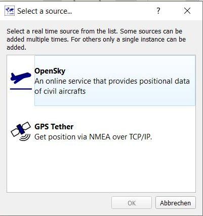

The active sources are now displayed in the realtime window. They need further general and application-specific configuration to get the data from its source.

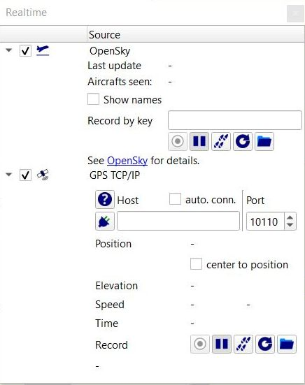

An active data source can be deleted (deactivated) with the help of a right-click on the data source header line and clicking the context menu entry `Delete source`.

Each of the applications has a toolbar of the form

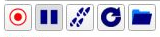

To prepare (configure) the application the following general initial procedure is recommended:

* Be sure the second icon with tooltip `Pause recording` is pressed.
* Click the right most icon with initial tooltip `Select record file`. This opens a file selection window. Define a filename and a path for a file where the realtime data can be saved (default extension: `.rec`). After selecting a record file, the tooltip of this icon changes to the name of the selected file.
* Click the fourth icon with tooltip `Reset record` and confirm, if required, the reset of the content of the record file.
* Now, the first icon with tooltip `Start recording` should be active (red). 
* Continue with the application specific configuration.

As soon as the connection is established between the data source and QMS and realtime data is reaching QMS an animated line of the received locations is displayed in the QMS map window (without activated recording only a moving object (aircraft or circle) and no animated line is shown).    

## OpenSky flight data

Activate the OpenSky data source as described in the [previous section](#general-description).

The [OpenSky Network](https://opensky-network.org) provides realtime flight data (aircraft information). The given application uses this data and displays graphically information about a selected aircraft moving within the map area.

As soon as the computer is connected to the Internet, the QMS map window shows small blue moving aircraft. Moving the mouse on an aircraft the available flight data is displayed in a pop-up window.

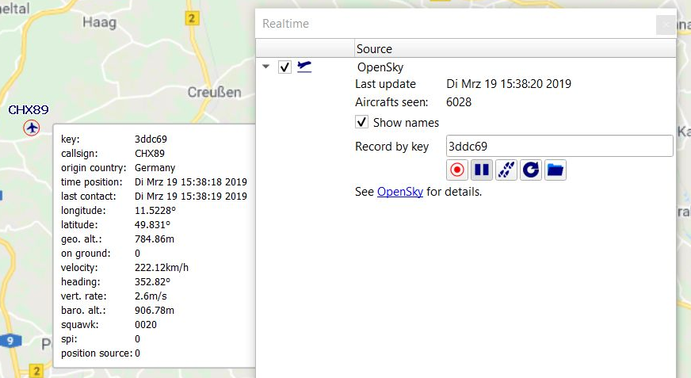

The flight of an aircraft can be recorded by 

* finding the flight key in the aircraft info window and inserting it into the `Record by key` edit field of the realtime window and
* pressing the record icon  in the toolbar. 

The flight track of the aircraft is then shown in the map window as animated line.

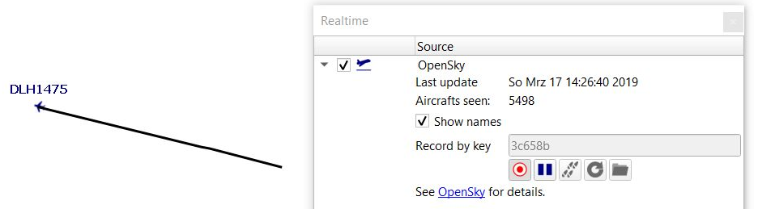

Use the pause button  to pause or stop recording. The record can be converted into a proper QMS track contained in a workspace project by clicking the track button .

## GPS location data

### General remarks

Using this data source QMS can display the location transmitted by a GPS receiver on your favorite QMS map. The application is using the following (data) model:

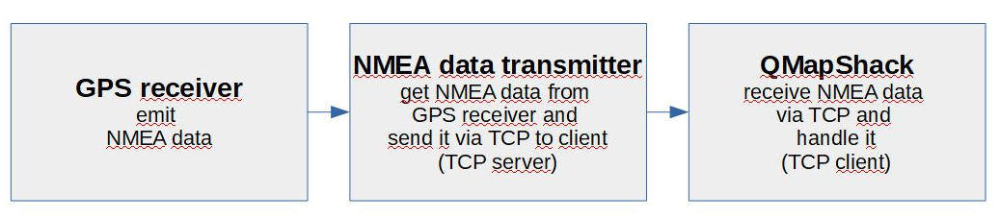

This model is based on 2 assumptions:

* GPS location data should be in NMEA form. Most GPS receivers and loggers support this data format after appropriate configuration.
* QMS can handle the GPS data only, if it can be obtained via TCP.

Tested **GPS receivers** are

* Android smartphones with GPS support.
* Garmin GPSMap 64s, GPSMap 60CSX, Garmin Etrex Vista, and similar devices.
* NL 8002 U Multi GNSS Receivers.
* NMEA data saved in file form and streamed to an appropriate TCP server (virtual GPS receiver, GPS replay).

The hardware of a GPS receiver connected to a PC can appear in various forms. Older devices are connected using a serial interface. Other devices have its own proprietary device type (e.g. Garmin GPSMap 64s). Different operating systems handle the hardware attached to the PC differently. Various **NMEA data transmitters** (TCP servers) can be used with GPS receivers. As a consequence, there is no unique approach for using different GPS receivers. This page describes in the following sections a few typical and tested use cases.

### GPS Tether on Android smartphones 
 
In this use case it is assumed that the smartphone has a GPS receiver. The NMEA data transmitter is located on the smartphone itself.
 
This TCP server together with QMS as TCP client needs a few installation and configuration steps on the smartphone and on the PC:

* _Download and install [GPS Tether](https://apkpure.com/gps-tether/com.ryanandbrenda.gpstether/download?from=details) on the Android smartphone._

* _Establish Ethernet connection_

    * Connect the PC running QMS and the smartphone either via a mobile hotspot or via Wi-Fi (both devices should be in the same network!).

* _Configuration of the Android smartphone with GPS_

    * Activate GPS on the smartphone.
    * Start `GPS Tether` on the smartphone.
    * In the `Sharing` tab click `Wi-Fi Hotspot Sharing`. After being connected to the PC this tab displays the smartphone IP address and the port required for the QMS configuration:
    
        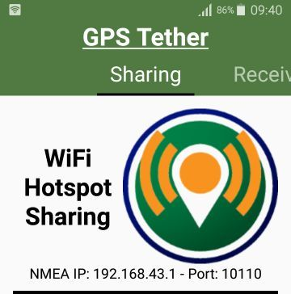

    * In the `Settings` tab activate `Enable NMEA Wi-Fi sharing`. Remember the TCP port shown.
    
        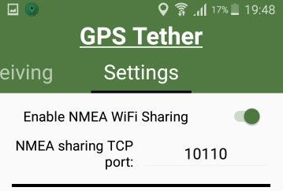
        
    * If everything is ready for use a notification is shown on the smartphone main page:
    
        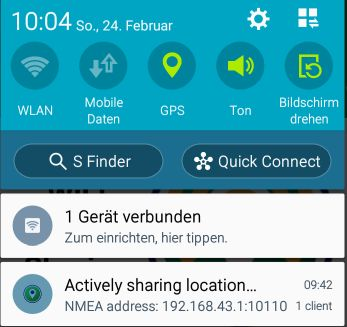
  
      _Remark:_ There are many smartphone applications working in the same way as `GPS Tether` does. The user is encouraged to try them out as NMEA data transmitters.  
    
* _Configuration of QMS_

    * Activate the GPS Tether data source as described at the [top of this page](#general-description).
    * Insert the IP address of the smartphone and the port number into the respective edit fields.
    * Click the connect icon (). The connection between QMS and `GPS Tether` on the smartphone will be established and the icon changes to show the connection ().
    
    
### Using serial interface and Ncat (Windows OS)    

_(Contributed by Helmut Schmidt)_

Many GPS receivers (e.g. the above mentioned NL 8002 U Multi GNSS receiver and older Garmin devices) provide a (virtual) serial interface. Nowadays, devices with a serial interface are connected with a USB-to-Serial adapter to a PC. Check, if your operating system detects the serial interface provided by the adapter!

[Ncat](https://nmap.org/ncat/) is a networking utility for the Windows operating system which reads and writes data across networks from the commandline. Ncat was written for the Nmap Project. It can be used as NMEA data transmitter.

Proceed as follows to use this transmitter:

* Activate NMEA data transmission in the GPS receiver.
* Download the `netcat/Nmap` package for Windows from https://nmap.org/download.html (download file https://nmap.org/dist/nmap-7.70-win32.zip) and unzip it.
* Identify the serial (COM) port provided by the GPS receiver with the help of the Windows device manager or similar tools.
* Call `ncat -v -l 1234 < COM5` from the commandline (replace`COM5` with the COM port found in the previous point!). This starts `Ncat` as TCP server transmitting NMEA data from the receiver via TCP. The following lines are shown in the commandline window after the server start:

         ncat -v -l 1234 < COM5
         Ncat: Version 7.70 ( https://nmap.org/ncat )
         Ncat: Listening on :::1234
         Ncat: Listening on 0.0.0.0:1234
      
* After a connection lines of the following form appear:      
      
         Ncat: Connection from ::1.
         Ncat: Connection from ::1:60629.
    
* Go to the QMS realtime window and insert `localhost` as host name and `1234` as port number into the respective edit fields.
* Click the connect icon (). The connection between QMS and `GPS Tether` on the smartphone will be established and the icon changes to show the connection ().
    

### Python server for Linux-like OS

_(Author of Python script: Henrik Schulz)_

Assume a GPS receiver is connected via a serial interface to a PC running a Linux-like operating system.

The Python script which can be downloaded from [here](Downloads/gpsserver.py) works as a data transmitter. The script tries first to find a serial port following a given device naming pattern. If such a serial port is found, then it starts a TCP server transmitting NMEA data from the GPS receiver (should be activated for NMEA data transmission!) to a TCP client (QMS).

Due to the device naming pattern used the script can only be used on operating systems having the given naming pattern for its hardware (Linux-like systems). It can't be used without changes on a Windows PC.

The script should be started from a commandline. The parameters that should be supplied to the script can be revealed with the help of a call of the form:

    gpsserver.py -h
    
which gives the following information:

    gpsserver.py -h
    usage: gpsserver.py [-h] [--port PORT] [--host HOST] [--device DEVICE]
                        [--device-directory DEVICE_DIRECTORY]

    optional arguments:
    -h, --help            show this help message and exit
    --port PORT           provide port to listen at, default=10000
    --host HOST           provide host name to listen, default=localhost
    --device DEVICE       provide device pattern, e.g. ttyACM without number,
                          default=ttyACM
    --device-directory DEVICE_DIRECTORY
                          provide device directory, e.g. /dev, default=/dev
                          
Configure and use QMS as described for [GPS Tether on smartphones](#gps-tether-on-android-smartphones).                          

_Remark:_ The Python script imports the `serial` module. This module should be installed first.
                          
### Track replay

Tracks recorded by a GPS device are typically saved as GPX or similar files and not as NMEA files. The well-known [GPSBabel](https://www.gpsbabel.org) tool converts tracks and other GPS data between different formats. For example, GPSBabel can convert a GPX file with recorded GPS data into a NMEA file. Therefore, GPSBabel can be used as a virtual GPS receiver and replay the recorded data via a TCP server into QMS. An advantage of GPSBabel is the control over the frequency of the data output. The only restrictions are the (quite reasonable) [requirements imposed on NMEA data by QMS](#nmea-and-other-restrictions). On output of NMEA `GGA` sentences GPSBabel sets the `Fix quality` to 0 and adds microseconds to timestamps. These 2 data items can be easily corrected with a small script reading the GPSBabel NMEA output, changing the 2 items properly and forwarding the corrected output to the TCP server.

Start the TCP server on a commandline with a sequence of commands as follows:

    GPSBabel.exe -t -i gpx -f RecordedTrack.gpx -o nmea,gpgga=1,gprmc=0,gpvtg=0,gpgsa=0,pause=3 -F - | nmeahandler.py | ncat.exe  -v -l 1234

Here, GPSBabel converts the GPX data of the input file to NMEA `GGA` sentences only and streams them to the [`nmeahandler.py`](Downloads/nmeahandler.py) script which carries out the described data update and forwards the updated data to the TCP server. Each NMEA data sentence is sent by GPSBabel after a 3 seconds pause. `Ncat` is used in the example as TCP server. The next image shows the result of such a procedure in QMS. 

NMEA `GGA` sentences have only a time but no date information. The timestamp displayed in the realtime window is composed of the date of the replay and the UTC time of recording!
    
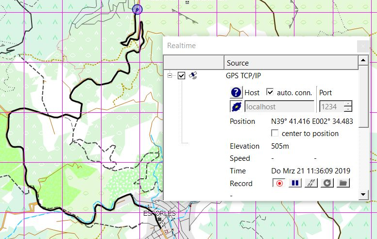

### Using Garmin devices with Windows 10

The approach described in this section is similar to the one described in the section [Track replay](#track-replay). The only difference is the input to GPSBabel. For GPS replay a GPX file is used as GPSBabel input. Here, GPSBabel reads its input directly from the connected GPS receiver in form of NMEA data.

To get NMEA data from Garmin GPSMap 64s or a similar device on a Windows 10 PC a few configuration settings must be done:

* Switch on the device and wait for a satellite fix.
* Go to to the main page and select `Setup` and then `System`.
* Set the interface to `Garmin spanner`.
* Connect the device with an USB cable to the PC.
* When asked `Would you like to go to mass storage?` select `no` (no additional disk drives are added in this case!). The device is now ready to send NMEA data to the PC using the USB interface.
* Open the Windows device manager or a similar tool. There should be a new entry `Garmin devices` with a subentry `Garmin USB GPS`. Double-click the last entry and check the device information in the next window. If the device has been installed properly, then there shouldn't be an error message in this window. 

    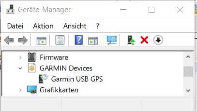

    The next snapshots shows the driver details tab revealing the installed Garmin drivers for the device.

    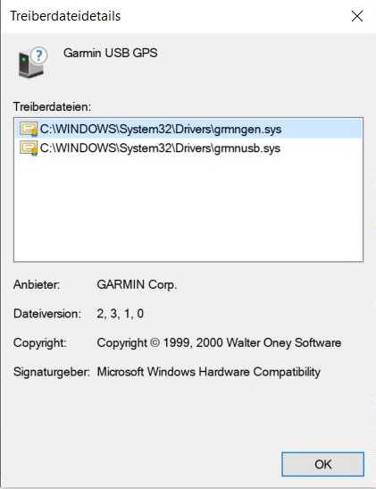

_Remark:_ If no Garmin device appears in the device manager, then 

* check if your device is connected to a serial port. In this case, use the approach described in section [Using serial interface and Ncat](#using-serial-interface-and-ncat-windows-os),
* check if your device is exposed as mass storage device. In this case restart your GPS receiver, ensure the correct settings and don't use it as mass storage device, when asked.

On a commandline a sequence of commands for starting the TCP server can look as follows:

    GPSBabel.exe -T -i garmin,get_posn -f usb: -o nmea,gpgga=1,gprmc=0,gpvtg=0,gpgsa=0,pause=3 -F - | nmeahandler.py | ncat.exe  -v -l 1234

Stop the transmission of data from the receiver by pressing `CTRL-C` in the commandline window.
    
_Remarks:_ 

* A Garmin GPSMap 60CSx device can be used in a similar way.
* Garmin Etrex Vista devices only support serial interfaces, either directly or with the help of a USB-to-Serial adapter. When using a USB-to-Serial adapter be sure that it works correctly with your operating system (insert GPSBabel option -D9 to see if and how GPSBabel establishes the serial connection). Tested was a TrendNet TU-9 adapter with a Prolific PL-2303 HXD chip and latest Windows 10 drivers. Set the interface in the Etrex Vista settings to `Garmin` and replace `usb:` in the commandline shown above with `com9` where `9` should be the number of the COM port for the adapter. If the Etrex Vista interface is set to `NMEA`, then the device sends a continuous flow of NMEA data without line end markers. These data can't be parsed by the involved tools because they assume that NMEA data is sent in records (with some line end). 
    
### QMS as TCP client
    
After successful configuration of the TCP server and the QMS TCP client and after establishing the connection between server and client QMS receives permanently the GPS locations transmitted by the TCP server and visualizes them as moving objects (aircraft or circles) in the map window. If the record icon is pressed, then the locations are shown as an animated line in the map window. The locations can be recorded as described in the [OpenSky application section](#opensky-flight-data).

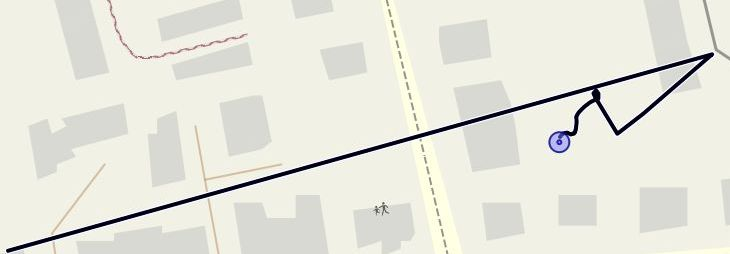

The last location (position) is shown together with other GPS data in the realtime window, too.
 
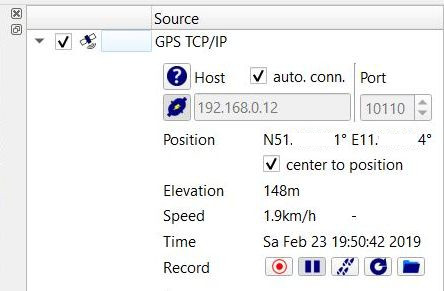

### NMEA and other restrictions

The NMEA data format is a rather variable data format. Each GPS receiver may use some specific features of this format. QMS does not know about all of these conceivable formatting variants. The QMS NMEA data parser handles mainly the most commonly used NMEA sentence identifiers `RMC` (Recommended minimum specific GPS/Transit data) and `GGA` (Global Positioning System Fix Data) to get timestamp, position and elevation and some other data.

NMEA data in QMS is valid (is used in QMS) if it fulfills the following reasonable restrictions:

* `RMC` data: The data field `Receiver warning` should have the value `A` (Available, ok). Sentences with other values are skipped by QMS.
* `GGA` data: The data field `Fix quality` should have a value `>0` (GPS fix). Sentences with other values are skipped by QMS.
* Timestamps in both types of NMEA records should have the format `hhmmss.00` (no milliseconds and `00` after decimal point). They are interpreted as UTC time.
* The date is set to the current date for `GGA` sentences in QMS (`GGA`sentences don't provide a date information!).
* The first NMEA sentence with valid data for a given timestamp is used in QMS. If there are more sentences with the same timestamp, then they are skipped (this may lead to invalid elevation, if a valid `RMC` sentence is in front of a valid `GGA` sentence with the same timestamp).

Further on, QMS updates its data only with a 1-second frequency. If data arrives at a higher frequency, then some data might be skipped.

    
- - -
[Prev](DocGisItemsArea) (Areas) | [Home](Home) | [Manual](DocMain) | [Index](AxAdvIndex) | [Top](#) | (Database) [Next](DocGisDatabase)
