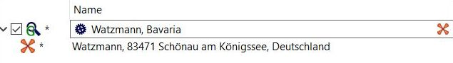

[Prev](DocHandleGpxFiles) (Handle GPX and QMS files) | [Home](Home) | [Manual](DocMain) | [Index](AxAdvIndex) | (Tracks, Waypoints & Co) [Next](DocGisItems)
- - -

# Geosearch

QMS supports online search of coordinates for geographical locations or addresses using different services.

Click the menu entry `Workspace - Geosearch` (toggle!) to open a search project in the workspace. This search project behaves like a normal project. Simply type your search text in the input field as you are used to from a browser search. Pressing `Return` on the keyboard will start the search operation.

Geosearch requires some initial setup. 

* To open the setup click the setup icon (the wheel in the search project). 
* Select one of the supported services from the menu:
    * OSM Nomatim
    * Geonames Places (no address search)
    * Geonames Address (address search, requires registered user name)
    * Google (use of API key optional, recommended, if search quota exceeded)
    
* If the menu entry `Accumulative results` (toggle!) is selected, then you can collect (accumulate) the results of several searches in the search project. Otherwise the search results are cleaned before new search results are displayed. The status of this toggle is shown in the search icon in front of the edit field 
(  vs. ).
* Using the menu entry `Reset results` you can clean the list of search results.
* Some of the services need additional setup information. To supply this information click the menu entry `Configure services` and insert the requested information into the edit fields. This setup window provides also links to the usage and license conditions of the services. The setup information is saved in the QMS configuration for further use.
    
    
    
Here are a few search result examples using different search info and different services:

* Search for **Watzmann** (the Alps, Germany)
    * OSM Nomatim:
    
        

    * Geonames Places:
    
        

    * Google:
    
        

* Search for address in Prague (Czech Republic)

    * OSM Nomatim:
    
        

    * Google:
    
        

The search results are displayed as child items (waypoints) of the search project. From here you can copy the search results to an existing or a new project using the context menu or drag-n-drop.

- - -
[Prev](DocHandleGpxFiles) (Handle GPX and QMS files) | [Home](Home) | [Manual](DocMain) | [Index](AxAdvIndex) | [Top](#) | (Tracks, Waypoints & Co) [Next](DocGisItems)
