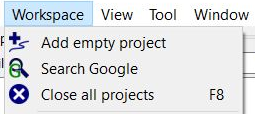

[Prev](DocMapDemSources) (Sources of QMapShack-compatible maps and elevation data) | [Home](Home) | [Manual](DocMain) | [Index](AxAdvIndex) | (Handle GPX and QMS files) [Next](DocHandleGpxFiles)
- - -
 
***Table of contents***

* [Working with Projects](#working-with-projects)

* * * * * * * * * *
 
# Working with Projects

A project is a container that contains GIS items like waypoints, tracks, etc. There are several sources for projects. A single GPX file is a project. Or a query on a GIS server like Google. 

You can create a new project, start a search or close all projects by the _Workspace_ menu:

You get the same menu with a right click when no item in the data view's workspace list is selected.

- - -
[Prev](DocMapDemSources) (Sources of QMapShack-compatible maps and elevation data) | [Home](Home) | [Manual](DocMain) | [Index](AxAdvIndex) | [Top](#) | (Handle GPX and QMS files) [Next](DocHandleGpxFiles)
